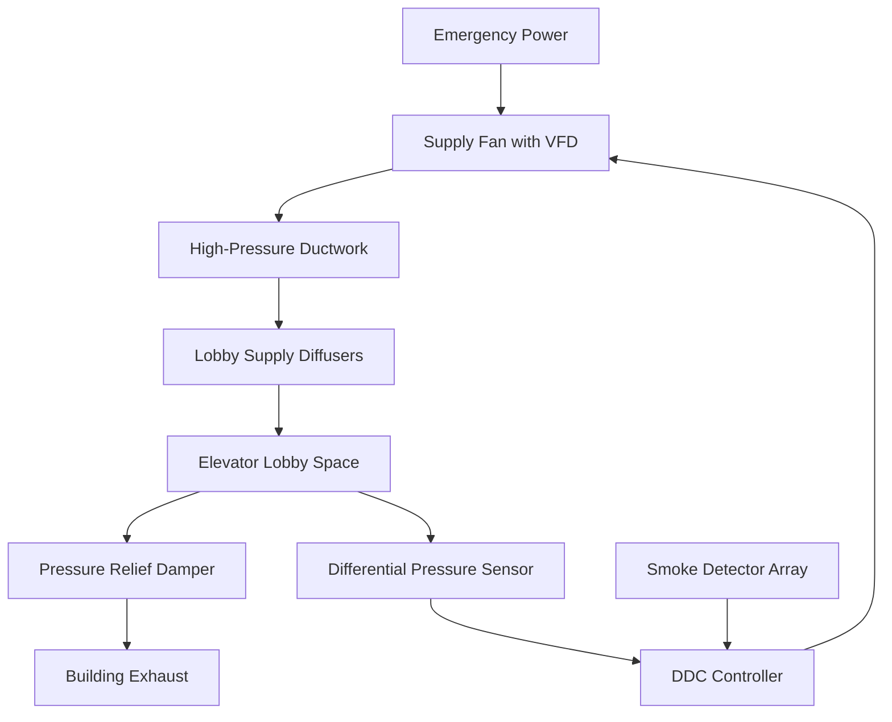
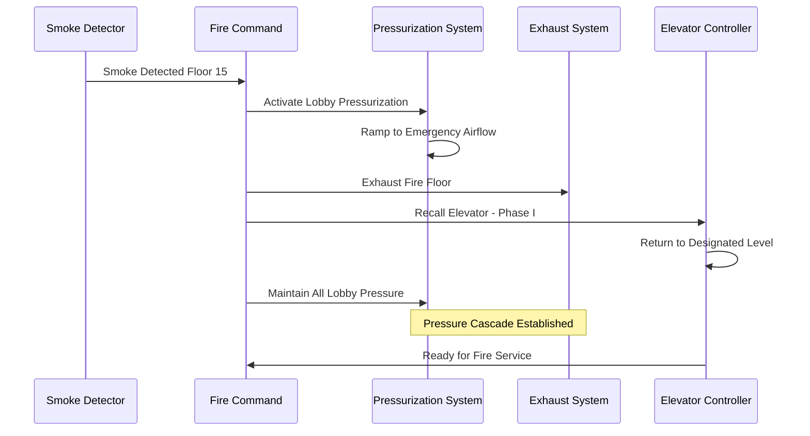

Fire service access elevators represent critical life safety infrastructure in high-rise buildings, requiring specialized HVAC systems that maintain operational integrity during fire emergencies. These systems must provide smoke-free environments for firefighter access while ensuring equipment continues to function under extreme thermal conditions.

## Regulatory Framework

IBC Section 3007 and ASME A17.1 Rule 211.3 establish comprehensive requirements for fire service access elevators. Buildings exceeding 120 feet in height require at least one elevator serving all floors, with dedicated HVAC provisions that protect both the elevator lobby and machine room from smoke infiltration and thermal degradation.

The integration of HVAC and fire protection systems creates a coordinated defense mechanism where pressurization, ventilation, and cooling work simultaneously to maintain tenable conditions during emergency operations.

## Elevator Lobby Pressurization

Fire service elevator lobbies require positive pressurization relative to adjacent spaces to prevent smoke migration. The pressurization system maintains a minimum pressure differential of 0.05 inches water gauge (12.5 Pa) across closed doors, increasing to 0.10 inches w.g. (25 Pa) under maximum airflow conditions.

### Pressure Differential Physics

The required pressure differential follows the orifice flow equation:

$$Q = 2610 \cdot A \cdot \sqrt{\frac{\Delta P}{\rho}}$$

Where:
- $Q$ = airflow rate (cfm)
- $A$ = leakage area (ft²)
- $\Delta P$ = pressure differential (inches w.g.)
- $\rho$ = air density (lb/ft³)

For a typical lobby with construction leakage area of 0.1 ft² per 100 ft² of wall area, maintaining 0.05 inches w.g. requires approximately 850-1200 cfm supply airflow, accounting for door undercuts, penetrations, and construction quality.

The supply fan must overcome door opening forces while maintaining tenable pressure differentials:

$$F_{door} = \frac{\Delta P \cdot A_{door} \cdot W}{2(W - d)}$$

Where $F_{door}$ represents the additional force required to open the door against the pressure differential, $A_{door}$ is door area, $W$ is door width, and $d$ is distance from door handle to hinges. Maximum allowable door opening force of 30 lbf limits pressure differential to approximately 0.35 inches w.g. for standard 3×7 ft doors.

### Airflow Distribution Strategy

Supply air enters through ceiling diffusers positioned to create downward flow patterns that sweep smoke away from elevator doors. The velocity profile must avoid high-speed jets that could disturb smoke layers or create uncomfortable conditions for occupants. Design velocities at 6 feet above floor level should not exceed 150 fpm under normal pressurization mode.

Pressure relief occurs through barometric dampers or electronically controlled dampers that modulate based on differential pressure sensors. The relief path must exhaust to safe areas, typically the building's fire exhaust system or directly to atmosphere through dedicated shafts.

## Machine Room Environmental Control

Elevator machine rooms housing traction equipment, controllers, and emergency power systems require year-round cooling to maintain equipment within manufacturer-specified temperature limits, typically 90°F maximum ambient.

### Heat Load Calculations

Machine room heat generation includes:

$$Q_{total} = Q_{motors} + Q_{controller} + Q_{lighting} + Q_{envelope}$$

Traction motor heat rejection during continuous operation:

$$Q_{motors} = \frac{HP \cdot 2545 \cdot (1 - \eta)}{\eta}$$

For a typical 40 HP gearless machine operating at 92% efficiency, motor heat rejection equals approximately 7,000 Btu/hr. Variable frequency drive controllers add 3-5% of motor power as heat, contributing an additional 5,000 Btu/hr. Envelope loads vary with room location but typically add 8,000-12,000 Btu/hr for interior rooms and 15,000-25,000 Btu/hr for penthouse locations exposed to solar radiation.

Total cooling load for a single elevator machine room ranges from 20,000 to 40,000 Btu/hr depending on equipment size and location.

### Cooling System Design

Machine room cooling systems must operate on emergency power with the same reliability as the elevator itself. Three primary approaches exist:

| Cooling Method | Advantages | Disadvantages | Typical Application |
|---|---|---|---|
| Split System AC | High efficiency, compact | Requires outdoor unit access | Mid-rise buildings |
| Chilled Water Fan Coil | Integrates with building systems | Emergency chiller required | High-rise with central plants |
| Glycol Loop Heat Exchanger | No refrigerant in room | Requires heat rejection | Critical facilities |
| Dedicated DX Unit | Independent operation | Lower efficiency | Existing building retrofits |

Emergency power sizing must account for simultaneous operation of all life safety systems. Machine room cooling typically represents 15-20% of total fire service elevator emergency load.

## Smoke Protection Strategies

Fire service elevators must remain smoke-free through physical separation and active smoke control. ASME A17.1 requires enclosed elevator lobbies on every floor with minimum 1-hour fire-rated construction and self-closing fire-rated doors.

The HVAC system prevents smoke entry through three mechanisms:

**Pressurization**: Maintains positive pressure differential preventing smoke infiltration through closed doors and construction gaps.

**Ventilation**: Under smoke detection, switches to 100% outside air mode preventing recirculation of contaminated air through building HVAC systems.

**Exhaust coordination**: Interfaces with building smoke exhaust to create pressure cascades directing smoke away from protected lobbies.

## Emergency Power Integration

All fire service elevator HVAC components connect to emergency power within 60 seconds of normal power failure per IBC Section 3007.9. The emergency power sequence prioritizes elevator operation while maintaining environmental protection:

**Priority 1** (0-10 seconds): Elevator controller, brake release, lighting

**Priority 2** (10-30 seconds): Machine room cooling, lobby pressurization fans

**Priority 3** (30-60 seconds): Smoke detection, control systems, auxiliary ventilation

Generator capacity calculations must account for inrush currents during motor starting. Pressurization fans with direct-online starters draw 600% of full load amps for 2-4 seconds, requiring generator sizing to accommodate these transient loads without voltage sag exceeding 15%.

Variable frequency drives reduce inrush to 150% of full load but add harmonic distortion requiring harmonic filters or oversized generators with 0.8 power factor rating rather than standard 0.8 kVA/kW ratio.

## Testing and Commissioning

Functional performance testing validates HVAC system response under simulated fire conditions. Testing protocols include:

- Pressure differential measurements at all lobby doors with adjacent doors open/closed
- Smoke candle tests verifying airflow patterns prevent smoke entry
- Door opening force measurements ensuring compliance with 30 lbf maximum
- Machine room temperature monitoring during extended elevator operation
- Emergency power transfer testing with full HVAC load
- Control sequence verification through fire alarm interface

Documentation requirements per IBC Section 3007.10 include as-built drawings showing all HVAC components, control sequences, maintenance procedures, and testing results maintained in the fire command center.

## Performance Verification Criteria

The completed fire service elevator HVAC system must demonstrate:

- Lobby pressure differential of 0.05-0.10 inches w.g. relative to building
- Machine room temperature maintained below 90°F during continuous operation
- Door opening forces not exceeding 30 lbf under maximum pressurization
- Emergency power transfer completing within 60 seconds maintaining all functions
- Smoke detector activation initiating pressurization within 30 seconds
- System operation sustainable for minimum 2-hour duration on emergency power

These performance standards ensure fire service access elevators remain viable transportation routes for firefighting operations throughout the duration of building emergencies.
