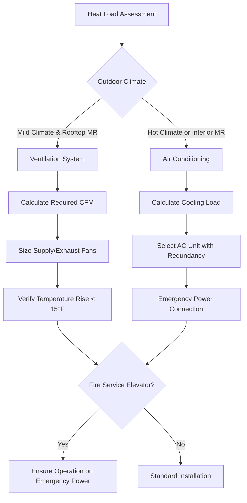
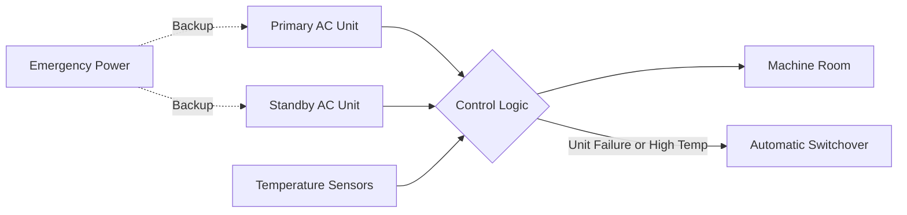

Elevator machine rooms concentrate significant heat loads in confined spaces, requiring precise thermal management to maintain equipment within operating temperature limits. The cooling system design directly affects elevator reliability, particularly for fire service access elevators that must operate under emergency conditions.

## Heat Load Sources and Calculations

### Primary Heat Sources

Elevator machine rooms generate heat from three dominant sources:

1. **Traction motors** - Convert electrical energy to mechanical work with efficiency losses appearing as heat
2. **Motor drives and controllers** - Power electronics dissipate heat during switching and conduction
3. **Brake resistors** - Convert regenerative braking energy to heat during car deceleration

The total sensible heat load follows:

$$Q_{total} = Q_{motor} + Q_{controller} + Q_{brake} + Q_{lighting} + Q_{envelope}$$

### Traction Motor Heat Generation

Motor heat output depends on duty cycle and efficiency. For a geared traction motor:

$$Q_{motor} = \frac{P_{rated} \times LF \times (1 - \eta)}{3412} \text{ [tons]}$$

Where:
- $P_{rated}$ = motor rated power [HP]
- $LF$ = load factor (typically 0.25-0.40 for elevators)
- $\eta$ = motor efficiency (0.85-0.92 for modern motors)

Gearless traction motors operate at higher efficiency (0.90-0.95) but higher rated power, resulting in comparable heat rejection.

### Controller Heat Dissipation

Variable frequency drives (VFDs) dissipate heat proportional to current flow:

$$Q_{VFD} = 3 \times I_{rated}^2 \times R_{eq} \times DF$$

Where $R_{eq}$ represents equivalent resistance of IGBT modules and $DF$ is the duty factor. Modern VFD manufacturers specify heat dissipation at 1.5-3% of drive rating.

### Dynamic Brake Resistors

During regenerative braking, kinetic energy converts to electrical energy, then to heat in brake resistors:

$$Q_{brake} = \frac{m \times g \times h \times \eta_{regen}}{t_{cycle} \times 3412}$$

This represents a significant intermittent load, particularly in high-rise applications where potential energy changes are substantial.

## Equipment Temperature Limits

### Manufacturer Requirements

Elevator equipment temperature limits follow electronic component constraints:

| Equipment Type | Maximum Ambient | Optimal Range | Consequences of Exceedance |
|---------------|-----------------|---------------|---------------------------|
| Traction Motors | 104°F (40°C) | 77-95°F | Insulation degradation, thermal trips |
| VFD Controllers | 104°F (40°C) | 68-86°F | Derating, semiconductor failure |
| Brake Resistors | 140°F (60°C) | 95-122°F | Thermal runaway risk |
| Control Panels | 95°F (35°C) | 68-86°F | Logic errors, relay failures |

ASME A17.1 Section 2.8.2 mandates that machine rooms maintain temperatures suitable for equipment operation, with most manufacturers specifying 40°C maximum.

### Heat Transfer Physics

Equipment surfaces dissipate heat through convection:

$$q = h \times A \times (T_{surface} - T_{ambient})$$

Higher ambient temperatures reduce the temperature differential, decreasing heat transfer effectiveness and causing equipment temperatures to rise. Inadequate cooling creates a feedback loop where elevated component temperatures further reduce cooling capacity.

## Ventilation vs Air Conditioning

### Ventilation-Only Systems

Ventilation relies on airflow to remove heat:

$$\dot{m}_{air} = \frac{Q_{total}}{c_p \times (T_{discharge} - T_{supply})}$$

For standard air ($c_p$ = 0.24 BTU/lb-°F), achieving a 15°F temperature rise:

$$CFM = \frac{Q_{BTU/hr}}{1.08 \times 15} = \frac{Q_{BTU/hr}}{16.2}$$

**Limitations:**
- Effective only when outdoor air temperature < 85°F
- No humidity control
- Ineffective during peak summer conditions
- Not suitable for interior machine rooms

### Air Conditioning Systems

Mechanical cooling maintains consistent conditions regardless of outdoor temperature. Cooling load includes:

$$Q_{AC} = Q_{sensible} + Q_{latent} + SF$$

Where $SF$ = safety factor (typically 1.15-1.25 for machine rooms).

## Machine-Room-Less (MRL) Elevator Considerations

MRL elevators integrate motors and controllers in the hoistway, eliminating dedicated machine rooms but creating unique cooling challenges:

### Heat Dissipation in Hoistways

Without dedicated ventilation, hoistway temperatures rise from equipment heat and solar gain through exterior walls. Heat stratification occurs with temperature gradients of 10-20°F from bottom to top.

The hoistway acts as a vertical chimney with natural convection:

$$\dot{Q}_{natural} = \rho \times A \times v \times c_p \times \Delta T$$

Where velocity $v$ depends on stack effect:

$$v = C \times \sqrt{h \times \Delta T}$$

Natural convection alone proves insufficient for temperature control in most applications.

### Forced Ventilation Requirements

MRL installations require forced hoistway ventilation:

- Supply air at hoistway bottom
- Exhaust at top of hoistway
- Minimum 4 air changes per hour
- Equipment zone requires direct airflow across motor and controller

## Emergency Operation Requirements

### Fire Service Access Elevators

ASME A17.1 Section 2.27 and IBC Section 403.6.1 mandate that fire service elevators operate during emergency conditions. The cooling system must:

1. Connect to emergency power (within 60 seconds of power failure)
2. Maintain equipment temperatures during extended fire service operation
3. Operate independently of building HVAC systems
4. Include redundant cooling capacity

### Redundancy and Reliability

Critical installations employ N+1 redundancy with automatic failover:

- Lead-lag operation based on runtime equalization
- Automatic switchover on unit failure or high temperature
- Independent refrigeration circuits
- Emergency power connection for both units

### Calculating Emergency Power Cooling Load

During fire service operation, elevator duty cycle increases substantially. The emergency cooling load accounts for:

$$Q_{emergency} = Q_{motor,max} + Q_{controller,max} + Q_{brake,avg} + Q_{envelope,fire}$$

Envelope loads increase during fire conditions due to elevated corridor temperatures. Design for continuous operation at maximum load factor (LF = 0.60-0.80) rather than typical values.

## Design Recommendations

### Sizing Methodology

1. Calculate equipment heat loads from manufacturer data
2. Add envelope loads (walls, ceiling, lighting)
3. Apply 20% safety factor for machine rooms
4. Select cooling equipment for total load
5. Provide N+1 redundancy for fire service elevators

### Installation Requirements

- Locate condensing units on emergency power
- Provide vibration isolation independent of elevator equipment
- Install redundant temperature monitoring with building automation interface
- Ensure outdoor air intake and relief locations prevent recirculation
- Commission cooling system under full elevator load conditions

Machine room cooling represents a critical subsystem where thermal management directly impacts elevator availability and safety. Proper sizing, redundancy, and emergency power integration ensure reliable operation under all conditions.

## Components

- Machine Room Heat Load
- Elevator Motor Heat Gain
- Machine Room Temperature Limits
- Cooling System Design Machine Room
- Redundant Cooling Units
- Emergency Power Cooling
