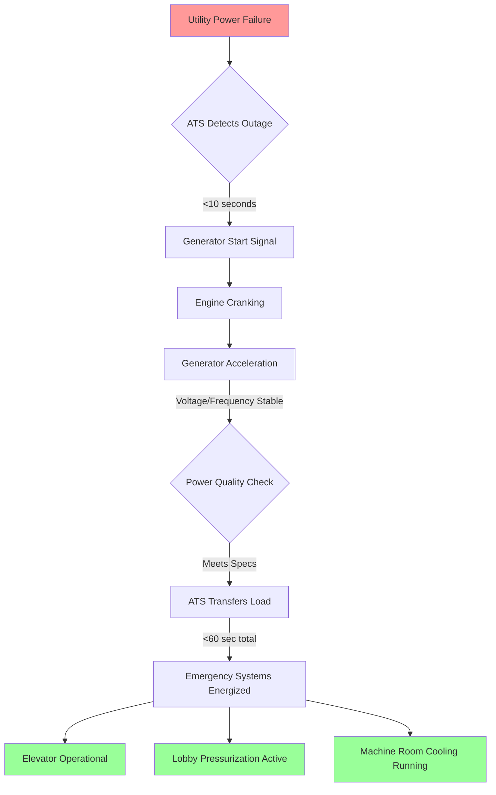
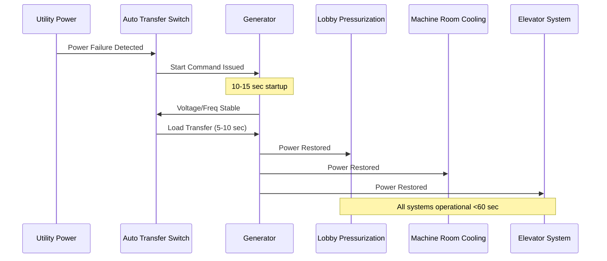

## Emergency Power System Requirements

Fire service access elevators require continuous operation during emergency conditions, necessitating robust backup power systems. The emergency power infrastructure must support not only the elevator mechanical and control systems but also critical HVAC components including lobby pressurization, machine room cooling, and smoke control interfaces.

### Code-Mandated Transfer Time

IBC Section 3003 and NFPA 72 mandate that emergency power transfer to fire service access elevators occur within 60 seconds of primary power failure. This requirement extends to all life safety systems, including:

- Elevator hoistway pressurization fans
- Elevator lobby pressurization systems
- Machine room ventilation and cooling equipment
- Emergency lighting and communication systems

The 60-second window represents the maximum allowable interruption before elevator recall and operational capability must be restored. HVAC systems supporting these elevators must maintain functionality throughout the transfer event.

### Generator Sizing for Combined Loads

Emergency generator capacity must accommodate the simultaneous operation of multiple systems. The total connected load calculation follows:

$$P_{total} = P_{elevator} + P_{HVAC} + P_{lighting} + P_{controls} \times SF$$

Where:
- $P_{total}$ = Total generator capacity (kW)
- $P_{elevator}$ = Elevator motor and control load (kW)
- $P_{HVAC}$ = Combined HVAC equipment load (kW)
- $P_{lighting}$ = Emergency and egress lighting (kW)
- $P_{controls}$ = Fire alarm and communication systems (kW)
- $SF$ = Safety factor (typically 1.25 per NFPA 110)

**HVAC Load Components:**

The HVAC portion includes:

$$P_{HVAC} = \sum_{i=1}^{n} \left(\frac{HP_i \times 0.746}{\eta_i \times PF_i}\right) + Q_{cooling}$$

Where:
- $HP_i$ = Motor horsepower for fan/pump $i$
- $\eta_i$ = Motor efficiency (typically 0.85-0.92)
- $PF_i$ = Power factor (typically 0.85 for motors)
- $Q_{cooling}$ = Machine room cooling equipment load (kW)

## Automatic Transfer Switch Specifications

The automatic transfer switch (ATS) serves as the critical interface between utility and emergency power. For fire service elevator applications, the ATS must meet specific performance criteria:

| Parameter | Requirement | Standard Reference |
|-----------|-------------|-------------------|
| Transfer Time | ≤10 seconds (typical) | NFPA 110 Type 10 |
| Voltage Sensing Range | ±10% nominal | UL 1008 |
| Frequency Tolerance | ±5% (57-63 Hz) | IEEE 446 |
| Withstand Current | 10× rated for 0.5 sec | UL 1008 |
| Mechanical Operations | 6,000 minimum | UL 1008 |
| HVAC Load Switching | In-rush capable | Application specific |

### In-Rush Current Considerations

HVAC equipment, particularly pressurization fans and cooling compressors, exhibits significant inrush current during starting. The locked rotor current can reach 6-8 times the full load amperage:

$$I_{inrush} = I_{FLA} \times LRC$$

Where:
- $I_{inrush}$ = Peak starting current (A)
- $I_{FLA}$ = Full load amperage (A)
- $LRC$ = Locked rotor code factor (typically 6.0-8.0)

The ATS and generator must accommodate these transient loads without voltage sag exceeding 20% or frequency deviation beyond 5%.

## HVAC Systems on Emergency Power

### Elevator Lobby Pressurization

Lobby pressurization systems prevent smoke infiltration into elevator shafts, maintaining a minimum differential pressure of 0.05 inches water column (12.5 Pa) relative to adjacent spaces. The emergency power system must sustain this pressurization throughout the emergency event.

**Airflow Continuity:**

Maintaining the required differential pressure demands continuous fan operation:

$$Q = \frac{A \times \sqrt{2 \times \Delta P / \rho}}{C_d}$$

Where:
- $Q$ = Required airflow (CFM)
- $A$ = Total leakage area (ft²)
- $\Delta P$ = Target pressure differential (lb/ft² or Pa)
- $\rho$ = Air density (lb/ft³)
- $C_d$ = Discharge coefficient (typically 0.65)

Power interruptions exceeding 5-10 seconds allow pressure decay, potentially compromising smoke protection. Battery-backed variable frequency drives (VFDs) can bridge the transfer gap, maintaining fan operation during the switchover period.

### Machine Room Cooling Continuity

Elevator machine rooms require continuous cooling to prevent equipment overheating, particularly during high-duty emergency operations. ASHRAE guidelines recommend maintaining machine room temperatures below 90°F (32°C) with relative humidity under 85%.

**Heat Load During Emergency Operation:**

The machine room heat gain during continuous elevator operation:

$$Q_{total} = Q_{elevator} + Q_{lights} + Q_{transmission} + Q_{VFD}$$

Where:
- $Q_{elevator}$ = Motor and brake resistor heat (BTU/hr)
- $Q_{lights}$ = Emergency lighting load (BTU/hr)
- $Q_{transmission}$ = Envelope heat gain (BTU/hr)
- $Q_{VFD}$ = Variable frequency drive losses (3-5% of motor load)

For a typical traction elevator operating continuously, motor inefficiencies and regenerative braking resistors can contribute 20,000-40,000 BTU/hr. Without cooling continuity, machine room temperatures can rise 2-3°F per hour in well-insulated spaces.

## Load Shedding and Priority Hierarchy

When generator capacity is constrained, load shedding protocols prioritize critical fire service elevator functions. The typical priority sequence:

**Priority 1 (No Shedding):**
- Elevator motor and controls
- Elevator lobby pressurization
- Fire alarm and communication systems

**Priority 2 (Maintain if Capacity Allows):**
- Machine room cooling
- Hoistway pressurization (if separate from lobby system)
- Emergency lighting

**Priority 3 (Shed if Necessary):**
- Non-critical building HVAC
- Convenience outlets
- Non-emergency lighting

Load shedding logic monitors generator output and frequency. If frequency drops below 58.5 Hz or voltage sags beyond 15%, lower priority loads disconnect automatically to prevent generator overload and potential failure.

## Battery Backup Integration

Uninterruptible power supplies (UPS) provide seamless continuity for control systems and critical HVAC components during the transfer interval. For fire service elevator applications:

- **Elevator controls:** 30-60 minute UPS capacity minimum
- **Pressurization fan VFDs:** 2-5 minute bridge capacity
- **Machine room monitoring:** 4-hour battery backup per NFPA 72

The UPS system ensures that control sequences remain uninterrupted even during transfer events, preventing inadvertent shutdowns or mode changes that could compromise safety.

## Testing and Maintenance Requirements

NFPA 110 mandates monthly generator testing under load, with annual testing at 100% nameplate capacity. For fire service elevator applications, testing protocols must verify:

- Transfer time compliance (<60 seconds total)
- HVAC system restart and stable operation
- Simultaneous load handling (elevator + HVAC + lighting)
- Battery backup discharge and recharge cycles
- Load shedding sequence functionality

Regular testing identifies degraded components before emergency events, ensuring reliable performance when needed most.
