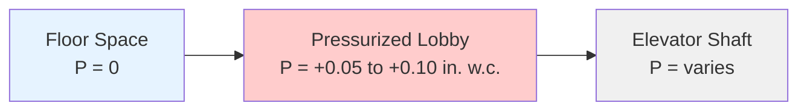
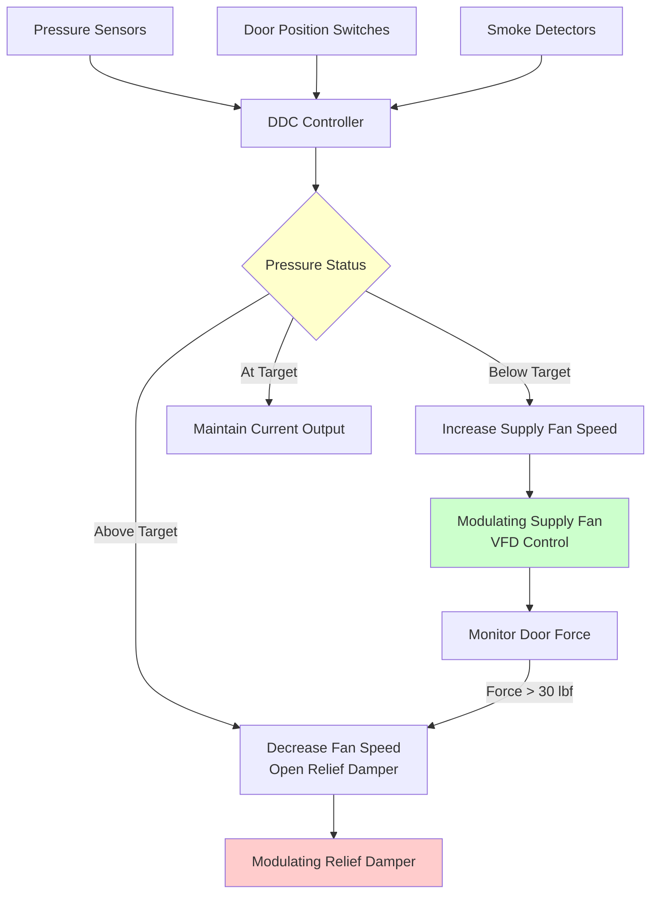

## Physical Principles of Lobby Pressurization

Fire service access elevator (FSAE) lobby pressurization creates a positive pressure differential between the elevator lobby and adjacent spaces to prevent smoke infiltration during fire incidents. This pressurization relies on fundamental fluid mechanics principles where airflow through openings depends on pressure differential, opening geometry, and air density.

The volumetric airflow through an opening follows the orifice equation:

$$Q = C_d A \sqrt{\frac{2\Delta P}{\rho}}$$

where $Q$ is volumetric flow rate (CFM), $A$ is the effective leakage area (ft²), $C_d$ is the discharge coefficient (typically 0.6-0.7), and $\Delta P$ is the pressure differential (in. wg).

## Pressurization Requirements

### Code-Mandated Pressure Differentials

**IBC Section 403.6.1** and **NFPA 5000** require fire service access elevator lobbies to maintain minimum pressure differentials relative to adjacent building areas during fire conditions:

| Condition | Minimum Pressure | Maximum Pressure | Door Opening Force |
|-----------|------------------|------------------|-------------------|
| Doors Closed | 0.05 in. w.c. (12.5 Pa) | 0.15 in. w.g. (37 Pa) | N/A |
| Doors Open (One Door) | 0.10 in. w.g. (25 Pa) | 0.15 in. w.c. (37 Pa) | ≤ 30 lbf (133 N) |
| Multiple Doors Open | 0.05 in. w.g. minimum | - | - |

The pressurization system maintains a protective pressure differential between the fire service elevator lobby and adjacent spaces, preventing smoke infiltration while allowing firefighter access.

### Door Opening Force Constraints

IBC Section 1010.1.3 limits door opening force to 30 lbf, which constrains maximum allowable pressure differential. The force required to open a door against a pressure differential:

$$F_{door} = \Delta P \cdot A_{door} \cdot \frac{W}{2}$$

where $F_{door}$ is opening force (lbf), $A_{door}$ is door area (ft²), and $W$ is door width (ft).

For a standard 3 ft × 7 ft door:

$$F_{30} = \frac{30}{21 \cdot 1.5} = 0.95 \text{ lbf/ft}^2 = 0.068 \text{ in. w.c.}$$

This establishes the maximum sustainable pressure differential at approximately 0.10 in. w.c. before exceeding force limits.

## Supply Air Calculation

The supply air system must compensate for leakage through closed doors and maintain airflow when doors open. Total airflow comprises three components:

$$Q_{total} = Q_{leakage} + Q_{door} + Q_{safety}$$

### Leakage Flow

Door leakage follows NFPA 92 assumptions for elevator lobby doors:

$$Q_{leak} = 0.05 \cdot P \cdot A_{gap}$$

where $P$ is perimeter (ft) and $A_{gap}$ is gap area per foot (in²/ft).

Typical leakage: 60-100 cfm per door at 0.05 in. w.c. for standard construction.

### Door Opening Flow

When doors open, the system must supply sufficient air to maintain outward velocity preventing smoke ingress. NFPA 92 recommends minimum average velocity of 200 fpm through the door opening in the direction opposing smoke movement.

$$Q_{door} = V_{avg} \cdot A_{door} \cdot N_{open}$$

For one 3 ft × 7 ft door:

$$Q_{door} = 200 \text{ fpm} \cdot 21 \text{ ft}^2 = 4,200 \text{ cfm}$$

### Total System Capacity

For a fire service elevator lobby serving one elevator:

$$Q_{design} = (80 \text{ cfm} \cdot 4 \text{ doors closed}) + (4,200 \text{ cfm} \cdot 1 \text{ door open}) + 500 \text{ cfm safety margin}$$

$$Q_{design} = 320 + 4,200 + 500 = 5,020 \text{ cfm}$$

## Vestibule Design Configuration

Fire service elevator lobbies function as pressure vestibules separating the elevator shaft from building floors. The vestibule creates a three-zone pressure cascade:

### Geometric Requirements

IBC 3007.7.1 specifies minimum lobby dimensions:
- Minimum area: 150 ft²
- Minimum dimension: 8 ft in every direction
- Clear of obstructions for fire fighter staging

Larger lobbies require proportionally greater supply airflow due to increased leakage paths and volume.

## Pressure Control System

The pressurization system employs modulating control to maintain target pressure across varying door positions:

### Control Sequence

**Normal operation (doors closed):**
1. Supply fan operates at minimum speed maintaining 0.05-0.10 in. w.c.
2. Relief damper closed or minimum position
3. Pressure sensor provides continuous feedback

**Door opening event:**
1. Door position switch signals controller
2. Fan speed increases to preset high-flow setpoint
3. Pressure maintained at lower threshold (0.02 in. w.c.)
4. Relief damper opens if pressure exceeds maximum

**Multiple door scenario:**
1. Second door opens before first closes
2. Fan operates at maximum capacity
3. Relief dampers fully open to prevent over-pressurization
4. System maintains positive pressure without force limit violation

## Relief Path Design

Relief dampers prevent over-pressurization when doors close after high-flow operation. Damper sizing:

$$A_{relief} = \frac{Q_{max}}{V_{relief} \cdot 60}$$

where $V_{relief}$ is 2,000 fpm maximum face velocity.

For 5,000 cfm system:

$$A_{relief} = \frac{5,000}{2,000 \cdot 60} = 0.042 \text{ ft}^2 = 6 \text{ in}^2$$

Typical installation: two 12 in. × 12 in. barometric relief dampers with adjustable counterweights set to crack open at 0.08 in. w.c.

## Monitoring and Testing

NFPA 72 requires continuous monitoring of lobby pressurization systems with alarm transmission to the fire command center. Monthly testing verifies:

1. Pressure differential maintenance (doors closed)
2. Door opening force compliance
3. Supply fan response to door operations
4. Relief damper operation
5. Control system functionality

Annual commissioning includes smoke tracer testing to verify outward airflow at door openings and absence of reverse flow conditions.

## Fire Fighter Access Protection

The pressurization system protects fire fighters during elevator transit and lobby staging operations. Key protection mechanisms:

**Smoke exclusion:** Positive pressure prevents smoke infiltration from adjacent floors, maintaining tenable conditions in the travel path between the elevator and the fire floor stairwell.

**Thermal barrier:** Continuous outward airflow creates a pneumatic barrier supplementing physical fire-rated construction.

**Egress assurance:** Maintained pressure differential ensures that if conditions deteriorate, fire fighters can retreat through doors that open readily in the egress direction.

**Equipment staging:** Clean air environment preserves functionality of SCBA equipment, radios, and other gear staged in the lobby during operations.

The integration of vestibule pressurization with elevator mechanical systems, shaft pressurization, and stairwell pressurization creates a comprehensive smoke control strategy for high-rise fire fighter access.
