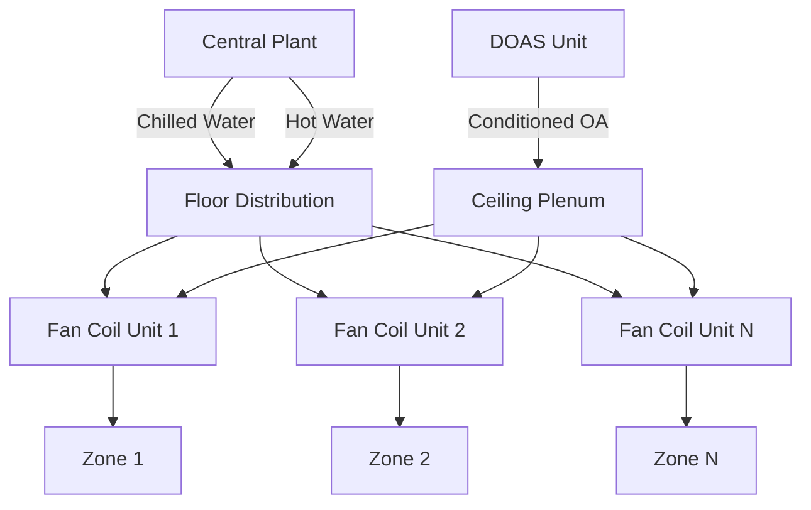
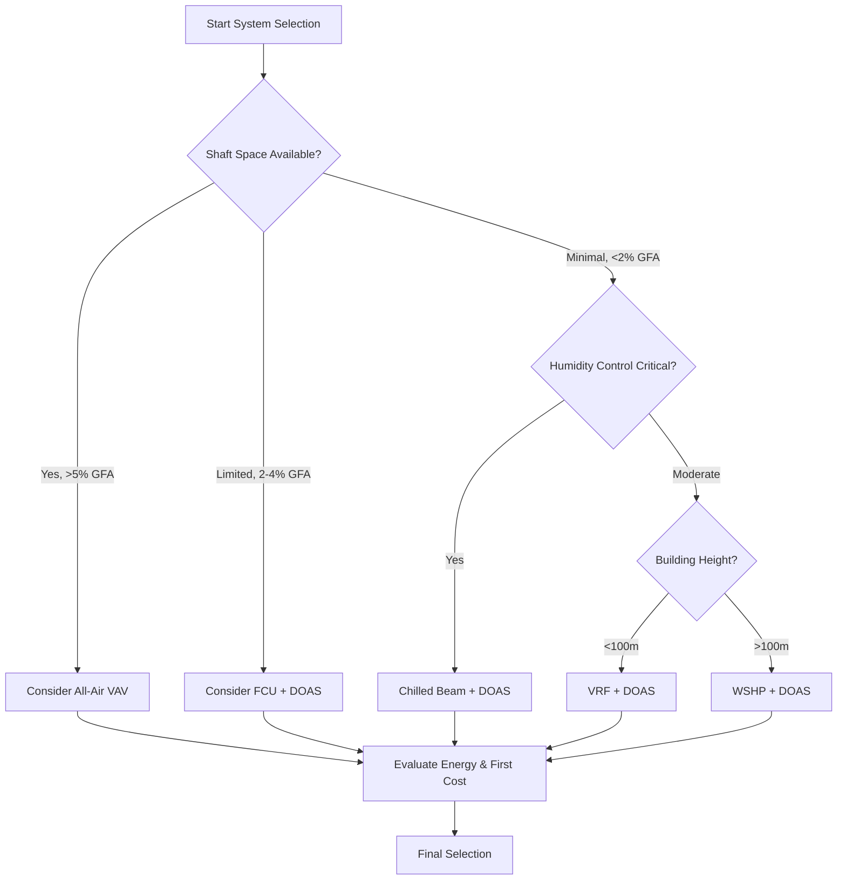

# High-Rise HVAC System Types and Selection

High-rise buildings present unique HVAC challenges driven by vertical stratification, stack effect pressures, and the need to distribute energy efficiently across hundreds of feet. System selection fundamentally depends on balancing energy transport efficiency, spatial constraints, and zone-level control requirements.

## Energy Transport Fundamentals

The energy required for conditioning is governed by:

$$Q_{total} = Q_{sensible} + Q_{latent} = \dot{m}c_p\Delta T + \dot{m}h_{fg}\Delta W$$

where $\dot{m}$ is mass flow rate, $c_p$ is specific heat, $\Delta T$ is temperature difference, $h_{fg}$ is latent heat of vaporization, and $\Delta W$ is humidity ratio change.

The critical decision in high-rise HVAC is whether to transport thermal energy via:
- **Air systems**: Move energy as sensible heat in air ($\rho_{air} \approx 1.2$ kg/m³)
- **Hydronic systems**: Move energy via water ($\rho_{water} \approx 1000$ kg/m³)

The volumetric heat capacity ratio is approximately 3500:1, making water distribution far more space-efficient for sensible loads.

## System Types Comparison

| System Type | Energy Transport | Zone Control | Space Requirements | Outdoor Air Strategy |
|-------------|------------------|--------------|-------------------|---------------------|
| All-Air VAV | Air only | Good | High (shafts 4-8% GFA) | Integrated |
| Fan Coil + DOAS | Water + air | Excellent | Medium (2-3% GFA) | Dedicated system |
| Water-Source Heat Pump | Water loop | Excellent | Low (1-2% GFA) | Separate ventilation |
| VRF + DOAS | Refrigerant + air | Excellent | Low (1-2% GFA) | Dedicated system |
| Chilled Beam + DOAS | Water + air | Good | Low (minimal shafts) | Dedicated system |

## All-Air Systems

All-air systems transport both sensible and latent loads through ductwork. For a typical high-rise floor requiring 300 kW cooling at $\Delta T = 11°C$:

$$\dot{V} = \frac{Q}{\rho c_p \Delta T} = \frac{300,000}{1.2 \times 1005 \times 11} \approx 22,700 \text{ m}^3/\text{h}$$

This substantial airflow requires large vertical shafts, typically consuming 4-8% of gross floor area per ASHRAE guidelines. Stack effect pressure compounds distribution challenges:

$$\Delta P_{stack} = 3460 \times h \times \left(\frac{1}{T_o} - \frac{1}{T_i}\right)$$

where $h$ is height in meters, $T_o$ is outdoor absolute temperature, and $T_i$ is indoor absolute temperature. A 200-meter building with 30°C temperature differential experiences approximately 260 Pa stack pressure.

**Advantages:**
- Complete control of humidity and outdoor air
- Superior indoor air quality
- Simpler zone-to-zone isolation
- Well-understood operation and maintenance

**Limitations:**
- Excessive shaft space requirements
- High fan energy due to vertical distribution
- Limited reheat capability without energy penalty
- Difficult perimeter zone control

## Fan Coil Units with DOAS

This decoupled approach separates ventilation (via Dedicated Outdoor Air System) from space conditioning (via hydronic fan coils). The DOAS handles latent loads and ventilation while fan coils address sensible loads:

$$Q_{sensible} = \dot{m}_{water} c_{p,water} (T_{supply} - T_{return})$$

For the same 300 kW load with 5°C water temperature differential:

$$\dot{m}_{water} = \frac{300,000}{4186 \times 5} \approx 14.3 \text{ L/s}$$

This requires only 50-mm piping compared to 900-mm ductwork for equivalent air systems.

**Advantages:**
- Minimal shaft requirements (2-3% GFA)
- Individual zone control and metering
- Simultaneous heating and cooling capability
- Lower distribution energy

**Limitations:**
- Condensate drainage required at each unit
- Fan noise in occupied spaces
- Filter maintenance at distributed locations
- Potential for inadequate outdoor air

## Water-Source Heat Pumps

WSHP systems use a common water loop (typically 15-32°C) as both heat source and sink. Each unit functions as a reversible heat pump:

$$COP_{cooling} = \frac{Q_{evap}}{W_{comp}} = \frac{T_{evap}}{T_{cond} - T_{evap}}$$

The building loop acts as thermal storage, allowing simultaneous heating and cooling with high efficiency when core zones reject heat that perimeter zones require.

**Advantages:**
- Heat recovery between zones
- No refrigerant piping restrictions
- Simple loop distribution
- Excellent part-load efficiency

**Limitations:**
- Unit noise in occupied space
- Complex heat rejection/addition control
- Maintenance distributed to every zone
- Requires separate ventilation system

## Variable Refrigerant Flow (VRF)

VRF systems distribute refrigerant to multiple indoor units from centralized outdoor units. The refrigerant circuit operates on the vapor-compression cycle:

$$Q_{cooling} = \dot{m}_{ref}(h_1 - h_4)$$

where $\dot{m}_{ref}$ is refrigerant mass flow and $(h_1 - h_4)$ is enthalpy difference across the evaporator.

**Advantages:**
- Minimal space requirements
- Heat recovery capability
- Individual zone control
- No water systems or condensate

**Limitations:**
- Refrigerant piping height restrictions (90-150 m depending on system)
- Code restrictions on refrigerant quantities
- Complex troubleshooting
- Limited outdoor air integration

## Chilled Beam Systems

Chilled beams use convection and radiation for sensible cooling while DOAS handles latent loads. The beam capacity follows:

$$q_{beam} = UA(T_{room} - T_{water})$$

Critical to operation is maintaining beam surface temperature above dewpoint to prevent condensation. For 21°C space at 50% RH (dewpoint 10.5°C), minimum beam water temperature is typically 14-15°C.

**Advantages:**
- Silent operation
- Minimal mechanical space
- Low operating energy
- Excellent comfort (radiant component)

**Limitations:**
- Requires tight humidity control
- No latent capacity
- Complex commissioning
- Limited application in humid climates

## Selection Criteria Framework

**Primary Selection Factors:**

1. **Available Shaft Space**: Determines air vs. hydronic transport
2. **Building Height**: Affects pressure drop, stack effect, and refrigerant limits
3. **Humidity Requirements**: Dictates need for centralized dehumidification
4. **Zoning Density**: High zone count favors hydronic systems
5. **Operational Complexity**: Owner capability and maintenance philosophy

**ASHRAE Standard 90.1** provides minimum efficiency requirements but does not prescribe system types. Selection depends on building-specific constraints and life-cycle cost analysis including first cost, energy consumption, and maintenance burden over the expected system life (typically 20-25 years per ASHRAE equipment service life data).

The optimal system balances thermodynamic efficiency, spatial efficiency, and operational simplicity within the constraints of building geometry, climate, and occupancy requirements.
