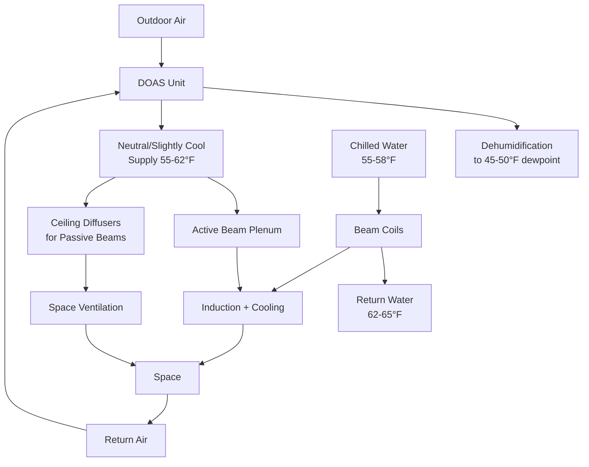

Chilled beam systems deliver sensible cooling through ceiling-mounted heat exchangers, offering significant advantages for high-rise buildings where floor-to-floor height constraints drive construction costs and condensation control requires careful engineering. The separation of sensible cooling from ventilation air reduces ductwork size, lowers fan energy, and allows smaller shaft allocations.

## Fundamental Heat Transfer Principles

Chilled beams operate on convective and radiant heat transfer from room air to cold water circulating through finned-tube coils. The heat transfer rate follows:

$$Q = U \cdot A \cdot \Delta T_{lm}$$

where $U$ is the overall heat transfer coefficient (typically 40-80 W/m²·K for passive beams, 80-150 W/m²·K for active beams), $A$ is the heat exchanger surface area, and $\Delta T_{lm}$ is the log-mean temperature difference between room air and chilled water.

The beam's cooling output increases non-linearly with temperature differential:

$$q \propto (\Delta T)^{1.3}$$

This relationship makes beam systems sensitive to chilled water supply temperature and room setpoint selection.

## Active vs Passive Chilled Beams

**Passive chilled beams** rely on natural convection. Warm room air rises to the ceiling, contacts the cold beam surface, cools (increasing density), and descends back into the space. Cooling capacity ranges from 30-100 W/m² of floor area depending on ceiling height, beam coverage, and temperature differential.

**Active chilled beams** incorporate a primary air plenum that induces room air through the beam's heat exchanger using nozzles. The induced air mixes with the primary air in ratios typically 2:1 to 4:1 (induced:primary). This mixing produces higher heat transfer coefficients and cooling capacities of 100-300 W/m².

The induction ratio depends on primary air velocity and nozzle design:

$$IR = \frac{\dot{m}_{induced}}{\dot{m}_{primary}} = f(v_{nozzle}, geometry)$$

| Characteristic | Passive Beams | Active Beams |
|----------------|---------------|--------------|
| Cooling capacity | 30-100 W/m² | 100-300 W/m² |
| Air requirement | None | 10-30 L/s per beam |
| Sound level | NC 15-20 | NC 25-35 |
| Zone control | Limited | Excellent |
| First cost | Lower | Higher |
| Operating cost | Lower | Moderate |
| Application | Perimeter zones | Interior and perimeter |

## DOAS Integration Strategy

Chilled beams handle sensible cooling only. A dedicated outdoor air system (DOAS) provides ventilation air while controlling space humidity to prevent condensation on beam surfaces. This separation of functions optimizes each system:

The DOAS must maintain space dewpoint below the beam surface temperature with adequate safety margin:

$$T_{dew,space} \leq T_{beam,surface} - \Delta T_{safety}$$

where $\Delta T_{safety}$ typically equals 2-3°F (1.1-1.7°C) to account for local variations and transient conditions.

## Condensation Prevention

Condensation control represents the critical design challenge for chilled beam systems in high-rise applications where exterior humidity can vary significantly with height. Prevention strategies include:

**Chilled Water Temperature Control**: Maintain supply water temperature above space dewpoint. Typical range is 55-58°F (13-14°C) requiring careful coordination with central plant design.

**Dewpoint Monitoring**: Install space dewpoint sensors that raise chilled water temperature or shut valves when dewpoint approaches beam temperature. Control sequence:

$$\text{if } (T_{dew,measured} > T_{CW,supply} - 3°F) \text{ then } T_{CW,supply} = T_{dew,measured} + 4°F$$

**DOAS Dehumidification**: Size DOAS cooling coils to achieve supply air dewpoint of 45-50°F under design conditions. The required sensible heat ratio:

$$SHR_{DOAS} = \frac{Q_{sensible}}{Q_{sensible} + Q_{latent}} \approx 0.65-0.75$$

**Humidity Interlocks**: Shut off chilled water flow to beams when space relative humidity exceeds 60% or dewpoint approaches supply water temperature.

**Drainage Provisions**: Although designed to prevent condensation, install drain pans or sloped ceiling tiles below beams as backup protection for occupied floors below.

## Floor Height Reduction Benefits

Chilled beam systems enable significant floor-to-floor height reduction compared to conventional all-air systems:

**Ductwork Elimination**: Beams handle 60-80% of cooling load with water (specific heat 4.18 kJ/kg·K) rather than air (1.00 kJ/kg·K). The volumetric flow comparison for 100 kW cooling:

- Air at 20°F ΔT: $\dot{V}_{air} = \frac{100 \times 3412}{1.08 \times 20} = 15,796$ CFM
- Water at 10°F ΔT: $\dot{V}_{water} = \frac{100 \times 3412}{500 \times 10} = 68$ GPM

The air system requires approximately 24 in² per 1000 CFM including insulation clearance, while the water system needs 1-2 inch pipes.

**Plenum Depth**: All-air VAV systems require 24-36 inch ceiling plenums for ductwork, turning vanes, and VAV box access. Chilled beam systems reduce this to 12-18 inches since only small ventilation air ducts penetrate the space.

**Height Savings Impact**: For a 50-story building, reducing floor-to-floor height from 13 ft to 12 ft saves 50 feet of building height. At $400-600 per square foot construction cost in urban high-rise markets, this reduction saves approximately:

$$\text{Cost Savings} = 50 \text{ ft} \times \text{floor area} \times \text{perimeter cost premium}$$

For a 20,000 ft² floor plate, this represents $3-5 million in structural, cladding, and core savings.

## System Design Considerations

**Ceiling Integration**: Beams integrate into suspended ceiling systems as:
- Exposed linear units in open ceilings
- Recessed units within standard ceiling grids
- Custom architectural integration with lighting and diffusers

**Zoning Strategy**: Active beams allow individual zone control through primary air modulation. Passive beams require water-side control with 2-way valves, providing slower response but adequate performance for perimeter zones.

**Structural Coordination**: Water-filled beams add 15-25 lb/ft² to ceiling loads. Coordinate suspension points with structural engineer, particularly for seismic bracing requirements per ASCE 7.

**Acoustic Performance**: Passive beams produce minimal noise (NC 15-20). Active beams generate noise from primary air nozzles, requiring acoustic lining and proper nozzle selection to maintain NC 25-35 for office environments per ASHRAE Fundamentals.

**Maintenance Access**: Provide accessible ceiling tiles at beam locations for coil inspection, though maintenance requirements are minimal compared to air-side equipment. Annual inspection of coils, strainers, and control valves typically suffices.

## Energy Performance

Chilled beam systems reduce energy consumption through multiple mechanisms:

- Lower fan power: 0.2-0.4 W/CFM for DOAS vs 0.6-1.2 W/CFM for VAV
- Higher chilled water temperatures: 55-58°F enables more efficient chiller operation
- Reduced reheat: Sensible-only cooling eliminates overcool-reheat cycles
- Thermal mass activation: Beam exposure to structure provides thermal storage

ASHRAE studies indicate 20-40% HVAC energy savings compared to conventional VAV systems in applicable climates.

## References

ASHRAE Handbook—HVAC Systems and Equipment, Chapter 6: Radiant Heating and Cooling
ASHRAE Standard 62.1: Ventilation for Acceptable Indoor Air Quality
ASHRAE Guideline 36: High-Performance Sequences of Operation for HVAC Systems
