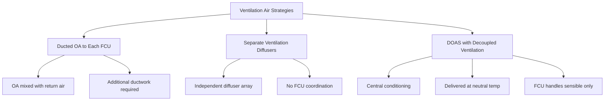

## System Overview

Fan coil units (FCUs) are decentralized HVAC terminal devices widely deployed in high-rise residential, hotel, and office applications. Each FCU contains a fan, heating/cooling coil, filter, and control system within a compact enclosure located in the conditioned space. Water-based heat transfer provides energy-efficient vertical distribution compared to all-air systems, while distributed fans minimize ductwork requirements—a critical advantage in buildings where vertical shaft space is constrained.

The fundamental operation involves circulating room air across a finned-tube coil supplied with chilled or hot water. Heat transfer rate follows:

$$Q = \dot{m}_w c_{p,w} (T_{w,in} - T_{w,out}) = UA \cdot LMTD$$

where $\dot{m}_w$ is water mass flow rate (kg/s), $c_{p,w}$ is water specific heat (4.186 kJ/kg·K), $U$ is overall heat transfer coefficient (W/m²·K), $A$ is coil surface area (m²), and $LMTD$ is log mean temperature difference (K).

## Two-Pipe vs. Four-Pipe Configurations

The piping configuration fundamentally determines system flexibility and performance:

| Parameter | Two-Pipe System | Four-Pipe System |
|-----------|----------------|------------------|
| Supply lines | 1 supply, 1 return | 2 supply (hot + chilled), 2 return |
| Simultaneous heating/cooling | No | Yes |
| Seasonal changeover | Required | Not required |
| Initial cost | Lower (40-50% less piping) | Higher |
| Operating cost | Higher (changeover losses) | Lower (optimized operation) |
| Tenant flexibility | Limited | Maximum |
| Typical application | Residential, budget hotels | Class A office, luxury residential |

### Two-Pipe System Operation

Two-pipe systems supply either chilled water or hot water through a single piping loop. Building-wide changeover typically occurs at outdoor temperatures around 55-60°F based on dominant load conditions. During swing seasons, perimeter zones requiring heating while core zones need cooling cannot be satisfied simultaneously.

The changeover decision criterion:

$$T_{changeover} = \frac{\sum_{i=1}^{n} (Q_{cooling,i} - Q_{heating,i})}{UA_{total}}$$

where positive net load indicates cooling mode operation. This limitation creates thermal comfort complaints during transition periods, particularly in buildings with diverse solar exposures.

### Four-Pipe System Operation

Four-pipe systems maintain independent hot water and chilled water loops year-round, enabling simultaneous heating and cooling across different zones. Each FCU contains separate heating and cooling coils, typically with individual control valves. This configuration accommodates:

- Perimeter zone heating with core zone cooling
- Different tenant temperature preferences
- Diverse internal load patterns
- Solar load variations by orientation

The energy penalty is increased pumping power for four piping circuits rather than two, offset by eliminating changeover waste heat and improved comfort reducing thermostat setpoint manipulation.

## Ventilation Air Coordination

ASHRAE Standard 62.1 requires minimum outdoor air ventilation independent of thermal load. Fan coil systems handle only recirculated room air, necessitating separate ventilation air delivery. Three primary strategies exist:

### Dedicated Outdoor Air Systems (DOAS)

Modern high-rise designs increasingly employ DOAS to decouple ventilation from thermal loads. The DOAS conditions outdoor air to space neutral temperature (typically 70-75°F, 50% RH), eliminating latent load from FCU coils and preventing condensate issues.

DOAS supply temperature is calculated:

$$T_{DOAS} = T_{space} + \frac{Q_{sensible,FCU}}{\dot{m}_{OA} c_p}$$

This approach enables:
- Centralized energy recovery (ERV/HRV)
- Superior dehumidification control
- Reduced FCU condensate drainage
- Smaller FCU coils (sensible-only)

## Water Distribution Challenges

Vertical water distribution in tall buildings encounters significant static pressure challenges. At building height $h$ (m), static pressure is:

$$P_{static} = \rho g h = 9.81h \text{ kPa}$$

For a 200m building, this generates 1,962 kPa (285 psi) at the base—exceeding pressure ratings for standard FCU components (typically rated 1,035 kPa / 150 psi).

### Pressure Management Strategies

**Vertical Zoning**: Divide building into 15-20 story zones with separate pumping systems and heat exchangers:

| Zone | Floors | Static Pressure | Equipment Rating |
|------|--------|-----------------|------------------|
| Upper | 40-50 | 300 kPa | Standard (150 psi) |
| Mid-Upper | 30-39 | 600 kPa | Standard (150 psi) |
| Mid-Lower | 20-29 | 900 kPa | High pressure (200 psi) |
| Lower | 1-19 | 1,200 kPa | High pressure (200 psi) |

**Pressure Reducing Valves (PRVs)**: Install PRVs at branch connections to limit FCU inlet pressure. PRV sizing requires balancing pressure drop against flow capacity:

$$\Delta P_{PRV} = K \frac{\rho v^2}{2}$$

where $K$ is valve loss coefficient and $v$ is flow velocity (m/s).

**Reverse Return Piping**: Ensures equal pipe lengths to all FCUs, promoting balanced flow without extensive balancing valve adjustment. Critical in buildings where access for commissioning is limited.

## Tenant Control Flexibility

FCUs provide superior individual zone control compared to central air systems—a primary selection driver for multitenant buildings. Each unit operates independently with local thermostat control of:

- Fan speed (typically 3-speed or variable)
- Heating/cooling valve position
- Operating mode (heat/cool/auto/fan only)

The control loop for proportional valve modulation:

$$\dot{m}_w = \dot{m}_{max} \cdot f(T_{space} - T_{setpoint})$$

where $f$ represents the proportional-integral (PI) control function. Modern FCUs employ electronic expansion valves with 0-10V control for precise modulation.

### Advantages for Tenant Flexibility

- **After-hours operation**: Tenants activate individual FCUs without running central systems
- **Fit-out modifications**: FCU locations easily relocated during tenant improvements
- **Individual metering**: Water flow meters enable tenant-level energy billing
- **Diverse schedules**: Each zone operates independently—critical for mixed-use buildings

### Maintenance Access Considerations

High-rise FCU maintenance requires planning for vertical access logistics. Typical maintenance includes:

- Filter replacement (quarterly)
- Coil cleaning (annual)
- Condensate pan treatment (quarterly)
- Fan bearing lubrication (annual)

Specify accessible ceiling installations with adequate clearance (minimum 24" above unit) and below-ceiling service access panels. Coordinate with architectural ceiling systems early in design to avoid inaccessible installations discovered during commissioning.

## Performance Optimization

Maximize fan coil system performance through:

1. **Variable speed fans**: ECM motors reduce energy 40-60% versus PSC motors
2. **Water-side economizer**: Free cooling when outdoor conditions permit
3. **Supply water temperature reset**: Raise chilled water temperature based on space loads
4. **Condensate drainage**: Verify positive slope (1/4" per foot minimum) to drain points

The optimal chilled water supply temperature reset relationship:

$$T_{CHW,supply} = T_{CHW,design} + K(T_{OA,design} - T_{OA,actual})$$

where typical reset coefficient $K = 0.4-0.6$ provides 20-30% reduction in chiller energy at part-load conditions per ASHRAE Research Project RP-1515.

## References

- ASHRAE Handbook—HVAC Systems and Equipment, Chapter 5: "In-Room Terminal Systems"
- ASHRAE Standard 62.1: Ventilation for Acceptable Indoor Air Quality
- ASHRAE Research Project RP-1515: Control Optimization for Chilled Water Plants
