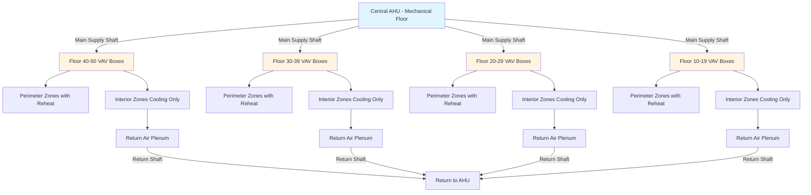
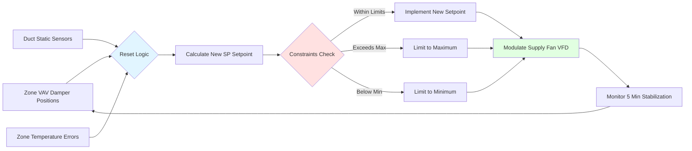

## Variable Air Volume Systems in Tall Buildings

Variable air volume (VAV) systems represent the dominant approach for high-rise building conditioning, providing simultaneous heating and cooling across multiple floors while maintaining energy efficiency through modulating airflow. The fundamental physics of VAV operation relies on maintaining constant supply air temperature while varying volume to match thermal loads, governed by the energy balance:

$$Q = \dot{m} \cdot c_p \cdot \Delta T = \rho \cdot \dot{V} \cdot c_p \cdot (T_{supply} - T_{zone})$$

where $Q$ is cooling capacity (W), $\dot{m}$ is mass flow rate (kg/s), $\dot{V}$ is volumetric flow (m³/s), $c_p$ is specific heat (1006 J/kg·K for air), and $\Delta T$ is temperature difference (K).

## High-Rise VAV System Configurations

High-rise buildings employ specialized VAV configurations to address vertical distribution challenges, stack effect pressures, and diverse zone requirements across multiple floors.

### Central vs. Distributed Air Handling

| Configuration | Application | Advantages | Limitations |
|--------------|-------------|-----------|-------------|
| **Single Central AHU** | Buildings <30 floors | Maximum floor area efficiency, centralized maintenance | High static pressure (>8 in. w.g.), large shaft requirements |
| **Mid-Rise & High-Rise Zones** | Buildings 30-60 floors | Reduced static pressure per zone, manageable shaft sizes | Multiple mechanical floors required, complexity |
| **Floor-by-Floor AHUs** | Super-tall buildings >60 floors | Minimal static pressure, smaller shafts, zone isolation | Reduced floor area, distributed maintenance |
| **Hybrid Configuration** | Mixed-use towers | Optimized for varied loads, flexible operation | Higher initial cost, complex controls |

## Duct Shaft Sizing for Vertical Distribution

Duct shaft sizing in high-rise buildings balances velocity, pressure drop, noise, and construction economy. The pressure drop through vertical risers follows the Darcy-Weisbach equation:

$$\Delta P_{shaft} = f \cdot \frac{L}{D_h} \cdot \frac{\rho \cdot V^2}{2}$$

where $f$ is friction factor (dimensionless), $L$ is shaft height (m), $D_h$ is hydraulic diameter (m), $\rho$ is air density (kg/m³), and $V$ is velocity (m/s).

### Supply Shaft Design Criteria

**Maximum velocities** per ASHRAE Fundamentals:
- Main supply risers: 2000-2500 fpm (10-12.7 m/s)
- Branch takeoffs: 1500-1800 fpm (7.6-9.1 m/s)
- Terminal connections: 1200-1500 fpm (6.1-7.6 m/s)

**Shaft sizing methodology:**

For a 40-story building with 60,000 CFM (28.3 m³/s) total supply at design:

$$A_{shaft} = \frac{\dot{V}}{V_{max}} = \frac{60,000 \text{ CFM}}{2,200 \text{ fpm}} = 27.3 \text{ ft}^2$$

For rectangular shaft: 5 ft × 5.5 ft (1.52 m × 1.68 m) provides 27.5 ft² with aspect ratio <1.5:1.

**Stack effect pressure compensation:**

Stack effect creates additional pressure differential:

$$\Delta P_{stack} = g \cdot h \cdot (\rho_{outside} - \rho_{inside}) = g \cdot h \cdot \rho_0 \cdot \left(\frac{1}{T_{outside}} - \frac{1}{T_{inside}}\right)$$

For 500 ft (152 m) building height with $T_{outside} = 0°F$ (-18°C) and $T_{inside} = 70°F$ (21°C):

$$\Delta P_{stack} = 9.81 \cdot 152 \cdot 1.2 \cdot \left(\frac{1}{255} - \frac{1}{294}\right) = 0.31 \text{ in. w.g.}$$

This pressure must be accommodated through damper control and AHU fan pressure capability.

## Static Pressure Reset Strategies

Static pressure reset reduces fan energy consumption by modulating duct static pressure setpoint based on actual zone demand. The fan power relationship demonstrates cubic energy savings:

$$P_{fan} = \frac{\dot{V} \cdot \Delta P}{\eta_{fan}} \propto \Delta P^{3/2}$$

### Reset Control Methods

**Damper-position-based reset (most common):**

Monitor all VAV damper positions; if most critical zone is <90% open, reduce static pressure:

$$SP_{new} = SP_{current} - k \cdot (90\% - D_{max})$$

where $k$ is tuning constant (typically 0.05-0.1 in. w.g. per percent), $D_{max}$ is maximum damper position.

**Minimum SP constraints for high-rise:**
- Bottom 10 floors: 1.5-2.0 in. w.g. minimum
- Middle floors: 2.0-2.5 in. w.g. minimum
- Top 10 floors: 1.0-1.5 in. w.g. minimum (stack effect assist)

### Energy Savings Calculation

Reducing static pressure from 4.0 to 3.0 in. w.g. at 50% airflow:

$$\frac{P_{reset}}{P_{original}} = \frac{3.0}{4.0} \cdot \left(\frac{0.5}{1.0}\right)^3 = 0.75 \cdot 0.125 = 0.094$$

This represents 90.6% energy savings compared to constant volume at full pressure.

## Floor-by-Floor Air Handling Approaches

Floor-by-floor systems employ dedicated air handlers on each floor or every few floors, eliminating long vertical duct runs and reducing static pressure requirements.

### System Advantages

1. **Reduced static pressure**: Typical 2-3 in. w.g. vs. 6-8 in. w.g. for central systems
2. **Smaller vertical shafts**: Only chilled water, condenser water, and electrical
3. **Zone isolation**: Equipment failure affects limited floors
4. **Flexible renovation**: Individual floor modifications without system-wide impact

### Design Considerations

| Parameter | Floor-by-Floor | Central System |
|-----------|----------------|----------------|
| **Fan static pressure** | 2.5-3.5 in. w.g. | 6-10 in. w.g. |
| **Shaft area** | 15-25 ft² piping only | 40-60 ft² duct + piping |
| **Mechanical space per floor** | 400-800 ft² | 0 ft² (except mech floors) |
| **Maintenance access** | Every floor | Centralized |
| **Sound attenuation** | Greater requirement | Central location advantage |
| **First cost** | Higher (multiple AHUs) | Lower (economies of scale) |
| **Operating cost** | Lower (reduced pressure) | Higher (fan energy) |

## Zone Control Strategies

High-rise VAV systems typically employ dual-zone strategy: perimeter zones with reheat for envelope loads, and interior zones with cooling-only operation.

### Perimeter Zone Control

Perimeter zones experience high variation in solar and conductive loads, requiring reheat capability:

$$Q_{total} = Q_{cooling} + Q_{reheat} = \dot{V}_{min} \cdot \rho \cdot c_p \cdot (T_{supply} - T_{zone}) + Q_{RH}$$

Minimum airflow typically set to 30-50% of design to maintain ventilation while allowing reheat.

**Sequence of operation:**
1. Cooling demand: VAV damper modulates from minimum to maximum (55°F supply)
2. Heating demand: VAV damper at minimum position, reheat coil modulates
3. Dead band: 2-3°F between cooling and heating to prevent simultaneous operation

### Interior Zone Control

Interior zones maintain relatively constant loads from occupants, lights, and equipment:

- Cooling-only VAV boxes without reheat
- Minimum airflow 20-30% for ventilation
- Supply air temperature 55-58°F (12.8-14.4°C)
- Direct return air plenum strategy

**Ventilation compliance** per ASHRAE 62.1:

$$V_{oz} = R_p \cdot P_z + R_a \cdot A_z$$

where $V_{oz}$ is zone outdoor air (CFM), $R_p$ is per-person requirement (typically 5 CFM/person), $P_z$ is zone population, $R_a$ is per-area requirement (0.06 CFM/ft²), $A_z$ is zone area.

### Advanced Control Integration

Modern high-rise VAV systems integrate multiple control strategies:

- **Demand-controlled ventilation**: CO₂ sensors modulate minimum airflow
- **Occupancy-based scheduling**: Reduced airflow during unoccupied periods
- **Optimal start/stop**: Minimize runtime while meeting temperature setpoints
- **Supply air temperature reset**: Increase SAT during low-load conditions to reduce reheat

## Performance Optimization

High-rise VAV system optimization focuses on minimizing simultaneous heating and cooling while maintaining comfort and ventilation across all floors.

**Key performance metrics:**
- Terminal reheat energy <10% of total cooling energy
- Average VAV damper position 40-60% at design conditions
- Static pressure reset achieving >30% fan energy reduction
- Zone temperature maintained within ±1°F of setpoint >95% of occupied hours

Per ASHRAE 90.1, supply air temperature reset must be implemented when systems serve >5,000 ft² or multiple floors, increasing SAT by up to 5°F when cooling loads permit, further reducing reheat penalties in perimeter zones.

---

**File:** `/Users/evgenygantman/Documents/github/gantmane/hvac/content/specialty-applications-testing/specialty-hvac-applications/tall-buildings-high-rise-hvac/high-rise-system-types/vav-systems/_index.md`
