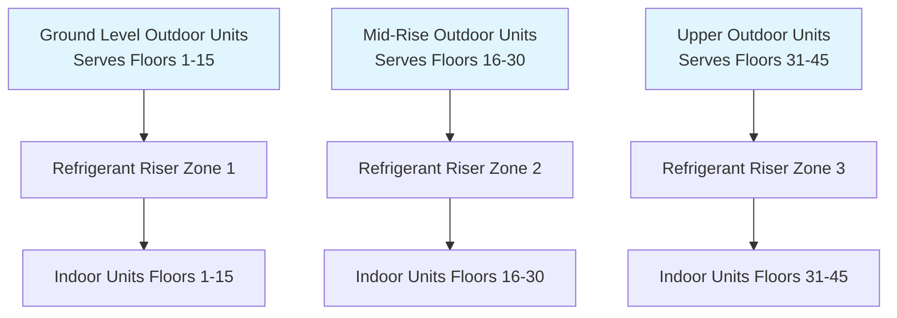
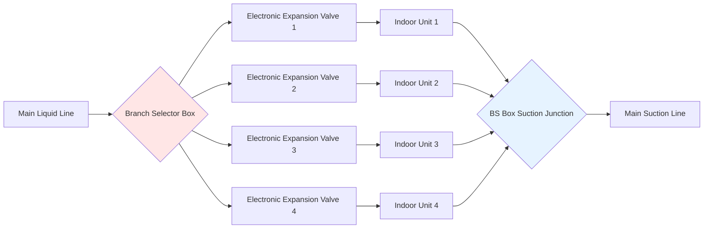
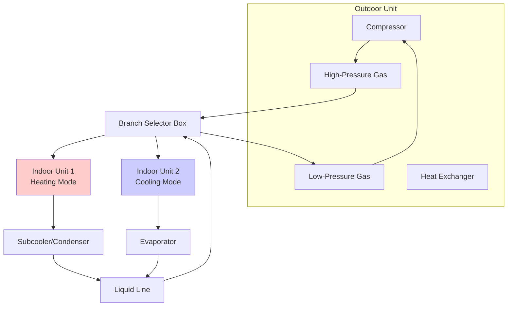

## Variable Refrigerant Flow Systems in Tall Buildings

Variable refrigerant flow (VRF) systems offer zoning flexibility and energy efficiency for tall buildings through direct expansion refrigerant distribution. The fundamental challenge in high-rise VRF applications involves managing refrigerant circulation and oil return across significant vertical distances where gravitational forces, pressure differentials, and fluid dynamics create operational constraints not encountered in low-rise installations.

## Refrigerant Piping Height Limitations

Height restrictions in VRF systems stem from the interaction between refrigerant pressure drop, oil transport requirements, and compressor discharge pressure capabilities.

### Physical Principles of Height Limits

The maximum vertical height between outdoor and indoor units is governed by:

$$\Delta P_{total} = \Delta P_{friction} + \Delta P_{elevation} + \Delta P_{acceleration}$$

For vertical refrigerant risers:

$$\Delta P_{elevation} = \rho_{refrigerant} \cdot g \cdot h$$

where $\rho_{refrigerant}$ is refrigerant density (kg/m³), $g$ is gravitational acceleration (9.81 m/s²), and $h$ is vertical height (m).

The pressure difference creates a static head that must be overcome by the compressor. For R-410A at typical operating conditions ($\rho \approx 1100$ kg/m³ in liquid state), each meter of vertical rise creates approximately 10.8 kPa of static pressure.

| Manufacturer Limits | Maximum Height (m) | Maximum Total Pipe Length (m) | Notes |
|---------------------|--------------------|-----------------------------|-------|
| Typical VRF Systems | 50-90 | 150-200 | Standard configurations |
| High-Rise Models | 90-165 | 200-300 | Requires oil separators |
| Distributed Systems | No single limit | 1000+ | Multiple outdoor units |
| Staged Refrigerant | 30-50 per stage | Varies | Cascade arrangement |

### Multi-Stage Refrigerant Distribution

For buildings exceeding single-system height limits, cascade or staged VRF configurations divide the building vertically:

## Oil Return Considerations

Oil circulation management represents the critical design challenge in tall building VRF systems, as compressor lubrication depends on continuous oil return from remote evaporators.

### Oil Transport Mechanics

Refrigerant velocity must maintain oil entrainment to prevent accumulation in horizontal runs and vertical risers. The minimum velocity for reliable oil return depends on pipe orientation:

**Horizontal suction lines:** $v_{min} = 3.5$ to 5 m/s

**Vertical suction risers:** $v_{min} = 5$ to 7.5 m/s

The drag force on oil droplets must exceed gravitational settling:

$$F_{drag} = \frac{1}{2} \cdot C_D \cdot \rho_{vapor} \cdot A_{droplet} \cdot v^2$$

where $C_D$ is drag coefficient, $A_{droplet}$ is droplet cross-sectional area, and $v$ is refrigerant velocity.

### Oil Separator Integration

High-rise VRF systems employ oil separators at outdoor units to minimize oil circulation:

| Oil Management Strategy | Application | Efficiency | Installation Requirement |
|------------------------|-------------|------------|--------------------------|
| Integral Oil Separator | Heights >50 m | 90-95% separation | Factory installed |
| External Coalescent Separator | Heights >90 m | 95-98% separation | Field installation required |
| Oil Level Sensors | All high-rise | Monitoring only | Compressor crankcase |
| Oil Equalizer Lines | Multiple compressors | N/A | Pressure balancing |

### Suction Riser Design for Oil Return

Vertical suction risers require specific design provisions:

$$D_{riser} = \sqrt{\frac{4 \cdot \dot{m}}{\pi \cdot \rho_{vapor} \cdot v_{min}}}$$

where $\dot{m}$ is refrigerant mass flow rate (kg/s), and $v_{min}$ is minimum velocity for oil entrainment.

For capacity modulation systems, dual-riser configurations prevent oil trapping at low loads:

- **Large riser:** Handles 100% capacity operation
- **Small riser:** Maintains velocity at 25-50% capacity

Inverted trap configurations with oil return orifices ensure oil drainage during shutdown periods.

## Branch Selector Boxes (BS Boxes)

Branch selector boxes distribute refrigerant to multiple indoor units while managing flow control and refrigerant phase separation.

### BS Box Functions

Branch selector boxes provide:

1. **Flow distribution** - Routes liquid refrigerant to active indoor units
2. **Pressure equalization** - Maintains consistent supply pressure
3. **Vapor-liquid separation** - Prevents liquid slugging in suction lines
4. **Solenoid control** - Isolates inactive units

### Strategic Placement in Tall Buildings

Optimal BS box locations minimize total pipe length while maintaining height limits:

**Vertical shaft placement:** Every 8-12 floors for distributed refrigerant delivery

**Horizontal distribution:** Reduces branch line lengths to <25 m per zone

**Service accessibility:** Mechanical closets or ceiling access panels

The pressure drop through a BS box adds to total system resistance:

$$\Delta P_{BS} = K_{BS} \cdot \frac{\rho \cdot v^2}{2}$$

Typical $K_{BS}$ values range from 1.5 to 3.0 depending on configuration and flow rates.

## Simultaneous Heating and Cooling

Heat recovery VRF systems enable energy-efficient simultaneous heating and cooling by transferring thermal energy between zones.

### Heat Recovery Operating Modes

| Operating Mode | Description | Energy Transfer | COP Range |
|----------------|-------------|-----------------|-----------|
| Cooling Only | All units cooling | Heat rejected to outdoor | 3.0-4.5 |
| Heating Only | All units heating | Heat absorbed from outdoor | 3.5-5.0 |
| Heat Recovery | Mixed heating/cooling | Internal heat transfer | 4.5-7.0 |
| Cooling Dominant | Majority cooling | Excess heat rejected | 4.0-5.5 |
| Heating Dominant | Majority heating | Additional heat absorbed | 4.0-5.5 |

### Three-Pipe Heat Recovery Architecture

Heat recovery VRF employs three refrigerant pipes:

- **High-pressure gas line:** From compressor to heating units
- **Low-pressure gas line:** From cooling units to compressor
- **Liquid line:** Bidirectional liquid refrigerant distribution

### Energy Balance in Heat Recovery

The heat recovery effectiveness depends on the ratio of heating to cooling loads:

$$Q_{recovery} = \min(Q_{heating,demand}, Q_{cooling,available})$$

When heating demand exceeds available cooling energy:

$$Q_{supplemental} = Q_{heating,total} - Q_{recovery}$$

Coefficient of performance during heat recovery operation:

$$COP_{system} = \frac{Q_{heating} + Q_{cooling}}{W_{compressor} + W_{fans}}$$

Heat recovery systems achieve COP values of 5.0-7.0 when heating and cooling loads are balanced, compared to 3.5-4.5 for heat pump-only operation.

### Tall Building Heat Recovery Benefits

High-rise buildings present ideal conditions for heat recovery VRF:

- **Core/perimeter loads:** Interior zones require cooling year-round while perimeter zones need heating
- **Solar exposure variation:** South-facing zones heat while north-facing zones cool
- **Occupancy diversity:** Data centers and kitchens reject heat for perimeter heating
- **Vertical temperature stratification:** Upper floors require more cooling, lower floors more heating

The temperature difference between heating and cooling zones drives thermodynamic efficiency. With core temperatures at 24°C requiring cooling and perimeter at 18°C requiring heating:

$$\Delta T_{internal} = T_{cooling,zone} - T_{heating,zone} = 6K$$

This internal temperature lift is significantly smaller than outdoor temperature differences, reducing compression work:

$$W_{recovery} = \dot{m} \cdot c_p \cdot \Delta T_{internal} / \eta_{compressor}$$

## Riser Design and Refrigerant Charge Management

Vertical refrigerant distribution in tall buildings requires specialized piping configurations and charge management strategies.

### Pressure Equalization Lines

Install pressure equalization (PE) lines parallel to liquid risers to prevent liquid column weight from creating excessive subcooling:

$$\Delta T_{subcool} = \frac{\Delta P_{static}}{(\partial P / \partial T)_{sat}}$$

PE lines allow vapor pressure communication, maintaining proper expansion valve operation.

### Refrigerant Charge Calculation

Total refrigerant charge increases substantially with building height:

$$M_{total} = M_{outdoor} + M_{indoor} + M_{liquid,line} + M_{vapor,line}$$

Liquid line charge dominates in tall buildings:

$$M_{liquid,line} = \rho_{liquid} \cdot V_{pipe} = \rho_{liquid} \cdot \frac{\pi \cdot D^2}{4} \cdot L$$

For a 100-meter riser with 28 mm OD liquid line and R-410A ($\rho_{liquid} \approx 1100$ kg/m³):

$$M_{liquid,line} = 1100 \cdot \frac{\pi \cdot 0.025^2}{4} \cdot 100 \approx 54 \text{ kg}$$

### Refrigerant Migration Prevention

During shutdown, temperature gradients cause refrigerant migration to the coldest system component. In tall buildings, upper floors may be significantly colder, creating charge imbalance.

**Mitigation strategies:**

- **Crankcase heaters:** Maintain compressor oil temperature above ambient
- **Pump-down cycles:** Move refrigerant to outdoor unit before shutdown
- **Refrigerant receivers:** Accumulate excess charge during migration events
- **Solenoid valve isolation:** Prevent refrigerant flow to inactive zones

## VRF System Selection for Tall Buildings

| Selection Criteria | Heat Pump VRF | Heat Recovery VRF | Distributed VRF |
|-------------------|---------------|-------------------|-----------------|
| Building Height | <50 m | <90 m | Unlimited |
| Simultaneous Heating/Cooling | No | Yes | Yes (with HR models) |
| Initial Cost | Lowest | +20-30% | +15-25% per zone |
| Operating Cost | Baseline | -15-25% | -10-20% |
| Refrigerant Charge | Moderate | High (+30%) | Lowest per system |
| Design Complexity | Low | Moderate | High |

**ASHRAE references:** Consult ASHRAE Handbook—HVAC Systems and Equipment, Chapter 18 (Air-Conditioning and Heating Systems) for VRF design guidance and Chapter 2 (Refrigerants) for refrigerant properties and piping design.

## Conclusion

VRF systems provide flexible, efficient climate control for tall buildings when properly designed for vertical refrigerant distribution challenges. Height limitations stem from pressure drop and oil return requirements, addressable through multi-stage configurations, oil separators, and proper riser sizing. Heat recovery variants offer substantial energy savings in buildings with simultaneous heating and cooling demands. Branch selector boxes enable distributed refrigerant delivery while maintaining system control. Success requires careful attention to refrigerant charge management, pressure equalization, and oil entrainment velocities throughout the vertical distribution network.
