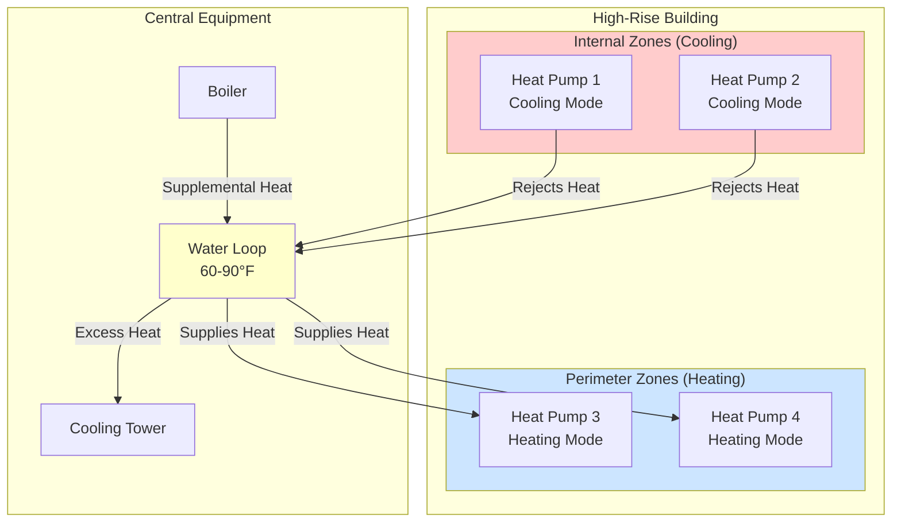
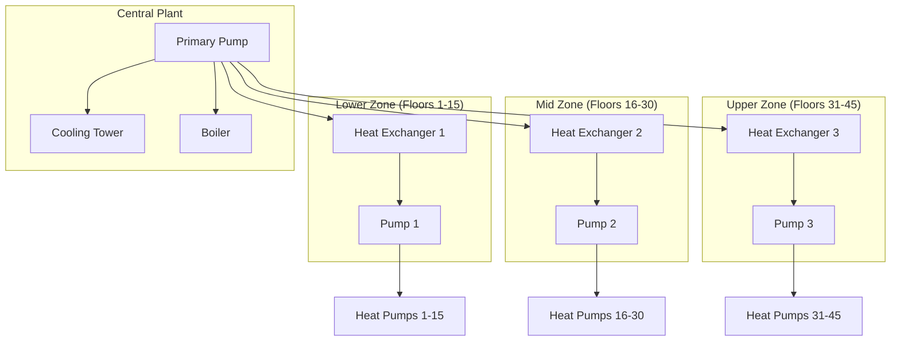

Water-source heat pump (WSHP) systems represent one of the most energy-efficient approaches for high-rise HVAC design, particularly in buildings with significant simultaneous heating and cooling loads. These distributed systems enable direct energy transfer between zones requiring cooling and zones requiring heating through a common water loop, eliminating the energy waste inherent in conventional central systems that reject heat while simultaneously generating it.

## System Architecture and Energy Transfer Principles

A WSHP system consists of multiple water-to-air heat pumps distributed throughout the building, connected to a closed-loop piping network containing water typically maintained between 60°F and 90°F. Each heat pump operates independently in heating or cooling mode based on zone requirements, using the loop as either a heat source or heat sink.

The fundamental energy balance for the loop demonstrates the energy recovery principle:

$$Q_{loop} = \sum Q_{cooling} + \sum P_{comp,cooling} - \sum Q_{heating}$$

where:
- $Q_{loop}$ = net heat addition to loop (positive requires cooling tower, negative requires boiler)
- $Q_{cooling}$ = heat extracted from cooling zones
- $P_{comp,cooling}$ = compressor power for cooling units
- $Q_{heating}$ = heat delivered to heating zones

When internal zones require cooling while perimeter zones require heating (common in shoulder seasons and moderate climates), the system achieves near-zero net loop load, requiring minimal auxiliary heating or cooling.

## Loop Temperature Control Strategy

Loop temperature control directly impacts system efficiency through its effect on heat pump Coefficient of Performance (COP). The relationship between entering water temperature (EWT) and COP follows:

For heating mode:
$$COP_{heating} = \frac{Q_{heating}}{P_{comp}} = f(T_{cond} - T_{evap})$$

For cooling mode:
$$COP_{cooling} = \frac{Q_{cooling}}{P_{comp}} = f(T_{evap} - T_{cond})$$

Lower loop temperatures improve cooling COP but degrade heating COP, while higher temperatures have the opposite effect. ASHRAE Standard 90.1 references 60°F minimum and 90°F maximum loop temperatures as practical bounds.

**Optimal control sequences:**

1. **Floating loop temperature**: Allow loop temperature to float between setpoints based on load balance, minimizing auxiliary equipment operation
2. **Differential temperature control**: Maintain loop temperature differential ($\Delta T = T_{supply} - T_{return}$) of 10-20°F to minimize pumping energy
3. **Staged auxiliary equipment**: Activate cooling tower or boiler only when loop temperature approaches limits despite internal heat recovery

| Loop Temperature | Heating COP Impact | Cooling COP Impact | Application |
|-----------------|-------------------|-------------------|-------------|
| 60-70°F | Reduced (3.0-3.5) | Optimal (4.5-5.5) | Cooling-dominant buildings |
| 70-80°F | Balanced (3.5-4.0) | Balanced (4.0-5.0) | Mixed-use, shoulder seasons |
| 80-90°F | Optimal (4.0-5.0) | Reduced (3.5-4.5) | Heating-dominant conditions |

## Heat Pump Sizing for High-Rise Applications

Heat pump capacity selection must account for both thermal load and available water-side temperature range. Manufacturers rate equipment at specific EWT conditions (typically 70°F for cooling, 80°F for heating), but actual capacity varies significantly with loop temperature.

The capacity adjustment relationship:

$$Q_{actual} = Q_{rated} \times CAF$$

where $CAF$ = Capacity Adjustment Factor from manufacturer data, varying ±15-25% across the loop temperature range.

**Sizing methodology:**

1. Calculate zone peak loads at design conditions
2. Determine coincident loop temperature based on building-wide load diversity
3. Apply capacity adjustment factors for actual EWT
4. Add 10-15% safety factor for high-rise pressure effects and piping pressure drop
5. Verify performance at multiple operating conditions (peak heating, peak cooling, shoulder season)

For a perimeter zone requiring 24,000 Btu/h heating at design conditions with expected 70°F loop temperature:

$$\text{Required nominal capacity} = \frac{24,000 \text{ Btu/h}}{0.85 \text{ CAF}} \times 1.10 = 31,000 \text{ Btu/h}$$

Select next standard size (36,000 Btu/h nominal).

## Loop Piping Design Considerations

High-rise WSHP piping presents unique challenges due to static pressure, friction losses over vertical distribution, and the need for pressure zoning.

**Critical design parameters:**

- **Static pressure**: $P_{static} = \rho g h = 0.433 \text{ psi/ft}$ for water
- **Friction loss**: Use Darcy-Weisbach equation with equivalent length method for fittings
- **System pressure rating**: Specify piping and components for maximum static pressure plus system operating pressure

**Pressure zone strategy:**

Buildings exceeding 400 feet typically require pressure zone separation to limit equipment pressure ratings and prevent excessive pressure at heat pump connections. Common approach uses intermediate heat exchangers every 15-20 floors with dedicated circulation pumps per zone.

**Piping sizing criteria:**

- Main risers: 2-4 ft/s velocity at design flow
- Branch piping: 4-6 ft/s velocity maximum
- Total pressure drop budget: 15-25 ft wc per zone
- Expansion tank sizing for total system volume plus thermal expansion

The pressure drop calculation for vertical risers:

$$\Delta P_{total} = \Delta P_{friction} + \Delta P_{static,net}$$

For a closed-loop system, net static pressure is zero over complete circulation path, leaving only friction losses and local pressure requirements.

## Boiler and Cooling Tower Plant Design

Auxiliary equipment capacity depends on building load diversity and climate. The central plant must handle net loop imbalance when simultaneous heating and cooling cannot achieve balance.

**Boiler capacity**: Size for peak heating load minus coincident internal heat gain recovery, typically 50-70% of building peak heating load:

$$Q_{boiler} = Q_{peak,heating} - (Q_{internal,cooling} + P_{comp}) \times DF$$

where $DF$ = diversity factor (0.6-0.8 for high-rise applications).

**Cooling tower capacity**: Size for peak cooling load plus compressor heat of rejection minus coincident perimeter heating recovery:

$$Q_{tower} = (Q_{peak,cooling} + P_{comp}) \times 1.25 - Q_{perimeter,heating} \times DF$$

The 1.25 multiplier accounts for heat of compression. Tower selection should prioritize low approach temperature (6-8°F) to maintain lower loop temperatures and improve cooling-mode COP.

## Energy Recovery Performance

The energy recovery effectiveness quantifies the system's ability to reuse rejected heat:

$$\eta_{recovery} = \frac{Q_{recovered}}{Q_{total,heating}} = \frac{Q_{cooling} + P_{comp} - Q_{tower}}{Q_{heating}}$$

Well-designed WSHP systems in mixed-use high-rise buildings achieve recovery effectiveness of 40-70% annually, with peak values exceeding 90% during shoulder seasons when perimeter and internal loads balance.

This direct energy transfer eliminates double conversion losses present in conventional systems (generating heat while rejecting heat elsewhere), providing significant energy savings particularly in buildings with high internal loads and variable occupancy patterns across zones.
