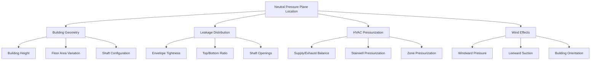

Vertical shafts in tall buildings create unique pressure differential challenges driven by thermal buoyancy forces. Understanding the physics of stack effect, neutral pressure plane dynamics, and seasonal variations is essential for designing high-rise HVAC systems that maintain occupant comfort, control air infiltration, and ensure proper building pressurization.

## Stack Effect Fundamentals

Stack effect results from air density differences between the building interior and exterior, creating buoyant forces that drive vertical airflow through continuous shafts.

### Pressure Differential Physics

The pressure difference at any height due to stack effect is governed by the hydrostatic equation modified for temperature-dependent density:

$$\Delta P = \rho_o g h \left(\frac{1}{T_o} - \frac{1}{T_i}\right) \times T_o$$

Where:
- $\Delta P$ = pressure differential (Pa)
- $\rho_o$ = outdoor air density at reference temperature (kg/m³)
- $g$ = gravitational acceleration, 9.81 m/s²
- $h$ = height above neutral pressure plane (m)
- $T_o$ = absolute outdoor temperature (K)
- $T_i$ = absolute indoor temperature (K)

**Simplified form for engineering calculations:**

$$\Delta P = C \times h \times \left(\frac{1}{T_o} - \frac{1}{T_i}\right)$$

Where $C = 3460$ Pa·m·K (for standard atmospheric pressure).

### Stack Effect Magnitude

For a typical winter condition with indoor temperature of 21°C (294 K) and outdoor temperature of -18°C (255 K):

$$\Delta P = 3460 \times h \times \left(\frac{1}{255} - \frac{1}{294}\right)$$

$$\Delta P = 3460 \times h \times (0.00392 - 0.00340) = 1.80h \text{ Pa}$$

This yields approximately **1.8 Pa per meter of height** under these conditions.

| Building Height | Winter ΔP (Pa) | Summer ΔP (Pa) | Annual Variation |
|----------------|----------------|----------------|------------------|
| 50 m (13 floors) | 90 | -30 | 120 Pa |
| 100 m (26 floors) | 180 | -60 | 240 Pa |
| 200 m (52 floors) | 360 | -120 | 480 Pa |
| 300 m (78 floors) | 540 | -180 | 720 Pa |

*Note: Summer values assume reverse stack effect with outdoor temperature 35°C, indoor 24°C*

## Neutral Pressure Plane

The neutral pressure plane (NPP) represents the elevation where indoor and outdoor pressures are equal. Air flows into the building below the NPP and out above it during normal stack effect conditions.

### NPP Location Calculation

For a building with uniform leakage characteristics:

$$h_{NPP} = \frac{H}{2} \times \frac{1 + (A_{bottom}/A_{top})}{1 + \sqrt{A_{bottom}/A_{top}}}$$

Where:
- $h_{NPP}$ = height of neutral pressure plane (m)
- $H$ = total building height (m)
- $A_{bottom}$ = effective leakage area at base (m²)
- $A_{top}$ = effective leakage area at top (m²)

**For equal top and bottom leakage** ($A_{bottom} = A_{top}$):

$$h_{NPP} = \frac{H}{2}$$

The NPP locates at mid-height.

### Factors Affecting NPP Location

### NPP Control Strategies

Building pressurization systems can shift the NPP location:

**Positive building pressurization** (supply > exhaust):
- Raises NPP above mid-height
- Increases outward flow at upper levels
- Reduces infiltration at lower levels

**Negative building pressurization** (exhaust > supply):
- Lowers NPP below mid-height
- Increases infiltration at lower levels
- Increases exfiltration at upper levels

## Seasonal Variations

Stack effect reverses direction seasonally based on indoor-outdoor temperature relationships.

### Winter Stack Effect

**Conditions:** $T_i > T_o$

- Indoor air less dense than outdoor air
- Upward buoyant force in shafts
- Infiltration at lower floors
- Exfiltration at upper floors
- Maximum pressure differentials
- Critical for vestibule design

**Vertical airflow velocity in shafts:**

$$v = \sqrt{\frac{2\Delta P}{\rho}}$$

For $\Delta P = 180$ Pa and $\rho = 1.2$ kg/m³:

$$v = \sqrt{\frac{2 \times 180}{1.2}} = 17.3 \text{ m/s}$$

This substantial velocity creates door operation challenges and air distribution issues.

### Summer Stack Effect

**Conditions:** $T_i < T_o$ (in air-conditioned buildings)

- Indoor air denser than outdoor air
- Downward force in shafts (reverse stack)
- Infiltration at upper floors
- Exfiltration at lower floors
- Lower magnitude than winter (smaller ΔT)
- Humidity infiltration concerns

### Transition Periods

Spring and fall present unique challenges:

- NPP shifts frequently
- Variable pressure differentials
- Unpredictable airflow patterns
- Control system hunting
- Mixed-mode ventilation opportunities

## Vertical Shaft Pressure Management

### Elevator Shafts

Elevator shafts act as vertical airways connecting all floors:

**Pressurization approaches:**

1. **Vented shafts:** Reduce pressure buildup through controlled venting at top
2. **Sealed shafts:** Minimize air exchange, control pressure through HVAC
3. **Pressurized shafts:** Active pressurization for smoke control

**Elevator piston effect:**

$$\Delta P_{piston} = \frac{\rho v^2}{2} \times \frac{A_{car}}{A_{shaft} - A_{car}}$$

Where:
- $v$ = elevator velocity (m/s)
- $A_{car}$ = car cross-sectional area (m²)
- $A_{shaft}$ = shaft cross-sectional area (m²)

### Stairwell Pressurization

NFPA 92A and IBC requirements for stairwell pressurization during fire emergencies:

| Condition | Minimum Pressure | Maximum Pressure |
|-----------|------------------|------------------|
| Doors closed | 12.5 Pa | 75 Pa |
| Single door open | 12.5 Pa | 75 Pa |
| Critical door open | Per AHJ | 175 Pa (max opening force) |

**Design airflow for pressurization:**

$$Q = A_L \times \sqrt{\frac{2\Delta P}{\rho}}$$

Where:
- $Q$ = required airflow (m³/s)
- $A_L$ = total leakage area (m²)
- $\Delta P$ = target pressure differential (Pa)

## Mitigation Strategies

### Compartmentalization

Dividing tall buildings into vertical zones:

- Sky lobbies as pressure breaks
- Transfer floors with separation
- Mechanical floors as boundaries
- Reduced effective height per zone

**Effective height reduction:**

For 4 zones in 300 m building: $h_{effective} = 75$ m

Pressure reduction: $\Delta P = 1.8 \times 75 = 135$ Pa (instead of 540 Pa)

### Revolving Doors and Vestibules

Required at building entries to manage pressure differentials:

**Vestibule effectiveness:**

$$\eta = 1 - \frac{Q_{with\,vestibule}}{Q_{without\,vestibule}}$$

Properly designed vestibules achieve 60-80% reduction in infiltration.

### Shaft Venting

Strategic venting of vertical shafts:

- Top-of-building vents for elevator shafts
- Mid-height venting for NPP stabilization
- Automated dampers for seasonal reversal
- Relief dampers to limit maximum pressure

## ASHRAE References

ASHRAE Handbook—Fundamentals (2021):
- Chapter 16: Ventilation and Infiltration
- Stack effect calculations and pressure distribution

ASHRAE Handbook—HVAC Applications (2019):
- Chapter 5: Tall Buildings
- Vertical transportation integration with HVAC

ASHRAE Standard 62.1-2022: Ventilation for Acceptable Indoor Air Quality
- Pressurization requirements
- Outdoor air delivery in tall buildings

## Measurement and Verification

**Pressure monitoring locations:**

1. Base of building (below NPP)
2. Neutral pressure plane elevation
3. Top mechanical floor
4. Critical elevator lobbies
5. Stairwell at multiple levels

**Acceptance criteria:**

- Maximum door opening force: 133 N (30 lbf)
- Lobby pressure: ±5 Pa relative to exterior
- Stairwell pressure: per NFPA requirements
- Elevator lobby pressure: -2.5 to +2.5 Pa relative to adjacent spaces

Understanding pressure differentials in vertical shafts enables engineers to design effective pressurization systems, select appropriate vestibule configurations, and implement zone separation strategies that maintain comfort and safety in tall buildings across all seasons.
