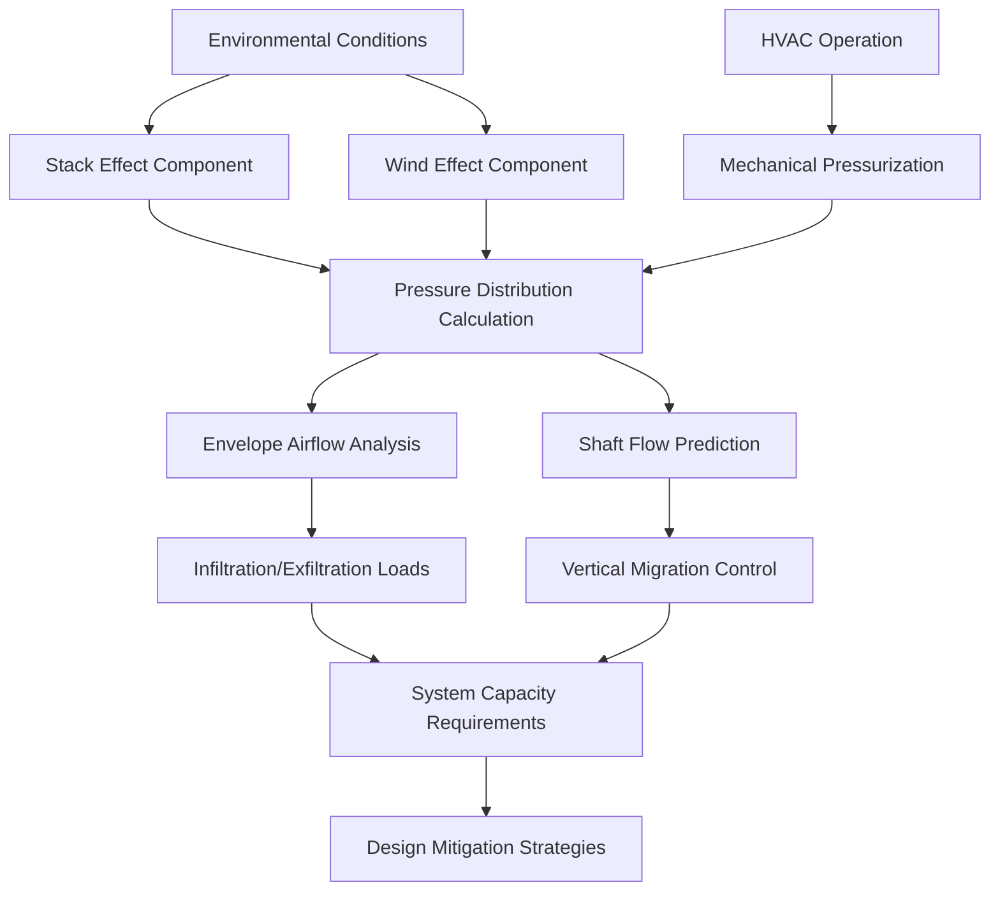

Accurate pressure differential calculations form the foundation of high-rise HVAC system design. These methods quantify stack effect forces, wind-induced pressures, and their combined impact on building envelope infiltration, shaft airflow, and vertical pressure distribution. Understanding the physics and computational approaches enables engineers to predict pressure-driven phenomena and design effective mitigation strategies.

## Stack Effect Pressure Calculation

The fundamental stack effect pressure differential arises from density differences between indoor and outdoor air columns. At any height $h$ above the neutral pressure plane (NPP), the pressure difference is:

$$\Delta P_s = \rho_o g h \left(1 - \frac{T_o}{T_i}\right)$$

Where:
- $\Delta P_s$ = stack effect pressure differential (Pa)
- $\rho_o$ = outdoor air density (kg/m³)
- $g$ = gravitational acceleration (9.81 m/s²)
- $h$ = vertical distance from neutral pressure plane (m)
- $T_o$ = outdoor absolute temperature (K)
- $T_i$ = indoor absolute temperature (K)

**Simplified form** using standard air density at sea level (1.2 kg/m³):

$$\Delta P_s = 0.0342 \, h \, \frac{\Delta T}{T_i}$$

Where $\Delta T = T_i - T_o$ in Kelvin. This equation reveals that pressure differential scales linearly with height and temperature difference, creating maximum differential at building extremes during winter conditions.

### Neutral Pressure Plane Location

The NPP represents the elevation where indoor and outdoor pressures equalize. Its location depends on building leakage distribution and HVAC system operation. For a building with uniform leakage:

$$h_{NPP} = \frac{\sum A_i h_i}{\sum A_i}$$

Where $A_i$ represents leakage area at height $h_i$. In practice, NPP typically locates between 0.3H to 0.7H (H = building height), shifting based on:

| Condition | NPP Shift | Physical Reason |
|-----------|-----------|-----------------|
| Top-heavy leakage | Upward | More flow resistance below |
| Bottom-heavy leakage | Downward | More flow resistance above |
| Exhaust fan operation | Upward | Building depressurization |
| Supply air imbalance | Downward | Building pressurization |
| Increased outdoor temperature | Toward building mid-height | Reduced density differential |

Strategic manipulation of NPP through pressurization reduces peak differentials at critical locations (e.g., ground floor entrances, elevator shafts).

## Wind Effect Calculations

Wind creates surface pressure distributions governed by Bernoulli's equation and building geometry. The wind-induced pressure at any building surface:

$$P_w = C_p \cdot \frac{1}{2} \rho_{air} V^2$$

Where:
- $P_w$ = wind pressure (Pa)
- $C_p$ = pressure coefficient (dimensionless)
- $V$ = wind velocity at building height (m/s)
- $\rho_{air}$ = air density (kg/m³)

Pressure coefficients vary with building shape, orientation, and surrounding terrain. ASHRAE Handbook—Fundamentals Chapter 24 provides $C_p$ values:

| Building Surface | $C_p$ Range | Typical Value |
|-----------------|-------------|---------------|
| Windward face | +0.5 to +0.8 | +0.6 |
| Leeward face | -0.3 to -0.5 | -0.4 |
| Side faces | -0.6 to -0.8 | -0.7 |
| Roof (flat) | -0.6 to -0.9 | -0.7 |
| Corners/edges | -1.0 to -1.5 | -1.2 |

**Wind velocity increases with height** according to the power law profile:

$$V_h = V_{ref} \left(\frac{h}{h_{ref}}\right)^\alpha$$

Where $\alpha$ ranges from 0.14 (open terrain) to 0.33 (urban centers). This vertical gradient creates differential pressures across building height even on the same facade.

## Combined Thermal and Wind Analysis

Stack and wind effects superimpose, creating complex pressure patterns. The total pressure differential across the building envelope:

$$\Delta P_{total} = \Delta P_s + \Delta P_w + \Delta P_{HVAC}$$

Where $\Delta P_{HVAC}$ represents mechanical system pressurization or depressurization effects. The interaction produces:

**Critical design conditions** occur when thermal and wind effects align:

1. **Winter windward upper floors**: $\Delta P_s$ (positive) + $P_w$ (positive) = maximum infiltration
2. **Winter leeward upper floors**: $\Delta P_s$ (positive) + $P_w$ (negative) = potential reversal
3. **Summer ground floor**: $\Delta P_s$ (negative) + $P_w$ (variable) = entrance pressurization challenges

## Computational Methods

### Airflow Network Modeling

Network models discretize buildings into nodes (zones, shafts) connected by flow paths (leakage, doors, dampers). The pressure-flow relationship for each path:

$$Q = C (\Delta P)^n$$

Where:
- $Q$ = volumetric flow rate (m³/s)
- $C$ = flow coefficient (m³/s·Pa^n)
- $n$ = flow exponent (0.5 for turbulent, 1.0 for laminar)

Simultaneous solution of mass balance equations at all nodes yields pressure distribution:

$$\sum Q_{in} = \sum Q_{out}$$

Software tools (CONTAM, EnergyPlus Airflow Network) solve these non-linear equation sets iteratively. Input requirements include:

- Building geometry and leakage distribution
- Shaft dimensions and effective leakage areas
- Door specifications (size, closing force, infiltration class)
- HVAC system parameters (supply/return flows, pressurization)
- Environmental boundary conditions (T, P, wind)

### Computational Fluid Dynamics

CFD provides spatial resolution of velocity and pressure fields within shafts and around building exteriors. The Navier-Stokes equations govern fluid motion:

$$\rho \left(\frac{\partial \mathbf{v}}{\partial t} + \mathbf{v} \cdot \nabla \mathbf{v}\right) = -\nabla p + \mu \nabla^2 \mathbf{v} + \rho \mathbf{g}$$

CFD applications in high-rise HVAC include:

| Analysis Type | CFD Application | Design Insight |
|--------------|-----------------|----------------|
| Exterior wind flow | Surface pressure coefficients | Building-specific $C_p$ values |
| Shaft airflow patterns | Velocity profiles, recirculation zones | Optimal vent sizing/location |
| Lobby airflow | Temperature stratification | Vestibule effectiveness |
| Mechanical room ventilation | Hot spot identification | Equipment layout optimization |

**Turbulence modeling** (k-ε, k-ω SST) captures realistic flow behavior but demands significant computational resources. Simplified approaches (potential flow, panel methods) offer faster solutions for preliminary design.

## Design Tools and Procedures

**Hand Calculation Workflow**:

**Software-Based Analysis**:

1. **Building geometry input**: Floor plans, shaft locations, dimensions
2. **Leakage characterization**: Envelope air barrier performance, door infiltration ratings
3. **Environmental scenarios**: Design heating/cooling days, wind speed/direction
4. **HVAC system definition**: Pressurization strategy, system flows
5. **Iterative solution**: Convergence to pressure/flow distribution
6. **Post-processing**: Peak differentials, shaft flows, mitigation effectiveness

ASHRAE Handbook—HVAC Applications Chapter 53 provides detailed procedures for stack effect calculations and mitigation design. Accuracy depends critically on leakage area estimation—field testing (blower door, tracer gas) improves prediction reliability.

**Validation approaches** include:

- Pressure differential monitoring during commissioning
- Shaft airflow velocity measurements
- Door opening force testing
- Comparison with similar buildings in same climate

These calculation methods enable quantitative prediction of pressure-driven phenomena, transitioning design from empirical rules to physics-based performance prediction. The combination of analytical equations for conceptual understanding and computational tools for detailed analysis provides comprehensive design capability.

## Components

- Stack Effect Pressure Calculation
- Shaft Airflow Estimation
- Leakage Area Determination
- Pressure Loss Calculations
- Flow Coefficient Shaft Doors
- Empirical Pressure Methods
- Computational Fluid Dynamics Shafts
