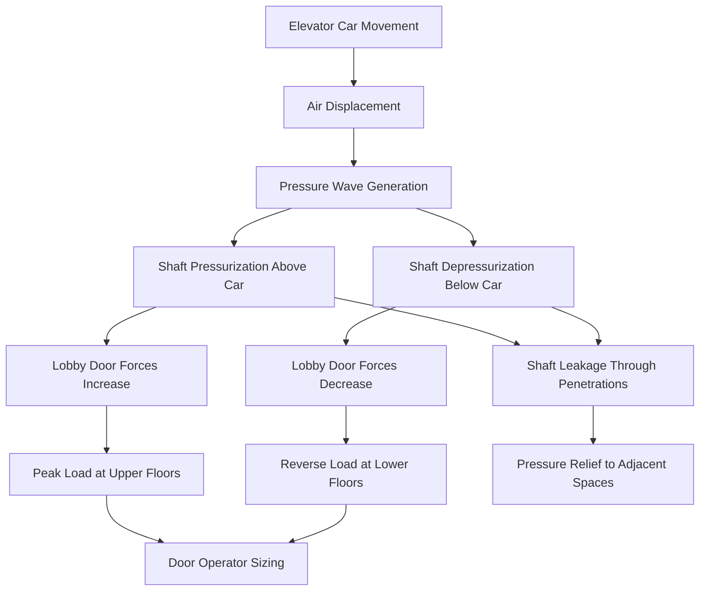
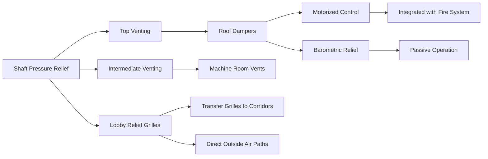

Elevator shafts in tall buildings generate complex pressure dynamics driven by car movement, stack effect, and HVAC system interactions. The piston effect from a moving elevator car creates transient pressure fluctuations that impact door operation, occupant comfort, and fire safety systems. Proper analysis of these pressure differentials is essential for code compliance and operational reliability.

## Piston Effect Physics

The elevator car acts as a moving piston within the hoistway, displacing air as it travels. This displacement creates pressure waves that propagate through the shaft and surrounding spaces. The magnitude of pressure change depends on car velocity, shaft cross-sectional area, and leakage characteristics.

The instantaneous pressure differential generated by car movement is approximated by:

$$\Delta P = \frac{\rho v^2}{2} \left(\frac{A_c}{A_s - A_c}\right)^2 \cdot C_d$$

Where:
- $\Delta P$ = pressure differential (Pa)
- $\rho$ = air density (kg/m³)
- $v$ = car velocity (m/s)
- $A_c$ = car cross-sectional area (m²)
- $A_s$ = shaft cross-sectional area (m²)
- $C_d$ = dynamic pressure coefficient (typically 0.6-0.8)

For a high-speed elevator traveling at 8 m/s in a shaft with 60% car-to-shaft area ratio, peak pressure differentials reach 150-250 Pa. These transient pressures superimpose on static stack effect pressures, creating complex loading conditions on lobby doors.

## Pressure Distribution in Hoistways

Pressure within the elevator shaft varies vertically due to stack effect and horizontally due to car position. The total pressure at any point combines static stack pressure and dynamic piston pressure:

$$P_{total}(z,t) = P_{stack}(z) + P_{piston}(z,t)$$

Stack effect pressure follows:

$$P_{stack}(z) = \rho g h \left(\frac{1}{T_{out}} - \frac{1}{T_{shaft}}\right)$$

Where:
- $g$ = gravitational acceleration (9.81 m/s²)
- $h$ = height above neutral plane (m)
- $T_{out}$ = outdoor absolute temperature (K)
- $T_{shaft}$ = shaft air absolute temperature (K)

## Lobby Door Force Analysis

Elevator lobby doors experience combined forces from stack effect and piston effect. IBC Section 3002.7 requires that lobby doors operate under maximum design pressure differentials. The force required to open a door against pressure differential is:

$$F_{door} = \Delta P \cdot A_{door} \cdot \mu$$

Where:
- $F_{door}$ = door opening force (N)
- $\Delta P$ = pressure differential across door (Pa)
- $A_{door}$ = door leaf area (m²)
- $\mu$ = force transmission efficiency (0.5-0.7 for sliding doors)

| Pressure Differential | Standard Door (2.1 m × 0.9 m) | Wide Door (2.1 m × 1.2 m) | Force Limit |
|----------------------|-------------------------------|---------------------------|-------------|
| 25 Pa | 24 N | 32 N | Acceptable |
| 50 Pa | 47 N | 63 N | Marginal |
| 75 Pa | 71 N | 95 N | Requires power assist |
| 100 Pa | 95 N | 126 N | Exceeds ADA limits |

ADA and IBC limit maximum door opening force to 133 N (30 lbf). When combined stack and piston pressures exceed 75 Pa, powered door operators or pressure relief strategies become necessary.

## Fire Service Elevator Requirements

NFPA 72 and IBC Section 3007 mandate specific pressurization requirements for fire service elevators. The hoistway must maintain positive pressure relative to the fire floor to prevent smoke infiltration during emergency operations.

NFPA 72 Section 21.3.3 requires:
- Minimum 25 Pa positive pressure in elevator lobby relative to fire floor
- Maximum 35 Pa to prevent excessive door opening forces
- Pressure maintained under single door open condition
- Automatic pressure relief for non-fire conditions

The pressurization airflow required to maintain target pressure is calculated by:

$$Q = A_{leak} \sqrt{\frac{2\Delta P}{\rho}} \cdot C_{leak}$$

Where:
- $Q$ = airflow rate (m³/s)
- $A_{leak}$ = total leakage area (m²)
- $C_{leak}$ = leakage coefficient (0.6-0.65)

For a typical fire service elevator lobby with 0.08 m² equivalent leakage area, maintaining 30 Pa pressure requires approximately 850 m³/h (500 CFM) supply air.

## Shaft Venting Strategies

Venting strategies reduce peak pressure differentials while maintaining fire safety:

### Top Venting
Motorized dampers at the shaft top open during high-speed car operation to relieve pressure. Vent area is sized to limit peak pressure:

$$A_{vent} = \frac{v \cdot A_c}{\sqrt{\frac{2\Delta P_{max}}{\rho}}}$$

For the previous example (8 m/s car, limiting to 50 Pa), required vent area is approximately 1.2 m².

### Intermediate Venting
Machine rooms provide natural relief paths when doors or louvers connect the shaft to building spaces. This approach reduces peak pressures but may transfer noise and pressure fluctuations to occupied areas.

### Lobby Relief
Transfer grilles between elevator lobbies and corridors reduce door opening forces but compromise acoustic separation. Grille sizing follows the same airflow equation, with effective area 40-60% of geometric area due to louver resistance.

## Pressure Measurement and Verification

Field verification of elevator shaft pressurization requires instrumentation and test protocols addressing transient conditions:

| Parameter | Instrumentation | Measurement Method | Acceptance Criteria |
|-----------|-----------------|-------------------|---------------------|
| Static Stack Pressure | Differential manometer | Shaft-to-exterior at multiple floors | Match calculation ±15% |
| Peak Piston Pressure | Fast-response transducer | 10+ Hz sampling during travel | Below design limit |
| Lobby Door Force | Force gauge | Pull force at latch edge | ≤133 N (30 lbf) |
| Fire Service Pressure | Calibrated manometer | With supply fan operating | 25-35 Pa range |

Testing must occur under design wind and temperature conditions. Winter conditions typically produce maximum stack effect, while summer conditions may reverse pressure gradients in conditioned shafts.

## Design Integration

Successful elevator shaft pressure management requires coordination between architectural, structural, and HVAC disciplines:

1. **Shaft sealing**: Specify construction joints, penetration seals, and door frames to achieve target leakage rates (typically 1.5-2.5 m²/100 m² shaft wall area equivalent leakage)

2. **Door operator sizing**: Select door machines capable of operating against design pressure differentials plus 25% margin

3. **Pressurization system**: Integrate fire service pressurization fans with building BMS for pressure monitoring and damper control

4. **Relief paths**: Design intentional relief paths sized to limit peak pressures while maintaining fire compartmentation

5. **Stack effect mitigation**: Consider mid-rise sky lobbies, shaft partitioning, or vestibule systems to reduce overall pressure differentials

The interaction between elevator shaft pressurization and building stack effect creates one of the most challenging pressure control problems in tall building design. Physics-based analysis of car motion, shaft geometry, and leakage characteristics provides the foundation for reliable system performance across all operating conditions.
