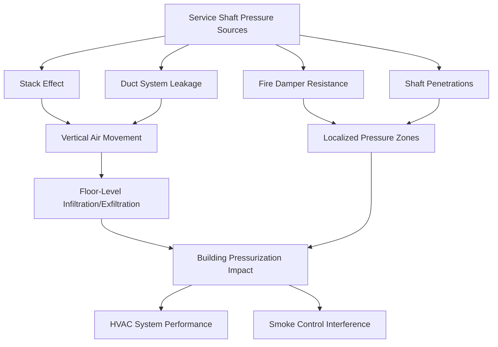
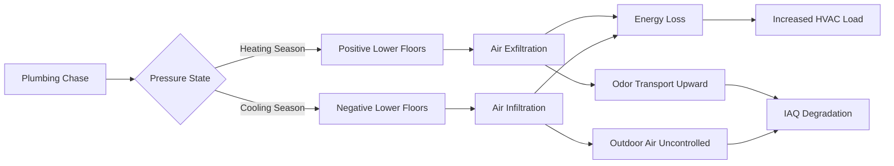

## Service Shaft Pressure Physics

Service shafts in high-rise buildings experience significant pressure differentials driven by stack effect, mechanical system operation, and fire protection requirements. Unlike stairwells designed for specific pressurization, service shafts create unintended vertical airflow paths that affect building pressurization, energy consumption, and smoke control system performance.

The fundamental pressure differential in a service shaft follows the hydrostatic equation modified for temperature differences:

$$\Delta P = \rho g h \left(\frac{T_{shaft} - T_{outdoor}}{T_{outdoor}}\right)$$

Where $\rho$ = air density (kg/m³), $g$ = gravitational acceleration (9.81 m/s²), $h$ = shaft height (m), and temperatures in Kelvin. A 200-meter shaft with a 20°C temperature difference generates approximately 48 Pa of pressure differential between top and bottom.

## Mechanical Shaft Pressurization Characteristics

Mechanical shafts housing supply and return ducts, piping, and electrical conduit create complex pressure environments influenced by multiple factors:

**Primary Pressure Sources:**
- Stack effect from temperature stratification within the shaft
- Fan pressure transmitted through duct leakage
- Elevator piston effect in adjacent shafts
- HVAC equipment operation creating local pressurization
- Wind-induced pressure variations at shaft terminations

The net pressure at any shaft elevation combines these effects:

$$P_{total}(z) = P_{stack}(z) + P_{duct\_leak}(z) + P_{wind}(z)$$

Mechanical shafts typically operate at 5-15 Pa positive relative to occupied spaces during heating season and may reverse to negative during cooling season depending on shaft temperature control.

## Duct Shaft Air Leakage Analysis

Vertical duct shafts exhibit leakage at multiple points creating distributed pressure losses along the shaft height. The cumulative leakage follows the power-law relationship:

$$Q_{leak} = C \cdot A \cdot \Delta P^n$$

Where $C$ = leakage coefficient (0.4-0.65 for typical construction), $A$ = total leakage area (m²), and $n$ = flow exponent (0.6-0.7). For a shaft with 200 m² of wall area and leakage class rating of 1.8 L/s·m² at 75 Pa, total leakage exceeds 25,000 L/s under peak pressure differential conditions.

This distributed leakage creates a vertical pressure gradient that deviates from the theoretical stack effect curve:

$$\frac{dP}{dz} = -\rho g + \frac{Q_{leak}(z)}{A_{shaft} \cdot v(z)}$$

The second term represents pressure recovery from reduced airflow velocity as leakage occurs along the shaft height.

| Shaft Sealing Method | Leakage Rate (L/s·m² @ 75 Pa) | Relative Cost | Durability |
|----------------------|-------------------------------|---------------|------------|
| Unsealed CMU | 3.5-5.0 | 1.0× | Permanent |
| Painted CMU | 1.8-2.5 | 1.2× | 5-10 years |
| Gypsum Board (unsealed joints) | 2.0-3.0 | 1.3× | Permanent |
| Sealed Gypsum (caulked) | 0.8-1.2 | 1.5× | 15+ years |
| Spray-Applied Barrier | 0.4-0.6 | 2.0× | 20+ years |

## Plumbing Chase Pressure Dynamics

Plumbing chases create unique pressure challenges due to water flow dynamics, vent stack connections, and thermal stratification from hot water piping. The effective leakage area in plumbing chases typically exceeds mechanical shafts by 40-60% due to larger penetrations for piping.

**Critical Pressure Considerations:**
- Vent stack operation creates bidirectional airflow
- Drain line air admittance valves allow one-way airflow
- Hot water risers elevate shaft temperature 8-15°C above ambient
- Condensate drain terminations create direct outdoor connections
- Floor drain connections to sanitary system allow sewer gas infiltration under negative pressure

The combined effect produces shaft pressures that vary with plumbing system operation:

$$P_{chase}(t) = P_{stack,thermal} + P_{vent,flow} + P_{drain,surge}$$

Where the vent flow term varies with fixture discharge events and the drain surge term represents transient pressure pulses from waste water flow.

## Fire Damper Impact on Shaft Pressure

Fire dampers installed at floor penetrations create significant flow restrictions affecting shaft pressurization. The pressure drop across a fire damper follows turbulent flow principles:

$$\Delta P_{damper} = \frac{1}{2} \rho v^2 K$$

Where $K$ = damper loss coefficient (2.5-4.5 for fusible link dampers, 1.5-2.5 for curtain-type). A shaft experiencing 500 L/s airflow through a 0.5 m² damper opening generates 15-30 Pa additional pressure drop.

**Fire Damper Pressure Effects:**
- Creates localized high-pressure zones immediately upstream
- Reduces stack effect airflow by 30-50% compared to open shafts
- Allows pressure compartmentalization between floors
- Generates turbulent mixing that moderates shaft temperature stratification

International Building Code (IBC) Section 717 and International Mechanical Code (IMC) Section 607 require fire dampers at shaft penetrations through fire-resistance-rated assemblies. These dampers must maintain ratings while accommodating operational pressure differentials up to 50 Pa without premature closure.

## Shaft Sealing and Leakage Control Strategies

Effective shaft sealing requires addressing penetrations, construction joints, and material permeability:

**Penetration Sealing Requirements (IBC Section 714):**
- Firestop systems must maintain F-rating equal to shaft wall rating
- Leakage rating (L-rating) required for smoke barrier penetrations
- Annular spaces around pipes sealed with approved materials
- Cable tray penetrations require functional fire-stopping systems

**Construction Joint Treatment:**
- Horizontal joints at floor slabs sealed with intumescent gaskets
- Vertical control joints treated with elastomeric sealants
- Door frames and access panel perimeters continuously sealed
- Mechanical equipment anchors isolated with compression seals

The overall shaft leakage coefficient improves exponentially with comprehensive sealing:

$$C_{effective} = C_{base} \cdot e^{-k \cdot N_{seals}}$$

Where $N_{seals}$ represents the number of sealed leakage paths and $k$ = sealing effectiveness factor (0.15-0.25 for professional installation).

## Service Core Pressure Control Integration

Multi-shaft service cores require coordinated pressure management to prevent cross-contamination and maintain fire smoke control integrity. The pressure relationship between adjacent shafts follows:

$$\Delta P_{shaft1-shaft2} = \left(\rho g h \frac{\Delta T_1}{T_{ref}}\right) - \left(\rho g h \frac{\Delta T_2}{T_{ref}}\right)$$

When shaft temperature differences exceed 5°C, inter-shaft pressure differentials reach 12-15 Pa, sufficient to drive airflow through shared walls and penetrations.

**Pressure Control Strategies:**
- Install barometric relief dampers at shaft tops to limit maximum pressure
- Provide mechanical ventilation to control shaft temperature
- Seal between adjacent shafts to prevent cross-flow
- Monitor shaft pressures relative to occupied spaces
- Coordinate with smoke control system design per NFPA 92

Proper service shaft pressure management reduces uncontrolled air leakage by 40-60%, decreases HVAC energy consumption by 8-12%, and ensures fire smoke control system reliability during emergency operation.

## Testing and Commissioning Requirements

Service shaft performance verification requires pressurization testing per ASTM E779 or E1827 adapted for vertical applications:

- Measure leakage area at multiple pressure differentials (25, 50, 75 Pa)
- Document airflow patterns using smoke tracers
- Verify fire damper operation under design pressure conditions
- Confirm shaft-to-occupied space pressure relationships
- Test integration with building smoke control systems

These measurements establish baseline performance and identify remediation priorities for shafts exceeding design leakage criteria.
