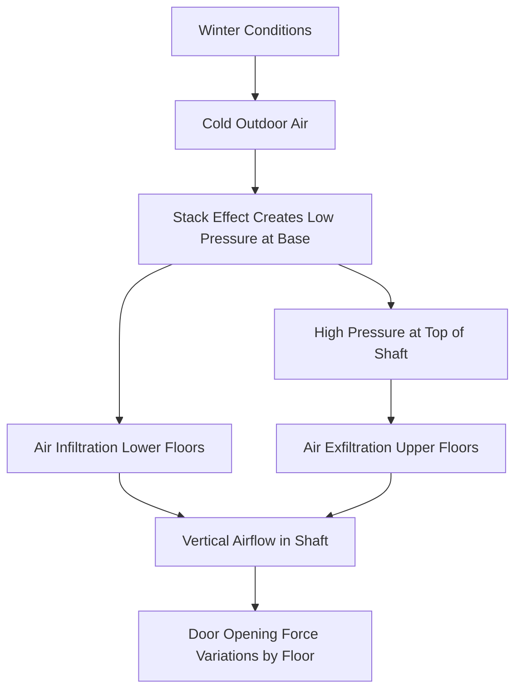
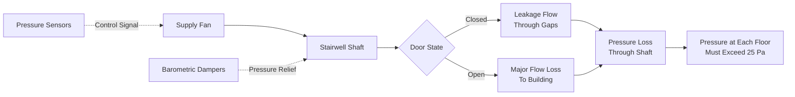

Stairwell pressure control in tall buildings represents a critical intersection of life safety, building physics, and mechanical design. The vertical shafts created by enclosed stairwells experience significant pressure differentials driven by stack effect, mechanical pressurization systems, and environmental conditions. These pressure variations directly impact egress capability, smoke control effectiveness, and code compliance.

## Stack Effect in Stairwell Shafts

Stack effect generates pressure differentials proportional to the height of the vertical shaft and the temperature difference between the interior and exterior environments. For a stairwell shaft, the pressure differential at any height is:

$$\Delta P = \rho g h \left(\frac{1}{T_o} - \frac{1}{T_i}\right)$$

Where:
- $\Delta P$ = pressure differential (Pa)
- $\rho$ = air density at reference conditions (1.2 kg/m³)
- $g$ = gravitational acceleration (9.81 m/s²)
- $h$ = vertical height from neutral plane (m)
- $T_o$ = outdoor absolute temperature (K)
- $T_i$ = indoor absolute temperature (K)

For a 200 m tall building with an interior temperature of 20°C (293 K) and exterior temperature of -20°C (253 K), the maximum pressure differential reaches approximately 250 Pa. This substantial pressure creates significant challenges for door operation and air infiltration control.

### Neutral Pressure Plane Location

The neutral pressure plane (NPP) represents the elevation where interior and exterior pressures equalize. In naturally ventilated stairwells, the NPP typically occurs near mid-height but shifts based on leakage distribution:

$$h_{NPP} = \frac{\sum A_L h_L}{\sum A_L}$$

Where $A_L$ represents leakage area at height $h_L$. Stairwell doors, construction joints, and shaft wall penetrations dominate the leakage distribution.

## Door Opening Forces

IBC Section 1010.1.3 limits door opening force to 30 lbf (133 N) under normal conditions and 15 lbf (67 N) for accessibility. The force required to open a door against a pressure differential is:

$$F_{door} = \Delta P \times A_{door} \times d / w$$

Where:
- $F_{door}$ = opening force at handle (N)
- $\Delta P$ = pressure differential across door (Pa)
- $A_{door}$ = door area (m²)
- $d$ = distance from hinge to pressure center (m)
- $w$ = distance from hinge to handle (m)

For a standard 915 mm × 2130 mm (3 ft × 7 ft) door with a pressure differential of 50 Pa, the opening force exceeds 100 N (22.5 lbf), approaching code limits even without mechanical pressurization.

### Seasonal Force Variations

| Season | Exterior Temp | ΔP at Base (200m) | ΔP at Top (200m) | Force at Base | Force at Top |
|--------|---------------|-------------------|------------------|---------------|--------------|
| Winter | -20°C | +125 Pa | -125 Pa | 280 N (63 lbf) | -280 N (suction) |
| Spring | 10°C | +25 Pa | -25 Pa | 56 N (12.6 lbf) | -56 N (suction) |
| Summer | 35°C | -75 Pa | +75 Pa | -168 N (suction) | 168 N (37.8 lbf) |

This table assumes a maintained interior temperature of 20°C and demonstrates how door opening forces reverse seasonally, creating accessibility concerns at different building elevations throughout the year.

## Stairwell Pressurization for Smoke Control

NFPA 92 and IBC Section 403.5.4 require stairwell pressurization in buildings exceeding specific heights (typically 75 ft or 23 m). The pressurization system must maintain a minimum pressure differential of 25 Pa (0.10 in. w.g.) with all stairwell doors closed and not more than 60 Pa (0.25 in. w.g.) with anticipated doors open.

### Pressurization Airflow Requirements

The required supply airflow accounts for leakage through closed doors and maintains pressure when doors open:

$$Q_{total} = Q_{leakage} + Q_{open\_doors}$$

Leakage through closed doors follows:

$$Q_{leakage} = C \times A_{gap} \times \sqrt{\Delta P}$$

Where $C$ is the flow coefficient (0.65 for sharp-edged orifices), and $A_{gap}$ represents the total gap area around all stairwell doors. For a 50-floor building with 100 doors, assuming 6 mm average gap width:

$$A_{gap} = 100 \times (2 \times 2.13 + 0.915) \times 0.006 = 3.14 \text{ m}^2$$

At 50 Pa, leakage flow reaches approximately 900 m³/h (530 CFM). Door opening flow at 1 m/s velocity through an open doorway adds 7000 m³/h (4100 CFM) per open door. NFPA 92 assumes one door open per five floors during egress, requiring substantial supply capacity.

## Stairwell Air Leakage Characteristics

Leakage in stairwell shafts occurs through multiple paths with varying pressure dependencies. The dominant leakage paths include:

**Door perimeter gaps**: Follow square-root pressure relationship, typically 0.2-0.4 m³/s per door at 50 Pa
**Construction joints**: Linear with pressure for small gaps, 0.05-0.15 m³/s per floor at 50 Pa
**Shaft wall penetrations**: Electrical and mechanical penetrations contribute 10-20% of total leakage
**Stair tower roof vents**: When present, can dominate leakage at upper floors

Total stairwell leakage follows a power-law relationship:

$$Q = C (\Delta P)^n$$

Where exponent $n$ ranges from 0.5 to 0.7 depending on gap geometry. Field measurements in existing buildings typically show $n = 0.6$ as a reasonable average.

## IBC Requirements and Design Considerations

IBC Section 403.5.4 establishes prescriptive requirements for stairwell pressurization systems:

1. Minimum pressure differential of 0.10 in. w.g. (25 Pa) in the shaft relative to the building with all doors closed
2. Maximum pressure differential of 0.35 in. w.g. (87 Pa) with all doors closed
3. Maximum door opening force of 30 lbf (133 N) under all conditions
4. Pressure relief to prevent excessive pressures when doors close after opening
5. Supply air capacity to maintain minimum pressure with any single door open

### Pressure Relief Strategies

Maintaining pressure within the acceptable range while accommodating door opening events requires pressure relief mechanisms:

| Relief Method | Response Time | Capacity | Advantages | Limitations |
|---------------|---------------|----------|------------|-------------|
| Barometric dampers | <1 second | High | Fast, no power | Fixed setpoint, maintenance |
| Motorized dampers | 3-10 seconds | Medium | Adjustable | Slower, requires controls |
| VFD fan control | 5-20 seconds | Variable | Efficient | Slowest response |
| Auxiliary relief fans | 2-5 seconds | High | Positive control | Complexity, cost |

Effective designs combine multiple relief strategies, using barometric dampers for rapid response and VFD control for steady-state optimization.

## Scissor Stair and Fire Tower Configurations

Buildings with multiple stairwells in close proximity face unique pressurization challenges. Scissor stairs (two stairs within a single shaft) share a common pressure environment, simplifying pressurization but creating egress coordination concerns. Separate stair towers require independent pressurization systems to prevent pressure imbalances that could compromise one shaft while over-pressurizing another.

Fire tower configurations with vestibules between the building and stairwell provide superior smoke control through two-stage pressurization. The vestibule maintains 12.5 Pa relative to the building, and the stairwell maintains an additional 12.5 Pa relative to the vestibule, creating a 25 Pa total differential with improved door opening force distribution.

Effective stairwell pressure control requires integrating stack effect physics, mechanical system design, and code requirements into a comprehensive solution that maintains life safety under all operating conditions.
