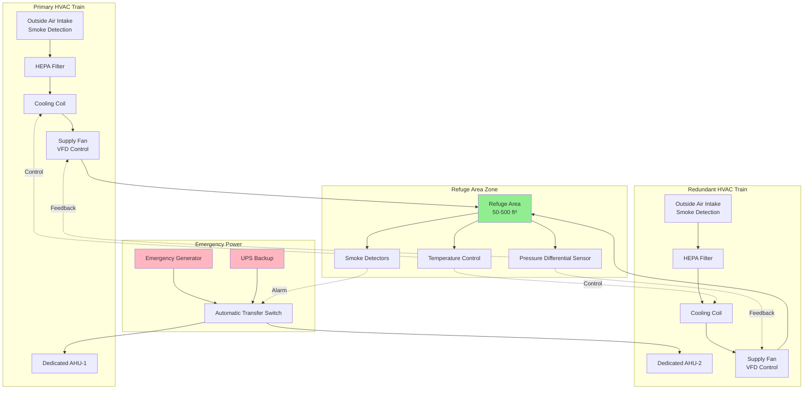

Independent HVAC systems for refuge areas provide dedicated environmental control isolated from the building's primary mechanical systems. These specialized installations ensure occupant safety during fire emergencies or other evacuation scenarios by maintaining tenable conditions in designated safe havens.

## Design Requirements and Code Compliance

NFPA 101 Life Safety Code and IBC Section 1009.6 mandate specific environmental conditions for areas of refuge. Independent HVAC systems must maintain positive pressurization relative to adjacent spaces, provide adequate outdoor air, and operate continuously during emergency conditions.

The minimum pressurization differential is typically 0.05 to 0.10 inches water column (12.5 to 25 Pa) relative to surrounding areas. This pressure relationship prevents smoke infiltration while allowing egress doors to open with reasonable force.

### Air Supply Duration Calculation

The required air supply capacity depends on occupant load and emergency duration requirements:

$$V_{total} = N \cdot V_{person} \cdot t$$

Where:
- $V_{total}$ = total air volume required (cfm)
- $N$ = design occupant load (persons)
- $V_{person}$ = outdoor air per person (15-20 cfm minimum)
- $t$ = required operating duration (hours)

For a refuge area accommodating 50 occupants with 2-hour emergency duration:

$$V_{total} = 50 \times 20 \times 2 = 2000 \text{ cfm minimum}$$

### Cooling Capacity Sizing

Sensible cooling load accounts for occupant heat gain, lighting, and envelope transmission:

$$Q_{sensible} = (N \cdot 250) + (A \cdot U \cdot \Delta T) + Q_{lights}$$

Where:
- $Q_{sensible}$ = sensible cooling load (Btu/hr)
- $N$ = occupant load
- $250$ = sensible heat gain per person (Btu/hr)
- $A$ = envelope area (ft²)
- $U$ = overall heat transfer coefficient (Btu/hr·ft²·°F)
- $\Delta T$ = temperature difference (°F)
- $Q_{lights}$ = lighting heat gain (Btu/hr)

## System Architecture

## System Configuration Comparison

| Configuration | Advantages | Disadvantages | Typical Application |
|---------------|------------|---------------|---------------------|
| **100% Redundant (N+N)** | Complete backup capability; maintenance without shutdown | High initial cost; double space requirement | Critical facilities; supertall buildings >75 floors |
| **Partial Redundancy (N+1)** | Reduced capital cost; full capacity with one unit down | Some capacity loss during maintenance | High-rise buildings 40-75 floors |
| **Single System with Component Redundancy** | Lower cost; smaller footprint | No full system backup | Mid-rise refuge areas <40 floors with accessible fire department access |
| **Shared System with Priority Control** | Lowest cost; efficient space use | Dependent on main building systems | Low-rise applications where permitted by AHJ |

## Critical Design Features

### Dedicated Equipment

Independent refuge area HVAC systems operate as standalone installations. Air handling units, ductwork, controls, and power supplies are physically separated from the building's general HVAC infrastructure. This isolation ensures the refuge area system continues operating even if primary building systems fail or become contaminated.

Equipment rooms should be located on the same floor as the refuge area or directly above/below with dedicated shafts. Horizontal duct runs through non-protected spaces must be avoided or protected with 2-hour fire-rated construction.

### Emergency Power Integration

Connection to emergency power through automatic transfer switches (ATS) provides continuity during utility failure. The typical sequence operates as follows:

1. Normal power failure detected
2. ATS initiates generator start (10-second delay)
3. Generator reaches stable voltage/frequency
4. ATS transfers load to emergency power
5. HVAC system resumes operation within 30 seconds total

Uninterruptible power supply (UPS) systems bridge the transfer gap for critical controls and smoke detection equipment. Battery capacity should provide 15-30 minutes runtime for control panels and sensors.

### Air Quality and Filtration

HEPA filtration (minimum MERV 16 or H13 classification) removes particulate matter and smoke particles from outdoor air intake. Pre-filters (MERV 8-11) extend HEPA filter life by capturing larger particles.

Outside air intakes must be positioned to avoid smoke contamination. Typical locations include:
- Roof level with smoke detection monitoring
- Tower extensions above highest occupied floor
- Windward building faces with multiple intake points
- Protected alcoves with automatic damper isolation

### Pressure Control and Monitoring

Variable frequency drives (VFD) on supply fans modulate airflow to maintain setpoint differential pressure. Building automation systems continuously monitor:

- Differential pressure across refuge area boundaries
- Smoke detector status at air intakes
- Supply air temperature and flow rate
- Equipment operating status and faults

Pressure differential below setpoint triggers high-speed fan override. Smoke detection at any intake automatically closes associated dampers and switches to alternate intake locations.

### Redundancy Strategies

Full N+N redundancy provides two complete HVAC systems, each sized for 100% of the design load. Both systems operate during emergencies; either system alone maintains code-required conditions.

Component-level redundancy includes dual fans in parallel, redundant cooling coils with independent refrigerant circuits, and multiple outdoor air intake paths. This approach reduces capital cost while maintaining reliability.

## Testing and Commissioning

Functional performance testing verifies system operation under simulated emergency conditions:

- Pressure differential testing with doors open/closed
- Automatic transfer switch exercise under load
- Smoke detector activation and damper response
- Emergency generator runtime test (minimum 90 minutes)
- Temperature control during maximum occupancy simulation

Annual testing per NFPA 110 ensures continued readiness. Quarterly inspections verify filter condition, damper operation, and control system calibration.

## Maintenance Considerations

Scheduled maintenance occurs during normal building hours without compromising refuge area protection. Redundant systems allow offline maintenance of one train while the backup system remains operational.

Critical maintenance tasks include:
- Monthly emergency generator exercise (30 minutes loaded)
- Quarterly HEPA filter differential pressure monitoring
- Semi-annual damper actuator lubrication and stroke testing
- Annual cooling coil cleaning and leak testing
- Biennial ATS contact inspection and load bank testing

Filter replacement intervals depend on outdoor air quality but typically range from 6-24 months for HEPA filters and 3-6 months for pre-filters. Differential pressure transmitters provide real-time filter loading indication.
