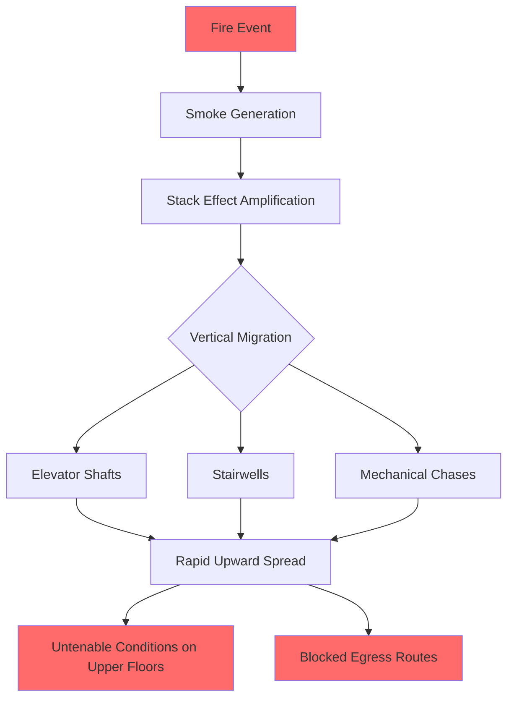
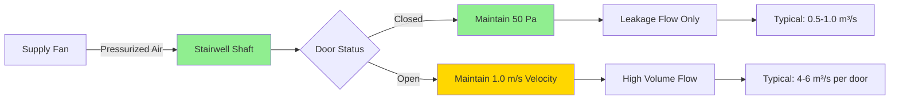

Smoke control in tall buildings presents unique challenges fundamentally different from low-rise structures. The vertical height amplifies natural pressure differentials, creating powerful buoyancy forces that can rapidly transport smoke throughout the building. Effective smoke control requires understanding the physics of stack effect, implementing pressurization strategies, and integrating these systems with the building's HVAC infrastructure.

## Stack Effect and Smoke Movement Physics

The stack effect in tall buildings generates pressure differentials that dominate smoke movement patterns. The neutral pressure plane (NPP) divides the building into pressure zones, with pressures below ambient at lower floors and above ambient at upper floors.

The pressure differential due to stack effect is:

$$\Delta P_s = C_s h \rho_o \left(1 - \frac{T_o}{T_i}\right)$$

Where:
- $\Delta P_s$ = stack pressure differential (Pa)
- $C_s$ = stack coefficient (typically 0.000043 for SI units)
- $h$ = vertical distance from NPP (m)
- $\rho_o$ = outside air density (kg/m³)
- $T_o$ = outside absolute temperature (K)
- $T_i$ = inside absolute temperature (K)

For a 200-meter tall building with 20°C temperature differential, the pressure difference between top and bottom floors reaches approximately 80-100 Pa. During a fire, smoke temperatures can exceed 600°C, creating temperature ratios $(T_i/T_o)$ of 3:1 or higher, dramatically amplifying buoyancy forces.

The volumetric smoke generation rate from a fire depends on fire heat release rate:

$$\dot{V}_s = 0.071 Q_c^{1/3} (T_s - T_a)$$

Where $\dot{V}_s$ is smoke production (m³/s), $Q_c$ is convective heat release rate (kW), and $T_s$ and $T_a$ are smoke and ambient temperatures (K).

## High-Rise Smoke Control Challenges

**Critical Challenges:**

1. **Vertical Shaft Migration**: Unprotected vertical shafts act as smoke chimneys, transporting combustion products at 2-5 m/s under stack effect conditions

2. **Pressure Reversal**: NPP location shifts with outdoor temperature, causing unpredictable airflow patterns across seasons

3. **Leakage Paths**: Construction tolerances create gaps around doors, elevator doors, and penetrations, with typical leakage areas of 0.01-0.02 m² per door

4. **Wind Effects**: Dynamic wind pressures superimpose on stack pressures, creating fluctuating pressure fields that vary with building orientation and height

5. **Fire Floor Dynamics**: Heat release rates in commercial occupancies can reach 5-10 MW, generating smoke at 20-40 m³/s

## Pressurization Strategies

Stairwell and elevator shaft pressurization creates pressure barriers preventing smoke infiltration into protected egress routes.

### Design Pressure Differentials

NFPA 92 specifies minimum pressure differentials across smoke barriers:

| Location | Minimum Pressure (Pa) | Maximum Pressure (Pa) |
|----------|----------------------|----------------------|
| Stairwell to Building | 12.5 | 60 |
| Elevator Shaft to Building | 25 | 60 |
| Vestibule to Corridor | 12.5 | 60 |
| Refuge Area to Building | 12.5 | 60 |

Maximum pressures limit door opening forces to approximately 130 N per IBC Section 1010.1.3.

### Pressurization Airflow Calculations

Required airflow to maintain pressure differential with doors closed:

$$Q_L = 2610 A \sqrt{\frac{\Delta P}{\rho}}$$

Where:
- $Q_L$ = leakage airflow (m³/s)
- $A$ = total leakage area (m²)
- $\Delta P$ = pressure differential (Pa)
- $\rho$ = air density (kg/m³)

For a stairwell with effective leakage area of 0.4 m² and target differential of 50 Pa:

$$Q_L = 2610 \times 0.4 \times \sqrt{\frac{50}{1.2}} = 6,720 \text{ m}^3/\text{h}$$

When doors open during egress, airflow requirements increase dramatically. The flow through an open door maintaining velocity $v$:

$$Q_d = 0.6 A_d v$$

Where $A_d$ is door area (typically 2.0 m²) and $v$ is face velocity (minimum 1.0 m/s per NFPA 92).

## Exhaust Methods

### Dedicated Smoke Exhaust Systems

Mechanical smoke exhaust removes smoke directly from the fire floor and adjacent levels. Exhaust rates depend on building geometry and fire characteristics.

For a smoke zone with area $A$ and perimeter $P$, the required exhaust rate:

$$Q_e = \frac{P \times h \times v}{0.8}$$

Where $h$ is smoke layer depth (typically 2.0-2.5 m) and $v$ is makeup air velocity at openings (0.5-1.0 m/s).

### HVAC System Integration

Three integration approaches exist:

| Strategy | Description | Advantages | Limitations |
|----------|-------------|------------|-------------|
| **Dedicated Systems** | Separate smoke control fans and ductwork | Reliable, code-compliant, no interference | Higher installation cost, space requirements |
| **Dual-Purpose HVAC** | HVAC fans switch to smoke mode | Lower cost, efficient space use | Requires rated dampers, complex controls |
| **Passive Venting** | Natural buoyancy-driven exhaust | No power required, simple | Unreliable, weather-dependent, limited capacity |

Most jurisdictions require dedicated systems per IBC Section 909 for buildings exceeding 55 meters or containing atriums.

### Zoned Smoke Control

Large floor plates require subdivision into smoke zones, each with independent pressurization and exhaust capability.

**Design Criteria:**
- Maximum zone area: 1,850 m² per NFPA 92
- Minimum pressure boundary rating: 1-hour fire resistance
- Smoke damper ratings: Class I (elevated temperature 250°C)
- Fan survival ratings: 400°C for 2 hours minimum

## Control Sequences and Monitoring

Modern smoke control systems employ building management systems (BMS) with fire alarm integration. Upon alarm activation:

1. **Immediate Actions** (0-5 seconds):
   - Activate stairwell pressurization fans
   - Close smoke dampers on non-fire floors
   - Recall elevators to designated floors

2. **Fire Floor Actions** (5-15 seconds):
   - Start exhaust fans to create negative pressure
   - Open makeup air dampers to adjacent floors
   - Override HVAC to shutdown mode

3. **Adjacent Floor Actions** (5-15 seconds):
   - Maintain neutral or slight positive pressure
   - Monitor pressure differentials continuously

4. **Monitoring Requirements**:
   - Pressure differential sensors every 3-5 floors
   - Airflow velocity sensors at critical makeup air paths
   - Door position sensors at stairwell entries
   - Temperature sensors in exhaust ducts

Pressure control tolerances typically range ±5 Pa from setpoint under steady-state conditions, widening to ±10 Pa during transient door operations.

## Conclusion

Effective smoke control in tall buildings requires sophisticated understanding of pressure dynamics, careful integration with HVAC systems, and robust control sequences. The amplification of stack effect in high-rise structures transforms what would be manageable smoke migration in low-rise buildings into rapid, building-wide contamination without proper pressurization and exhaust systems. Design must account for the complex interaction of thermal buoyancy, mechanical pressurization, wind effects, and human egress patterns to create truly effective life safety systems.
