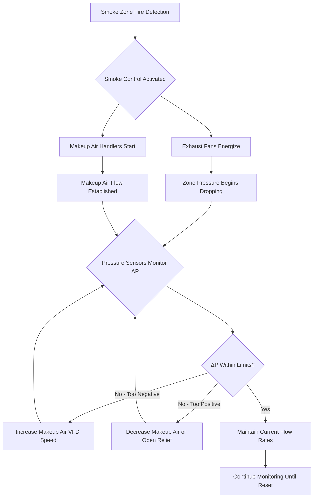
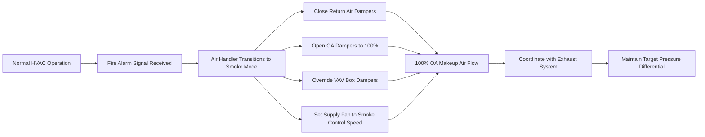

Makeup air systems serve a critical function in smoke control operations by replacing exhausted air to maintain controlled pressure differentials and prevent excessive building depressurization. Without properly coordinated makeup air, exhaust systems create negative pressures that can compromise stairwell integrity, impede egress door operation, and draw smoke into protected spaces through unintended pathways.

## Volumetric Balance and Pressure Control

The fundamental principle governing makeup air requirements derives from mass conservation. When smoke exhaust systems remove air from a building or zone, replacement air must enter through controlled or uncontrolled paths. The pressure differential across any boundary results from the imbalance between outflow and inflow.

For a control volume representing a smoke zone, the continuity equation yields:

$$\dot{m}_{exhaust} = \dot{m}_{makeup} + \dot{m}_{leakage}$$

Where leakage flow occurs through construction gaps, elevator shafts, and other unintended openings. Converting to volumetric flow at standard conditions:

$$Q_{makeup} = Q_{exhaust} - Q_{leakage}$$

The leakage component follows the orifice equation, relating flow to pressure differential:

$$Q_{leakage} = C \cdot A \cdot \sqrt{2 \Delta P / \rho}$$

Where $C$ represents the flow coefficient (0.6-0.7 for typical building openings), $A$ is the effective leakage area, and $\Delta P$ is the pressure differential across the building envelope or floor assembly.

## Makeup Air Volume Determination

NFPA 92 provides guidance on makeup air quantities, typically specifying 50-80% of exhaust airflow should be supplied as conditioned makeup air. The remaining 20-50% enters through controlled leakage paths including stairwell doors and building envelope openings.

| Makeup Air Ratio | Typical Application | Pressure Differential |
|------------------|---------------------|----------------------|
| 100% of exhaust | Sealed zones, critical applications | Minimal (0-5 Pa) |
| 80% of exhaust | Standard high-rise floors | Low (5-12 Pa) |
| 50-60% of exhaust | Zones with relief dampers | Moderate (12-25 Pa) |
| <50% of exhaust | Unacceptable - excessive pressure | High (>25 Pa) |

The selection of makeup air percentage involves balancing multiple factors. Excessive makeup air (approaching 100%) minimizes pressure differentials but requires larger air handling systems and energy input. Insufficient makeup air creates negative pressures that can exceed door opening forces specified in building codes (typically 30-133 N depending on occupancy).

The maximum acceptable pressure differential limits door opening force:

$$F_{door} = \frac{\Delta P \cdot A_{door} \cdot W}{2(W - d)}$$

Where $W$ is door width and $d$ is the distance from the door handle to the latch edge. IBC limits this force to 133 N for egress doors.

## Makeup Air Intake Location and Contamination Prevention

Makeup air intakes require strategic positioning to prevent smoke entrainment. The intake location must account for wind effects, exhaust plume behavior, and potential fire scenarios.

Exhaust plume rise follows buoyancy-driven flow principles. For a smoke exhaust discharge with volumetric flow $Q_{exhaust}$ and temperature elevation $\Delta T$:

$$h_{plume} = 1.5 \cdot Q_{exhaust}^{0.4} \cdot \Delta T^{0.6}$$

This empirical relationship indicates makeup air intakes positioned on the opposite building face or at grade level minimize smoke recirculation risk. Vertical separation between exhaust discharge and intake should exceed three times the plume rise height calculated at design conditions.

## Tempered Makeup Air Requirements

Introducing large volumes of outdoor air during winter conditions without temperature conditioning creates occupant discomfort and potentially hazardous conditions. Makeup air temperature affects buoyancy forces and pressure distribution in tall buildings.

The stack effect pressure differential in a vertical shaft:

$$\Delta P_{stack} = 3460 \cdot h \cdot \left(\frac{1}{T_{outdoor}} - \frac{1}{T_{indoor}}\right)$$

Where $h$ is height in meters and temperatures are in Kelvin. Cold makeup air at outdoor winter temperatures (e.g., -20°C) introduced into a 200 m building creates additional upward pressure forces exceeding 100 Pa, potentially overwhelming smoke control pressure differentials.

IBC and NFPA 92 do not mandate specific makeup air temperatures, but practical considerations suggest tempering to at least 10-15°C to limit stack effect interference. The heating energy required:

$$Q_{heating} = \dot{m} \cdot c_p \cdot (T_{supply} - T_{outdoor})$$

For a 50,000 cfm makeup air system serving multiple floors, tempering from -20°C to 15°C requires approximately 1,200 kW heating capacity.

## Air Handler Smoke Control Modes

Standard air handling units serving high-rise floors must incorporate smoke control operating modes distinct from normal HVAC operation. The transition involves damper repositioning, fan speed adjustment, and interlock coordination.

### Normal HVAC Mode
- Return air dampers modulating for temperature control
- Outside air dampers at minimum position (typically 10-20%)
- Supply fans at variable speed based on zone demand
- Return/exhaust fans maintaining slight building pressurization

### Smoke Control Mode
- Return air dampers fully closed (prevents smoke recirculation)
- Outside air dampers fully open (100% outdoor air operation)
- Supply fans at predetermined smoke control speed (typically 80-100% capacity)
- Coordination with dedicated smoke exhaust system
- Override of all normal temperature controls

## Emergency Power and Reliability

Makeup air systems classified as life safety systems require connection to emergency power per NFPA 92 and IBC requirements. The electrical load calculation must account for:

- Makeup air supply fan motors at full load
- Heating coils (if electric) or combustion air fans (if gas-fired)
- Control systems and actuators
- Pressure monitoring and interlock systems

Emergency generators must reach full voltage and frequency within 10 seconds of normal power failure, with automatic transfer switch operation maintaining continuity. Battery backup for control systems bridges the transfer interval.

## Makeup Air Distribution and Duct Design

Makeup air distribution requires low-velocity ductwork to minimize pressure losses that reduce available fan capacity for overcoming building resistance. Duct velocities typically range from 1,000-2,000 fpm compared to 2,000-4,000 fpm in normal HVAC systems.

Pressure loss in makeup air ductwork:

$$\Delta P_{duct} = f \cdot \frac{L}{D} \cdot \frac{\rho V^2}{2} + \sum K \cdot \frac{\rho V^2}{2}$$

Where $f$ is the friction factor, $L/D$ is the length-to-diameter ratio, and $\sum K$ represents the sum of dynamic loss coefficients for fittings and transitions.

Oversized ductwork reduces pressure losses but increases construction costs and space requirements. Optimization balances first cost against fan energy and reliability. A 20% increase in duct diameter reduces pressure loss by approximately 50% while increasing material costs by 20%.

## Coordination with Exhaust Systems

Effective smoke control demands precise coordination between makeup air supply and smoke exhaust. The control sequence must prevent:

- Excessive building depressurization (>25 Pa)
- Insufficient pressure differential to move smoke (<5 Pa)
- Time lag between exhaust activation and makeup air delivery
- Makeup air flow patterns that interfere with smoke stratification

Pressure differential sensors positioned at critical boundaries (stairwell doors, elevator lobbies, zone separations) provide feedback to variable frequency drives controlling makeup air fan speed. A typical control algorithm:

1. Exhaust fans start upon smoke detection
2. Makeup air fans start with 2-5 second delay
3. Makeup air VFD ramps to 80% of exhaust flow rate
4. Pressure sensors measure actual differential after 30 seconds
5. VFD adjusts ±10% to achieve target differential (8-15 Pa)
6. Continuous monitoring maintains differential within tolerance

This closed-loop control approach accommodates variations in outdoor wind conditions, building envelope leakage, and door positions that affect actual pressure distribution.
