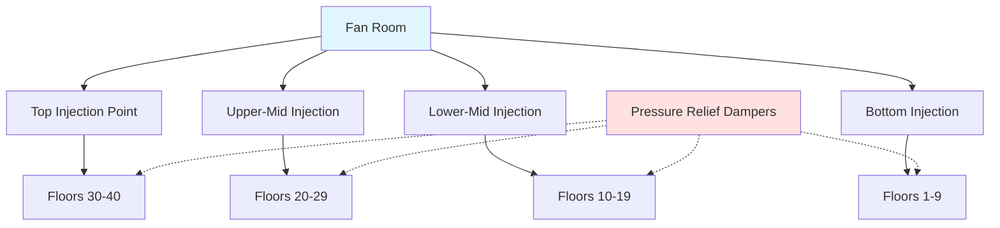
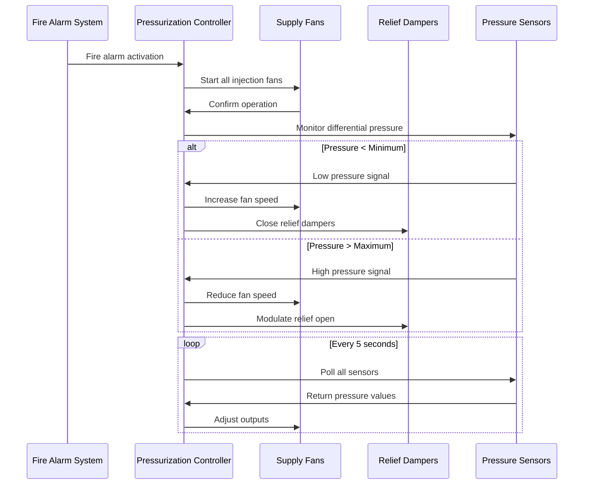

Stairwell and elevator shaft pressurization forms the primary life safety strategy in high-rise smoke control systems. These systems create positive pressure barriers that prevent smoke infiltration into protected egress routes and elevator shafts during fire events. The fundamental challenge lies in maintaining sufficient pressure differential to block smoke migration while ensuring doors remain openable under code-specified force limits across the entire building height, accounting for stack effect and temperature variations.

## Design Pressure Differentials

The required pressure differential across smoke barriers depends on the leakage characteristics of the barrier assembly and the buoyancy forces driving smoke movement. IBC Section 909 and NFPA 92 establish minimum pressure differentials based on building configuration and barrier construction.

**Target pressure differential across closed doors:**

$$\Delta P_{min} = 12.5 \text{ Pa (0.05 in. w.g.)}$$

This minimum ensures smoke containment under most fire scenarios. For increased reliability, design values typically range from 25-75 Pa (0.10-0.30 in. w.g.). The pressure differential creates a velocity barrier through door gaps and leakage paths.

The velocity through barrier leakage paths follows Bernoulli's principle:

$$v = C \sqrt{\frac{2\Delta P}{\rho}}$$

Where:
- $v$ = air velocity through opening (m/s)
- $C$ = discharge coefficient (typically 0.6-0.7 for door gaps)
- $\Delta P$ = pressure differential (Pa)
- $\rho$ = air density (kg/m³)

For a 25 Pa pressure differential with air at 20°C ($\rho$ = 1.20 kg/m³):

$$v = 0.65 \sqrt{\frac{2 \times 25}{1.20}} = 4.2 \text{ m/s}$$

This velocity exceeds typical smoke migration velocities, effectively blocking smoke infiltration.

## Door Opening Force Limits

The force required to open a door against a pressure differential creates a fundamental design constraint. IBC Section 1010.1.3 limits door opening force to 133 N (30 lbf), though accessibility requirements under IBC/ANSI A117.1 typically limit this to 67 N (15 lbf) for interior doors.

The opening force required consists of two components: pressure force and closer force.

$$F_{open} = F_{pressure} + F_{closer} + F_{friction}$$

The pressure component acts on the door area:

$$F_{pressure} = \Delta P \times A_{door} \times \frac{w}{2}$$

Where:
- $A_{door}$ = door area (m²)
- $w$ = door width (m)
- The factor $w/2$ represents the effective moment arm

For a standard 0.91 m × 2.13 m (3 ft × 7 ft) door under 50 Pa pressure:

$$F_{pressure} = 50 \times (0.91 \times 2.13) \times \frac{0.91}{2} = 44 \text{ N}$$

This leaves minimal margin for closer and friction forces, demonstrating why pressure relief mechanisms become essential at higher differentials.

## Stack Effect Compensation

Stack effect creates natural pressure gradients in tall buildings that superimpose on the mechanical pressurization system. The stack effect pressure differential increases with vertical distance:

$$\Delta P_{stack} = 3460 \times h \left(\frac{1}{T_o} - \frac{1}{T_i}\right)$$

Where:
- $\Delta P_{stack}$ = stack effect pressure (Pa)
- $h$ = vertical distance from neutral plane (m)
- $T_o$ = outdoor absolute temperature (K)
- $T_i$ = indoor absolute temperature (K)

For a 100 m tall building with $T_i$ = 293 K (20°C) and $T_o$ = 263 K (-10°C):

$$\Delta P_{stack} = 3460 \times 100 \left(\frac{1}{263} - \frac{1}{293}\right) = 133 \text{ Pa}$$

This substantial pressure gradient requires variable supply airflow distribution to maintain uniform pressure differentials across all floors.

## Multiple Injection Point Strategy

To compensate for stack effect and maintain uniform pressurization, supply air injection occurs at multiple vertical locations throughout the stairwell or shaft. The spacing and flow distribution of injection points follows from the pressure gradient analysis.

The optimal injection spacing depends on building height and design pressure differential. A typical approach distributes injection points every 10-15 floors in buildings above 30 stories.

**Injection point flow distribution:**

| Injection Location | Floors Served | Typical Flow Ratio | Stack Effect Compensation |
|-------------------|---------------|-------------------|---------------------------|
| Top injection | 30-40 | 1.0× base | Counteract negative stack |
| Upper-mid injection | 20-29 | 1.2× base | Moderate compensation |
| Lower-mid injection | 10-19 | 1.5× base | Strong compensation |
| Bottom injection | 1-9 | 1.8× base | Maximum stack counteraction |

## Fan Sizing Methodology

Pressurization fan capacity must account for total system leakage under design pressure differential. The leakage area calculation follows NFPA 92 methodology.

Total system airflow requirement:

$$Q_{total} = A_{leakage} \times v_{avg} + Q_{door}$$

Where:
- $A_{leakage}$ = total effective leakage area (m²)
- $v_{avg}$ = average velocity through leakage paths (m/s)
- $Q_{door}$ = allowance for door opening events (m³/s)

Leakage area estimation uses construction-specific values:

| Construction Type | Leakage Area per Floor | Basis |
|------------------|------------------------|-------|
| Tight construction (sealed shafts) | 0.04-0.06 m²/floor | Gasketed doors, sealed penetrations |
| Average construction | 0.08-0.12 m²/floor | Standard doors, typical penetrations |
| Loose construction | 0.15-0.25 m²/floor | Non-gasketed doors, poor sealing |

For a 30-story stairwell with average construction (0.10 m²/floor leakage) at 50 Pa design pressure:

$$v_{avg} = 0.65 \sqrt{\frac{2 \times 50}{1.20}} = 5.9 \text{ m/s}$$

$$Q_{leakage} = (30 \times 0.10) \times 5.9 = 17.7 \text{ m}^3\text{/s}$$

Adding 30% for simultaneous door openings:

$$Q_{total} = 17.7 \times 1.3 = 23.0 \text{ m}^3\text{/s (48,700 cfm)}$$

## Pressure Relief Coordination

Pressure relief dampers or barometric relief prevent excessive pressurization when doors remain closed. Relief dampers open when pressure exceeds the door opening force threshold, typically set at 35-60 Pa.

The relief damper sizing follows the maximum expected pressure scenario:

$$A_{relief} = \frac{Q_{total}}{v_{relief} \times C}$$

Where $v_{relief}$ corresponds to the relief setpoint pressure differential.

## Control Sequence Architecture

Pressurization systems require sophisticated control sequences to maintain design differentials during varying door states and fire scenarios.

The control system must maintain pressurization under three distinct operating conditions:

1. **All doors closed** - Maximum pressure, relief dampers modulating
2. **Single door open** - Moderate pressure, increased fan output
3. **Multiple doors open** - Minimum acceptable pressure, maximum fan output

**Comparison of control strategies:**

| Control Strategy | Response Time | Complexity | Reliability | Cost |
|-----------------|---------------|------------|-------------|------|
| Fixed-speed fans with relief dampers | Slow (5-10 s) | Low | High | Low |
| Variable-speed fans with pressure feedback | Fast (1-3 s) | Moderate | High | Moderate |
| Multi-stage fans with zone control | Moderate (3-5 s) | High | Very high | High |
| Hybrid VFD + relief dampers | Fast (1-2 s) | Moderate | Very high | Moderate-high |

The hybrid approach combining VFD control with barometric relief dampers provides optimal performance, maintaining rapid response to door events while ensuring pressure ceiling protection through passive relief.

## Design Verification Testing

NFPA 92 requires performance testing to verify that installed systems meet design pressure differentials under simulated fire conditions. Testing includes pressure measurements at each floor level with doors closed, single door open, and multiple doors open scenarios. The acceptance criteria requires maintaining minimum 12.5 Pa differential in all cases while respecting maximum door opening forces.

Field adjustments to injection flow distribution and relief damper settings typically achieve compliance when the fundamental sizing proves adequate. Significant deviations indicate design deficiencies requiring fan capacity upgrades or leakage reduction measures.
