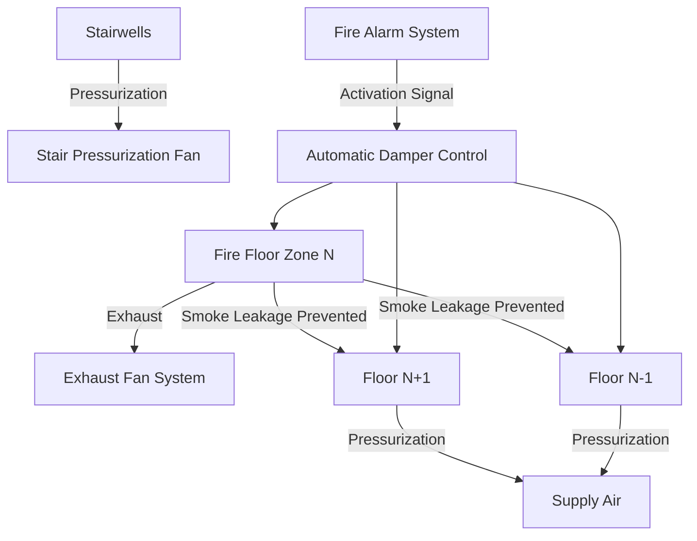
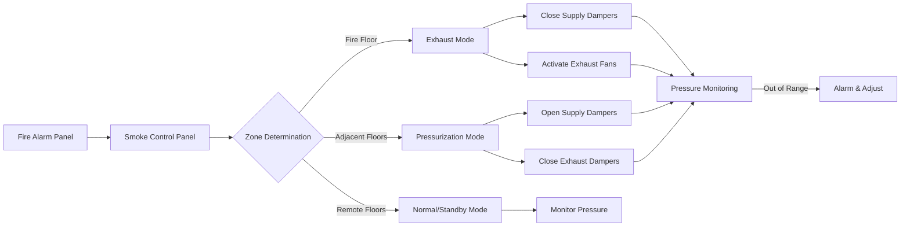
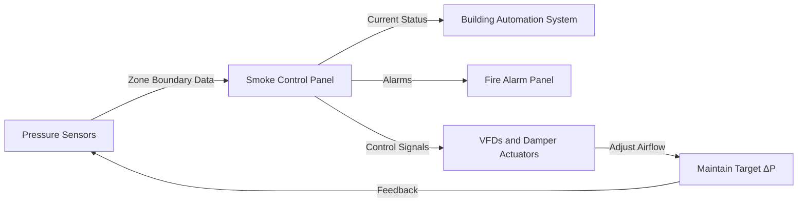

Zoned smoke control divides tall buildings into distinct smoke control zones, typically floor-by-floor, to contain smoke within the fire zone while maintaining tenable conditions in adjacent areas and egress paths. This approach uses coordinated exhaust, pressurization, and airflow control to establish predictable pressure differentials that prevent smoke migration.

## Fundamental Physics of Zoned Smoke Control

Smoke movement in buildings follows pressure gradient laws. Air flows from high-pressure regions to low-pressure regions according to:

$$Q = C \cdot A \cdot \sqrt{2\Delta P / \rho}$$

Where:
- $Q$ = volumetric airflow rate (m³/s)
- $C$ = flow coefficient (typically 0.6-0.7)
- $A$ = leakage area (m²)
- $\Delta P$ = pressure differential (Pa)
- $\rho$ = air density (kg/m³)

The pressure differential required to prevent smoke migration depends on buoyancy forces from hot smoke and the leakage characteristics of zone boundaries. For effective smoke control, the system must overcome stack effect, wind effects, and thermal buoyancy.

### Stack Effect Considerations

In tall buildings, stack effect pressure at any height is:

$$\Delta P_s = \frac{P_0 \cdot g \cdot h \cdot (T_o - T_i)}{T_o \cdot T_i}$$

Where:
- $P_0$ = atmospheric pressure (Pa)
- $g$ = gravitational acceleration (9.81 m/s²)
- $h$ = height above neutral plane (m)
- $T_o$ = outdoor temperature (K)
- $T_i$ = indoor temperature (K)

Zoned smoke control systems must provide pressure differentials that exceed stack effect forces, typically 25-75 Pa across zone boundaries per NFPA 92.

## Smoke Zone Definition and Boundaries

Zone boundaries must resist both air leakage and smoke penetration. Each smoke control zone is physically defined by:

| Boundary Element | Construction Requirement | Typical Leakage Area |
|------------------|--------------------------|----------------------|
| Floor slab | Fire-rated assembly | 0.0001-0.0003 m²/m² |
| Shaft walls | 2-hour fire rating | 0.00015 m²/m² |
| Doors | Self-closing, gasketed | 0.01-0.02 m² per door |
| Dampers | Smoke/fire rated | 0.005-0.01 m² when closed |
| Penetrations | Firestopped | Variable, minimize |

The leakage area of zone boundaries directly impacts required airflow rates. A single unsealed penetration can compromise an entire zone's smoke control capability.

## Floor-by-Floor Exhaust and Pressurization Strategy

The typical zoned smoke control sequence operates as follows:

**Fire Floor (Zone N):**
1. HVAC supply air shut off via automatic dampers
2. Return air dampers close
3. Dedicated exhaust fans activate (or HVAC return converted to exhaust)
4. Target pressure: -25 to -40 Pa relative to adjacent floors

**Adjacent Floors (N+1, N-1):**
1. HVAC supply air increases or dedicated pressurization fans activate
2. Return/exhaust dampers close or modulate
3. Target pressure: +25 to +40 Pa relative to fire floor
4. Pressure differential maintained: 50-80 Pa across floor assemblies

**Remote Floors:**
- Normal HVAC operation or staged pressurization
- Elevator lobbies may receive additional pressurization
- Stairwell pressurization operates independently

### Airflow Rate Calculations

Required exhaust airflow from the fire floor:

$$Q_{exhaust} = \frac{A_{leak} \cdot \sqrt{2 \cdot \Delta P_{target} / \rho}}{C}$$

For a typical floor with 4,000 m² area and 0.0002 m²/m² leakage ratio:

$$A_{leak} = 4000 \times 0.0002 = 0.8 \text{ m}^2$$

With target $\Delta P = 50$ Pa:

$$Q_{exhaust} = \frac{0.8 \cdot \sqrt{2 \cdot 50 / 1.2}}{0.65} \approx 9.4 \text{ m}^3/\text{s} = 33,840 \text{ m}^3/\text{h}$$

This represents minimum exhaust capacity; actual design includes safety factors (1.5-2.0) and accounts for door openings, which can increase required flow by 200-400%.

## HVAC System Integration

Effective zoned smoke control integrates with the building's HVAC system through multiple pathways:

### Integration Methods

**Dedicated Smoke Control System:**
- Separate fans, ductwork, and dampers
- Highest reliability but greatest cost
- Typical for super high-rise (>150 m)

**HVAC System Conversion:**
- Existing HVAC equipment repurposed during fire
- Return fans convert to exhaust function
- Supply fans provide pressurization
- Lower cost but requires careful design
- Adequate for most high-rise applications

**Hybrid Approach:**
- Dedicated exhaust for fire floor
- HVAC system provides pressurization
- Balance of cost and performance

## Automatic Damper Control

Damper performance is critical to zone isolation. Each zone requires:

| Damper Type | Location | Actuation Method | Leakage Class |
|-------------|----------|------------------|---------------|
| Fire/Smoke | Floor boundary penetrations | Fail-safe spring return | Class I (≤0.0006 m³/s·m² @ 250 Pa) |
| Combination Fire/Smoke | Air handling unit isolation | Electric/pneumatic with spring return | Class I |
| Smoke | Pressurization control | Modulating electric/pneumatic | Class II (≤0.003 m³/s·m² @ 250 Pa) |
| Exhaust | Fire floor exhaust | Normally closed, powered open | Class I |

Damper response time must not exceed 60 seconds from alarm signal to full position per IBC Section 909.10. Control sequences must account for damper stroke time in system response calculations.

### Pressure-Based Damper Modulation

Advanced systems use pressure feedback to modulate dampers:

$$A_{effective} = A_{max} \cdot f(\theta)$$

Where damper opening angle $\theta$ adjusts to maintain target pressure. Control algorithms typically employ PID logic with gains tuned to building-specific response characteristics.

## Pressure Differential Monitoring and Maintenance

IBC Section 909.12 and NFPA 92 require continuous pressure monitoring across zone boundaries. Minimum pressure differentials:

- Fire floor to adjacent floor: 12.5 Pa (0.05 in. w.g.) minimum
- Typical design target: 25-50 Pa
- Maximum: 75-100 Pa (excessive pressure impedes door operation)

Sensor placement requirements:
- One sensor per zone boundary interface
- Located away from supply/exhaust points (minimum 1 m)
- Mounted at door head height or mid-floor level
- Calibrated annually with accuracy ±2.5 Pa

## Design Verification Through Computer Modeling

NFPA 92 Section 4.7 requires computer modeling for complex zoned smoke control systems. Models must account for:

1. **Leakage path analysis** - All doors, walls, shafts, and penetrations
2. **Transient effects** - Door opening events, fan startup sequences
3. **HVAC interaction** - Ductwork pressure losses, fan performance curves
4. **Weather conditions** - Design wind speeds, temperature extremes
5. **Stack effect** - Height-dependent pressure gradients

Model validation against measured building leakage data improves accuracy. Commissioning tests must demonstrate pressures within ±20% of modeled predictions.

## Operational Reliability Considerations

Zoned smoke control effectiveness depends on:

- **Boundary integrity**: Regular inspection of seals, gaskets, and firestopping
- **Fan capacity maintenance**: Filter loading reduces available pressure
- **Damper functionality**: Quarterly actuation testing required
- **Control system verification**: Annual sequence-of-operations testing
- **Occupant behavior**: Education on keeping doors closed during alarms

System failure modes include inadequate exhaust capacity, damper malfunction, and compromised zone boundaries. Redundancy in critical components (dual fans, backup power) enhances reliability in the most critical life-safety applications.

---

**File:** `/Users/evgenygantman/Documents/github/gantmane/hvac/content/specialty-applications-testing/specialty-hvac-applications/tall-buildings-high-rise-hvac/smoke-control-tall-buildings/zoned-smoke-control/_index.md`
