Stack effect, also known as the chimney effect, represents one of the most significant air movement phenomena in tall buildings. This naturally occurring pressure differential arises from the density difference between interior and exterior air masses at different temperatures. Understanding and managing stack effect is essential for designing functional HVAC systems in high-rise structures.

## Physical Basis of Stack Effect

Stack effect originates from the principle that warm air is less dense than cold air. In winter conditions, heated building air becomes buoyant relative to cold outdoor air. This buoyancy creates upward airflow within the building envelope, establishing a pressure distribution where lower floors experience negative pressure (infiltration) and upper floors experience positive pressure (exfiltration). The phenomenon reverses in summer when exterior temperatures exceed interior temperatures, though the magnitude is typically smaller due to reduced temperature differentials.

The driving pressure differential across the building envelope at any height can be calculated using the ASHRAE Handbook Fundamentals stack effect equation:

$$\Delta P = C \cdot h \cdot \left(\frac{1}{T_o} - \frac{1}{T_i}\right)$$

Where:
- $\Delta P$ = pressure difference, Pa
- $C$ = 3460 for SI units (7.64 for I-P units)
- $h$ = vertical distance from neutral pressure plane, m
- $T_o$ = absolute outdoor temperature, K
- $T_i$ = absolute indoor temperature, K

This relationship demonstrates that stack effect pressure increases linearly with height and proportionally with temperature difference.

## Neutral Pressure Plane

The neutral pressure plane (NPP) represents the elevation where interior and exterior pressures are equal. Above the NPP, interior pressure exceeds exterior pressure. Below the NPP, the relationship inverts. The NPP location depends on building leakage distribution, HVAC system operation, and shaft configurations.

For a building with uniform leakage distribution and no mechanical pressurization, the NPP typically occurs near mid-height. However, leakage concentration in elevator shafts, stairwells, and mechanical penetrations shifts the NPP location. Intentional pressurization through HVAC systems can also manipulate the NPP position to control airflow patterns.

The NPP height can be approximated by:

$$h_{NPP} = \frac{H}{1 + \sqrt{A_t/A_b}}$$

Where:
- $h_{NPP}$ = height of neutral pressure plane, m
- $H$ = total building height, m
- $A_t$ = leakage area at top, m²
- $A_b$ = leakage area at bottom, m²

## Stack Effect Impact by Building Height

| Building Height | Typical Winter ΔT | Maximum Pressure Difference | Primary Concerns |
|-----------------|-------------------|---------------------------|------------------|
| 10-20 stories (30-60 m) | 40°C | 15-30 Pa | Infiltration, minor door operation issues |
| 20-40 stories (60-120 m) | 40°C | 30-60 Pa | Significant infiltration, elevator door leakage, difficult door operation |
| 40-60 stories (120-180 m) | 40°C | 60-90 Pa | Major infiltration loads, elevator shaft pressurization, door opening forces exceed accessibility codes |
| 60+ stories (180+ m) | 40°C | 90+ Pa | Extreme infiltration, compartmentalization required, specialized vestibule systems necessary |

Note: Values assume uniform interior temperature and no mechanical pressurization. Actual pressures vary with leakage distribution and HVAC operation.

## Consequences for HVAC Design

Stack effect creates multiple challenges for building operation:

**Infiltration Loads**: Stack-driven infiltration introduces unconditioned outdoor air that must be heated or cooled. On lower floors during winter, this infiltration can represent 10-30% of the total heating load. The volumetric infiltration rate increases with the square root of pressure difference.

**Door Operation Forces**: Pressure differentials create forces resisting door opening. A 50 Pa pressure difference across a standard 1 m wide door generates approximately 100 N of additional opening force, potentially exceeding ADA accessibility requirements of 67 N maximum.

**Elevator System Issues**: Elevator shafts act as continuous vertical conduits, amplifying stack effect. Pressure differentials cause elevator doors to experience significant closing or opening forces, potentially compromising safety systems. Leakage through elevator doors transfers air between floors, creating comfort complaints.

**Stairwell Pressurization**: Stack effect interferes with fire protection stairwell pressurization systems. Winter stack effect can over-pressurize upper stairwell levels while under-pressurizing lower levels, compromising egress door operability.

## Stack Effect Airflow Patterns

```mermaid
graph TD
    subgraph "Winter Stack Effect"
    W1[Cold Outdoor Air<br/>Higher Density]
    W2[Lower Floors<br/>Negative Pressure<br/>Infiltration]
    W3[Neutral Pressure Plane<br/>Zero Pressure Difference]
    W4[Upper Floors<br/>Positive Pressure<br/>Exfiltration]
    W5[Warm Indoor Air<br/>Lower Density<br/>Rises]

    W1 -->|Enters| W2
    W2 --> W3
    W3 --> W4
    W4 -->|Exits| W5
    end

    subgraph "Summer Stack Effect"
    S1[Hot Outdoor Air<br/>Lower Density]
    S2[Upper Floors<br/>Negative Pressure<br/>Infiltration]
    S3[Neutral Pressure Plane<br/>Zero Pressure Difference]
    S4[Lower Floors<br/>Positive Pressure<br/>Exfiltration]
    S5[Cool Indoor Air<br/>Higher Density<br/>Sinks]

    S1 -->|Enters| S2
    S2 --> S3
    S3 --> S4
    S4 -->|Exits| S5
    end

    style W3 fill:#90EE90
    style S3 fill:#90EE90
```

## Mitigation Strategies

Effective stack effect management employs multiple strategies:

**Compartmentalization**: Dividing the building into vertical zones separated by barriers interrupts the continuous stack effect column. Each zone develops independent stack effect with reduced magnitude.

**Shaft Pressurization**: Mechanically pressurizing elevator and stairwell shafts counteracts natural pressure gradients. This approach requires careful balancing to avoid creating new pressure-related problems.

**Building Pressurization**: Maintaining slight positive pressure throughout occupied spaces reduces infiltration-driven stack effect. This strategy increases energy consumption but provides better control.

**Vestibules and Revolving Doors**: Multiple-door entry systems at grade level reduce direct air pathways between exterior and interior, limiting the effectiveness of pressure differentials in driving airflow.

**Improved Envelope Tightness**: Reducing envelope leakage area, particularly at shaft penetrations and building extremes, decreases airflow rates for given pressure differentials.

Stack effect cannot be eliminated in tall buildings, but understanding its physical basis enables designers to predict its magnitude and implement appropriate control strategies. Accurate stack effect analysis during design prevents operational problems and reduces energy consumption throughout the building lifecycle.
