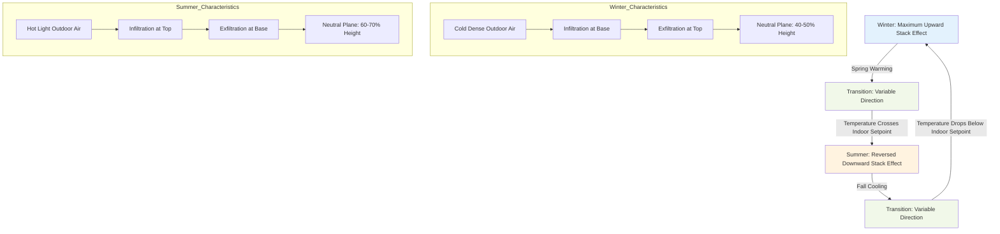

Stack effect in tall buildings follows a predictable annual cycle driven by seasonal temperature differences between indoor and outdoor environments. The magnitude and direction of stack-driven airflow vary throughout the year, creating distinct operational challenges for each season that require adaptive HVAC strategies and pressure management techniques.

## Seasonal Pressure Differential Mechanics

The driving force for stack effect changes continuously as outdoor temperature varies throughout the year. The pressure difference at any height follows the fundamental relationship:

$$\Delta P = \rho_o g h \left(1 - \frac{T_o}{T_i}\right)$$

Where $\rho_o$ is outdoor air density, $g$ is gravitational acceleration, $h$ is height above neutral plane, $T_o$ is outdoor absolute temperature, and $T_i$ is indoor absolute temperature.

The maximum stack effect pressure differential occurs during winter conditions when the temperature difference $(T_i - T_o)$ reaches its annual maximum. For a building maintaining 21°C (294 K) indoor temperature:

$$\Delta P_{max} = \frac{3460 \cdot h \cdot \Delta T}{T_{avg}}$$

Where $h$ is in meters, $\Delta T$ is the temperature difference in Kelvin, and $T_{avg}$ is the average absolute temperature.

## Winter Stack Effect Maximum

Winter produces the most severe stack effect conditions due to maximum indoor-outdoor temperature differentials. Cold, dense outdoor air creates strong infiltration at lower levels while warm indoor air exfiltrates forcefully at upper levels.

**Winter characteristics:**
- Maximum pressure differentials across building envelope
- Neutral plane typically located at 40-50% of building height
- Strongest upward airflow in shafts and vertical penetrations
- Peak energy losses through infiltration and exfiltration
- Maximum elevator door opening forces
- Greatest lobby revolving door resistance

ASHRAE Standard 62.1 recommends maintaining building pressure between -5 Pa and +12 Pa relative to outdoors. Winter stack effect routinely exceeds these values in tall buildings without active pressure control.

## Summer Stack Effect Reversal

During summer, when outdoor temperatures exceed indoor setpoints, stack effect reverses direction. Hot outdoor air at upper levels creates positive pressure, forcing infiltration downward through the building.

**Summer reversal conditions:**
- Reversed airflow patterns (downward in shafts)
- Neutral plane shifts to upper building levels (60-70% of height)
- Reduced pressure magnitudes compared to winter
- Challenges for smoke control systems designed for upward flow
- Increased cooling loads at upper floors from hot air infiltration
- Potential for moisture intrusion at penthouse levels

The reversal occurs when:

$$T_o > T_i + \frac{P_{fan}}{\rho_o g h}$$

Where $P_{fan}$ represents any pressurization effect from HVAC systems.

## Transition Period Challenges

Spring and fall shoulder seasons present unique operational challenges as outdoor temperatures fluctuate around indoor setpoints. The neutral plane becomes unstable, shifting vertically throughout the day.

**Transition period issues:**
- Multiple daily stack effect reversals
- Unpredictable pressure distributions
- Control system instability
- Occupant comfort complaints from varying infiltration
- Difficulty maintaining consistent building pressurization
- Smoke control system unreliability

During these periods, diurnal temperature swings can cause the neutral plane to migrate 20-30 floors in large high-rises, creating transient pressure conditions that stress doors, windows, and facade systems.

## Climate Zone Variations

The annual stack effect cycle varies significantly by climate zone:

**Cold climates (ASHRAE Zones 6-8):**
- Dominant winter stack effect for 5-7 months
- Minimal summer reversal
- Brief transition periods

**Moderate climates (ASHRAE Zones 3-5):**
- Significant winter and summer effects
- Extended transition periods with frequent reversals
- Greatest control system challenges

**Hot climates (ASHRAE Zones 1-2):**
- Reversed stack effect dominant
- Minimal traditional upward stack effect
- Different facade leakage considerations

## Annual Stack Effect Cycle

## Seasonal Stack Effect Comparison

| Parameter | Winter Peak | Shoulder Season | Summer Peak |
|-----------|-------------|-----------------|-------------|
| **Outdoor Temp (°C)** | -20 to 0 | 15 to 25 | 30 to 40 |
| **ΔT (K)** | 40 to 60 | 0 to ±10 | -10 to -20 |
| **Pressure Differential (Pa/100m)** | 450 to 675 | 0 to ±110 | -110 to -220 |
| **Flow Direction** | Upward | Variable/Unstable | Downward |
| **Neutral Plane Location** | 40-50% height | Highly variable | 60-70% height |
| **Infiltration Zone** | Lower 40% of building | Migrates daily | Upper 30% of building |
| **Exfiltration Zone** | Upper 60% of building | Migrates daily | Lower 70% of building |
| **Control Difficulty** | High (consistent) | Very High (variable) | Moderate (consistent) |
| **Energy Impact** | Maximum heating loss | Variable | Increased cooling load |
| **Door Operation** | Difficult at extremes | Unpredictable | Moderate difficulty |
| **Elevator Issues** | Shaft pressurization | Variable pressure | Reduced compared to winter |

**Notes:** Pressure values calculated for 100m height increment. Actual values depend on building tightness, internal resistance, and HVAC system operation.

## Adaptive Management Strategies

Effective tall building HVAC systems must account for annual stack effect variations:

**Year-round requirements:**
- Variable speed stairwell pressurization based on outdoor temperature
- Seasonal adjustment of building pressurization setpoints
- Temperature-compensated elevator shaft ventilation
- Adaptive lobby vestibule control sequences

**Seasonal control strategies:**
- Winter: Maximize lower-level supply air, reduce upper-level pressurization
- Summer: Increase upper-level supply air, pressurize penthouse areas
- Transition: Frequent pressure monitoring and real-time setpoint adjustment

ASHRAE Handbook—Fundamentals recommends continuous building pressure monitoring at multiple vertical locations to track neutral plane movement and adjust pressurization strategies accordingly.

The annual stack effect cycle represents one of the most significant dynamic loads on tall building HVAC systems, requiring sophisticated control strategies that adapt to changing outdoor conditions throughout the year.
