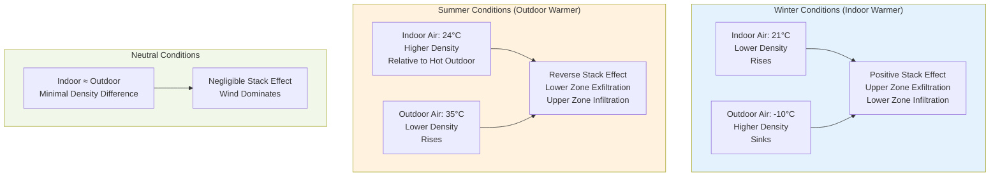

## Temperature as the Primary Driver

Temperature difference between indoor and outdoor air creates the fundamental driving force for stack effect in tall buildings. This temperature differential produces density variations that generate vertical pressure gradients, causing air movement through the building envelope. The magnitude of stack effect pressure is directly proportional to the temperature difference and building height.

## Physical Mechanism

The stack effect originates from buoyancy forces created when air masses at different temperatures have different densities. When indoor air temperature differs from outdoor air temperature, the less dense air attempts to rise, creating pressure differentials across the building envelope. This phenomenon follows fundamental thermodynamic principles governing fluid behavior under thermal gradients.

The relationship between temperature and air density is expressed through the ideal gas law. At a given atmospheric pressure, warmer air has lower density than cooler air. This density difference creates buoyant forces that drive vertical air movement.

## Stack Effect Pressure Calculation

The pressure difference induced by stack effect at any height in a building is calculated using the following relationship:

$$\Delta P_{stack} = \rho_o \cdot g \cdot h \cdot \left(\frac{1}{T_o} - \frac{1}{T_i}\right)$$

Where:
- $\Delta P_{stack}$ = stack effect pressure difference (Pa)
- $\rho_o$ = outdoor air density at standard conditions (kg/m³)
- $g$ = gravitational acceleration (9.81 m/s²)
- $h$ = height above neutral pressure level (m)
- $T_o$ = absolute outdoor air temperature (K)
- $T_i$ = absolute indoor air temperature (K)

For practical calculations using Celsius temperatures, the formula becomes:

$$\Delta P_{stack} = 3460 \cdot \frac{h}{T_i} \cdot \left(\frac{T_i - T_o}{T_o}\right)$$

Where temperatures are in Kelvin (add 273.15 to Celsius values).

The simplified engineering approximation commonly used in ASHRAE applications is:

$$\Delta P_{stack} = C \cdot h \cdot \left(\frac{1}{T_o} - \frac{1}{T_i}\right)$$

Where $C$ = 3460 Pa·m/K for standard atmospheric pressure at sea level.

## Temperature Differential Effects

## Stack Effect Intensity by Temperature Difference

The following table quantifies stack effect pressure at various heights for different temperature differentials:

| Temperature Difference (°C) | 10m Height (Pa) | 50m Height (Pa) | 100m Height (Pa) | 200m Height (Pa) | Severity |
|----------------------------|-----------------|-----------------|------------------|------------------|----------|
| 5 | 1.7 | 8.6 | 17.2 | 34.4 | Minimal |
| 10 | 3.4 | 17.1 | 34.2 | 68.4 | Moderate |
| 15 | 5.1 | 25.6 | 51.3 | 102.6 | Significant |
| 20 | 6.8 | 34.1 | 68.2 | 136.4 | Strong |
| 25 | 8.5 | 42.5 | 85.0 | 170.0 | Very Strong |
| 30 | 10.2 | 51.0 | 102.0 | 204.0 | Extreme |
| 35 | 11.9 | 59.4 | 118.8 | 237.6 | Critical |

*Calculated at sea level with indoor temperature 21°C and outdoor temperatures from 16°C to -14°C*

## Seasonal Variation

### Winter Stack Effect

During winter conditions, indoor temperatures exceed outdoor temperatures, creating the classic positive stack effect. Heated indoor air has lower density than cold outdoor air, causing it to rise within the building shaft. This produces:

- Exfiltration of conditioned air at upper floors
- Infiltration of cold outdoor air at lower floors
- Maximum pressure differential at the top of the building
- Increased heating loads due to cold air infiltration

The neutral pressure level typically occurs between 40-60% of building height, depending on envelope leakage distribution and mechanical system operation.

### Summer Stack Effect Reversal

When outdoor temperatures significantly exceed indoor temperatures, reverse stack effect occurs. Air-conditioned indoor air becomes denser than hot outdoor air, reversing the typical flow pattern:

- Infiltration of hot humid air at upper floors
- Exfiltration of conditioned air at lower floors
- Increased cooling loads and humidity control challenges
- Potential for moisture condensation issues

Summer stack effect is generally less intense than winter stack effect in most climates because the temperature differential is typically smaller.

## Buoyancy Force Fundamentals

The buoyant force driving stack effect results from Archimedes' principle applied to compressible fluids. The buoyancy force per unit volume is:

$$F_b = (\rho_o - \rho_i) \cdot g$$

Where:
- $F_b$ = buoyancy force per unit volume (N/m³)
- $\rho_o$ = outdoor air density (kg/m³)
- $\rho_i$ = indoor air density (kg/m³)
- $g$ = gravitational acceleration (9.81 m/s²)

This force acts on the entire column of indoor air, creating the vertical pressure gradient that characterizes stack effect.

## Temperature Control Implications

Maintaining consistent indoor temperatures throughout a tall building directly impacts stack effect magnitude. Temperature stratification within vertical shafts amplifies the effect, while tighter temperature control reduces it. ASHRAE Fundamentals Chapter 16 provides detailed guidance on accounting for temperature-induced pressure in building design and HVAC system sizing.

HVAC systems must counteract stack effect forces to maintain proper ventilation, space pressurization, and comfort conditions. This requires careful pressure control strategies, especially in buildings exceeding 100 meters in height where stack effect pressures can exceed 100 Pa.

## Design Considerations

Temperature-driven stack effect must be addressed through:

- Compartmentalization of vertical shafts
- Vestibules and air locks at building entries
- Pressure control in elevator shafts and stairwells
- Mechanical pressurization systems to counteract natural forces
- Enhanced envelope sealing, particularly at perimeter transitions

Accurate calculation of temperature-induced pressures is essential for proper HVAC system design, envelope specification, and occupant comfort in tall buildings.
