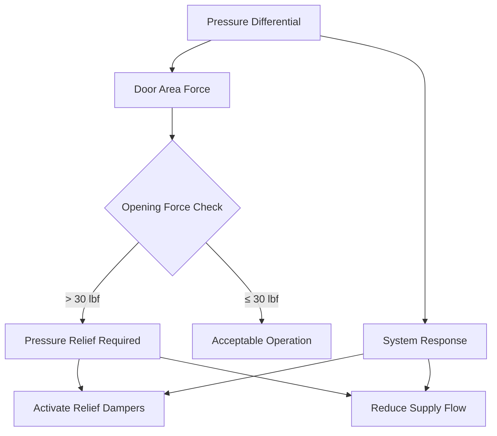
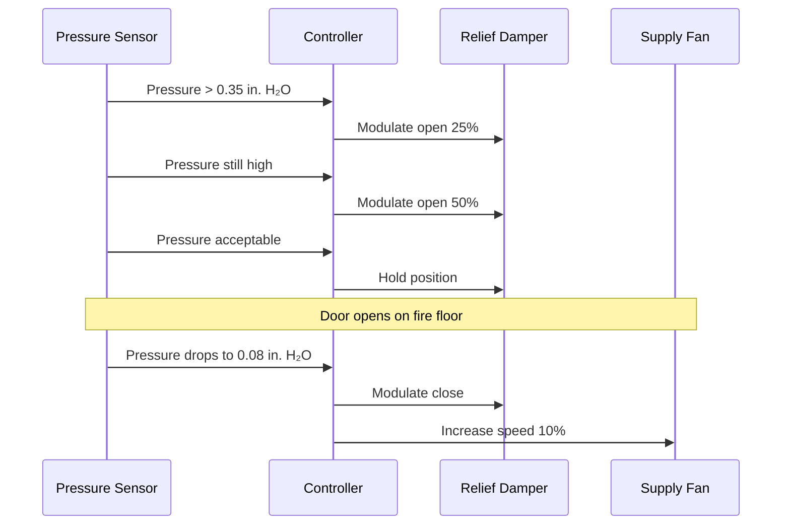

Stairwell pressurization systems maintain positive pressure within egress stairwells to prevent smoke infiltration during fire emergencies in high-rise buildings. These systems create a pressure barrier by injecting outdoor air into the stairwell, establishing a higher pressure than adjacent building spaces. The fundamental challenge involves maintaining sufficient pressure differential to prevent smoke entry while ensuring occupants can open stairwell doors during evacuation.

## Pressure Differential Requirements

NFPA 92 and IBC establish minimum pressure differentials based on door status and building conditions. The pressure difference across a barrier prevents smoke migration through the relationship:

$$Q = C \cdot A \cdot \sqrt{2 \Delta P / \rho}$$

where $Q$ represents volumetric airflow through openings (cfm), $C$ is the flow coefficient (typically 0.65 for door gaps), $A$ is the leakage area (ft²), $\Delta P$ is the pressure differential (in. H₂O), and $\rho$ is air density (lb/ft³).

### Design Pressure Targets

| Condition | Minimum Pressure | Maximum Pressure | Application |
|-----------|------------------|------------------|-------------|
| Doors closed | 0.10 in. H₂O | 0.35 in. H₂O | All doors closed scenario |
| Single door open | 0.05 in. H₂O | N/A | One door open on fire floor |
| Multiple doors open | Maintain flow | N/A | Evacuation scenario |
| Door opening force | N/A | 30 lbf | Maximum acceptable force |

The minimum 0.10 in. H₂O differential with all doors closed provides adequate smoke barrier performance. The maximum 0.35 in. H₂O limit prevents excessive door opening forces. During single door opening events, the system must maintain at least 0.05 in. H₂O across closed doors on other floors to prevent smoke spread.

## Door Opening Force Calculations

Door opening force directly correlates to pressure differential through door geometry. The force required to overcome pressure differential acting on a door area follows:

$$F_{pressure} = \Delta P \cdot A_{door} \cdot \frac{W}{2}$$

where $F_{pressure}$ is the force component from pressure (lbf), $A_{door}$ is door area (ft²), and $W$ is door width (ft). The factor $W/2$ accounts for the moment arm from the door hinge to the center of pressure.

For a standard 3 ft × 7 ft door, the relationship becomes:

$$F_{total} = \Delta P \times 21 \text{ ft}^2 \times 1.5 \text{ ft} + F_{closure} + F_{friction}$$

where $F_{closure}$ represents door closer force and $F_{friction}$ accounts for latch and hinge resistance. IBC limits total opening force to 30 lbf for accessible egress, which constrains maximum allowable pressure differential.

### Force Limitation Analysis

When pressure differential exceeds thresholds that produce opening forces above 30 lbf, the system must immediately reduce pressure through relief mechanisms or supply flow modulation.

## Multiple Injection Point Strategy

Tall stairwells require multiple supply air injection points to overcome stack effect and maintain uniform pressure distribution. Single injection point systems create pressure gradients from stack effect:

$$\Delta P_{stack} = \rho \cdot g \cdot h \cdot \left(\frac{1}{T_{outside}} - \frac{1}{T_{stairwell}}\right)$$

where $g$ is gravitational acceleration (32.2 ft/s²), $h$ is vertical height (ft), and temperatures are in absolute scale (°R).

### Injection Point Spacing

For a 500 ft tall stairwell with 40°F outdoor temperature and 70°F stairwell temperature:

$$\Delta P_{stack} = 0.075 \times 32.2 \times 500 \times \left(\frac{1}{500} - \frac{1}{530}\right) = 0.15 \text{ in. H}_2\text{O}$$

This stack effect creates bottom-to-top pressure gradient requiring multiple injection points. Recommended spacing:

| Building Height | Maximum Injection Spacing | Typical Injection Points |
|-----------------|---------------------------|--------------------------|
| < 75 ft | Single point at bottom | 1 location |
| 75-150 ft | 75 ft vertical | 2-3 locations |
| 150-300 ft | 50-75 ft vertical | 4-6 locations |
| > 300 ft | 40-60 ft vertical | 8+ locations |

Each injection point delivers proportional airflow based on zone volume and leakage area. Upper injection points compensate for stack effect pressure loss, maintaining uniform differential across building height.

## Modulating Pressure Relief Systems

Pressure relief dampers prevent over-pressurization during variable door conditions. The system responds to door openings through barometric or mechanical relief:

### Relief Damper Control Sequence

Relief damper sizing requires sufficient capacity to discharge excess flow during minimum door opening scenarios:

$$Q_{relief} = Q_{supply} - Q_{leakage} - Q_{door}$$

where $Q_{relief}$ is relief damper capacity (cfm), $Q_{supply}$ is total supply flow, $Q_{leakage}$ is normal stairwell leakage, and $Q_{door}$ represents flow through open doors.

### Barometric vs. Mechanical Relief

| Relief Type | Response Time | Accuracy | Complexity | Application |
|-------------|---------------|----------|------------|-------------|
| Barometric dampers | 1-2 seconds | ±0.05 in. H₂O | Low | Buildings < 200 ft |
| Motorized dampers | 5-15 seconds | ±0.02 in. H₂O | Medium | Buildings 200-400 ft |
| VFD supply fan | 3-8 seconds | ±0.01 in. H₂O | High | Buildings > 400 ft |

Barometric relief dampers open mechanically at preset pressure, providing rapid response without controls. Motorized dampers offer precise modulation through building automation integration. Variable frequency drive supply fan control provides finest pressure regulation by adjusting airflow at the source rather than relieving excess pressure.

## System Commissioning Verification

Acceptance testing verifies pressure differential maintenance across door operation scenarios:

1. **All doors closed test**: Verify 0.10-0.35 in. H₂O across all floors
2. **Single door open test**: Open one door per floor sequentially, maintain ≥0.05 in. H₂O on other floors
3. **Door force test**: Measure opening force at maximum pressure, confirm ≤30 lbf
4. **Relief damper response**: Verify modulation within specified time and accuracy
5. **Stack effect compensation**: Test system during maximum indoor-outdoor temperature difference

Temperature-induced stack effect creates the most challenging operational condition, requiring seasonal commissioning verification to confirm year-round performance across extreme weather conditions.

