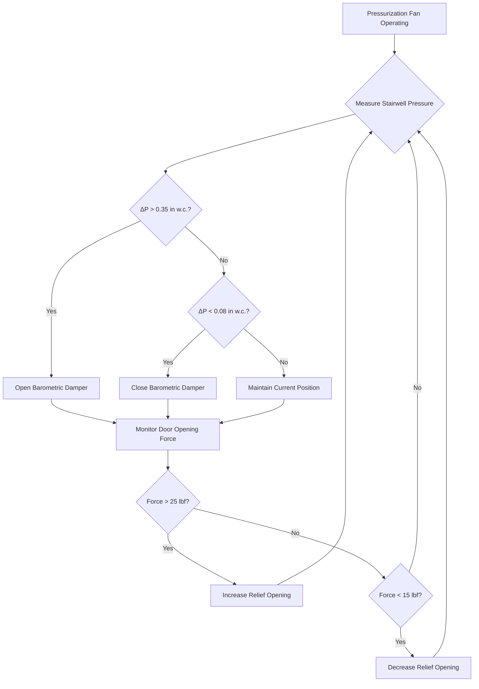

Fire service access stairwells require enhanced pressurization systems that balance two competing requirements: sufficient pressure differential to prevent smoke infiltration while maintaining door opening forces within the physical capabilities of firefighters carrying equipment. These systems represent the most challenging application of stairwell pressurization due to stringent door force limits and the need for absolute reliability during emergency operations.

## Enhanced Pressurization Requirements

Fire service access stairwells serve as the primary protected path for firefighting operations in high-rise buildings. IBC Section 403.5.3 and NFPA 92 mandate pressurization systems that maintain minimum pressure differentials of 0.10 inches w.c. (25 Pa) across stairwell doors, while never exceeding pressure differentials that would create door opening forces above 30 lbf (133 N) at the door handle.

The physics of door opening force relates directly to pressure differential through the fundamental equation:

$$F = \Delta P \cdot A_{eff} \cdot d_{cp}/d_h$$

where $F$ is the opening force at the handle, $\Delta P$ is the pressure differential, $A_{eff}$ is the effective door area subject to pressure (accounting for frame leakage and door closer forces), $d_{cp}$ is the distance from hinge to center of pressure, and $d_h$ is the distance from hinge to handle. For a standard 3 ft × 7 ft door with center of pressure at mid-width, the effective moment arm ratio $d_{cp}/d_h$ approximates 0.5.

### Pressure Differential Limits

The allowable pressure range creates a narrow operating window. For a typical fire door with effective area of 18 ft² (after accounting for 15% leakage), the maximum permissible pressure differential calculates as:

$$\Delta P_{max} = \frac{F_{max} \cdot d_h}{A_{eff} \cdot d_{cp}} = \frac{30 \text{ lbf} \cdot 2.5 \text{ ft}}{18 \text{ ft}^2 \cdot 1.25 \text{ ft}} = 3.33 \text{ lbf/ft}^2 = 0.48 \text{ in w.c.}$$

This yields an operational pressure window of 0.10 to 0.48 inches w.c., requiring precise control to accommodate varying numbers of open doors and weather-induced pressure fluctuations.

## Vestibule Pressurization Requirements

IBC Section 403.5.3 requires fire service access elevators to be accessed through a ventilated vestibule. When the stairwell also connects to this vestibule, a three-zone pressurization cascade develops: stairwell > vestibule > building floor. NFPA 92 recommends maintaining the vestibule at an intermediate pressure, typically 0.05 inches w.c. above the floor and 0.05 inches w.c. below the stairwell.

The airflow required to maintain vestibule pressure depends on the total leakage area of doors and construction joints:

$$Q_{vestibule} = C \cdot A_{leak} \cdot \sqrt{\Delta P}$$

where $C$ is the flow coefficient (approximately 2610 for turbulent flow with pressure in inches w.c. and area in ft²), and $A_{leak}$ represents the effective leakage area. A typical vestibule with two fire-rated doors (each with $A_{leak}$ = 0.12 ft²) at 0.05 inches w.c. requires:

$$Q_{vestibule} = 2610 \cdot 0.24 \cdot \sqrt{0.05} = 140 \text{ cfm}$$

## Pressure Relief and Door Opening Force Control

The critical challenge in fire service access stairwell pressurization occurs when all doors remain closed while the building facade experiences wind pressure. The system must prevent excessive pressure buildup through automatic relief mechanisms.

Three primary methods control door opening forces:

1. **Barometric relief dampers**: Spring-loaded dampers that open automatically when pressure exceeds setpoint, providing passive relief without power requirements
2. **Motorized relief dampers**: Variable position dampers controlled by pressure sensors, offering precise modulation
3. **Variable speed fan control**: Modulates supply fan speed based on measured pressure differential, reducing energy consumption

| Relief Method | Response Time | Precision | Power Dependency | Typical Application |
|---------------|---------------|-----------|------------------|---------------------|
| Barometric Damper | 1-2 seconds | ±0.05 in w.c. | None | Low-rise, simple systems |
| Motorized Damper | 5-10 seconds | ±0.02 in w.c. | Required | High-rise, multiple zones |
| VFD Fan Control | 10-30 seconds | ±0.01 in w.c. | Required | Premium systems, energy optimization |

## Emergency Power Requirements

NFPA 70 (National Electrical Code) Article 700 classifies stairwell pressurization fans for fire service access as emergency systems requiring automatic transfer to standby power within 10 seconds of utility failure. The emergency power source must have sufficient capacity to operate the pressurization system at full design load for a minimum duration specified by local code (typically 2-4 hours).

The emergency generator must supply:

- Pressurization fan(s): Full motor nameplate current
- Control systems: Including pressure sensors, damper actuators, and control panels
- Associated HVAC equipment: Makeup air units if required for fan cooling
- Lighting and communication systems: In the stairwell and vestibule

Generator sizing must account for motor inrush current during startup. For a typical 10 HP pressurization fan with locked rotor current of 6× running current:

$$I_{peak} = I_{run} \cdot 6 = 28 \text{ A} \cdot 6 = 168 \text{ A}$$

Soft-start controllers reduce inrush to approximately 2× running current, significantly decreasing generator capacity requirements.

## Communication Systems Integration

Fire service access stairwells require two-way emergency communication systems per IBC Section 403.4.7. The pressurization system must coordinate with communication equipment to prevent acoustic interference. Excessive air velocities near communication stations create noise that interferes with voice intelligibility.

The relationship between air velocity and background noise level follows:

$$L_p = 50 + 10 \log_{10}(v^{1.5})$$

where $L_p$ is the sound pressure level in dBA and $v$ is air velocity in ft/min. To maintain voice intelligibility (requiring background noise below 65 dBA), maximum air velocity near communication stations must not exceed:

$$v_{max} = 10^{(65-50)/(10 \cdot 1.5)} = 10^{1.0} = 10 \text{ ft/s} = 600 \text{ fpm}$$

Supply air diffusers should be located a minimum of 10 feet from communication stations with air directed away from microphone locations.

## System Testing and Commissioning

NFPA 92 Section 4.6.3.3 requires testing stairwell pressurization systems under both doors-closed and doors-open conditions. Testing must verify:

1. **Minimum pressure differential**: 0.10 in w.c. with all doors closed
2. **Maximum door opening force**: Not exceeding 30 lbf at any door
3. **Relief system operation**: Proper activation of relief dampers or fan speed reduction
4. **Emergency power transfer**: Successful transition to standby power within 10 seconds
5. **Communication system function**: Voice intelligibility under pressurization system operation

The most critical test simulates firefighter entry by opening doors sequentially from bottom to top while monitoring pressure differentials and door forces at all levels. This test reveals inadequate supply capacity or improperly sized relief mechanisms.

Proper design, installation, and testing of fire service access stairwell pressurization systems ensures firefighters can safely access all building levels during emergency operations while preventing smoke infiltration that would compromise the protected egress path. The narrow operational pressure window demands sophisticated control systems and rigorous commissioning to achieve reliable performance across all operating scenarios.
