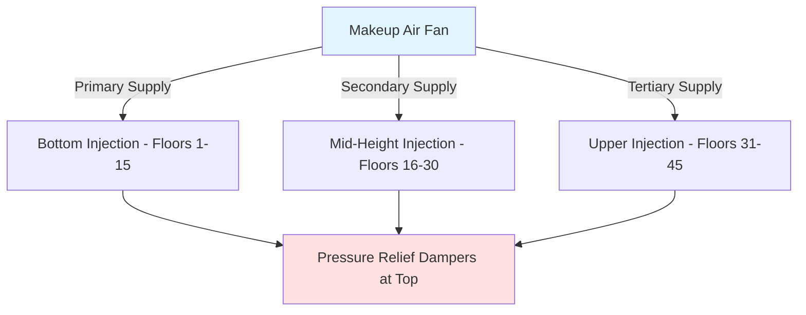
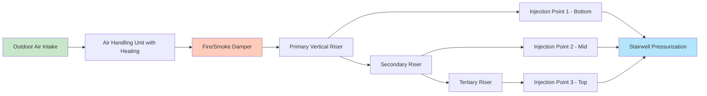

## Overview

Makeup air systems for stairwell pressurization must deliver sufficient airflow to maintain minimum pressure differentials across all stairwell boundaries while compensating for leakage and door-opening events. The design requires careful calculation of supply air quantities, strategic placement of injection points, and proper fan selection to ensure uniform pressure distribution throughout the vertical shaft.

## Makeup Air Volume Calculation

The total makeup air requirement combines two fundamental components: continuous leakage compensation and transient door-opening demand.

### Base Leakage Airflow

Leakage through stairwell envelope penetrations follows the orifice equation, modified for crack geometry:

$$Q_L = C \cdot A \cdot \sqrt{\Delta P}$$

Where:
- $Q_L$ = leakage airflow (cfm)
- $C$ = flow coefficient (cfm/ft²-√inWC), typically 0.65-0.83 for construction joints
- $A$ = total leakage area (ft²)
- $\Delta P$ = pressure differential (inWC)

For multi-story stairwells, the cumulative leakage area includes:

| Leakage Path | Typical Area per Floor | Notes |
|--------------|------------------------|-------|
| Door perimeter (closed) | 0.15-0.25 ft² | Per IBC Section 403.5.1 |
| Construction joints | 0.05-0.10 ft² | Per NFPA 92 Table 4.5.3 |
| Penetrations (pipes, conduits) | 0.02-0.05 ft² | Varies by construction |
| Elevator lobby separations | 0.10-0.20 ft² | If not separately pressurized |

For an $n$-story stairwell:

$$Q_{L,total} = \sum_{i=1}^{n} C_i \cdot A_i \cdot \sqrt{\Delta P_i}$$

IBC Section 909.6.2 requires maintaining minimum 0.05 inWC across stairwell doors with all doors closed. NFPA 92 Section 4.5.3 recommends 0.10 inWC as a practical design target to account for measurement uncertainty.

### Door Opening Demand

When a stairwell door opens, the system must supply makeup air to replace the volume exhausted through the opening while maintaining acceptable pressure:

$$Q_{door} = C_d \cdot A_{door} \cdot \sqrt{2 \cdot \Delta P / \rho}$$

Converting to standard HVAC units:

$$Q_{door} = 2610 \cdot C_d \cdot A_{door} \cdot \sqrt{\Delta P}$$

Where:
- $Q_{door}$ = door opening airflow (cfm)
- $C_d$ = discharge coefficient, 0.65-0.70 for door openings
- $A_{door}$ = effective door area (ft²), typically 50-70% of geometric area
- $\Delta P$ = pressure differential (inWC)
- 2610 = conversion factor for standard air (60°F, sea level)

NFPA 92 requires systems to accommodate simultaneous opening of doors on the fire floor plus two adjacent floors. For a typical 3'-0" × 7'-0" door with 60% effective area:

$$Q_{door} = 2610 \times 0.65 \times (3 \times 7 \times 0.60) \times \sqrt{0.10} = 2,757 \text{ cfm per door}$$

## Multiple Injection Points Strategy

Vertical distribution of makeup air prevents excessive pressure stratification in tall stairwells. Stack effect creates a pressure gradient:

$$\Delta P_{stack} = 7.64 \cdot h \cdot \left(\frac{1}{T_{outside}} - \frac{1}{T_{stairwell}}\right)$$

Where:
- $\Delta P_{stack}$ = stack effect pressure (inWC)
- $h$ = height difference (ft)
- $T$ = absolute temperature (°R = °F + 460)

For a 400-ft stairwell with 20°F outdoor and 70°F indoor temperatures:

$$\Delta P_{stack} = 7.64 \times 400 \times \left(\frac{1}{480} - \frac{1}{530}\right) = 0.60 \text{ inWC}$$

This pressure gradient necessitates multiple injection points to maintain uniform pressurization.

### Injection Point Placement

General guidelines for injection point spacing:

| Building Height | Injection Points | Maximum Vertical Span |
|-----------------|------------------|----------------------|
| < 150 ft (≤15 floors) | 1 (bottom) | 150 ft |
| 150-300 ft (15-30 floors) | 2 | 150 ft each |
| 300-500 ft (30-50 floors) | 3-4 | 125-150 ft each |
| > 500 ft (>50 floors) | 4+ | 100-125 ft each |

Each injection point should serve zones of similar leakage characteristics. Balancing dampers at each injection point enable field adjustment to achieve uniform pressure distribution.

## Fan Sizing and Selection

Makeup air fans must overcome system resistance while delivering design flow under worst-case conditions.

### Fan Capacity Requirements

Total fan capacity includes safety factors for uncertainties:

$$Q_{fan} = 1.2 \times \left(Q_{L,total} + Q_{door,simultaneous}\right)$$

The 1.2 multiplier accounts for:
- Leakage area estimation uncertainty (±15%)
- Duct leakage (3-5% for sealed metal ducts)
- Control tolerance (±5%)

### Static Pressure Calculation

Fan total pressure must overcome:

$$\Delta P_{fan} = \Delta P_{stairwell} + \Delta P_{duct} + \Delta P_{fittings} + \Delta P_{injection}$$

**Duct friction loss** follows the Darcy-Weisbach equation:

$$\Delta P_{duct} = f \cdot \frac{L}{D} \cdot \frac{\rho V^2}{2 \cdot 144}$$

For rectangular ducts, use hydraulic diameter $D_h = 4A/P$.

**Injection device loss** typically ranges 0.25-0.50 inWC for diffusers, 0.15-0.30 inWC for nozzles.

Example for 40-story building:
- Stairwell pressure target: 0.10 inWC
- Duct run friction (250 ft equivalent): 0.85 inWC
- Fittings and transitions (8 elbows, 3 branches): 0.40 inWC
- Injection devices (3 points): 0.35 inWC
- **Total fan static pressure: 1.70 inWC**

### Fan Type Selection

| Fan Type | Advantages | Disadvantages | Application |
|----------|-----------|---------------|-------------|
| Centrifugal backward-curved | High efficiency (75-82%), stable curve | Larger footprint | Preferred for <15,000 cfm |
| Centrifugal airfoil | Highest efficiency (78-85%) | Cost, size | Large systems >20,000 cfm |
| Vaneaxial | Compact, inline installation | Noise, narrow efficiency range | Space-constrained applications |
| Plenum fan | Very compact | Lower efficiency (65-72%) | Retrofit, limited space |

Select fans to operate between 50-75% of maximum flow on the fan curve, ensuring stable operation if system resistance changes.

## Duct Routing Considerations

### Riser Configuration

Vertical duct risers adjacent to stairwells minimize horizontal runs. Key design elements:

**Velocity limitations:**
- Main risers: 2,000-2,500 fpm (balance noise vs. size)
- Branch takeoffs: 1,500-2,000 fpm
- Injection devices: 800-1,200 fpm (minimize noise)

### Outdoor Air Intake Location

IBC Section 909.13 and NFPA 92 Section 4.8.4 require outdoor air intakes located to prevent smoke entrainment:

- Minimum 20 ft from potential smoke sources (loading docks, exhaust outlets)
- Above grade flood level per local requirements
- Consider prevailing wind patterns and building aerodynamics
- Install bird/debris screens without excessive pressure drop (<0.10 inWC)

For buildings >75 ft, locate intakes on roof to avoid ground-level smoke migration and maximize pressure recovery from building wake effects.

## Seasonal Considerations

### Temperature Effects on Airflow

Air density variation impacts volumetric flow relationships:

$$\rho = \frac{P_{abs}}{R \cdot T_{abs}}$$

For standard pressure (29.92 inHg) and varying temperature:

| Outdoor Temperature | Air Density (lb/ft³) | Density Ratio (vs 60°F) |
|---------------------|----------------------|--------------------------|
| -20°F | 0.0870 | 1.16 |
| 0°F | 0.0830 | 1.11 |
| 32°F | 0.0780 | 1.04 |
| 60°F | 0.0750 | 1.00 |
| 90°F | 0.0710 | 0.95 |

Cold outdoor air increases density, requiring compensation in fan control strategies. Variable frequency drives (VFD) modulate fan speed to maintain constant pressure:

$$N_2 = N_1 \cdot \sqrt{\frac{\rho_1}{\rho_2}}$$

### Stack Effect Compensation

Winter conditions intensify stack effect in tall buildings. Systems must overcome additional pressure differential:

**Worst-case winter scenario** (for 400-ft building):
- Outdoor: -10°F
- Indoor: 70°F
- Stack effect: 0.72 inWC (from previous equation)
- Required stairwell pressure: 0.10 inWC
- **Total fan discharge pressure required: 0.82 inWC + duct losses**

Summer reverse stack effect (outdoor >indoor temperature) aids pressurization at lower floors but opposes it at upper floors, necessitating careful injection point balancing.

### Heating Requirements

NFPA 92 Section 4.8.5 permits heating makeup air to prevent discomfort during door openings. Heating capacity:

$$Q_{heating} = 1.08 \cdot CFM \cdot \Delta T$$

For 10,000 cfm system with 60°F temperature rise (-10°F to 50°F discharge):

$$Q_{heating} = 1.08 \times 10,000 \times 60 = 648,000 \text{ Btu/hr}$$

Heating must activate with pressurization fans to prevent cold air dumping during emergency egress.

## System Redundancy and Emergency Power

IBC Section 909.11 requires emergency power for pressurization systems. Design considerations:

- Dual makeup air fans (100% standby capacity)
- Emergency generator connection via automatic transfer switch (<10 second transfer)
- Battery backup for controls and damper actuators (minimum 90-minute capacity)
- Monthly automatic testing per NFPA 110

Redundant systems may share common ductwork with isolation dampers, or provide completely independent air paths for enhanced reliability in critical applications.

## Testing and Commissioning

Field verification confirms design assumptions:

1. **Leakage area measurement**: Pressurize stairwell with all openings sealed, measure flow at multiple pressures to determine actual $C \cdot A$ product
2. **Pressure distribution**: Verify ±0.02 inWC uniformity between injection zones
3. **Door opening performance**: Simulate simultaneous door openings, confirm pressure maintenance
4. **Seasonal adjustment**: Program VFD control algorithms based on outdoor temperature sensors

Acceptance criteria per NFPA 92 Section 4.6:
- Minimum 0.05 inWC, maximum 0.35 inWC across closed doors
- Maximum 30 lbf door opening force (0.12-0.15 inWC depending on door geometry)
- Pressure recovery within 30 seconds after door closure

---

*This content provides engineering-level guidance for makeup air system design. Specific projects require calculations based on actual building geometry, construction details, and local code amendments.*
