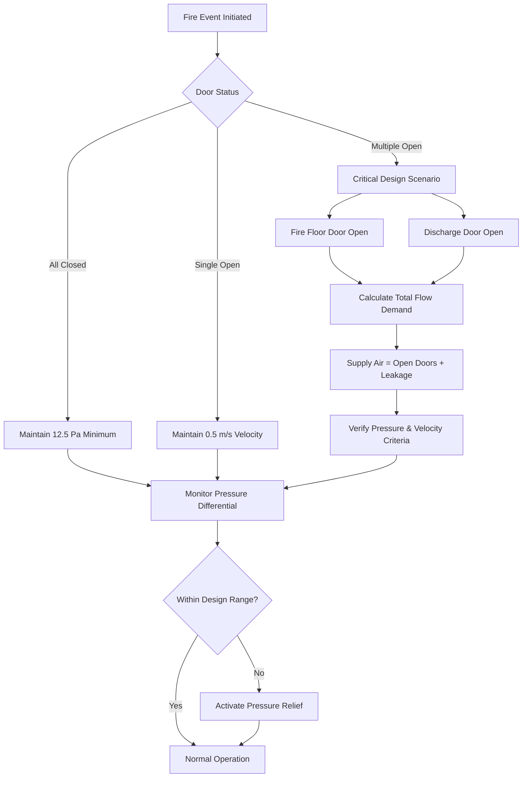
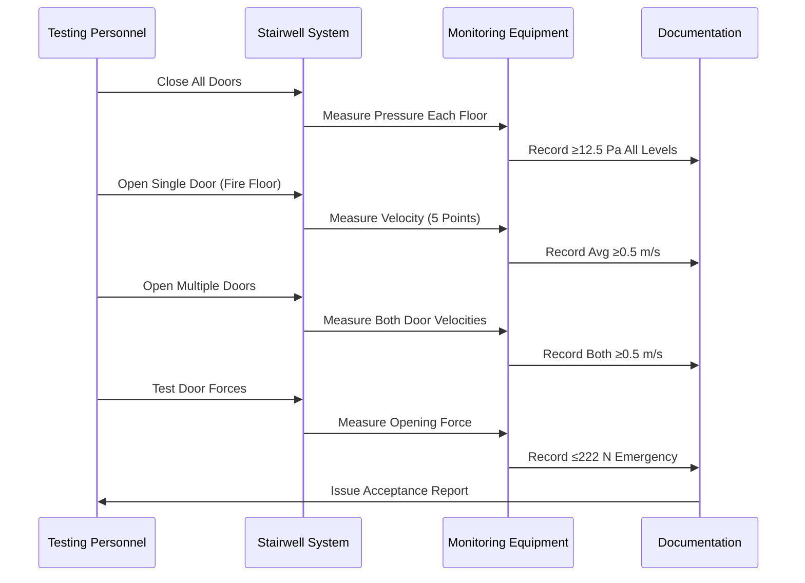

## Fundamental Smoke Control Objectives

Stairwell pressurization systems maintain positive pressure differentials to prevent smoke infiltration during fire events, ensuring tenable egress conditions for occupants and safe access for firefighting personnel. The physical principle relies on establishing air velocity through door openings that exceeds smoke buoyancy forces.

The fundamental relationship governing smoke control is:

$$\Delta P = \rho \cdot g \cdot h \cdot \Delta T / T_{avg}$$

Where $\Delta P$ is buoyancy-induced pressure differential (Pa), $\rho$ is air density (kg/m³), $g$ is gravitational acceleration (9.81 m/s²), $h$ is height (m), $\Delta T$ is temperature difference (K), and $T_{avg}$ is average absolute temperature (K).

## Design Pressure Differentials

### Minimum Pressure Requirements

NFPA 92 establishes minimum pressure differentials across closed stairwell doors relative to building spaces. Under all operating conditions, the system must maintain sufficient pressure to overcome stack effect and wind forces.

**Minimum design pressures:**

| Condition | Minimum Pressure | Design Basis |
|-----------|------------------|--------------|
| All doors closed | 12.5 Pa (0.05 in. w.g.) | Smoke leakage prevention |
| Single door open | Maintain flow | Minimum 0.5 m/s velocity |
| Multiple doors open | Maintain flow | Design scenario dependent |

The minimum pressure of 12.5 Pa prevents smoke infiltration through door gaps and construction imperfections. This value accounts for typical door leakage areas of 0.01-0.02 m² per door.

### Maximum Pressure Limits

Maximum pressure differentials are constrained by door opening forces, which must not exceed accessibility requirements. NFPA 101 limits maximum door opening force to 133 N (30 lbf) under non-fire conditions and permits up to 222 N (50 lbf) during fire emergencies.

The force required to open a door against pressure differential:

$$F_{door} = \Delta P \cdot A_{door} \cdot W / 2$$

Where $F_{door}$ is opening force (N), $A_{door}$ is door area (m²), $W$ is door width (m), and the factor 2 accounts for the lever arm at the door handle.

For a standard 0.91 m × 2.13 m (3 ft × 7 ft) door:

$$\Delta P_{max} = \frac{2 \cdot F_{door}}{A_{door} \cdot W}$$

At maximum emergency force of 222 N:

$$\Delta P_{max} = \frac{2 \times 222}{(0.91 \times 2.13) \times 0.91} = 252 \text{ Pa (1.01 in. w.g.)}$$

Practical design limits typically range from 50-75 Pa (0.2-0.3 in. w.g.) to balance smoke control effectiveness with door operability.

## Open Door Scenarios

### Single Door Opening

When a stairwell door opens, the pressure differential collapses, and the system must maintain minimum air velocity through the doorway to prevent smoke entry. NFPA 92 requires minimum average velocity of 0.5 m/s across the open door.

Required volumetric flow for open door:

$$Q_{door} = V_{min} \cdot A_{door}$$

For a 1.94 m² door at 0.5 m/s:

$$Q_{door} = 0.5 \times 1.94 = 0.97 \text{ m³/s (2,055 CFM)}$$

This calculation assumes uniform velocity distribution. Actual designs typically use 0.75-1.0 m/s to account for non-uniform flow and door turbulence.

### Multiple Door Opening Scenario

Critical design scenario occurs when doors at the fire floor and discharge level open simultaneously, creating maximum airflow demand. The system must supply air to replace:

1. Air exiting at ground floor discharge
2. Air leaking through closed doors throughout the shaft
3. Makeup air to maintain pressure

**Flow calculation for multiple openings:**

$$Q_{total} = Q_{open,fire} + Q_{open,discharge} + Q_{leakage}$$

Leakage flow through closed doors:

$$Q_{leakage} = C_{d} \cdot A_{leak} \cdot \sqrt{2 \cdot \Delta P / \rho}$$

Where $C_{d}$ is discharge coefficient (typically 0.65), $A_{leak}$ is total leakage area (m²), $\Delta P$ is pressure differential (Pa), and $\rho$ is air density (kg/m³).

## Multiple Injection Points

Tall stairwells require multiple air injection points to overcome stack effect and maintain uniform pressurization throughout the shaft height. Single-point injection at the top produces excessive pressure at upper levels and insufficient pressure at lower levels.

### Stack Effect Pressure Distribution

Natural stack effect creates pressure gradients in vertical shafts:

$$\Delta P_{stack} = 3460 \cdot h \cdot \left(\frac{1}{T_{out}} - \frac{1}{T_{in}}\right)$$

Where $\Delta P_{stack}$ is stack pressure (Pa), $h$ is height (m), $T_{out}$ is outdoor temperature (K), and $T_{in}$ is indoor temperature (K).

For a 100 m stairwell with outdoor temperature of -20°C (253 K) and indoor temperature of 20°C (293 K):

$$\Delta P_{stack} = 3460 \times 100 \times \left(\frac{1}{253} - \frac{1}{293}\right) = 187 \text{ Pa}$$

This significant pressure differential necessitates multiple injection points to counteract stack forces.

### Injection Point Spacing

Maximum vertical spacing between injection points typically ranges from 15-30 stories (50-100 m), depending on:

- Stack effect magnitude (climate-dependent)
- Design pressure differential targets
- Door leakage characteristics
- System capacity margins

**Optimal injection strategy:**

| Building Height | Injection Points | Location Strategy |
|-----------------|------------------|-------------------|
| < 30 m | 1 | Top of shaft |
| 30-60 m | 2 | Top and mid-height |
| 60-100 m | 3 | Top, 2/3 height, 1/3 height |
| > 100 m | 4+ | Every 25-30 m vertically |

Each injection point requires independent flow control with pressure-responsive dampers or variable speed fans to balance pressure throughout the shaft.

## Acceptance Testing Requirements

NFPA 92 mandates comprehensive acceptance testing to verify system performance under all design scenarios. Testing must demonstrate compliance with pressure, velocity, and door force criteria.

### Pressure Differential Testing

**Test procedure:**

1. **All doors closed test:** Measure pressure differential at each floor level with all stairwell doors closed. Verify minimum 12.5 Pa at all locations.

2. **Single door open test:** Open single door at design fire floor. Measure velocity at five points across door opening. Verify average velocity ≥ 0.5 m/s.

3. **Multiple door open test:** Open doors at fire floor and discharge simultaneously. Verify maintained air velocity at both openings.

Pressure measurements use calibrated digital manometers with ±1 Pa accuracy. Measurements taken at door centerline, 25 mm from closed door surface.

### Velocity Measurement Protocol

Door opening velocity measured using calibrated vane anemometers or hot-wire anemometers. Five-point measurement grid:

- Center of door
- Four points at 1/4 and 3/4 width, 1/4 and 3/4 height

Average velocity calculated as:

$$V_{avg} = \frac{1}{5} \sum_{i=1}^{5} V_i$$

Individual measurements should not vary more than 30% from average to ensure adequate flow distribution.

### Door Opening Force Testing

Door opening force measured using calibrated force gauges at door handle location. Maximum force recorded from fully latched position through 15° of opening arc.

**Acceptance criteria:**

| Operating Mode | Maximum Force | Standard Reference |
|----------------|---------------|-------------------|
| Normal conditions | 133 N (30 lbf) | NFPA 101 |
| Fire emergency | 222 N (50 lbf) | NFPA 101 |
| ADA compliance | 22 N (5 lbf) | Non-fire conditions |

If forces exceed limits, pressure relief dampers must be adjusted or additional relief capacity installed.

### System Response Testing

Dynamic testing verifies system response to door operations:

1. Monitor pressure with all doors closed
2. Open single door and record time to establish minimum velocity
3. Close door and record time to re-establish pressure
4. Repeat for multiple door scenarios

Response time from door opening to established airflow should not exceed 10 seconds to prevent smoke infiltration during transient conditions.

### Seasonal Testing Requirements

Stack effect varies significantly with seasonal temperature changes. Acceptance testing should verify system performance under:

- **Summer conditions:** Minimal stack effect, reverse stack possible
- **Winter conditions:** Maximum stack effect, highest pressure demands
- **Swing seasons:** Intermediate conditions

Systems must demonstrate compliance across the full range of anticipated environmental conditions or include automatic compensation mechanisms such as:

- Variable speed fans with pressure feedback control
- Barometric dampers for automatic pressure relief
- Multiple fan staging based on outdoor temperature

The commissioning process validates control sequences, confirming automatic adjustments maintain design criteria throughout the annual cycle.

## Conclusion

Effective smoke control through stairwell pressurization requires integrated design addressing pressure differentials, open door scenarios, injection strategies, and rigorous acceptance testing. Physics-based calculations ensure systems overcome stack effect while maintaining door operability. Multiple injection points provide uniform pressurization in tall buildings. Comprehensive testing per NFPA 92 verifies life safety performance across all operating conditions and environmental scenarios.
