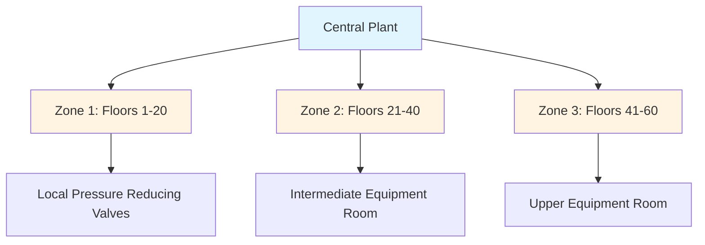
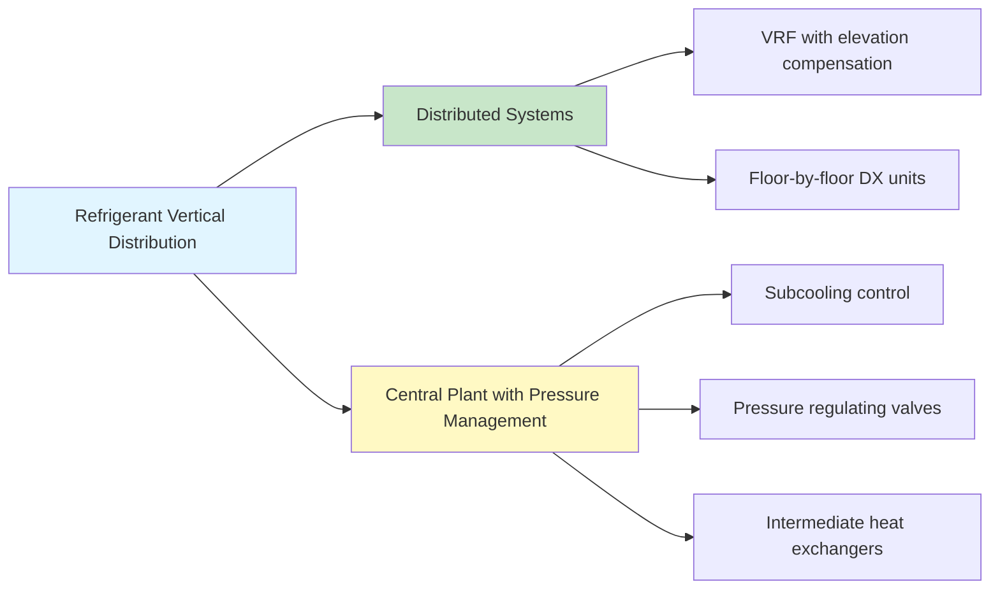

## Physical Challenges of Vertical Fluid Distribution

Vertical transportation of HVAC fluids in tall buildings presents unique engineering challenges driven by fundamental physics. The primary obstacle is hydrostatic pressure, which increases linearly with height according to:

$$P_{\text{static}} = \rho g h$$

where $\rho$ is fluid density (kg/m³), $g$ is gravitational acceleration (9.81 m/s²), and $h$ is vertical height (m).

For water systems, this translates to approximately 0.433 psi per foot of elevation (9.8 kPa/m). A 100-story building with 400 ft (122 m) of vertical rise generates 173 psi (1.2 MPa) of static pressure at the base, creating several critical concerns:

- **Component pressure ratings** - Valves, heat exchangers, and piping must withstand maximum system pressure
- **Pump selection complexity** - Balancing total head against equipment limitations
- **Energy penalties** - Lifting fluid mass repeatedly consumes significant pumping energy
- **Pressure control requirements** - Preventing equipment damage and ensuring proper flow distribution

## Pressure Zoning Strategies

High-rise buildings typically employ pressure zoning to manage static head. Rather than designing a single system for maximum pressure, the vertical distribution is divided into zones, each served by dedicated equipment.

### Zoning Approaches

| Method | Advantages | Disadvantages | Typical Application |
|--------|------------|---------------|---------------------|
| **Parallel Pumping** | Simple control, equipment redundancy | Requires vertical shaft space for multiple risers | Buildings < 40 stories |
| **Series Pumping** | Reduces individual pump head, energy recovery possible | Complex control, staging coordination required | Buildings 40-80 stories |
| **Heat Exchanger Isolation** | Complete hydraulic separation, independent zone control | Heat transfer penalty, added first cost | Buildings > 60 stories, mixed-use |
| **Pressure Reducing Valves** | Low first cost, minimal space | Energy waste, limited control precision | Retrofit applications, small zones |

## Pump Selection and Staging

The total head required for vertical distribution combines static head, friction losses, and equipment pressure drops:

$$H_{\text{total}} = H_{\text{static}} + H_{\text{friction}} + H_{\text{equipment}}$$

For tall buildings, static head dominates. A pump serving floors 1-30 (approximately 300 ft or 91 m) must overcome:

- **Static head**: 130 psi (896 kPa)
- **Friction losses**: 20-40 psi (138-276 kPa) depending on flow velocity
- **Equipment pressure drop**: 15-30 psi (103-207 kPa) for coils, valves, controls

**Total head requirement**: 165-200 psi (1.14-1.38 MPa)

### Series Pump Configuration

Series pumping allows multiple pumps to share the total head requirement. Each pump adds its head to the system:

$$H_{\text{system}} = H_{\text{pump1}} + H_{\text{pump2}} + H_{\text{pump3}}$$

This approach offers several benefits:

1. **Equipment availability** - Individual pumps operate within standard pressure ranges (150-175 psi)
2. **Staging flexibility** - Pumps can be activated based on load, improving part-load efficiency
3. **Energy recovery** - Descending fluid can drive lower pumps when pressure differentials permit

The hydraulic energy available from descending return flow is:

$$W_{\text{recovery}} = \dot{m} g h = \rho Q g h$$

where $Q$ is volumetric flow rate (m³/s). For a 1000 gpm (63 L/s) return flow descending 300 ft (91 m), theoretical recovery power is approximately 75 hp (56 kW), representing 30-40% of pumping energy in well-designed systems.

## Refrigerant Distribution in Tall Buildings

Direct expansion (DX) and variable refrigerant flow (VRF) systems face unique challenges in vertical applications. Refrigerant piping must accommodate:

### Oil Return Requirements

Compressor oil entrained in refrigerant must return reliably. Vertical suction risers require minimum gas velocities to lift oil:

$$v_{\text{min}} = \sqrt{\frac{4 g d (\rho_{\text{oil}} - \rho_{\text{gas}})}{\rho_{\text{gas}} C_D}}$$

For typical conditions, this translates to 1000-1500 fpm (5-7.6 m/s) minimum velocity in vertical risers. At part load, velocity decreases, potentially trapping oil. Double-riser configurations with automatic switchover prevent oil logging during low-load operation.

### Pressure Drop Considerations

Refrigerant density varies dramatically between liquid and vapor states. The static pressure penalty for liquid refrigerant (density ~1200 kg/m³) is roughly 3 times greater than water:

- **R-410A liquid**: 1.3 psi/ft (29.4 kPa/m)
- **R-134a liquid**: 1.1 psi/ft (24.9 kPa/m)

A 400 ft (122 m) liquid line generates 520 psi (3.6 MPa) of static pressure, potentially causing:

- **Excessive subcooling** at upper floors
- **Liquid flashing** in expansion devices at lower floors
- **Reduced system capacity** due to pressure imbalances

### Mitigation Strategies

## Energy Impact and Optimization

The parasitic energy consumption of vertical transportation is quantified by the static head pumping penalty:

$$E_{\text{static}} = \frac{\rho g h Q}{\eta_{\text{pump}} \eta_{\text{motor}}}$$

For a representative high-rise chilled water system (2000 gpm, 300 ft elevation, 65% wire-to-water efficiency), static head alone consumes 140 hp (104 kW) of continuous pumping power. Annual energy consumption reaches 1.2 million kWh, costing approximately $120,000 at typical commercial rates.

### Optimization Approaches

**Primary-secondary decoupling**: Isolating distribution pumping from production pumping allows central plant optimization independent of building height penalties.

**Variable flow design**: Reducing flow at part load decreases both friction losses and pumping power according to the affinity laws:

$$\frac{P_2}{P_1} = \left(\frac{Q_2}{Q_1}\right)^3$$

**Pressure-independent terminal units**: Two-way control valves with integral pressure regulation eliminate minimum flow requirements, maximizing variable flow benefits.

**Heat recovery from descending fluid**: Capturing potential energy through hydraulic turbines or reverse-running pumps recovers 25-35% of static head energy.

## Design Recommendations per ASHRAE

ASHRAE Handbook—HVAC Applications, Chapter 3 (Commercial and Public Buildings) provides guidance for high-rise distribution:

- Limit individual zone static head to 150 ft (46 m) where practical
- Design for fluid velocities that balance first cost against pumping energy (6-10 ft/s for chilled water)
- Specify pressure ratings 25% above maximum static plus operating pressure
- Provide pressure relief protection at equipment room boundaries
- Consider seismic separation requirements at zone boundaries per ASHRAE Standard 171

The engineering of vertical transportation systems fundamentally shapes high-rise HVAC performance, energy consumption, and long-term operational costs. Proper pressure management, strategic zoning, and physics-based pump selection transform elevation challenges into manageable design parameters.

