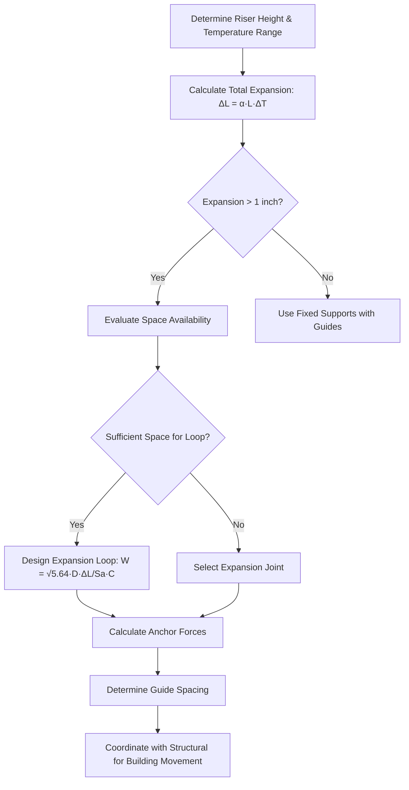

## Thermal Expansion in Vertical Risers

Vertical piping in tall buildings experiences significant thermal expansion due to temperature differentials between installation and operating conditions. A 400-foot steel riser with a 100°F temperature change expands approximately 3.3 inches, creating substantial forces if improperly constrained.

The fundamental thermal expansion equation governs riser design:

$$\Delta L = \alpha \cdot L \cdot \Delta T$$

Where:
- $\Delta L$ = total expansion (inches)
- $\alpha$ = coefficient of linear expansion (in/in/°F)
- $L$ = pipe length (feet)
- $\Delta T$ = temperature change (°F)

**Material expansion coefficients:**

| Material | Coefficient (in/in/°F) | 100 ft @ 100°F ΔT |
|----------|------------------------|-------------------|
| Carbon Steel | 6.5 × 10⁻⁶ | 0.78 inches |
| Copper | 9.4 × 10⁻⁶ | 1.13 inches |
| Stainless 304 | 9.6 × 10⁻⁶ | 1.15 inches |
| CPVC | 3.6 × 10⁻⁵ | 4.32 inches |

## Expansion Loop Design

Expansion loops provide flexibility through geometric configuration, absorbing thermal movement without generating excessive stress. The two-plane offset loop represents the most common configuration for vertical risers.

### Loop Sizing Calculation

The required leg length for a two-plane offset loop:

$$W = \sqrt{\frac{5.64 \cdot D \cdot \Delta L}{S_a \cdot C}}$$

Where:
- $W$ = leg length from centerline of run (feet)
- $D$ = pipe outside diameter (inches)
- $\Delta L$ = total expansion (inches)
- $S_a$ = allowable stress range (psi), typically 20,000 psi for carbon steel
- $C$ = flexibility correction factor (dimensionless)

For a 6-inch Schedule 40 carbon steel riser with 2.5 inches expansion:

$$W = \sqrt{\frac{5.64 \times 6.625 \times 2.5}{20000 \times 1.0}} = \sqrt{0.000469} = 0.0217 \text{ ft} = 4.5 \text{ feet}$$

## Expansion Loops vs Expansion Joints

The selection between loops and joints depends on available space, system pressure, and maintenance philosophy.

| Factor | Expansion Loops | Expansion Joints |
|--------|-----------------|------------------|
| Space Required | 4-10 ft per loop | Minimal (12-24 in) |
| Pressure Limit | Pipe rating | Joint rating (typically lower) |
| Maintenance | None | Periodic inspection/replacement |
| Initial Cost | Moderate (piping/labor) | Higher (joint cost) |
| Reliability | Excellent (no moving parts) | Good (requires maintenance) |
| Useful Life | 50+ years | 15-25 years typical |
| Anchor Forces | Low (self-compensating) | High (must resist joint pressure thrust) |

**Expansion loops** excel where space permits and long-term reliability is prioritized. They introduce no additional leak points and require no maintenance.

**Expansion joints** become necessary in space-constrained situations or when piping routes cannot accommodate loops. Bellows-type joints handle significant movement but introduce pressure thrust forces requiring substantial anchoring.

## Anchor Point Design

Anchors prevent pipe movement at specific locations, forcing expansion into loops or joints. Main anchors resist pressure thrust and thermal loads:

$$F_a = P \cdot A + \mu \cdot W$$

Where:
- $F_a$ = total anchor force (lbf)
- $P$ = system pressure (psi)
- $A$ = pipe cross-sectional area (in²)
- $\mu$ = friction coefficient (0.3 typical for steel on steel)
- $W$ = pipe weight including fluid (lbf)

For a 6-inch Schedule 40 pipe at 150 psi:

$$A = \frac{\pi \cdot d^2}{4} = \frac{\pi \cdot 6.065^2}{4} = 28.9 \text{ in}^2$$

$$F_a = 150 \times 28.9 + 0.3 \times W_{pipe} = 4,335 + 0.3W \text{ lbf}$$

Anchors must be installed at:
- Changes in pipe direction (elbows preceding expansion loops)
- Equipment connections (to prevent equipment movement)
- Expansion joint boundaries (to contain pressure thrust)
- Building expansion joint crossings

## Guide Spacing

Guides constrain lateral movement while permitting axial displacement. Proper spacing prevents buckling during thermal expansion.

**Maximum guide spacing per ASME B31.1:**

$$L_{max} = 0.03 \cdot \sqrt[3]{\frac{E \cdot I}{W_p}}$$

Where:
- $L_{max}$ = maximum spacing (feet)
- $E$ = modulus of elasticity (29 × 10⁶ psi for steel)
- $I$ = moment of inertia (in⁴)
- $W_p$ = pipe weight per foot including fluid (lbf/ft)

**Recommended guide spacing for vertical risers:**

| Pipe Size | Weight (lbf/ft) | Maximum Spacing | Practical Spacing |
|-----------|-----------------|-----------------|-------------------|
| 2 inch | 6.5 | 22 ft | 15 ft (every floor) |
| 4 inch | 15.0 | 16 ft | 15 ft (every floor) |
| 6 inch | 28.5 | 13 ft | 10 ft (every floor) |
| 8 inch | 42.0 | 11 ft | 10 ft (alternate floors) |
| 12 inch | 73.0 | 9 ft | 8 ft (alternate floors) |

Guides immediately adjacent to expansion loops (within 4 pipe diameters) must be aligned precisely to prevent binding.

## Building Movement Accommodation

Tall buildings experience structural movement from wind loads, seismic activity, and differential settlement. HVAC risers crossing building expansion joints require special treatment.

**Building movement types:**

1. **Vertical settlement** - Differential compression between core and perimeter
2. **Lateral sway** - Wind and seismic-induced displacement
3. **Thermal expansion** - Building structure temperature changes
4. **Construction sequencing** - Cumulative shortening during construction

At building expansion joints, piping must accommodate full structural movement plus thermal expansion. A flexible connection independent of thermal compensation is required:

$$\Delta_{total} = \Delta_{building} + \Delta_{thermal}$$

Double-loop configurations or dedicated expansion joints with oversized movement capacity handle this combined displacement. Coordinate riser routing to cross building joints at optimal locations where movement is minimized and access for maintenance is available.

## Riser Support Flexibility Analysis

Complete riser systems require integrated analysis considering all support components. Modern finite element analysis evaluates stress distribution throughout the system under combined loading.

Critical checks include:
- Maximum stress in pipe at anchors and guides
- Reaction forces at structural support points
- Clearances during full expansion/contraction cycles
- Equipment nozzle loads within manufacturer limits
- Vibration characteristics and natural frequencies

ASME B31.1 Section 119.7 requires that calculated stress range remain below allowable values based on material properties and cycle life expectations. For systems experiencing daily temperature swings, fatigue considerations become significant beyond 7,000 cycles.

---

**Reference Standards:**
- ASME B31.1: Power Piping Code
- ASME B31.9: Building Services Piping
- ASHRAE Handbook - HVAC Systems and Equipment, Chapter 46
- MSS SP-69: Pipe Hangers and Supports - Selection and Application
