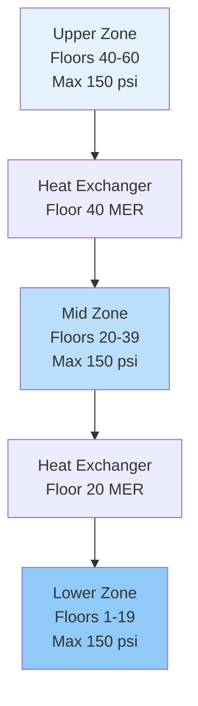
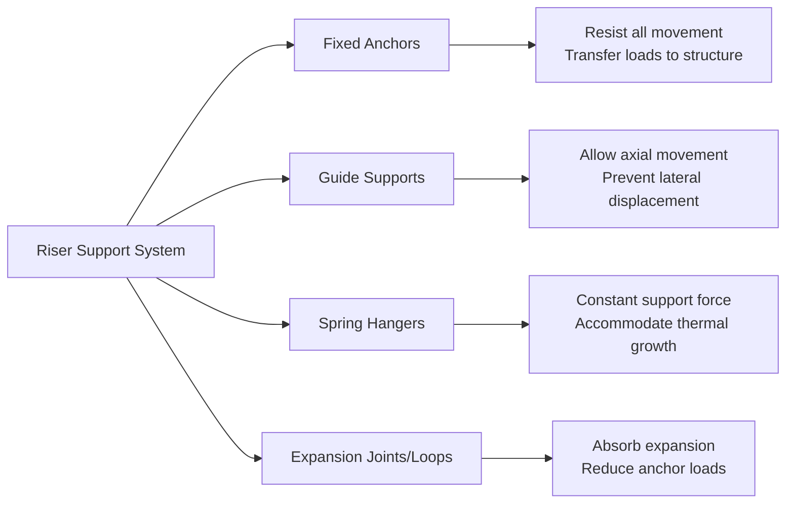

Vertical piping systems in tall buildings present unique engineering challenges driven by hydrostatic pressure, thermal expansion over significant heights, and the need for reliable fluid transport across multiple floors. Proper design requires rigorous analysis of static head effects, strategic pressure zoning, and specialized support systems that accommodate both gravitational and thermal loads.

## Static Pressure and Riser Zoning

The primary design constraint for vertical piping is static pressure, which increases linearly with elevation difference. The hydrostatic pressure relationship is:

$$P_{static} = \rho g h$$

Where $\rho$ is fluid density (kg/m³), $g$ is gravitational acceleration (9.81 m/s²), and $h$ is the vertical height (m). For water at standard conditions, this yields approximately 1 psi per 2.31 feet (9.8 kPa per meter) of elevation.

In buildings exceeding 400-500 feet, single-zone systems become impractical due to excessive pressures at lower levels. Equipment ratings typically limit system pressure to 150-300 psi (1034-2068 kPa), necessitating multiple pressure zones separated by heat exchangers, pressure-reducing stations, or dedicated mechanical equipment rooms.

### Zoning Strategies

| Strategy | Application | Advantages | Limitations |
|----------|------------|------------|-------------|
| Heat Exchanger Separation | Chilled water, heating hot water | Complete pressure isolation, equipment protection | Thermal penalty (2-3°F), added first cost |
| Pressure-Reducing Valves | Condenser water, secondary systems | Lower cost, simpler design | Throttling losses, maintenance requirements |
| Booster Pumps | Return risers, condensate systems | Eliminates static head penalty | Added energy consumption, complexity |
| Direct Connection with High-Pressure Equipment | Buildings <400 ft | Simplicity, lower first cost | Requires special high-pressure rated components |

## Pipe Sizing for Vertical Transport

Sizing vertical risers requires balancing friction loss against static pressure effects. The total pressure drop in a vertical pipe segment combines friction and elevation components:

$$\Delta P_{total} = \Delta P_{friction} + \rho g \Delta h$$

For upward flow, the static component opposes pump discharge pressure; for downward flow, it assists. The Darcy-Weisbach equation governs friction loss:

$$\Delta P_{friction} = f \frac{L}{D} \frac{\rho v^2}{2}$$

Where $f$ is the friction factor (dimensionless), $L$ is pipe length (m), $D$ is diameter (m), and $v$ is velocity (m/s).

**Design Velocities for Vertical Risers:**
- Chilled water supply: 4-8 ft/s (1.2-2.4 m/s)
- Chilled water return: 4-8 ft/s (1.2-2.4 m/s)
- Heating hot water: 4-10 ft/s (1.2-3.0 m/s)
- Condenser water: 6-12 ft/s (1.8-3.7 m/s)
- Steam (low pressure): 6000-10000 ft/min (30-51 m/s)

Higher velocities minimize pipe diameter and first cost but increase friction loss, noise, and erosion potential. ASHRAE Guideline 36 recommends maintaining velocities within these ranges to balance performance and longevity.

## Material Selection and Pressure Ratings

Material selection for vertical risers depends on fluid type, pressure class, and corrosion considerations:

| Material | Pressure Rating | Applications | Corrosion Resistance |
|----------|----------------|--------------|---------------------|
| Schedule 40 Carbon Steel | 150 psi @ 353°F | Chilled water, heating hot water | Moderate with treatment |
| Schedule 80 Carbon Steel | 300 psi @ 353°F | High-pressure zones, steam | Moderate with treatment |
| Type L Copper | 250 psi @ 100°F | Potable water, small risers | Excellent |
| Stainless Steel 304/316 | 400+ psi | Corrosive fluids, critical systems | Excellent |
| CPVC Schedule 80 | 400 psi @ 73°F | Non-metallic option, special applications | Excellent, limited temperature |

Carbon steel dominates large commercial installations due to cost-effectiveness and weldability. Proper water treatment maintaining pH 7.5-9.5 and oxygen levels <0.005 mg/L prevents internal corrosion. External corrosion protection requires insulation vapor barriers and periodic inspection at support points.

## Support and Anchoring Systems

Vertical piping supports must resist dead weight, thermal expansion forces, and seismic loads while allowing controlled movement. The thermal expansion for steel pipe is:

$$\Delta L = \alpha L \Delta T$$

Where $\alpha$ is the coefficient of thermal expansion (6.5 × 10⁻⁶ in/in/°F for steel), $L$ is length, and $\Delta T$ is temperature change. A 500-foot vertical riser experiencing a 50°F temperature swing expands 1.95 inches.

**Support System Components:**

Fixed anchors typically locate at mechanical equipment rooms every 10-20 floors, creating manageable expansion segments. Guide supports space at 15-25 feet vertically, with closer spacing near direction changes. Spring hangers at branch takeoffs maintain constant support force despite riser thermal movement.

## Pressure Testing and Commissioning

ASME B31.9 and local codes mandate hydrostatic testing at 1.5 times operating pressure, minimum 150 psi, held for 30 minutes minimum. For tall buildings, testing occurs in segments to avoid exceeding pressure ratings:

**Pressure Test Procedure:**
1. Fill system from bottom, venting continuously at high points
2. Apply test pressure gradually (50 psi per 10 minutes)
3. Visually inspect all joints, flanges, and penetrations
4. Monitor pressure gauge for 30 minutes—drop >5% indicates leakage
5. Release pressure slowly to prevent water hammer

Commissioning vertical piping systems includes flow balancing across zones, verification of automatic valves, and thermal imaging to confirm insulation integrity. Differential pressure monitoring between supply and return risers validates design assumptions and identifies restrictions.

Total pressure drop from system pumps through distribution should match calculated values within ±10%. Significant deviations indicate undersized piping, fouled strainers, or improperly positioned valves requiring investigation before system acceptance.

## Components

- Chilled Water Risers
- Heating Hot Water Risers
- Condenser Water Risers
- Steam Risers High Rise
- Condensate Return Risers
- Dual Temperature Risers
- Piping Material Selection
