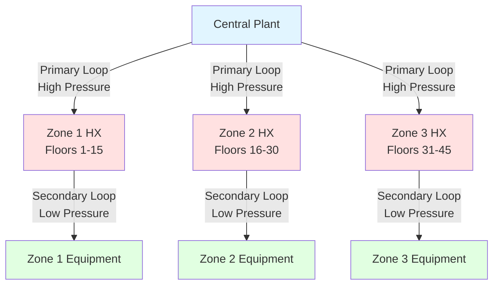
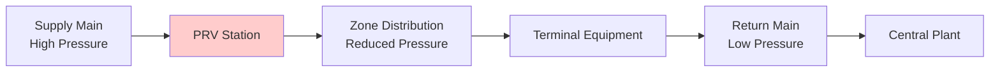

## Hydrostatic Pressure in Vertical Systems

Tall building piping systems face a fundamental challenge: hydrostatic pressure increases linearly with vertical height at approximately 0.433 psi per foot of elevation in water systems. This creates bottom-floor pressures that exceed equipment ratings and compromise system integrity without proper compartmentalization.

The hydrostatic pressure at any point in a static water column is:

$$P = \rho g h$$

Where:
- $P$ = pressure (Pa)
- $\rho$ = fluid density (kg/m³)
- $g$ = gravitational acceleration (9.81 m/s²)
- $h$ = vertical height above the point (m)

In imperial units, this simplifies to 0.433 psi/ft for water at 60°F. A 600-foot building generates 260 psi of static pressure at the base, far exceeding typical HVAC component ratings of 125-175 psi.

## Equipment Pressure Rating Limitations

HVAC equipment and system components have maximum working pressure (MWP) limits that establish zoning requirements:

| Component | Typical MWP | Governing Standard |
|-----------|-------------|-------------------|
| Terminal units (FCUs, VAV) | 125-150 psi | AHRI 430 |
| Hydronic coils | 150-175 psi | AHRI 410 |
| Control valves | 150-200 psi | ANSI/FCI 70-2 |
| Steel pipe (Schedule 40) | 300+ psi | ASME B31.9 |
| Copper tube (Type L) | 200-400 psi | ASTM B88 |
| Heat exchangers (plate) | 150-300 psi | ASME Section VIII |

The weakest components—typically terminal equipment and control valves—dictate zone height limits. ASHRAE Handbook applications recommend limiting individual zones to prevent exceeding 80% of the lowest-rated component's MWP, providing safety margin for pressure transients.

## Pressure Zone Height Calculation

The maximum vertical height for a single pressure zone is:

$$H_{max} = \frac{P_{rated} \times 0.8 - P_{system}}{0.433}$$

Where:
- $H_{max}$ = maximum zone height (ft)
- $P_{rated}$ = lowest equipment pressure rating (psi)
- $P_{system}$ = operating system pressure including pump head (psi)
- 0.433 = hydrostatic pressure gradient (psi/ft)

For equipment rated at 150 psi in a system operating at 30 psi:

$$H_{max} = \frac{150 \times 0.8 - 30}{0.433} = \frac{90}{0.433} = 208 \text{ ft}$$

This establishes a practical zone height limit of approximately 200 feet, requiring 3-4 zones for a typical 600-foot tower.

## Pressure Zone Configuration Strategies

### Strategy 1: Heat Exchanger Isolation

Each pressure zone operates as an independent hydronic loop, isolated by plate-and-frame or brazed-plate heat exchangers. The primary (high-pressure) loop serves heat exchangers at zone boundaries, while secondary (low-pressure) loops distribute heating or cooling within each zone.

### Strategy 2: Pressure Reducing Valve Stations

Pressure-reducing valve (PRV) stations maintain downstream pressure at safe levels while allowing continuous flow through a single piping network. This approach requires less mechanical room space than heat exchanger isolation but introduces control complexity.

## Pressure Reducing Station Design

PRV stations require redundant valves, isolation capabilities, and pressure monitoring:

**Key Components:**
- Dual PRVs (one operating, one standby) for reliability
- Upstream and downstream isolation valves
- Strainers upstream of PRVs to prevent fouling
- Pressure gauges on both sides for performance verification
- Bypass line with manual valve for maintenance
- Pressure relief valve downstream set 10% above PRV setpoint

The pressure drop across a PRV station is:

$$\Delta P_{PRV} = P_{upstream} - P_{setpoint}$$

For a zone receiving water at 180 psi with equipment rated at 150 psi, the PRV setpoint would be 120 psi (80% of rating), requiring the valve to absorb 60 psi.

## Zone Break Point Selection

Optimal zone breaks occur at:

1. **Mechanical floor locations** where equipment rooms provide installation space
2. **Architectural setbacks** that reduce piping complexity
3. **Building thirds or quarters** for geometric uniformity
4. **Equipment rating boundaries** at calculated maximum heights

Zone transition floors typically house heat exchangers or PRV stations, expansion tanks for the zone, and zone-specific pumps when using heat exchanger isolation.

## System Compartmentalization Benefits

Beyond pressure protection, zone compartmentalization provides:

**Operational Advantages:**
- Reduced system water volume per zone enables faster commissioning
- Zone isolation for maintenance without building-wide shutdown
- Localized fault containment limits failure propagation
- Smaller zone pumps reduce energy consumption compared to single high-head pumps

**Hydraulic Benefits:**
- Lower friction losses in shorter vertical runs
- Reduced pipe wall thickness requirements in upper zones
- Minimized water hammer effects during transient events

## Pressure Transient Considerations

Static pressure calculations represent steady-state conditions. Transient events introduce additional pressure spikes:

- **Pump start/stop**: Generates pressure waves propagating at acoustic velocity (approximately 4000 ft/s in water)
- **Control valve rapid closure**: Creates water hammer with pressure rise calculated by the Joukowsky equation: $\Delta P = \rho c \Delta v$
- **System filling**: Requires controlled pressurization to prevent over-pressure

Pressure zone design must accommodate these transients through proper equipment selection, control sequencing, and pressure relief protection sized per ASME Section VIII requirements.

## Compliance and Standards

Pressure zone design must satisfy:

- **ASME B31.9**: Building services piping pressure ratings and testing
- **ASHRAE Handbook—HVAC Applications**: Chapter on Tall Buildings
- **ASME Section VIII**: Pressure vessel rules for heat exchangers
- **Local building codes**: Maximum working pressure requirements
- **IPC/UPC**: Pressure relief and safety device mandates

Proper pressure zone implementation protects equipment, ensures operational reliability, and provides the foundation for effective hydronic distribution in tall buildings.
