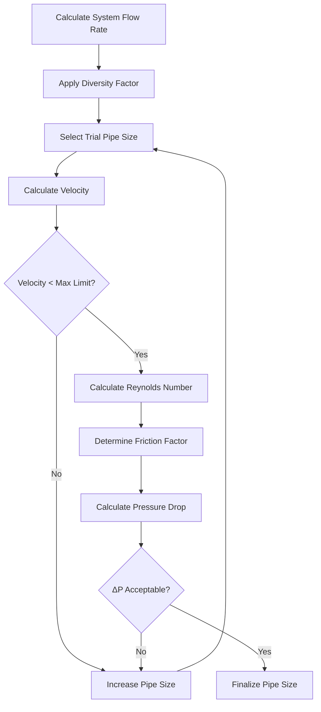
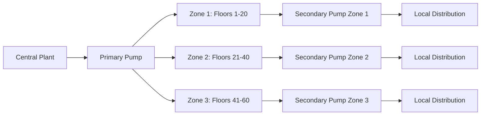
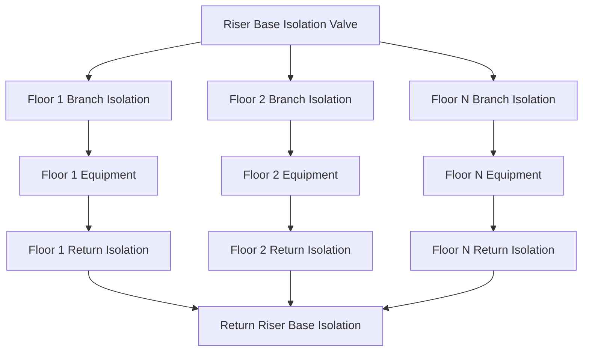

HVAC riser design in tall buildings presents unique challenges arising from static pressure heads, velocity constraints, thermal expansion, and the need for hydraulic balance across multiple vertical zones. Proper riser configuration directly impacts system efficiency, equipment life, and operational flexibility.

## Fundamental Physics of Vertical Hydronic Systems

The total pressure at the base of a water column combines static and dynamic components. For a vertical riser:

$$P_{total} = P_{static} + P_{friction} + P_{equipment}$$

where:
- $P_{static} = \rho g h$ (Pa), with $\rho$ = water density (kg/m³), $g$ = 9.81 m/s², $h$ = vertical height (m)
- $P_{friction}$ = frictional losses through piping (Pa)
- $P_{equipment}$ = pressure drop through valves, coils, and fittings (Pa)

Static pressure dominates in tall buildings. A 100 m riser generates approximately 980 kPa (142 psi) of static head, requiring pressure class considerations for all components below grade.

## Riser Sizing Methodology

Proper sizing balances initial cost, pressure drop, velocity constraints, and shaft space. The fundamental flow equation:

$$Q = A \times v = \frac{\pi d^2}{4} \times v$$

where $Q$ = flow rate (m³/s), $d$ = inside diameter (m), $v$ = velocity (m/s).

For HVAC applications, optimal velocities range from 1.2 to 2.4 m/s to minimize erosion, noise, and pressure drop while avoiding air entrainment.

**Sizing Process:**

1. **Calculate total system flow** using load diversity factors (typically 0.7-0.85 for large buildings per ASHRAE Handbook—HVAC Systems and Equipment)
2. **Determine maximum allowable velocity** (2.4 m/s for chilled water, 3.0 m/s for condenser water)
3. **Select initial pipe size** from standardized schedules
4. **Calculate pressure drop** using Darcy-Weisbach equation
5. **Verify pump head requirements** against available equipment

### Pressure Drop Calculations

The Darcy-Weisbach equation governs frictional pressure drop:

$$\Delta P_f = f \frac{L}{D} \frac{\rho v^2}{2}$$

where:
- $f$ = friction factor (dimensionless), dependent on Reynolds number and relative roughness
- $L$ = pipe length (m)
- $D$ = inside diameter (m)
- $\rho$ = density (kg/m³)
- $v$ = velocity (m/s)

For turbulent flow (Re > 4000), the Colebrook-White equation determines friction factor:

$$\frac{1}{\sqrt{f}} = -2 \log_{10}\left(\frac{\varepsilon/D}{3.7} + \frac{2.51}{Re\sqrt{f}}\right)$$

where $\varepsilon$ = absolute roughness (0.045 mm for commercial steel pipe), Re = Reynolds number.

## Riser Configuration Strategies

### Direct Return Systems

Supply and return risers follow independent paths, creating inherent hydraulic imbalance. Lower floors experience higher pressure drop due to greater piping length, requiring balancing valves on each floor.

**Advantages:**
- Simpler installation
- Reduced shaft space requirements
- Lower initial cost

**Disadvantages:**
- Complex balancing procedures
- Higher operating cost from throttling losses
- Difficult to maintain balance during partial load

### Reverse Return Systems

The furthest branch has equal total piping length to the nearest branch, providing inherent hydraulic balance.

$$L_{supply,far} + L_{return,far} = L_{supply,near} + L_{return,near}$$

**Advantages:**
- Self-balancing characteristics
- Reduced balancing valve requirements
- Better part-load performance

**Disadvantages:**
- Increased shaft space (30-40% more)
- Higher material costs
- Complex routing in existing buildings

### Loop Riser Systems

Common in super-tall buildings (>150 m), loop systems divide the building into vertical zones served by dedicated primary loops with secondary distribution.

## Velocity Limitations and Erosion Considerations

Excessive velocity accelerates erosion-corrosion at pipe bends and fittings. The erosion potential correlates with kinetic energy:

$$E_{kinetic} = \frac{1}{2}\rho v^2$$

**Maximum Recommended Velocities (ASHRAE Standard 90.1):**

| System Type | Maximum Velocity | Rationale |
|-------------|-----------------|-----------|
| Chilled Water | 2.4 m/s (8 ft/s) | Minimize erosion, control noise |
| Heating Water | 2.4 m/s (8 ft/s) | Prevent flashing in low-pressure zones |
| Condenser Water | 3.0 m/s (10 ft/s) | Higher tolerance due to water quality |
| Glycol Solutions | 1.8 m/s (6 ft/s) | Higher viscosity increases erosion |

Copper piping exhibits erosion above 1.5 m/s in systems with poor water treatment. Steel piping tolerates higher velocities but requires proper commissioning to remove mill scale.

## Shaft Space Allocation

Riser shaft sizing must accommodate piping, insulation, clearances, and future expansion.

**Minimum Shaft Dimensions:**

$$W_{shaft} = \sum(D_{pipe} + 2t_{insulation} + C_{clearance}) + S_{access}$$

where:
- $D_{pipe}$ = outside diameter of all pipes
- $t_{insulation}$ = insulation thickness (typically 25-50 mm for chilled water)
- $C_{clearance}$ = minimum clearance (50 mm between pipes, 75 mm to wall)
- $S_{access}$ = access/maintenance space (minimum 600 mm)

**Typical Shaft Requirements:**

| Building Height | Approximate Shaft Area | Notes |
|----------------|----------------------|-------|
| 10-20 floors | 1.5-2.0 m² | Single riser pair sufficient |
| 20-40 floors | 2.5-3.5 m² | Multiple systems or zoning |
| 40-60 floors | 4.0-6.0 m² | Separate shafts recommended |
| >60 floors | Zone-specific | Decentralized approach |

## Balancing and Control Strategies

Hydraulic balance ensures design flow reaches each terminal unit regardless of piping length or elevation. Three primary methods:

1. **Manual Balancing Valves**: Require commissioning but provide long-term stability
2. **Automatic Flow Limiters**: Pressure-independent devices maintaining constant flow
3. **Differential Pressure Control**: Modulate pump speed or valve position to maintain setpoint

The required valve authority for effective control:

$$N = \frac{\Delta P_{valve,design}}{\Delta P_{valve,design} + \Delta P_{circuit}}$$

Target authority of 0.3-0.5 ensures controllability while avoiding excessive pressure drop.

## Isolation Valve Strategy

Strategic isolation valve placement enables maintenance without full system shutdown.

**Critical Isolation Points:**
- Base of each riser (both supply and return)
- Each floor connection
- Major equipment (chillers, pumps, heat exchangers)
- Zone boundaries in multi-zone systems
- Expansion tank connections

Butterfly valves typically serve for sizes >100 mm (4 in), while ball valves suit smaller connections. All isolation valves require:
- Pressure rating exceeding maximum static + operating pressure
- Accessible location with clearance for operation
- Identification tags per ASHRAE Standard 134
- Memory stops on throttling valves to prevent unauthorized adjustment

## Pressure Class Considerations

Equipment and valve ratings must exceed maximum operating pressure plus static head:

$$P_{required} = P_{operating} + \rho g h + P_{safety}$$

Standard pressure classes (ANSI/ASME B16.5): 150 psi (1034 kPa), 300 psi (2068 kPa), 600 psi (4137 kPa).

For a 200 m building with 700 kPa operating pressure:
- Static head = 2000 kPa
- Total pressure = 2700 kPa (392 psi)
- Minimum pressure class = 600 psi at building base

Proper riser design integrates structural, hydraulic, and thermal considerations to deliver reliable, efficient vertical fluid transport in high-rise HVAC systems.
