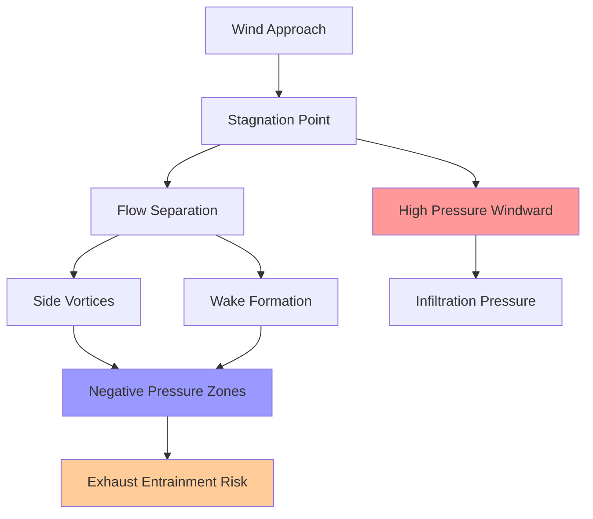
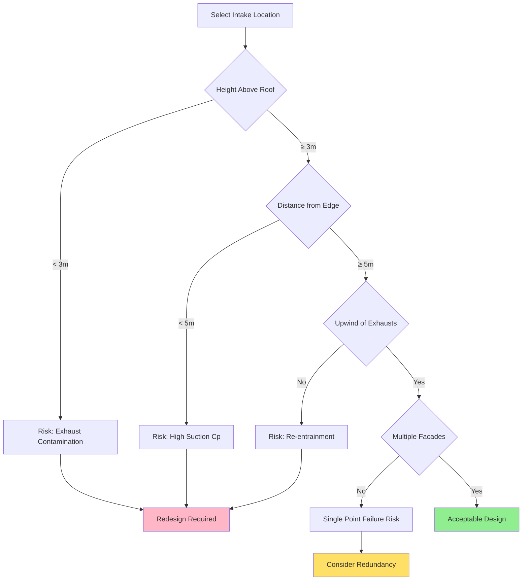
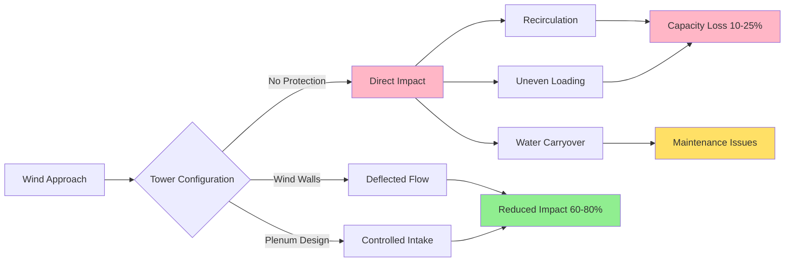

Wind effects dominate the design and performance of HVAC systems in tall buildings, creating pressure distributions that vary dramatically with height and building geometry. The interaction between wind-induced pressures and stack effect produces complex airflow patterns that affect outdoor air intake quality, exhaust discharge behavior, and equipment performance.

## Height-Dependent Wind Speed Profiles

Wind velocity increases with height above ground due to the atmospheric boundary layer effect. The velocity gradient depends on terrain roughness and atmospheric stability.

The power law velocity profile provides the fundamental relationship:

$$V_z = V_{ref} \left(\frac{z}{z_{ref}}\right)^\alpha$$

Where:
- $V_z$ = wind speed at height $z$
- $V_{ref}$ = reference wind speed at reference height $z_{ref}$
- $\alpha$ = terrain-dependent exponent (0.14 to 0.43)

ASHRAE Fundamentals provides terrain categories with corresponding exponents:

| Terrain Category | Description | Exponent α | Example |
|-----------------|-------------|-----------|---------|
| 1 | Open, flat terrain | 0.14 | Ocean, grassland |
| 2 | Rough, wooded terrain | 0.22 | Suburban residential |
| 3 | Urban, industrial | 0.33 | City centers |
| 4 | Dense urban | 0.43 | High-rise districts |

For a 200 m tall building in urban terrain (α = 0.33) with reference velocity of 5 m/s at 10 m height:

$$V_{200} = 5 \left(\frac{200}{10}\right)^{0.33} = 5 \times 2.71 = 13.6 \text{ m/s}$$

This 172% velocity increase creates significant pressure differentials between building top and bottom.

## Pressure Distribution Around Buildings

Wind creates pressure fields that vary around the building perimeter and with height. The relationship between wind velocity and pressure follows Bernoulli's equation for incompressible flow:

$$P_{wind} = \frac{1}{2} \rho V^2 C_p$$

Where:
- $P_{wind}$ = wind-induced pressure (Pa)
- $\rho$ = air density (kg/m³)
- $V$ = local wind velocity (m/s)
- $C_p$ = pressure coefficient (dimensionless)

Pressure coefficients depend on building geometry, wind direction, and location on facade:

| Location | Typical Cp Range | Pressure Type |
|----------|-----------------|---------------|
| Windward face (center) | +0.6 to +0.8 | Positive (inward) |
| Windward face (edges) | +0.3 to +0.5 | Positive (inward) |
| Side faces | -0.6 to -0.3 | Negative (suction) |
| Leeward face | -0.3 to -0.5 | Negative (suction) |
| Roof edges | -1.2 to -0.8 | Strong suction |
| Building wake | -0.4 to -0.2 | Negative (suction) |

At the roof level of a tall building with 15 m/s wind:

$$P_{windward} = \frac{1}{2} \times 1.2 \times 15^2 \times 0.7 = 95 \text{ Pa}$$

$$P_{leeward} = \frac{1}{2} \times 1.2 \times 15^2 \times (-0.4) = -54 \text{ Pa}$$

The 149 Pa differential drives significant airflow if openings exist between these zones.

## Outdoor Air Intake Location Strategies

Outdoor air intake placement must avoid contamination from building exhaust, street-level pollutants, and regions of high turbulence while maintaining adequate static pressure.

**Critical intake design criteria:**

1. **Vertical separation from pollution sources:** Minimum 3 m above roof surface, 10 m from exhaust discharge points
2. **Avoid high-suction zones:** Keep intakes away from roof edges and building corners where $C_p < -0.6$
3. **Multiple intake strategy:** Distribute intakes on different facades to maintain supply during unfavorable wind directions
4. **Velocity limits:** Design for maximum 2.5 m/s face velocity to prevent water entrainment

## Exhaust Discharge and Re-entrainment

Exhaust plume rise depends on vertical momentum, buoyancy, and wind effects. The dilution and trajectory determine re-entrainment potential.

**Plume rise equation** (Briggs formula for building wakes):

$$\Delta h = \frac{3 d V_e}{V_w}$$

For final plume height with buoyancy:

$$h_{final} = h_s + \Delta h + \frac{1.5 F^{1/3}}{V_w}$$

Where:
- $\Delta h$ = momentum rise (m)
- $d$ = stack diameter (m)
- $V_e$ = exhaust velocity (m/s)
- $V_w$ = wind velocity (m/s)
- $h_s$ = physical stack height (m)
- $F$ = buoyancy flux parameter (m⁴/s³)

For a kitchen exhaust: $d = 0.6$ m, $V_e = 12$ m/s, $V_w = 8$ m/s, $h_s = 3$ m:

$$\Delta h = \frac{3 \times 0.6 \times 12}{8} = 2.7 \text{ m}$$

**ASHRAE 62.1 re-entrainment criteria:**

- Minimum vertical separation between exhaust and intake: 3 m
- Minimum horizontal separation (same level): 6 m
- Exhaust velocity requirement: $V_e \geq 1.5 V_w$ to prevent downwash

| Wind Speed (m/s) | Min Exhaust Velocity (m/s) | Momentum Rise Factor |
|-----------------|---------------------------|---------------------|
| 5 | 7.5 | High |
| 10 | 15.0 | Moderate |
| 15 | 22.5 | Low |
| 20 | 30.0 | Minimal |

At high wind speeds, maintaining adequate exhaust momentum becomes challenging, requiring taller stacks or alternative discharge strategies.

## Cooling Tower Wind Effects

Wind creates multiple performance and operational challenges for rooftop cooling towers:

**1. Recirculation and Short-Circuiting**

Wind can force warm, moisture-laden discharge air back into the tower intake, reducing capacity. The recirculation factor:

$$R = \frac{T_{wb,inlet} - T_{wb,ambient}}{T_{wb,discharge} - T_{wb,ambient}}$$

Recirculation above 10% ($R > 0.1$) significantly degrades performance. Wind walls and intake plenums mitigate this effect.

**2. Wind-Induced Performance Loss**

Crosswinds disrupt counterflow air distribution, creating uneven loading:

$$Q_{actual} = Q_{design} \times \eta_{wind}$$

Where $\eta_{wind}$ ranges from 0.85 to 0.95 depending on wind speed and tower configuration.

**3. Water Carryover**

High winds can carry water droplets beyond drift eliminators. Carryover rate increases with the square of wind velocity:

$$\dot{m}_{carryover} \propto V_w^2$$

**Wind effect mitigation strategies:**

| Strategy | Effectiveness | Application |
|----------|--------------|-------------|
| Wind walls (4× tower height) | 60-80% reduction | Large installations |
| Intake plenums | 40-60% reduction | Modular towers |
| Tower orientation (long axis perpendicular to prevailing wind) | 20-30% improvement | Site-specific |
| Increased discharge velocity | 30-50% improvement | Mechanical draft |
| Multiple smaller cells | 25-40% improvement | Flexible operation |

## Design Integration Principles

Successful tall building HVAC design requires coordinating wind analysis with system layout:

1. **Computational Fluid Dynamics (CFD) modeling** for buildings above 150 m or complex geometries
2. **Wind tunnel testing** for super-tall buildings (>300 m) to validate pressure coefficients
3. **Dynamic stack effect interaction:** Wind pressures combine vectorially with thermal stack pressures
4. **Equipment sizing margins:** 10-15% capacity margin for cooling towers in high-wind locations
5. **Control strategies:** Modulating outdoor air intake dampers based on wind direction and building pressure

The combined pressure from wind and stack effect:

$$P_{total} = P_{stack} + P_{wind} \pm P_{mechanical}$$

During high winds, mechanical ventilation must overcome pressure differentials that can exceed 200 Pa on tall buildings, requiring careful fan selection and control sequencing.

Understanding and mitigating wind effects separates functional tall building HVAC systems from those plagued by contamination, inadequate ventilation, and equipment performance degradation.
