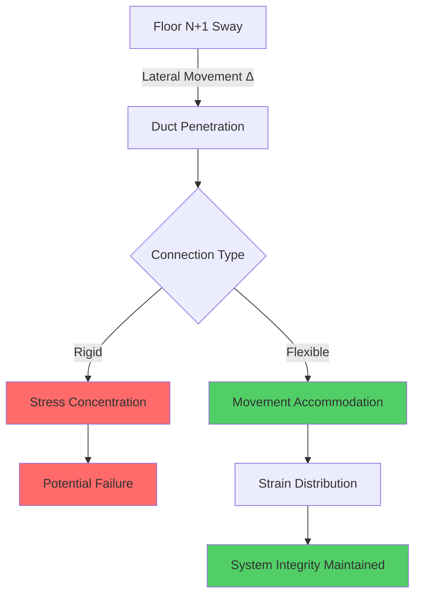
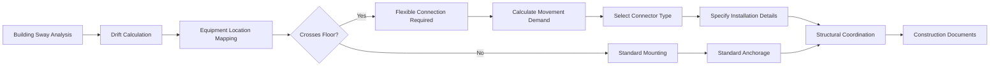

## Overview

Tall buildings experience lateral displacement from wind loads and seismic events, creating differential movement between floors (interstory drift) that HVAC systems must accommodate without failure. The physics of building sway imposes dynamic stresses on rigid piping, ductwork, and equipment connections, requiring engineered flexibility at strategic locations.

Building displacement at height follows cantilever beam deflection principles, with maximum sway occurring at the top floors. For a uniform building under lateral wind load, the displacement varies approximately as:

$$\delta(z) = \delta_{max} \left(\frac{z}{H}\right)^4$$

where $z$ is the height above grade, $H$ is the total building height, and $\delta_{max}$ is the maximum displacement at the roof. This creates varying interstory drift demands throughout the vertical distribution of HVAC systems.

## Interstory Drift and HVAC Design

Interstory drift represents the relative horizontal displacement between consecutive floors, typically expressed as drift ratio (displacement divided by story height). Building codes limit drift to prevent structural damage and maintain serviceability of building systems.

Typical drift limits and HVAC implications:

| Building Type | Drift Limit | HVAC Design Criteria |
|---------------|-------------|----------------------|
| Concrete frame | H/500 (0.2%) | Moderate flexibility required |
| Steel frame | H/400 (0.25%) | Enhanced flexible connections |
| Seismic zones | H/200 (0.5%) | Comprehensive seismic joints |
| Wind-governed tall | H/300-400 | Wind sway accommodations dominant |

For a 12 ft story height with H/400 drift limit, the design displacement is:

$$\Delta = \frac{12 \text{ ft}}{400} = 0.36 \text{ in}$$

HVAC systems crossing floor penetrations must accommodate at least this movement, typically multiplied by a safety factor of 1.5-2.0 to account for combined loads and installation tolerances.

## Flexible Connection Engineering

### Duct Flexible Connectors

Flexible duct connections accommodate movement through material deformation. The required connector length depends on the angular deflection capacity:

$$L_{min} = \frac{\Delta}{2 \sin(\theta_{max}/2)}$$

where $\Delta$ is the design drift displacement and $\theta_{max}$ is the maximum allowable angular deflection (typically 15-20° for fabric connectors).

For 0.5 inch drift with 15° deflection capacity:

$$L_{min} = \frac{0.5}{2 \sin(7.5°)} = 1.92 \text{ in}$$

Standard practice uses 6-12 inch flexible connectors to provide adequate movement capacity plus installation tolerance.

### Pipe Expansion Joints and Loops

Piping systems require expansion joints, flexible couplings, or expansion loops at floor penetrations. The selection depends on pipe size, pressure rating, and movement magnitude.

**Bellows-type expansion joints** absorb axial, lateral, and angular movement. The required bellows lateral deflection capacity:

$$\delta_{lateral} = \Delta \cdot SF$$

where $SF$ is a safety factor (typically 1.5-2.0).

**Expansion loops** provide flexibility through pipe bending compliance. The required loop leg length for lateral movement:

$$L = \sqrt{\frac{3 E I \Delta}{S_{allow} D}}$$

where:
- $E$ = modulus of elasticity (29×10⁶ psi for steel)
- $I$ = moment of inertia
- $\Delta$ = design displacement
- $S_{allow}$ = allowable stress
- $D$ = pipe outside diameter

## Equipment Mounting and Isolation

HVAC equipment mounted across multiple floors or connected to building structure must accommodate sway-induced movement. Equipment isolation serves dual purposes: vibration control and movement accommodation.

### Vibration Isolator Selection for Sway

Spring isolators provide both vibration isolation and lateral movement capacity. The lateral stability requirement:

$$H_{max} = \frac{W}{k_{lateral} \cdot \delta_{sway}}$$

where:
- $H_{max}$ = maximum isolator height
- $W$ = equipment weight
- $k_{lateral}$ = lateral spring stiffness
- $\delta_{sway}$ = building sway displacement

Restrained spring isolators with limit stops prevent excessive movement during seismic events while allowing operational sway accommodation.

| Isolator Type | Movement Capacity | Application |
|---------------|-------------------|-------------|
| Neoprene pads | ±0.25 in | Light equipment, low drift |
| Open spring | ±0.5-1.0 in | General equipment, moderate drift |
| Restrained spring | ±1.0-2.0 in | Heavy equipment, high drift/seismic |
| Seismic snubbers | ±2.0-4.0 in | Critical equipment, seismic zones |

### Equipment Anchorage Coordination

Equipment anchorage must transfer seismic forces to structure while permitting thermal expansion and building sway. The design process requires coordination between structural and HVAC engineers.

## Seismic vs. Wind Sway Considerations

Wind-induced sway is cyclic and relatively low amplitude, occurring continuously during building operation. Seismic movement is transient, high amplitude, and infrequent. Design must address both loading conditions.

**Wind sway characteristics:**
- Frequency: 0.1-0.3 Hz (building natural frequency)
- Amplitude: H/1000 to H/400 at top floors
- Duration: Continuous during wind events
- HVAC impact: Fatigue of connections, vibration transmission

**Seismic movement characteristics:**
- Frequency: 0.5-10 Hz (ground motion spectrum)
- Amplitude: H/200 to H/50 (code-level earthquake)
- Duration: 30-90 seconds strong motion
- HVAC impact: Ultimate strength of connections, pipe stress

Design approach combines wind serviceability (fatigue) with seismic ultimate strength requirements. Flexible connections sized for wind displacement typically have adequate ductility for seismic movement, but anchorage and bracing require separate seismic analysis per ASCE 7 Chapter 13.

## Installation Requirements

Proper installation of flexible connections is critical to achieving design performance:

1. **Orientation**: Install flexible connectors perpendicular to expected movement direction with adequate slack
2. **Support spacing**: Rigidly support piping/ductwork immediately adjacent to flexible connections (within 3-5 pipe diameters)
3. **Alignment**: Ensure zero preload condition during installation
4. **Clearance**: Provide adequate clearance at penetrations for full movement range without contact
5. **Identification**: Tag flexible connections for inspection and maintenance access

Movement accommodation failures typically result from installation errors rather than inadequate connector capacity. Construction administration should verify proper installation of all drift-accommodating components.

## Performance Verification

Post-construction verification methods:

- **Visual inspection**: Confirm proper orientation and clearances
- **Movement simulation**: Apply calculated drift displacement to verify clearance
- **Documentation**: Photograph as-built conditions of critical flexible connections
- **Maintenance planning**: Establish inspection intervals for flexible connector condition

Building monitoring systems in modern tall buildings can track actual sway displacement, allowing comparison with design assumptions and early detection of degraded flexible connections through anomalous vibration or noise.

---

**Related Topics:**
- Seismic bracing and restraint systems
- Thermal expansion accommodation
- Vibration isolation design for HVAC equipment
- Structural-HVAC coordination procedures
