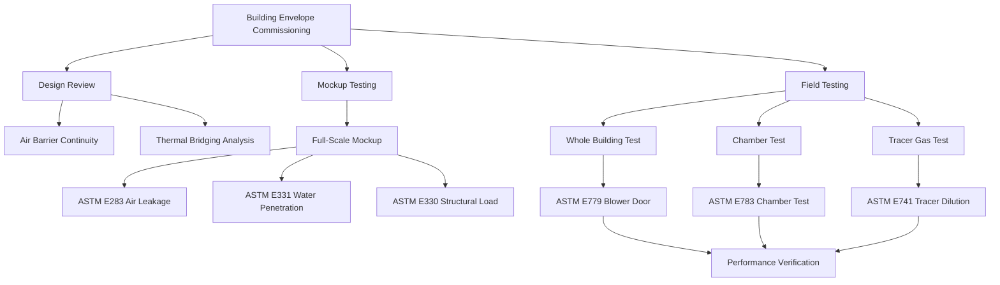

## Physical Mechanisms of Cladding Leakage

Air leakage through building cladding results from pressure differentials across the building envelope. In tall buildings, these pressure differentials arise from three primary mechanisms:

**Stack effect pressure:**
$$\Delta P_{stack} = \rho g h \left(\frac{1}{T_{outdoor}} - \frac{1}{T_{indoor}}\right)$$

where $\rho$ is air density (kg/m³), $g$ is gravitational acceleration (9.81 m/s²), $h$ is height above neutral pressure plane (m), and temperatures are in Kelvin.

**Wind pressure:**
$$\Delta P_{wind} = \frac{1}{2} \rho V^2 C_p$$

where $V$ is wind velocity (m/s) and $C_p$ is the pressure coefficient (dimensionless, ranging from -0.8 to +0.8 depending on facade orientation).

**Mechanical system pressure:** HVAC systems create internal pressurization or depressurization relative to outdoors, typically ranging from -5 Pa to +15 Pa in commercial buildings.

The combined pressure differential drives air leakage through cladding joints, gasket imperfections, and fabrication gaps. The volumetric flow rate through an orifice follows the power law relationship:

$$Q = C A (\Delta P)^n$$

where $Q$ is air flow rate (m³/s), $C$ is flow coefficient, $A$ is effective leakage area (m²), $\Delta P$ is pressure differential (Pa), and $n$ is flow exponent (typically 0.5-0.7 for turbulent flow, approaching 1.0 for laminar flow through long cracks).

## Curtain Wall Leakage Classification

ASTM E283 standardizes air leakage testing of exterior windows, curtain walls, and doors. The test measures leakage rate at a specified static pressure differential, typically 75 Pa or 300 Pa depending on building height and exposure.

### AAMA Leakage Classes

| Performance Grade | Test Pressure (Pa) | Maximum Leakage Rate (L/s·m²) | Application |
|-------------------|-------------------|-------------------------------|-------------|
| CW-PG25 | 300 | 0.30 | Low-rise, sheltered |
| CW-PG35 | 525 | 0.30 | Mid-rise, typical exposure |
| CW-PG45 | 675 | 0.30 | High-rise, moderate wind |
| CW-PG50 | 750 | 0.30 | High-rise, high wind |
| CW-PG70+ | 1050+ | 0.30 | Super tall, extreme exposure |

The leakage rate specification of 0.30 L/s·m² at test pressure represents air volume flow per unit area of wall surface. This value must be converted to actual operating conditions using pressure correction:

$$Q_{operating} = Q_{test} \left(\frac{\Delta P_{operating}}{\Delta P_{test}}\right)^n$$

For a curtain wall tested at 300 Pa with measured leakage of 0.25 L/s·m², the actual leakage at 50 Pa operating pressure (assuming $n = 0.65$) would be:

$$Q_{50Pa} = 0.25 \times \left(\frac{50}{300}\right)^{0.65} = 0.070 \text{ L/s·m}^2$$

## Impact on Heating and Cooling Loads

Infiltration heat loss or gain follows the sensible heat equation:

$$\dot{Q}_{sensible} = \dot{m} c_p (T_{outdoor} - T_{indoor}) = \rho Q c_p \Delta T$$

where $\dot{m}$ is mass flow rate (kg/s), $c_p$ is specific heat of air (1006 J/kg·K), and $Q$ is volumetric flow rate (m³/s).

Latent heat transfer from moisture infiltration:

$$\dot{Q}_{latent} = \rho Q h_{fg} (W_{outdoor} - W_{indoor})$$

where $h_{fg}$ is latent heat of vaporization (2,501,000 J/kg) and $W$ is humidity ratio (kg water/kg dry air).

### Load Calculation Example

Consider a 200 m tall office tower with 25,000 m² of curtain wall facade. Assuming average leakage of 0.08 L/s·m² under winter design conditions with 30 Pa average pressure differential:

Total infiltration rate:
$$Q_{total} = 0.08 \times 25,000 = 2,000 \text{ L/s} = 2.0 \text{ m}^3\text{/s} = 7,200 \text{ m}^3\text{/hr}$$

Winter heating load (outdoor -20°C, indoor 22°C):
$$\dot{Q}_{heating} = 1.2 \times 2.0 \times 1006 \times 42 = 101,000 \text{ W} = 101 \text{ kW}$$

At $0.10/kWh heating energy cost and 4,000 heating degree hours annually:
$$\text{Annual cost} = 101 \times 4,000 \times 0.10 = \$40,400$$

This calculation demonstrates that envelope leakage directly impacts mechanical system sizing and operating costs. A 50% reduction in leakage rate through improved cladding specifications would save approximately $20,000 annually in this example.

## Air Barrier Testing and Commissioning

### Field Testing Methods

**ASTM E779 Blower Door Testing** pressurizes or depressurizes entire building zones to 50-75 Pa while measuring air flow required to maintain pressure. Results quantify effective leakage area and air changes per hour at 50 Pa (ACH50).

**ASTM E783 Chamber Testing** applies a temporary chamber over installed curtain wall sections, creating controlled pressure differential while measuring leakage through the enclosed area. This method identifies localized leakage paths in actual installed conditions.

**ASTM E741 Tracer Gas Dilution** introduces sulfur hexafluoride (SF₆) or another tracer gas into building spaces, then measures concentration decay to determine air change rate under normal operating conditions.

### Acceptance Criteria

ASHRAE 90.1 establishes maximum air leakage rates for fenestration products:

- **Fixed windows:** 0.20 cfm/ft² at 75 Pa (1.0 L/s·m²)
- **Operable windows:** 0.30 cfm/ft² at 75 Pa (1.5 L/s·m²)
- **Curtain wall systems:** 0.06 cfm/ft² at 75 Pa (0.30 L/s·m²)

High-performance buildings targeting LEED certification or Passive House standards specify tighter envelopes:

- **LEED envelope:** < 0.25 cfm/ft² at 75 Pa
- **Passive House:** < 0.6 ACH at 50 Pa

The relationship between specific leakage rate and whole-building ACH50 depends on envelope area to volume ratio:

$$ACH_{50} = \frac{Q_{50} \times A_{envelope}}{V_{building}} \times 3600$$

where $Q_{50}$ is leakage rate per unit area (m³/s·m²), $A_{envelope}$ is total envelope area (m²), and $V_{building}$ is building volume (m³).

## Remediation Strategies

When field testing reveals excessive leakage, systematic investigation identifies dominant leakage paths:

1. **Perimeter joints:** Apply additional sealant at curtain wall mullion intersections
2. **Through-wall penetrations:** Seal mechanical, electrical, and plumbing penetrations with fire-rated sealant systems
3. **Slab edge gaps:** Inject expanding foam or mineral wool into gaps between floor slab edges and curtain wall backup
4. **Vision-spandrel transitions:** Install continuous gaskets at horizontal transitions
5. **Operable window weatherstripping:** Replace degraded compression seals

Thermal imaging during pressurization testing rapidly locates air leakage paths through temperature differential visualization. Cold air infiltration appears as dark regions on infrared images during winter testing.

## Components

- Curtain Wall Air Leakage
- Window Infiltration Rates
- Facade Leakage Testing
- Air Barrier Performance
- Water Penetration Air Leakage
- Differential Pressure Testing
- Building Envelope Commissioning
