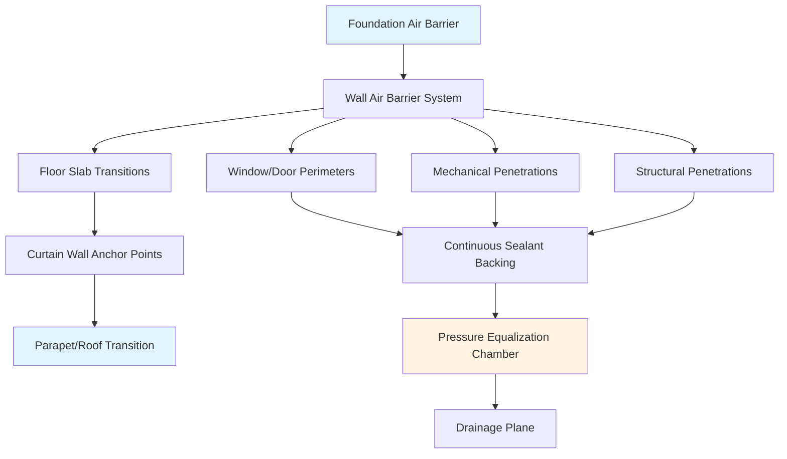
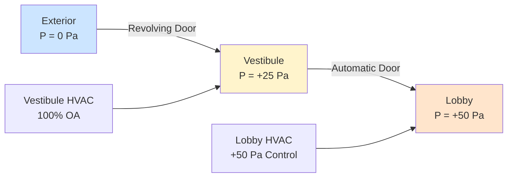

Weather sealing in tall buildings presents fundamentally different challenges than low-rise construction due to extreme pressure differentials created by stack effect and wind forces. A 200-meter building experiences pressure differences exceeding 200 Pa between interior and exterior surfaces, generating infiltration rates that can overwhelm HVAC systems if envelope continuity fails.

## Physical Mechanisms of Air Leakage

Air movement through building envelopes follows Bernoulli's principle combined with flow through orifices. The volumetric flow rate through envelope penetrations follows:

$$Q = C_d \cdot A \cdot \sqrt{\frac{2\Delta P}{\rho}}$$

Where:
- $Q$ = volumetric flow rate (m³/s)
- $C_d$ = discharge coefficient (0.6-0.7 for typical construction gaps)
- $A$ = effective leakage area (m²)
- $\Delta P$ = pressure differential across envelope (Pa)
- $\rho$ = air density (kg/m³)

The square root relationship demonstrates that doubling pressure differential increases infiltration by 41%, not 100%. However, in tall buildings, combined stack and wind pressures create multiplicative effects requiring robust sealing strategies.

Stack effect pressure at height $h$ in a building with interior-exterior temperature difference:

$$\Delta P_{stack} = \rho_o g h \left(1 - \frac{T_o}{T_i}\right)$$

For a 60-story building (210 m) at -20°C exterior and 21°C interior, stack pressure reaches 245 Pa at the top, equivalent to 1 inch water column—sufficient to force airflow through any discontinuity.

## Air Barrier System Integration

Effective weather sealing requires continuous air barrier from foundation to roof with pressure-equalized design at critical transitions.

### Air Barrier Material Selection

| Material Type | Air Permeance (L/s·m² @ 75 Pa) | Temperature Range | UV Resistance | Service Life |
|---------------|--------------------------------|-------------------|---------------|--------------|
| Self-Adhered Membrane | <0.02 | -40°C to 90°C | Requires protection | 25+ years |
| Fluid-Applied Membrane | <0.02 | -30°C to 80°C | Good | 20-30 years |
| Mechanically Fastened | <0.02 | -50°C to 100°C | Excellent | 30+ years |
| Spray Polyurethane Foam | <0.02 | -40°C to 110°C | Requires coating | 20-25 years |

ASTM E2357 requires air barrier assemblies achieve ≤0.2 L/s·m² at 75 Pa pressure differential. In tall buildings, design for testing at 300 Pa minimum to account for actual operating conditions.

## Curtain Wall Weather Sealing

Curtain wall systems dominate tall building envelopes and require pressure-equalized rainscreen design with four distinct control layers.

### Pressure Equalization Principle

Pressure equalization eliminates driving force for water penetration by balancing pressure across the outer seal:

$$\Delta P_{water} = \Delta P_{exterior} - \Delta P_{chamber}$$

When $\Delta P_{chamber} \approx \Delta P_{exterior}$, water penetration force approaches zero. Chamber volume must be sufficient to respond to wind gusts within 1-2 seconds:

$$V_{chamber} = \frac{Q_{leak} \cdot t_{response}}{\Delta P_{max} / (R \cdot T)}$$

Typical curtain wall pressure equalization chambers: 25-50 mm depth with compartmentalization every 1.5 m vertically and at each mullion horizontally.

### Sealant Joint Design

Structural sealant joints accommodate differential thermal movement while maintaining air and water seal. Joint width-to-depth ratio critically affects performance:

$$\epsilon_{sealant} = \frac{\Delta L}{W_{joint}}$$

Where $\epsilon_{sealant}$ = strain, $\Delta L$ = thermal movement, $W_{joint}$ = joint width.

Silicone sealants accommodate ±50% movement at optimal 2:1 width-to-depth ratio. Deviation to 1:1 reduces movement capacity to ±25% due to constrained stress distribution.

Thermal movement calculation for aluminum curtain wall:

$$\Delta L = \alpha \cdot L \cdot \Delta T$$

For $\alpha_{aluminum}$ = 23 × 10⁻⁶ /°C, 3.6 m panel, 80°C temperature swing: $\Delta L$ = 6.6 mm, requiring 13 mm minimum joint width with 2:1 ratio.

## Entrance Systems and Vestibule Design

Building entrances create the largest envelope discontinuity, requiring specialized pressure control.

### Revolving Door Performance

Revolving doors provide superior air leakage control compared to sliding or swinging doors:

| Door Type | Air Leakage Rate (m³/s @ 75 Pa) | Effective in Stack Effect | Traffic Capacity (persons/hr) |
|-----------|----------------------------------|----------------------------|-------------------------------|
| Revolving Door | 0.5-1.5 | Excellent | 1000-2000 |
| Sliding Door (pair) | 3.0-6.0 | Poor | 2000-3000 |
| Swinging Door (pair) | 4.0-8.0 | Very Poor | 1500-2500 |
| Swing + Vestibule | 1.5-3.0 | Good | 1500-2500 |

Revolving doors maintain near-constant building pressure during operation because door wings create progressive seal. Effective leakage area during rotation:

$$A_{eff} = A_{gap} \cdot \frac{\theta_{open}}{360°}$$

At 90° wing spacing, only 25% of perimeter gap exposes interior to exterior simultaneously.

### Vestibule Pressure Control

Vestibule design creates pressure buffer between exterior and conditioned space. Required vestibule pressurization:

$$P_{vestibule} = P_{interior} + \frac{\Delta P_{stack} + \Delta P_{wind}}{2}$$

Maintain vestibule at intermediate pressure reduces infiltration by 60-75% compared to single entrance. Dedicated vestibule HVAC system supplies 15-25 air changes per hour with 100% outdoor air during occupied hours.

## Elevator Shaft Sealing Strategy

Elevator shafts function as vertical chimneys amplifying stack effect. Uncontrolled shafts generate 1.5-2.0 times building height stack pressure due to reduced friction.

### Shaft Compartmentalization

Code-compliant fire/smoke barriers provide air sealing benefit when integrated with continuous gaskets:

- Lobby separation barriers every 10-15 floors
- Elevator machine room separation
- Transfer floor isolation
- Parking level separation

Compartmentalization reduces effective stack height. For three-segment shaft:

$$\Delta P_{total} = \Delta P_{segment1} + \Delta P_{segment2} + \Delta P_{segment3}$$

But $\Delta P_{segment} < \Delta P_{unified}$ because temperature stratification reduces per-segment driving force.

### Door and Penetration Sealing

Elevator door frames require continuous gasket systems achieving 0.5 L/s·m @ 75 Pa per ASTM E283. Critical sealing points:

- Sill gap: maximum 6 mm, continuous silicone seal
- Jamb perimeter: compressible gasket, 25% compression at closure
- Top closure: adjustable strike with minimum 8 mm engagement
- Vision panel perimeter: structural sealant with backing rod

Shaft wall penetrations for mechanical/electrical systems require fire-rated seal achieving equivalent air leakage performance. Cast-in sleeves with intumescent/elastomeric combination seals provide optimal solution.

## Performance Verification

ASTM E779 whole-building pressurization testing quantifies envelope performance. Target performance for tall buildings:

$$q_{75} \leq 2.0 \text{ L/s·m}^2$$

Where $q_{75}$ = air leakage rate normalized to envelope area at 75 Pa.

Infrared thermography during pressurization identifies thermal bridging and air leakage paths at transitions. Schedule verification testing:

1. Mockup testing at 1.5× design pressure
2. Construction phase testing of each system
3. Substantial completion whole-building test
4. Post-occupancy verification after first heating season

Weather sealing directly impacts HVAC energy consumption. Reducing envelope leakage from 4.0 to 2.0 L/s·m² at 75 Pa decreases heating load 15-25% and improves space pressurization control, enabling smaller HVAC equipment and reducing operational costs throughout building life.

## References to Standards

- ASTM E2357: Standard Test Method for Air Leakage of Building Envelope Assemblies
- ASTM E283: Test Method for Determining Rate of Air Leakage Through Exterior Windows, Skylights, and Doors
- ASTM E779: Standard Test Method for Determining Air Leakage Rate by Fan Pressurization
- AAMA 501: Methods of Test for Exterior Walls
- ASHRAE Handbook—Fundamentals, Chapter 16: Ventilation and Infiltration
