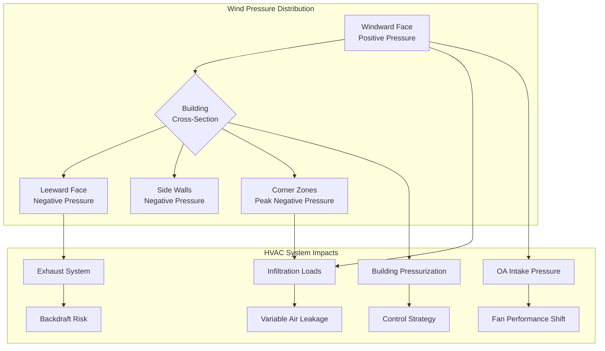
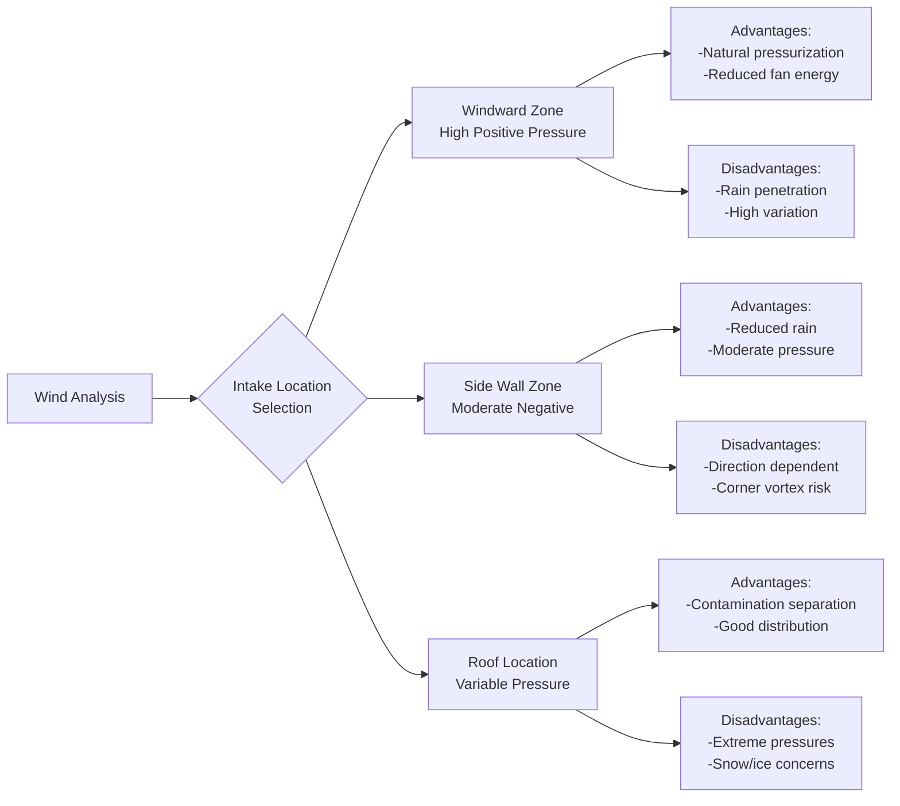

## Overview

Wind pressure creates significant challenges for HVAC systems in tall buildings by inducing dynamic pressure differentials across the building envelope. These pressure variations drive infiltration, affect ventilation system performance, and complicate outdoor air intake design. The pressure distribution around a building depends on wind speed, wind direction, building geometry, and surrounding terrain.

## Fundamental Wind Pressure Relationships

Wind velocity pressure at height $z$ above ground is calculated using the fundamental relationship:

$$q_z = 0.00256 \cdot K_z \cdot K_{zt} \cdot K_d \cdot V^2$$

Where:
- $q_z$ = velocity pressure at height $z$ (psf)
- $K_z$ = velocity pressure exposure coefficient (height and terrain dependent)
- $K_{zt}$ = topographic factor
- $K_d$ = wind directionality factor
- $V$ = basic wind speed (mph)

The velocity pressure exposure coefficient increases with height according to ASCE 7 terrain categories, reflecting the boundary layer wind profile.

## Pressure Coefficient Distributions

The wind-induced pressure on building surfaces is expressed as:

$$p = q_z \cdot G \cdot C_p$$

Where:
- $p$ = design wind pressure (psf)
- $G$ = gust effect factor
- $C_p$ = external pressure coefficient (dimensionless)

### Windward vs Leeward Pressure Characteristics

The pressure coefficient $C_p$ varies dramatically around the building perimeter:

| Surface Location | Typical $C_p$ Range | Pressure Type | HVAC Impact |
|------------------|---------------------|---------------|-------------|
| Windward face (center) | +0.6 to +0.8 | Positive (compression) | Infiltration driver, intake pressurization |
| Leeward face (center) | -0.3 to -0.5 | Negative (suction) | Exfiltration driver, exhaust assistance |
| Side walls (parallel to wind) | -0.5 to -0.7 | Negative (suction) | Cross-flow infiltration |
| Building corners | -0.8 to -1.2 | Strong negative (vortex) | Maximum infiltration potential |
| Roof edges | -1.0 to -1.8 | Extreme negative | Exhaust termination concerns |

The windward face experiences positive pressure (stagnation pressure), while leeward and side surfaces experience negative pressure from flow separation and wake formation. Corner vortices create the most severe negative pressures.

## Combined Wind and Stack Effect

In tall buildings, wind pressure interacts with stack effect to create complex pressure distributions:

$$\Delta p_{total} = \Delta p_{stack} + \Delta p_{wind}$$

Where stack effect pressure is:

$$\Delta p_{stack} = C_s \cdot h \cdot \left(\frac{1}{T_o} - \frac{1}{T_i}\right)$$

With:
- $C_s$ = 7.64 \text{ (psf·ft·°R)}$ for standard air density
- $h$ = height above neutral pressure level (ft)
- $T_o$, $T_i$ = absolute outdoor and indoor temperatures (°R)

The neutral pressure level shifts vertically with wind direction and speed. On the windward side, the neutral level moves upward; on the leeward side, it moves downward.

## Impact on Infiltration

Wind-driven infiltration through building envelope leakage is calculated using:

$$Q_{inf} = C \cdot A \cdot (\Delta p)^n$$

Where:
- $Q_{inf}$ = infiltration airflow (cfm)
- $C$ = flow coefficient (dependent on opening type)
- $A$ = leakage area (in²)
- $\Delta p$ = pressure differential (in. w.g.)
- $n$ = flow exponent (0.6-0.7 for typical openings)

For a high-rise building with 0.4 cfm/ft² envelope leakage at 0.3 in. w.g., wind pressure variations from 0.1 to 0.6 in. w.g. can change infiltration rates by a factor of 2-3, significantly impacting heating and cooling loads.

## Outdoor Air Intake Design Considerations

Wind pressure effects create critical challenges for outdoor air intake systems:

### Intake Location Strategy

### Pressure Equalization Requirements

ASHRAE Standard 62.1 requires outdoor air intake systems to accommodate pressure variations. Design strategies include:

1. **Multiple intake locations** with automatic damper control to select optimal intake based on wind direction
2. **Pressure-independent flow control** using calibrated airflow measurement and modulating dampers
3. **Plenum pressurization** to buffer short-term pressure fluctuations
4. **Fan speed modulation** to maintain constant outdoor airflow despite varying static pressure

### Fan Performance Compensation

Wind pressure effects shift fan operating points on the performance curve:

$$\Delta SP_{total} = \Delta SP_{system} \pm p_{wind}$$

For a supply fan with design static pressure of 4 in. w.g., a windward intake experiencing +0.3 in. w.g. wind pressure effectively reduces system resistance, increasing airflow and potentially causing noise and control issues. A leeward intake at -0.3 in. w.g. increases effective resistance, reducing airflow below design.

Variable frequency drives (VFDs) with airflow tracking control compensate for these variations by modulating fan speed to maintain constant volumetric flow.

## Design Wind Speed with Height

ASCE 7 specifies that design wind speed increases with height according to the power law profile:

$$V_z = V_{\text{ref}} \cdot \left(\frac{z}{z_{\text{ref}}}\right)^\alpha$$

Where $\alpha$ ranges from 0.14 (open terrain) to 0.33 (urban environments). For a 600-ft tall building in urban terrain, wind speed at the roof can be 1.8-2.2 times the wind speed at 30 ft elevation, producing velocity pressures 3-5 times greater.

## Wind Tunnel Testing and CFD Analysis

For buildings exceeding 400 ft in height or with unusual geometries, ASCE 7 permits wind tunnel testing to establish site-specific pressure coefficients. Computational Fluid Dynamics (CFD) analysis provides detailed pressure distributions for:

- Outdoor air intake optimization
- Exhaust dispersion analysis
- Pedestrian-level wind assessment
- Cladding pressure design

Wind tunnel or CFD results typically reveal pressure coefficients 20-40% different from code values for complex geometries, significantly impacting HVAC design.

## Practical Design Recommendations

**Infiltration Control:**
- Design envelope tightness to 0.25-0.30 cfm/ft² at 0.3 in. w.g. for occupied spaces
- Implement compartmentalization with floor-by-floor pressure control
- Use vestibules at main entrances to reduce transient infiltration

**Outdoor Air Intake Design:**
- Position intakes away from corner vortex zones (minimum 0.1 × building width from corners)
- Provide redundant intake locations with automatic selection capability
- Design for pressure variation range of ±0.5 in. w.g. minimum
- Install intake velocity limiters to prevent excessive airflow during high wind events

**System Pressurization:**
- Maintain building pressurization of +0.03 to +0.05 in. w.g. relative to outdoors
- Implement real-time pressure monitoring with automatic adjustment
- Coordinate pressurization strategy with smoke control requirements per NFPA 92

## References

- ASCE 7: Minimum Design Loads for Buildings and Other Structures
- ASHRAE Fundamentals Handbook, Chapter 24: Airflow Around Buildings
- ASHRAE Standard 62.1: Ventilation for Acceptable Indoor Air Quality
