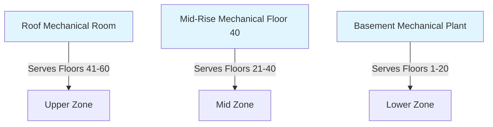
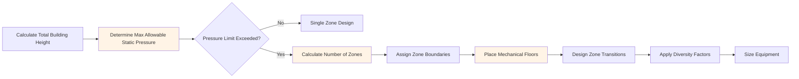

Vertical zoning divides tall buildings into discrete HVAC zones stacked vertically to manage static pressure limitations, accommodate different tenant requirements, and optimize system performance. Unlike horizontal zoning that segregates floor areas, vertical zoning addresses the unique challenges created by elevation differences in high-rise construction.

## Physical Basis for Vertical Zoning

The fundamental driver for vertical zoning is **hydrostatic pressure variation** with elevation. Water column pressure increases linearly with depth according to:

$$P = \rho g h$$

where $\rho$ is fluid density (kg/m³), $g$ is gravitational acceleration (9.81 m/s²), and $h$ is vertical height (m).

For chilled water systems, each 10 m (33 ft) of elevation creates approximately 10 kPa (1.4 psi) of static pressure. A 300 m tall building generates 300 kPa (43.5 psi) of hydrostatic pressure differential between the lowest and highest floors. This pressure exceeds the structural capacity of standard hydronic components, making vertical zoning a physical necessity rather than a design preference.

## Primary Drivers for Vertical Zoning

### Static Pressure Limitations

**Chilled water systems** typically limit zone heights to 150-200 m (490-660 ft) based on:
- Pipe pressure ratings (ANSI B16.5 standard flanges: 2.0-2.8 MPa)
- Valve body construction limits
- Coil header and connection integrity
- Pump seal capabilities

**Condenser water systems** face similar constraints but may use higher-rated components given the simpler loop configuration.

**Refrigerant systems** experience pressure changes from both elevation and temperature. The pressure difference for a vertical refrigerant riser follows:

$$\Delta P = \frac{\rho_L - \rho_V}{2} g h$$

where $\rho_L$ and $\rho_V$ represent liquid and vapor densities. Oil return becomes problematic above 30-40 m (100-130 ft) for direct expansion systems, limiting their applicability in high-rise applications.

### Load Diversity and Demand Factors

Vertical zoning allows application of different demand factors to each zone. ASHRAE Handbook—HVAC Applications recommends diversity factors based on building height and occupancy patterns:

| Building Section | Typical Diversity Factor | Justification |
|-----------------|-------------------------|---------------|
| Lower zone (0-20 floors) | 0.85-0.90 | High occupancy correlation |
| Mid zone (20-40 floors) | 0.75-0.85 | Moderate diversity |
| Upper zone (40+ floors) | 0.70-0.80 | Greater occupancy variation |

The diversity factor accounts for the statistical improbability that all spaces reach peak load simultaneously. For a building with $N$ zones, the total connected load $Q_{total}$ relates to individual zone loads $Q_i$ through:

$$Q_{total} = \sum_{i=1}^{N} (D_i \cdot Q_i)$$

where $D_i$ is the diversity factor for zone $i$.

### Tenant Type and Operational Requirements

Different building sections often serve different functions. A mixed-use tower might feature retail (floors 1-3), office space (floors 4-40), and residential units (floors 41-60). Each use type demands distinct:
- Operating schedules and setback strategies
- Ventilation rates (ASHRAE 62.1 varies by occupancy category)
- Temperature and humidity setpoints
- Control granularity and override capabilities

Vertical zoning at use-type boundaries prevents operational conflicts and allows independent scheduling.

## Typical Zone Height Configurations

Standard vertical zone heights depend on system type and design pressures:

**All-water systems (fan coils, radiant):** 15-25 floors per zone
**Air-water systems (induction units):** 12-20 floors per zone
**All-air systems (VAV):** 20-30 floors per zone (limited by duct friction rather than hydrostatic pressure)

A 60-story office tower typically employs three vertical zones:
- **Lower zone:** Floors 1-20 (served from basement mechanical plant)
- **Mid zone:** Floors 21-40 (served from mid-rise mechanical floor)
- **Upper zone:** Floors 41-60 (served from upper mechanical floor or roof plant)

## Mechanical Floor Placement

Mechanical floors house central equipment for each vertical zone. Strategic placement minimizes distribution losses and structural impacts:

### Placement Criteria

**Structural considerations:** Mechanical floors require enhanced floor loading (typically 7.2-9.6 kPa vs. 2.4-4.8 kPa for office floors). Locating them at structural transfer floors or over building cores optimizes column arrangements.

**Distribution efficiency:** Centralizing mechanical floors within their served zones minimizes pumping energy. For a zone serving floors $n_1$ to $n_2$, optimal mechanical floor placement is approximately:

$$n_{mech} \approx \frac{n_1 + n_2}{2}$$

This minimizes average distribution distance and associated pressure drops.

**Acoustic isolation:** Mechanical floors should avoid adjacency to noise-sensitive spaces (executive offices, residential units). Locating them above retail or parking levels provides acoustic buffering.

## Zone Transition Strategies

Transitioning between vertical zones requires managing pressure and temperature differentials while maintaining system integrity.

### Pressure Reducing Stations

Where zones overlap or share risers, pressure reducing valves (PRVs) protect lower-pressure zones from upper-zone static pressure. PRV stations typically include:
- Pressure reducing valve with 2:1 to 4:1 turndown
- Strainer upstream (40-60 mesh)
- Pressure gauges both sides
- Bypass with isolation valves for maintenance
- Pressure relief valve downstream set 10-15% above desired pressure

### Heat Exchanger Isolation

For maximum hydraulic separation, plate-and-frame heat exchangers isolate vertical zones completely. This approach:
- Eliminates static pressure transmission between zones
- Allows different water chemistries or glycol concentrations per zone
- Increases first cost but simplifies pressure management
- Introduces approach temperature penalty (typically 1-2°C)

The heat transfer effectiveness $\epsilon$ for a counterflow heat exchanger is:

$$\epsilon = \frac{1 - e^{-NTU(1-C_r)}}{1 - C_r e^{-NTU(1-C_r)}}$$

where $NTU$ is the number of transfer units and $C_r$ is the heat capacity ratio. For vertical zone transitions, targeting $\epsilon \geq 0.85$ minimizes approach penalty.

### Piping Arrangement at Transitions

Two-pipe and four-pipe systems require careful detailing at zone boundaries. ASHRAE Standard 90.1 requires isolation valves at zone transitions to allow independent operation and maintenance. Risers typically feature:
- Motorized isolation valves at each zone
- Pressure gauges and thermowells for diagnostics
- Seismic bracing at mechanical floor penetrations
- Expansion loops or flexible connectors to accommodate thermal movement

## Design Process for Vertical Zoning

The design sequence ensures physical constraints drive zoning decisions before optimization for cost or efficiency occurs.

## Operational Advantages

Beyond addressing physical limitations, vertical zoning provides operational benefits:
- **Maintenance isolation:** Taking one zone offline for maintenance leaves other zones operational
- **Phased commissioning:** Zones can be commissioned and occupied sequentially as construction completes
- **Capacity staging:** Smaller equipment per zone allows multiple units for redundancy and staging
- **Energy optimization:** Independent zone control enables setback during low-occupancy periods

Vertical zoning transforms the physical challenge of tall building HVAC into an opportunity for enhanced operational flexibility and system resilience.
