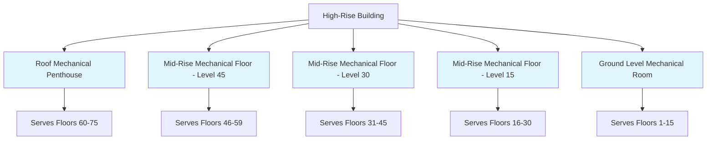
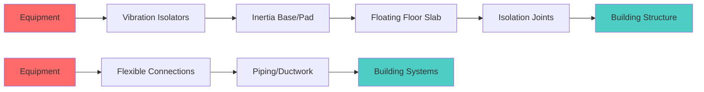

High-rise buildings require strategic placement of mechanical equipment rooms to serve vertical zones efficiently while addressing structural, acoustic, and operational constraints. The distribution and design of these spaces fundamentally determines system performance, energy efficiency, and maintenance accessibility.

## Sky Lobbies and Mechanical Floor Strategy

Mechanical floors typically occur at intervals of 15 to 30 stories in modern high-rise construction. This spacing balances hydraulic limitations, electrical distribution efficiency, and structural considerations. The sky lobby concept integrates mechanical equipment rooms with elevator transfer floors, optimizing building core utilization.

The vertical pressure differential drives mechanical floor frequency. For water systems, static pressure limits dictate maximum vertical spans:

$$P_{static} = \rho g h$$

where $\rho$ = water density (1000 kg/m³), $g$ = gravitational acceleration (9.81 m/s²), and $h$ = vertical height.

A 20-story zone (approximately 80 m) generates 785 kPa (114 psi) static pressure. Standard components rated to 1034 kPa (150 psi) provide adequate safety margin. Beyond this threshold, intermediate mechanical floors become necessary to prevent equipment failure and excessive energy consumption from over-pressurization.

## Equipment Room Sizing Methodology

Equipment room dimensions derive from thermal load calculations, equipment selection, and clearance requirements per ASHRAE Standard 15 and manufacturer specifications. The fundamental space allocation follows:

$$A_{room} = A_{equip} + A_{maint} + A_{circ}$$

where $A_{room}$ = total room area, $A_{equip}$ = equipment footprint, $A_{maint}$ = maintenance clearances, $A_{circ}$ = circulation pathways.

ASHRAE Guideline 36 recommends minimum clearances:
- Front access: 1.2 m (4 ft) minimum
- Rear access: 0.9 m (3 ft) minimum
- Side clearances: 0.6 m (2 ft) minimum
- Overhead clearance: 2.4 m (8 ft) minimum

| Equipment Type | Space Factor | Ceiling Height |
|----------------|--------------|----------------|
| Air Handling Units | 2.5× footprint | 3.6-4.5 m |
| Chillers (water-cooled) | 3.0× footprint | 4.0-5.0 m |
| Boilers | 2.5× footprint | 3.6-4.5 m |
| Pumps and Distribution | 2.0× footprint | 3.0-3.6 m |
| Electrical/Controls | 1.5× footprint | 3.0 m |

Vertical shaft penetrations for piping and ductwork consume additional floor area. Allocate 2-4% of mechanical floor area for shaft penetrations, varying with building height and system complexity.

## Structural Loading Considerations

Mechanical equipment imposes concentrated loads significantly exceeding typical office floor loading (2.4-4.8 kPa). Structural coordination during design prevents costly reinforcement during construction.

Dead loads include equipment weight, concrete housekeeping pads, piping systems filled with water, and architectural finishes. Operating loads add water mass in circulation systems. The combined loading equation:

$$L_{total} = L_{equip} + L_{fluid} + L_{struct} + L_{dynamic}$$

Typical mechanical floor loading ranges from 7.2 to 12.0 kPa (150-250 psf), with concentrated loads at equipment locations reaching 15-25 kPa. Chillers and air handling units create the highest point loads.

| Equipment | Unit Weight (kN) | Filled Weight (kN) | Floor Loading (kPa) |
|-----------|------------------|--------------------|--------------------|
| 500-ton Chiller | 45-55 | 65-80 | 18-22 |
| Large AHU (50,000 CFM) | 25-35 | 30-40 | 12-16 |
| Cooling Tower | 30-40 | 50-70 | 15-20 |
| Boiler (5 MMBH) | 20-30 | 25-35 | 10-14 |

Vibration isolation systems add complexity. Spring isolators require structural flexibility, while inertia bases increase dead loads but improve isolation efficiency. The natural frequency relationship governs isolation effectiveness:

$$f_n = \frac{1}{2\pi}\sqrt{\frac{k}{m}}$$

where $f_n$ = natural frequency, $k$ = spring constant, $m$ = combined mass of equipment and inertia base.

## Noise and Vibration Isolation

Sound transmission from mechanical equipment rooms requires multi-layer control addressing airborne and structure-borne paths. ASHRAE applications specify NC-35 to NC-40 criteria for adjacent occupied spaces.

Airborne isolation utilizes massive construction (200-300 mm concrete) combined with resilient mounting. The mass law governs transmission loss:

$$TL = 20\log_{10}(m \cdot f) - 42$$

where $TL$ = transmission loss (dB), $m$ = surface density (kg/m²), $f$ = frequency (Hz).

Structure-borne vibration control requires complete mechanical isolation:
1. Equipment mounted on vibration isolators (spring or neoprene)
2. Piping with flexible connections within 3× equipment dimensions
3. Ductwork with flexible canvas connections
4. Electrical conduit with flexible fittings
5. Floating floor slabs for critical applications

## Access and Maintenance Requirements

Equipment room layout must accommodate removal and replacement of major components. The critical path analysis identifies the largest equipment piece and required extraction route.

Access requirements per IMC Section 306:
- Doorway minimum width: equipment width + 0.3 m
- Corridor width: 1.2 m minimum, 1.8 m preferred
- Floor-to-ceiling clearance: tallest equipment + 0.6 m
- Rigging points: rated to 2× heaviest component

Freight elevator access to mechanical floors eliminates rigging operations through building facades. Where elevators cannot reach mechanical floors, permanent roof hatches (2.4 m × 2.4 m minimum) permit crane access.

## Equipment Room Ventilation

Mechanical equipment rooms require ventilation for heat rejection, combustion air (if applicable), and occupant safety during maintenance. Heat gain from equipment inefficiency drives ventilation loads:

$$Q_{vent} = \frac{P_{loss}}{\rho c_p \Delta T}$$

where $Q_{vent}$ = required ventilation rate (m³/s), $P_{loss}$ = equipment heat loss (W), $\Delta T$ = allowable temperature rise (typically 5-8°C).

Electric motor inefficiency, pump friction, and transformer losses create substantial heat gains. A 200 kW chiller plant may reject 8-12 kW to the equipment room. Without adequate ventilation, ambient temperatures exceed acceptable limits (40°C maximum per ASHRAE Standard 15).

Combustion equipment requires dedicated outdoor air per IMC Section 701: 50 cfm per 1000 BTU/hr input above 1 million BTU/hr, with minimum requirements below this threshold.

## Conclusion

Equipment room design for high-rise vertical zones integrates thermal engineering, structural analysis, acoustic control, and operational planning. Proper sizing, strategic placement, adequate structural support, and effective isolation create reliable, maintainable mechanical systems serving tall buildings efficiently throughout their operational life.
