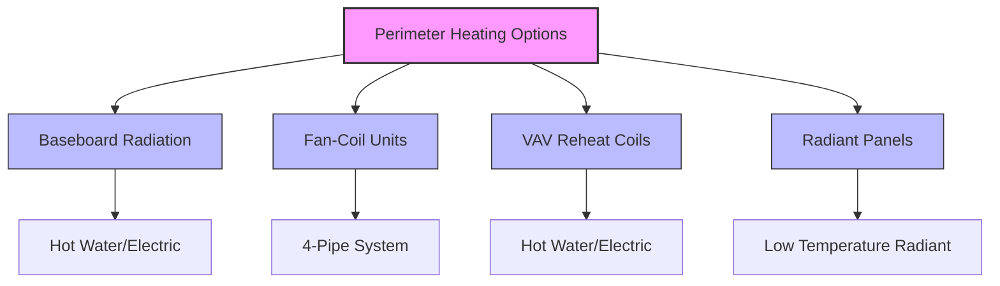

## Physical Basis of Perimeter and Core Zoning

Tall building HVAC design relies on fundamental heat transfer differences between envelope-dominated perimeter zones and internally-loaded core spaces. The perimeter zone experiences transient thermal loads driven by solar radiation, outdoor temperature fluctuations, and wind effects, while the core zone maintains relatively constant cooling loads from occupants, lighting, and equipment. This divergence in thermal behavior necessitates separate zoning strategies.

The standard perimeter zone depth of 12-15 feet (3.7-4.6 m) derives from the effective penetration distance of daylight and the thermal influence sphere of the building envelope. Beyond this depth, internal loads dominate the heat balance, creating distinctly different HVAC requirements.

## Perimeter Zone Thermal Characteristics

### Solar Load Variability

Solar radiation through glazing creates time-varying heating loads that depend on orientation, facade design, and shading. The instantaneous solar heat gain through fenestration is:

$$Q_{solar} = A_{glass} \times SHGC \times I_{incident} \times \cos(\theta)$$

Where $A_{glass}$ is the glazing area (ft²), $SHGC$ is the solar heat gain coefficient (dimensionless), $I_{incident}$ is the incident solar radiation (Btu/hr·ft²), and $\theta$ is the angle of incidence.

Peak solar loads vary dramatically by orientation:

| Orientation | Peak Solar Gain (Btu/hr·ft²) | Time of Peak | Design Consideration |
|-------------|------------------------------|--------------|---------------------|
| South | 140-160 | Winter noon | Year-round variability |
| East | 180-200 | Summer morning | Morning cooling spike |
| West | 180-200 | Summer afternoon | Afternoon peak concern |
| North | 40-60 | Diffuse only | Minimal solar impact |

This orientation-dependent variability requires separate perimeter zones for each facade exposure. ASHRAE Standard 90.1 Section 6.5.1 mandates separate thermostat control for spaces facing different cardinal directions when floor area exceeds specified thresholds.

### Conductive Heat Transfer

The perimeter zone experiences conductive heat transfer through the building envelope:

$$Q_{cond} = U \times A \times (T_{outdoor} - T_{indoor})$$

Where $U$ is the overall heat transfer coefficient (Btu/hr·ft²·°F), $A$ is the envelope area (ft²), and temperatures are in °F. This load component reverses seasonally and varies with outdoor conditions, creating heating requirements during cold weather that the core zone never experiences.

## Core Zone Thermal Characteristics

### Internal Load Dominance

Core zones maintain cooling loads year-round due to consistent internal heat generation. The total sensible cooling load for a typical core zone:

$$Q_{core} = Q_{lights} + Q_{equipment} + Q_{occupants,sensible}$$

Typical core zone load densities:

- **Lighting**: 0.8-1.2 W/ft² (modern LED systems)
- **Equipment**: 1.5-3.0 W/ft² (computers, servers, appliances)
- **Occupants**: 250-450 Btu/hr per person (sensible heat)
- **Total**: 15-25 Btu/hr·ft² cooling load

The core zone cooling load remains relatively constant regardless of outdoor conditions, operating hours, or season. This stability contrasts sharply with perimeter zone load swings of 40-60 Btu/hr·ft² between summer and winter conditions.

### Ventilation Air Heating Potential

While core zones require continuous cooling, the ventilation air serving these spaces can be used strategically. During cold weather, outdoor air at 0-20°F can be tempered to 55-60°F and supplied directly to core zones, reducing mechanical cooling energy. This "free cooling" from ventilation air provides:

$$Q_{ventilation,cooling} = \dot{m}_{air} \times c_p \times (T_{zone} - T_{OA,tempered})$$

For a 10,000 ft² core zone at 0.8 cfm/ft² ventilation rate with outdoor air at 10°F, tempering to 55°F provides approximately 85,000 Btu/hr of cooling to the 75°F zone.

## Perimeter Zone System Strategies

### Separate Heating Systems

Perimeter zones require dedicated heating capacity to counteract envelope losses. Common approaches:

The selection depends on facade integration constraints, first cost, and operating efficiency targets. Four-pipe fan-coil systems provide simultaneous heating and cooling capability, critical for transitional seasons when south-facing zones require cooling while north-facing zones need heat.

### Orientation-Based Zone Division

Proper perimeter zoning divides the building envelope into orientation-specific zones. For a rectangular floor plate:

1. **North Zone**: Minimal solar gain, heating-dominated in winter, modest cooling in summer
2. **East Zone**: Morning solar spike, cooling required by mid-morning even in winter
3. **South Zone**: Maximum winter solar gain (passive heating benefit), moderate summer loads with proper shading
4. **West Zone**: Afternoon solar spike, highest summer cooling loads, potential glare issues

Corner zones experience combined orientations and warrant separate consideration when space planning permits. A corner zone's effective solar heat gain coefficient increases by 30-40% compared to single-orientation zones due to dual-facade exposure.

## Facade Integration Considerations

### Active Chilled Beams in Perimeter Zones

Modern high-rise construction increasingly integrates HVAC delivery with facade systems. Active chilled beams installed at the perimeter provide:

- **Heating**: Hot water coils counteract envelope losses
- **Cooling**: Chilled water coils remove solar and envelope gains
- **Ventilation**: Ducted primary air induces room air across coils

The convective heat transfer from perimeter beams:

$$Q_{beam} = \dot{m}_{induced} \times c_p \times (T_{return} - T_{supply})$$

Where induced airflow typically ranges from 3-5 times the primary air quantity. This induction effect creates effective mixing and temperature control at the building envelope.

### Underfloor Air Distribution

Underfloor air distribution (UFAD) systems in perimeter zones supply conditioned air through floor diffusers near the facade. The stratified temperature profile in UFAD systems creates:

- **Lower zone** (0-6 ft): Occupied zone with direct temperature control
- **Upper zone** (6+ ft): Return air plenum with elevated temperatures

Perimeter UFAD diffusers must deliver higher airflow rates than core diffusers to counteract envelope loads. The perimeter-to-core airflow ratio typically ranges from 1.5:1 to 2.5:1 depending on facade performance.

## System Comparison for Mixed Zones

| System Type | Perimeter Heating | Core Cooling | Simultaneous Heating/Cooling | First Cost | Efficiency |
|-------------|-------------------|--------------|------------------------------|------------|-----------|
| Dual-Duct VAV | Excellent | Excellent | Yes (mixing) | High | Moderate |
| 4-Pipe Fan-Coil | Excellent | Good | Yes (independent) | High | Good |
| VAV with Reheat | Good | Excellent | Limited | Moderate | Good with DDC |
| Radiant + DOAS | Excellent | Excellent | Yes (separate systems) | Very High | Excellent |
| Chilled Beam | Excellent | Excellent | Yes (coil switching) | High | Excellent |

## Design Load Calculation Methodology

The proper design approach calculates perimeter and core loads separately using ASHRAE Fundamentals Chapter 18 methodology:

1. **Perimeter zones**: Include solar gains, conduction, infiltration, internal loads
2. **Core zones**: Include internal loads and ventilation air impact only
3. **Peak diversity**: Perimeter peaks rarely coincide with core peaks

The building-level peak cooling load is not the sum of zone peaks:

$$Q_{building,peak} \neq \sum Q_{zone,peaks}$$

Instead, perform hourly load calculations to identify the actual building peak, which typically occurs when perimeter solar loads combine with maximum occupancy. This peak may be 15-25% lower than the sum of individual zone peaks, significantly impacting central plant sizing.

## Operational Considerations

Separate perimeter and core zoning enables:

- **Night setback optimization**: Core zones maintain cooling; perimeter zones reduce heating/cooling
- **Seasonal changeover**: Perimeter zones transition between heating and cooling; core zones remain in cooling year-round
- **Demand response**: Perimeter zone setpoint relaxation provides greater demand reduction potential than core zones
- **Occupancy-based control**: Core zone occupancy sensors provide greater energy savings due to higher baseline loads

The energy impact of proper perimeter/core zoning ranges from 15-30% reduction in annual HVAC energy consumption compared to single-zone systems serving mixed perimeter/core spaces.

## References

- ASHRAE Standard 90.1-2022, Section 6.5.1: Thermostat and Temperature Control Requirements
- ASHRAE Handbook - Fundamentals, Chapter 18: Nonresidential Cooling and Heating Load Calculations
- ASHRAE Handbook - HVAC Applications, Chapter 3: Commercial and Public Buildings
