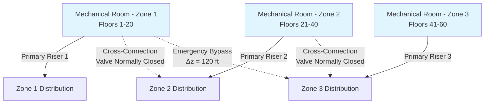
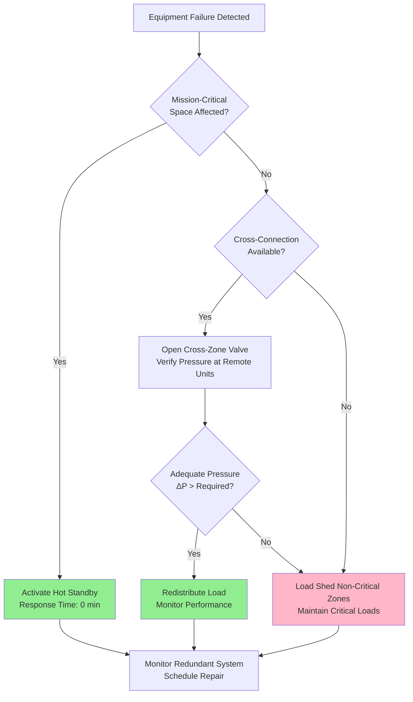

Redundancy in tall building HVAC systems addresses the catastrophic consequences of equipment failure across multiple floors. The physics of vertical pressure distribution, combined with the inability to rapidly deploy temporary systems at elevation, demands engineered backup capacity that maintains thermal comfort and meets life-safety requirements during component failures.

## Redundancy Configuration Strategies

### N+1 Equipment Sizing

N+1 redundancy provides standby capacity where N represents the minimum equipment required to meet design load and the additional unit provides backup during maintenance or failure. The sizing methodology differs fundamentally from simple oversizing because each unit must handle the redistributed load during single-unit failure.

For a building requiring total cooling capacity $Q_{\text{total}}$, the capacity of each unit in an N+1 configuration becomes:

$$Q_{\text{unit}} = \frac{Q_{\text{total}}}{N}$$

This ensures that when one unit fails, the remaining N units collectively deliver the required capacity. The critical distinction lies in control sequencing—all N+1 units operate during peak conditions to maintain efficiency, while any single unit can be isolated without compromising performance.

**N+1 Sizing Comparison by Zone Type:**

| Zone Configuration | Equipment Count | Unit Capacity | Operating Strategy | Redundancy Level |
|-------------------|----------------|---------------|-------------------|------------------|
| Single zone, 3 chillers | 2+1 | 50% each | All run at peak | Full redundancy |
| Dual zones, 4 chillers | 3+1 per zone | 33% each | Rotate standby | Full redundancy |
| Triple zones, 6 chillers | 5+1 distributed | 20% each | Cross-zone backup | Partial redundancy |
| Mission-critical floor | 1+1 dedicated | 100% each | Hot standby | Full + N+1 |

### Cross-Zone Connection Architecture

Cross-connections between vertical zones enable hydraulic redistribution of capacity when equipment serving one zone fails. The physics governing effective cross-connections centers on available pump pressure to overcome the additional static head differential between zones.

The pressure required for cross-zone flow is:

$$\Delta P_{\text{cross}} = \rho g \Delta z + \Delta P_{\text{friction}} + \Delta P_{\text{control}}$$

where $\Delta z$ represents the vertical elevation difference between zone boundaries, $\Delta P_{\text{friction}}$ accounts for piping resistance, and $\Delta P_{\text{control}}$ maintains adequate pressure at the highest terminal unit.

Cross-connections introduce complexity in balancing and control. The hydraulic gradient created by interconnecting zones at different elevations causes unintended flow circulation unless isolation valves remain closed during normal operation. Motorized valves with failure-position logic (normally closed, open on command) prevent gravity circulation while enabling emergency capacity transfer.

## Mission-Critical Tenant Requirements

Tenants with critical operations—data centers, trading floors, medical facilities—demand redundancy beyond standard N+1 configurations. The design approach stratifies reliability into tiers matching operational criticality.

**Redundancy Tiers for Critical Spaces:**

| Tier Level | Configuration | Annual Downtime | Application Example |
|-----------|---------------|-----------------|---------------------|
| Tier I | N+0, single path | 28.8 hours | Standard office |
| Tier II | N+1, single path | 22.0 hours | Professional services |
| Tier III | N+1, dual path | 1.6 hours | Financial trading |
| Tier IV | 2(N+1), dual path | 0.4 hours | Data centers |

Tier III and IV systems require dedicated equipment with isolated distribution paths. The physics governing reliability improvement stems from statistical independence—when parallel systems share no common failure modes, the combined failure probability becomes:

$$P_{\text{system failure}} = P_{\text{path A}} \times P_{\text{path B}}$$

For systems with 99% individual reliability, dual independent paths achieve 99.99% combined reliability.

## Standby Capacity Calculations

Determining appropriate standby capacity requires load analysis beyond peak design conditions. Partial-load performance dominates annual operating hours, and redundant equipment must maintain efficiency across the load spectrum.

The effective standby capacity accounts for degraded performance during failure scenarios:

$$Q_{\text{standby,effective}} = Q_{\text{standby,rated}} \times \eta_{\text{failure mode}} \times f_{\text{distribution}}$$

where $\eta_{\text{failure mode}}$ represents efficiency at elevated load fractions (typically 0.85-0.95 for chillers operating at 80-90% capacity) and $f_{\text{distribution}}$ accounts for hydraulic limitations in redistributing capacity (0.90-1.00 depending on piping configuration).

## Dual Riser Distribution Paths

Dual riser systems provide physical separation of distribution paths, eliminating single-point hydraulic failures. The design segregates supply and return mains into independent vertical shafts, with cross-ties at strategic intervals to enable flow reversal during riser isolation.

The hydraulic design must account for unequal pressure drops when one riser handles total flow. The pressure differential between risers during single-riser operation is:

$$\Delta P_{\text{riser}} = f \frac{L}{D} \frac{\rho v^2}{2}$$

where velocity $v$ doubles when flow consolidates into a single riser, quadrupling the dynamic pressure term. This pressure penalty requires oversized risers (typically 1.5× diameter) or acceptance of reduced flow rates during failure scenarios.

**Dual Riser Hydraulic Performance:**

| Operating Mode | Flow per Riser | Velocity Ratio | Pressure Drop Ratio | Available Capacity |
|----------------|----------------|----------------|---------------------|-------------------|
| Normal (both risers) | 50% | 1.0× | 1.0× | 100% |
| Single riser failure | 100% | 2.0× | 4.0× | 75-85% |
| Oversized risers (1.5D) | 100% | 0.89× | 1.6× | 95-100% |

## Control Integration for Redundant Systems

Redundant capacity delivers reliability only when building automation systems detect failures and execute switchover sequences faster than space conditions degrade. The control response time depends on sensor location, algorithm execution, and actuator response.

Temperature deviation rate in an unconditioned space follows:

$$\frac{dT}{dt} = \frac{Q_{\text{gains}} - Q_{\text{HVAC}}}{m c_p}$$

When $Q_{\text{HVAC}}$ drops to zero during equipment failure, thermal mass $m$ determines the time constant for space temperature rise. For typical office construction with 2-hour thermal time constant, temperature rises 1°F per 6 minutes under full cooling load conditions. This establishes a 5-10 minute response window for redundant system activation.

ASHRAE Standard 90.1 does not mandate specific redundancy levels but requires documentation of expected equipment life and maintenance accessibility. High-rise applications reference ASHRAE Guideline 36 for sequences of operation that include failure mode responses and automatic switchover logic.

The engineering judgment for redundancy configuration balances capital investment in standby equipment against the financial and reputational consequences of service interruption across multiple floors of occupied space.
