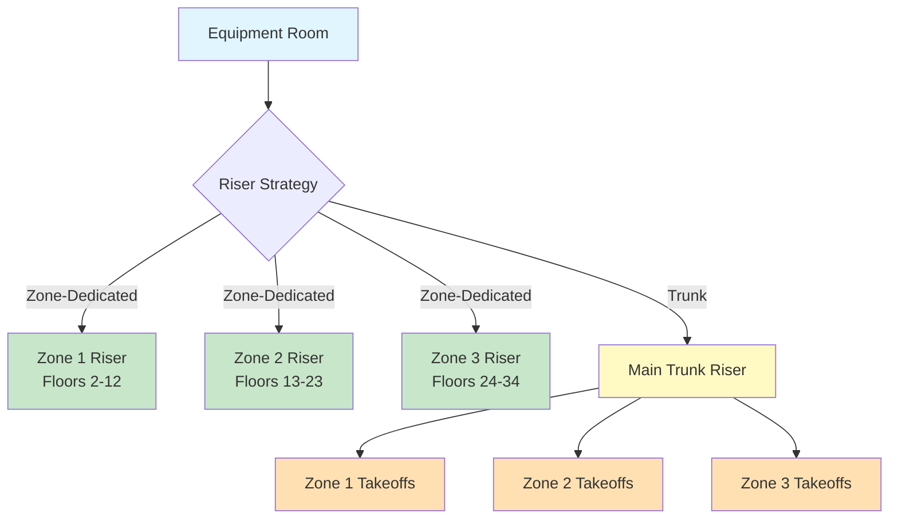
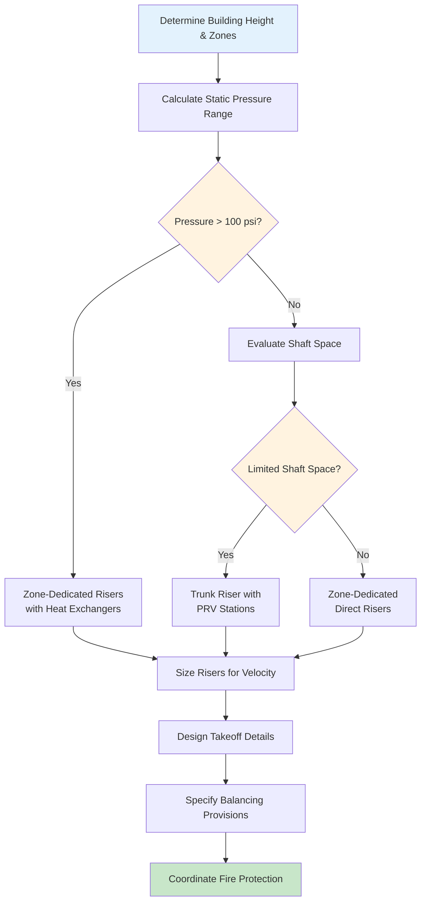

Riser design represents the critical arterial infrastructure for distributing heating, cooling, and ventilation throughout vertically zoned buildings. The selection between zone-dedicated risers and trunk riser configurations fundamentally impacts system performance, installation cost, operational flexibility, and long-term adaptability.

## Zone-Dedicated Risers vs Trunk Risers

The primary architectural decision in vertical distribution involves choosing between independent zone-dedicated risers or centralized trunk risers with branch takeoffs.

### Zone-Dedicated Riser Systems

Zone-dedicated risers provide independent vertical distribution for each HVAC zone, typically serving 6-12 floors per zone in buildings exceeding 20 stories. Each riser operates as an isolated circuit with dedicated pumps or fans at the equipment level.

**Advantages:**

- Independent hydraulic or pneumatic circuits eliminate inter-zone interference
- Simplified pressure control within narrower elevation ranges
- Enhanced redundancy through system separation
- Reduced pressure requirements for pumps or fans
- Simplified balancing procedures with isolated circuits

**Disadvantages:**

- Increased shaft space requirements for multiple parallel risers
- Higher first cost for duplicate distribution infrastructure
- Limited inter-zone flexibility for load sharing
- Increased penetration requirements through fire-rated floors

### Trunk Riser Configuration

Trunk risers employ large central distribution mains spanning the building height with branch takeoffs at each zone or floor level. This approach consolidates vertical distribution into minimal shaft penetrations.

**Advantages:**

- Minimized shaft space consumption
- Reduced overall piping or ductwork material quantities
- Greater flexibility for inter-zone heat transfer or air redistribution
- Simplified structural coordination with fewer penetrations
- Lower first cost for distribution infrastructure

**Disadvantages:**

- Complex pressure management across full building height
- Potential for hydraulic or flow imbalances between zones
- Single-point vulnerability reducing system redundancy
- Higher pump or fan energy consumption
- More sophisticated balancing requirements

## Pressure Balancing Between Zones

Hydrostatic or static pressure variations create the fundamental challenge in riser design. For hydronic systems, the pressure differential between zones is governed by:

$$\Delta P_{static} = \rho g \Delta h$$

where $\rho$ is fluid density (kg/m³), $g$ is gravitational acceleration (9.81 m/s²), and $\Delta h$ is elevation difference (m).

For a 30-story building with 4-meter floor heights (120 m total), the hydrostatic pressure difference equals:

$$\Delta P_{static} = 1000 \times 9.81 \times 120 = 1,177,200 \text{ Pa} \approx 171 \text{ psi}$$

This substantial pressure differential necessitates zone isolation through:

1. **Pressure-reducing valve stations** at each zone boundary
2. **Heat exchanger isolation** creating hydraulic separation
3. **Variable-speed pumping** with differential pressure control
4. **Flow-limiting devices** at individual takeoff connections

For air distribution systems, static pressure variations are less severe but still significant:

$$\Delta P_{air} = \rho_{air} g \Delta h$$

At standard conditions ($\rho_{air}$ = 1.2 kg/m³), the same 120-meter building height produces:

$$\Delta P_{air} = 1.2 \times 9.81 \times 120 = 1,413 \text{ Pa} \approx 5.6 \text{ in. w.g.}$$

## Takeoff Connection Design

Branch takeoff configuration critically influences flow distribution and balancing stability. Proper takeoff design follows these principles:

### Hydronic Riser Takeoffs

| Takeoff Method | Application | Pressure Loss Coefficient | Balancing Stability |
|----------------|-------------|---------------------------|---------------------|
| Direct tee | Low-rise, small branches | K = 0.9-1.2 | Poor |
| 45° reducing wye | Mid-rise, moderate flow | K = 0.4-0.6 | Good |
| Venturi takeoff | High-rise, critical balance | K = 0.2-0.3 | Excellent |
| Flexible hose connection | Equipment isolation | K = 1.5-2.5 | Fair |

The local pressure loss at each takeoff follows:

$$\Delta P_{takeoff} = K \frac{\rho v^2}{2}$$

where $K$ is the loss coefficient and $v$ is velocity in the branch pipe (m/s).

ASHRAE Handbook—HVAC Systems and Equipment recommends maintaining riser velocities between 1.2-2.4 m/s (4-8 ft/s) for chilled water systems to prevent erosion while minimizing pressure loss.

### Duct Riser Takeoffs

Air distribution takeoffs require careful attention to pressure balance and acoustic performance:

- **Volume dampers** at each takeoff provide coarse balancing
- **Venturi flow stations** enable measurement-based commissioning
- **Sound attenuators** address pressure drop discontinuities
- **Turning vanes** in rectangular takeoffs reduce turbulence losses

## Future Flexibility Considerations

Building lifespan typically exceeds 50 years while HVAC systems undergo major renovations every 15-25 years. Riser design must accommodate foreseeable adaptations:

**Oversizing Strategy:**

Size risers for 125-150% of initial design flow to accommodate:
- Future tenant load increases
- Technology improvements requiring higher flow rates
- Conversion between different system types
- Addition of supplementary equipment

**Capped Stub-Outs:**

Install capped connections at strategic locations:
- Every 3-4 floors on trunk risers
- At mid-height of each zone for future subdivision
- Adjacent to core areas likely to see tenant improvements

**Access Provisions:**

- Removable shaft wall panels at key connection points
- Adequate clearance for pipe or duct replacement
- Crane access or rigging points for equipment renewal

## Shaft Space Optimization

Riser shaft allocation represents premium real estate in high-rise construction. Optimize vertical distribution using:

### Stacking Principles

Vertical alignment of shafts through all floors minimizes structural complexity and cost. Per International Building Code requirements, shafts penetrating fire-rated assemblies require:

- 2-hour fire-resistance rating for buildings exceeding 75 feet
- Through-penetration firestop systems listed for specific pipe/duct combinations
- Maintenance access on alternate floors minimum

### Space Allocation Formula

For preliminary planning, estimate shaft area using:

$$A_{shaft} = 1.5 \times \sum A_{riser} + 0.6 \text{ m}^2$$

where $A_{riser}$ is the cross-sectional area of each pipe or duct, the 1.5 factor accounts for insulation and clearances, and 0.6 m² provides access space.

### Multi-Service Coordination

Consolidate compatible services within common shafts:

| Compatible Services | Separation Requirements | Code Reference |
|---------------------|-------------------------|----------------|
| Chilled water supply/return | None (same system) | N/A |
| Heating water and chilled water | 150 mm minimum | ASHRAE 90.1 |
| HVAC and plumbing vent | 300 mm minimum | IMC 302.1 |
| HVAC and electrical conduit | Per NEC clearances | NEC 300.8 |

## Practical Implementation

The selection between riser configurations depends on multiple factors evaluated during early design:

1. **Building height and zone count** - Buildings exceeding 40 stories typically require zone-dedicated risers due to pressure limitations
2. **Core space availability** - Constrained cores favor trunk risers despite higher operating costs
3. **System redundancy requirements** - Critical facilities demand zone-dedicated systems for fault isolation
4. **Life-cycle cost analysis** - Energy costs over 20 years often justify zone-dedicated systems despite higher first cost

Successful riser design balances these competing priorities through rigorous analysis of building-specific conditions rather than application of prescriptive rules. Engage mechanical, structural, and architectural teams early to optimize shaft locations and sizing for long-term building performance.
