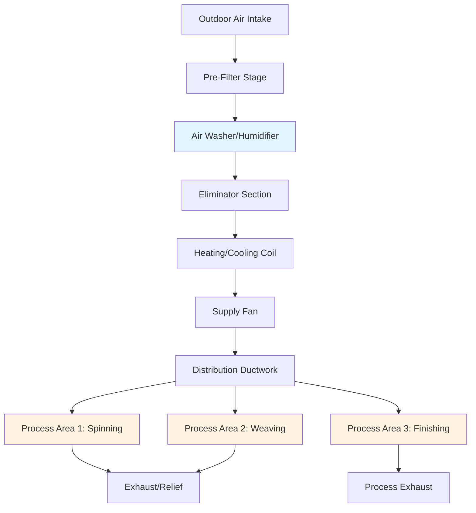
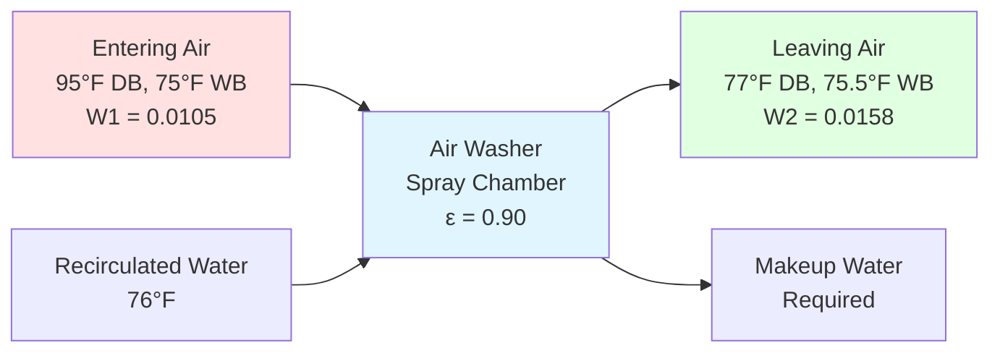

Textile processing plants require precise environmental control to maintain fiber moisture content, reduce static electricity, minimize dust, and ensure product quality. The HVAC system directly impacts yarn strength, fabric appearance, production efficiency, and worker comfort across multiple process areas with varying temperature and humidity requirements.

## Critical Environmental Parameters

Textile fibers are hygroscopic materials that continuously exchange moisture with surrounding air. Maintaining precise relative humidity prevents fiber breakage, reduces static buildup, and ensures dimensional stability during processing.

The equilibrium moisture content (EMC) of textile fibers depends on ambient conditions:

$$EMC = f(RH, T, \text{fiber type})$$

For cotton fibers, the relationship between relative humidity and moisture regain follows:

$$M = \frac{18.0 + 0.15 \cdot RH}{100 - 0.01 \cdot RH}$$

Where:
- $M$ = moisture regain (%)
- $RH$ = relative humidity (%)

The psychrometric moisture addition required for humidification:

$$\dot{m}_w = \dot{V} \cdot \rho \cdot (W_2 - W_1) \cdot 60$$

Where:
- $\dot{m}_w$ = water addition rate (lb/hr)
- $\dot{V}$ = airflow rate (cfm)
- $\rho$ = air density (lb/ft³, typically 0.075)
- $W_2$ = final humidity ratio (lb water/lb dry air)
- $W_1$ = initial humidity ratio (lb water/lb dry air)

## Process Area Requirements

Different textile operations require specific environmental conditions based on fiber characteristics and mechanical processes.

| Process Area | Temperature (°F) | Relative Humidity (%) | Air Changes/Hour | Primary Concerns |
|--------------|------------------|----------------------|------------------|------------------|
| Opening & Picking | 75-80 | 55-65 | 6-8 | Dust control, fiber conditioning |
| Carding | 75-80 | 50-60 | 8-12 | Static elimination, fiber strength |
| Drawing & Roving | 75-80 | 55-65 | 10-15 | Moisture uniformity, sliver strength |
| Spinning | 75-82 | 50-65 | 15-25 | Critical humidity, yarn strength |
| Winding | 72-78 | 50-60 | 10-15 | Package moisture, static control |
| Warping | 70-75 | 60-70 | 10-15 | Yarn elongation control |
| Slashing/Sizing | 75-85 | 65-80 | 12-18 | Size moisture pickup, drying rate |
| Weaving | 70-78 | 60-75 | 12-20 | Warp breakage prevention, filling insertion |
| Knitting | 68-75 | 60-70 | 10-15 | Yarn elasticity, needle friction |
| Finishing | 70-80 | 40-65 | 15-30 | Process dependent, moisture removal |

## HVAC System Configuration

Textile plant HVAC systems typically employ 100% outdoor air to manage high dust and lint concentrations that prohibit air recirculation in most process areas.

## Air Washing Systems

Air washers serve triple functions in textile plants: humidification, cooling, and air cleaning. These systems spray water directly into the airstream to condition air through direct evaporative cooling and dust removal.

### Air Washer Psychrometric Process

The air washing process follows an adiabatic saturation path on the psychrometric chart, approaching the wet-bulb temperature of entering air:

$$\frac{h_2 - h_1}{W_2 - W_1} = c_{p,ma} \cdot \left(\frac{T_{wb,1} + T_{wb,2}}{2}\right)$$

Where:
- $h$ = enthalpy (Btu/lb dry air)
- $W$ = humidity ratio (lb water/lb dry air)
- $c_{p,ma}$ = specific heat of moist air (Btu/lb·°F)
- $T_{wb}$ = wet-bulb temperature (°F)

Air washer effectiveness:

$$\epsilon_{AW} = \frac{W_2 - W_1}{W_{sat,wb} - W_1}$$

Where $W_{sat,wb}$ represents the humidity ratio at saturation at the entering wet-bulb temperature.

### Design Considerations

Air washer design parameters for textile applications:

1. **Spray Chamber Velocity**: 400-600 fpm through spray zone
2. **Water-to-Air Ratio**: 1.0-2.0 gpm/cfm for high effectiveness
3. **Spray Nozzle Pressure**: 15-40 psi for atomization
4. **Contact Time**: 1.5-3.0 seconds minimum
5. **Eliminator Efficiency**: >99% to prevent water carryover

The heat and mass transfer in spray chambers:

$$Q_{total} = \dot{m}_a \cdot (h_2 - h_1) = \dot{m}_a \cdot c_{p,ma} \cdot (T_2 - T_1) + h_{fg} \cdot \dot{m}_w$$

Where:
- $Q_{total}$ = total cooling capacity (Btu/hr)
- $\dot{m}_a$ = dry air mass flow (lb/hr)
- $h_{fg}$ = latent heat of vaporization (≈1050 Btu/lb at typical conditions)

## Challenges and Solutions

### Static Electricity Control

Static generation increases exponentially as RH drops below 50%. Maintaining 55-65% RH in spinning and weaving areas prevents charge accumulation that causes fiber repulsion, yarn breakage, and dust attraction.

### Uniform Distribution

Large textile floors (50,000-200,000 ft² common) require extensive duct networks. Perforated fabric ducts provide uniform distribution with lower installation costs and better aesthetics than metal ductwork.

### Energy Consumption

Textile plants consume 15-30% of operating costs for HVAC. Air washers using evaporative cooling reduce energy by 40-60% compared to mechanical cooling in suitable climates. Winter humidification loads range from 0.5-1.5 lb water/lb fiber processed.

### Water Quality

Air washer water requires treatment to prevent mineral deposits, biological growth, and nozzle clogging. Conductivity should remain below 1500 μS/cm with regular bleed-off and chemical treatment.

## System Integration

Modern textile plants integrate HVAC controls with production monitoring systems. Zone-level humidity sensors provide feedback to proportional spray valves, maintaining setpoints within ±3% RH. Supply air temperature resets based on outdoor conditions optimize energy while meeting process requirements.

ASHRAE Industrial Ventilation standards provide comprehensive guidance for textile facility design, including specific recommendations for fiber types (cotton, wool, synthetic), process equipment ventilation, and acceptable indoor environmental quality parameters.

The economic impact of proper environmental control in textile processing justifies capital investment in sophisticated HVAC systems. Reduced yarn breakage, improved first-quality yield, and enhanced worker productivity typically provide payback periods of 2-4 years for comprehensive climate control upgrades.
