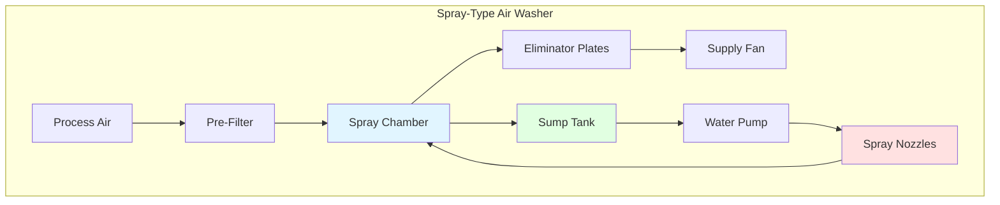
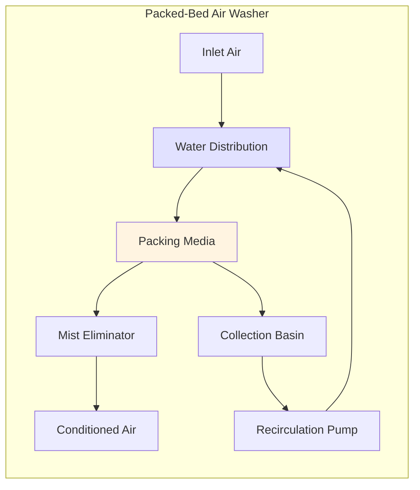

# Air Washing Systems for Textile Processing Plants

Air washing systems serve as critical components in textile manufacturing HVAC installations, providing simultaneous humidification, cooling, and air cleaning. These systems pass large volumes of process air through water sprays to condition the atmosphere for fiber processing, control static electricity, and maintain product quality.

## Functions of Air Washing Systems

Air washers in textile facilities perform three primary functions:

**Humidification**: Increases moisture content of supply air to maintain fiber pliability and reduce breakage during processing. Most textile operations require 60-75% relative humidity depending on fiber type.

**Evaporative Cooling**: Reduces dry-bulb temperature through adiabatic saturation, providing economical cooling during moderate outdoor conditions without mechanical refrigeration.

**Air Cleaning**: Removes airborne lint, dust, and particulates through impingement on water droplets, protecting equipment and improving indoor air quality.

## Air Washer Thermodynamics

The air washing process follows principles of adiabatic saturation. Air enters the spray chamber and approaches the wet-bulb temperature as water evaporates into the airstream.

### Moisture Addition Rate

The rate of moisture addition depends on the mass transfer coefficient and driving force:

$$\dot{m}_w = h_d A \rho_a (W_s - W_1)$$

Where:
- $\dot{m}_w$ = moisture addition rate (lb/hr)
- $h_d$ = mass transfer coefficient (ft/hr)
- $A$ = contact surface area (ft²)
- $\rho_a$ = air density (lb/ft³)
- $W_s$ = humidity ratio at saturation (lb/lb)
- $W_1$ = entering air humidity ratio (lb/lb)

### Saturation Efficiency

Air washer effectiveness is quantified by saturation efficiency:

$$\eta_{sat} = \frac{t_1 - t_2}{t_1 - t_{wb1}} \times 100\%$$

Where:
- $t_1$ = entering dry-bulb temperature (°F)
- $t_2$ = leaving dry-bulb temperature (°F)
- $t_{wb1}$ = entering wet-bulb temperature (°F)

Typical saturation efficiencies range from 85-95% for properly designed systems with adequate spray coverage and contact time.

### Cooling Capacity

The sensible cooling provided by evaporative processes:

$$Q_s = \dot{m}_a c_p (t_1 - t_2)$$

The latent heat absorption during moisture evaporation:

$$Q_l = \dot{m}_a h_{fg} (W_2 - W_1)$$

Where $h_{fg}$ = latent heat of vaporization (≈1050 BTU/lb at standard conditions).

## Air Washer System Types

## System Design Parameters

### Spray Chamber Configuration

**Chamber Length**: 6-12 ft typical, providing 2-4 seconds contact time at face velocities of 400-600 fpm.

**Spray Nozzle Spacing**: 12-24 inch centers in multiple banks (typically 2-4 banks) to ensure complete air saturation.

**Water Pressure**: 15-40 psig at nozzles, producing droplet sizes of 50-200 microns for optimal evaporation.

**Face Velocity**: 400-500 fpm for high-efficiency operation; up to 600 fpm acceptable with reduced efficiency.

### Eliminator Design

Eliminator plates prevent water carryover into supply ductwork. Design parameters include:

- Plate spacing: 0.5-0.75 inches
- Air velocity through eliminators: 400-500 fpm maximum
- Water removal efficiency: 95-99%
- Pressure drop: 0.1-0.2 inches w.g.

## System Comparison

| System Type | Saturation Efficiency | Pressure Drop | Water Consumption | Maintenance | Application |
|-------------|----------------------|---------------|-------------------|-------------|-------------|
| Spray Chamber | 85-95% | 0.4-0.8" w.g. | Moderate | High (nozzles) | Large capacity, cooling priority |
| Packed Bed | 90-98% | 0.6-1.2" w.g. | Low | Moderate (media) | High humidity, compact space |
| Capillary Mat | 70-85% | 0.2-0.4" w.g. | Low | Low | Pre-conditioning, small systems |
| Ultrasonic | 95-99% | 0.1-0.3" w.g. | Very Low | Moderate (transducers) | Clean spaces, precision control |

## Water Quality Considerations

Water quality directly impacts system performance and maintenance requirements:

**Total Dissolved Solids (TDS)**: Maintain below 500 ppm to prevent scale formation on nozzles and heat exchange surfaces.

**pH Range**: 6.5-8.5 optimal for corrosion control and scale prevention.

**Biological Control**: Continuous treatment required to prevent algae, bacteria, and biofilm formation. ASHRAE Standard 188 provides guidelines for Legionella control.

**Blowdown Rate**: Calculate based on makeup water TDS and acceptable recirculation TDS:

$$\dot{m}_{BD} = \frac{\dot{m}_{evap}}{COC - 1}$$

Where COC = cycles of concentration (typically 3-5 for air washers).

## Integration with Textile HVAC Systems

Air washing systems integrate with broader textile HVAC through:

1. **Pre-cooling stages**: Reducing mechanical refrigeration loads during warm weather
2. **Humidity control**: Primary humidification source for process spaces
3. **Makeup air treatment**: Conditioning outdoor air before mixing with return air
4. **Energy recovery**: Utilizing exhaust air enthalpy when economically justified

Air washer selection depends on outdoor climate, required indoor conditions, process loads, and energy costs. In arid climates with low wet-bulb temperatures, air washing provides highly economical cooling and humidification compared to mechanical systems.

## Design References

ASHRAE Handbook—HVAC Applications, Chapter 20: Textile Processing, provides comprehensive guidance on air washer design, water treatment, and system integration for textile facilities. ASHRAE Handbook—HVAC Systems and Equipment, Chapter 41: Air-to-Air Energy Recovery Equipment covers detailed thermodynamic analysis and equipment selection criteria.
