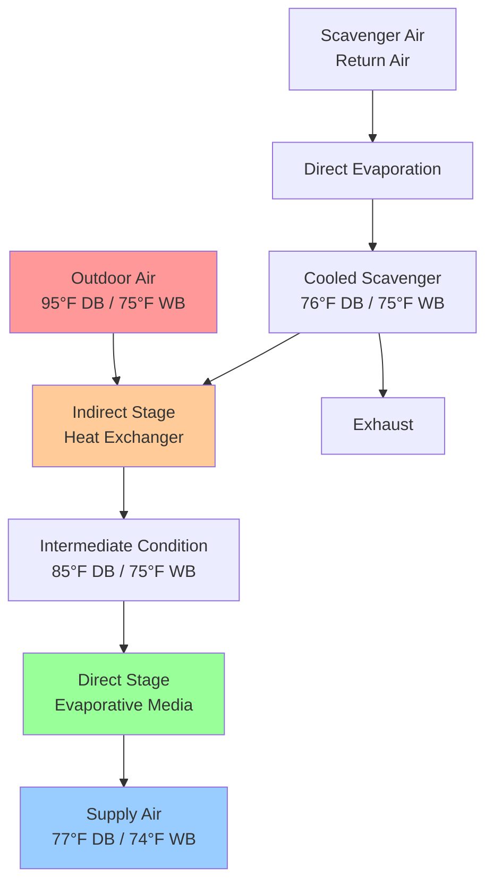
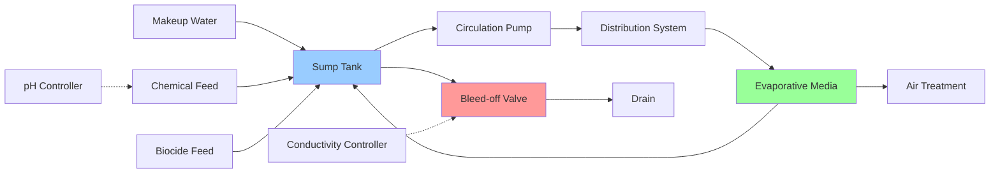

## Evaporative Cooling Fundamentals

Evaporative cooling exploits the latent heat of vaporization to reduce dry bulb temperature while increasing moisture content. In textile processing plants, evaporative systems provide economical cooling and humidification simultaneously, making them particularly suitable for fiber preparation and spinning areas where high humidity is required.

The fundamental energy transfer follows the adiabatic saturation process, where sensible heat converts to latent heat without net energy addition. This process follows a constant wet bulb temperature line on the psychrometric chart.

### Adiabatic Saturation Theory

The adiabatic saturation temperature represents the equilibrium temperature achieved when air passes over a water surface of infinite length. For practical applications, this approximates the wet bulb temperature for air-water vapor mixtures.

The energy balance for adiabatic saturation:

$$h_1 + (W_s - W_1) \cdot h_{fg} = h_s$$

Where:
- $h_1$ = enthalpy of entering air (Btu/lb)
- $h_s$ = enthalpy at saturation (Btu/lb)
- $W_1$ = entering humidity ratio (lb/lb)
- $W_s$ = saturation humidity ratio (lb/lb)
- $h_{fg}$ = latent heat of vaporization (Btu/lb)

The temperature depression achievable:

$$\Delta T_{max} = T_{db1} - T_{wb1}$$

Where $T_{db1}$ is entering dry bulb and $T_{wb1}$ is entering wet bulb temperature.

## Direct Evaporative Cooling

Direct evaporative coolers (DEC) bring air into direct contact with water through media pads, spray chambers, or fogging nozzles. Water evaporates directly into the airstream, increasing humidity while decreasing dry bulb temperature.

### Effectiveness Calculation

Cooling effectiveness quantifies actual performance versus theoretical maximum:

$$\varepsilon_{DEC} = \frac{T_{db1} - T_{db2}}{T_{db1} - T_{wb1}}$$

Where:
- $T_{db2}$ = leaving dry bulb temperature (°F)
- $\varepsilon_{DEC}$ = direct evaporative cooling effectiveness (dimensionless)

Typical effectiveness ranges for direct systems:

| Media Type | Effectiveness | Pressure Drop | Application |
|------------|---------------|---------------|-------------|
| Rigid cellulose media (6") | 85-95% | 0.25-0.35 in.wg | High efficiency requirements |
| Rigid cellulose media (4") | 75-85% | 0.18-0.25 in.wg | Standard textile applications |
| Spray chamber | 60-80% | 0.10-0.20 in.wg | Fiber washing integration |
| Fogging systems | 50-70% | 0.05-0.10 in.wg | Supplemental cooling |

### Moisture Addition

The humidity ratio increase:

$$\Delta W = W_2 - W_1 = \varepsilon_{DEC} \cdot (W_s - W_1)$$

This simultaneous cooling and humidification makes DEC ideal for textile spinning areas requiring 65-75% RH at 75-80°F.

## Indirect Evaporative Cooling

Indirect evaporative coolers (IEC) separate the evaporative process from the supply airstream using a heat exchanger. Water evaporates on one side, cooling the heat exchanger surface, which then cools the supply air without adding moisture.

### Effectiveness for Indirect Systems

$$\varepsilon_{IEC} = \frac{T_{db1} - T_{db2}}{T_{db1} - T_{wb,scavenger}}$$

Indirect system effectiveness typically ranges 50-75%, lower than direct systems but providing sensible cooling without humidification.

### Two-Stage Evaporative Cooling

Combined indirect-direct systems maximize cooling potential:

$$T_{final} = T_{db1} - \varepsilon_{IEC}(T_{db1} - T_{wb1}) - \varepsilon_{DEC}[(T_{db1} - \varepsilon_{IEC}(T_{db1} - T_{wb1})) - T_{wb1}]$$

Two-stage systems achieve 90-110% wet bulb effectiveness, approaching or exceeding wet bulb temperature when both stages operate at high efficiency.

## Water Treatment Requirements

Evaporative cooling concentrates dissolved solids through continuous evaporation. Proper water treatment prevents scaling, corrosion, and biological growth.

### Cycles of Concentration

$$COC = \frac{C_{circulating}}{C_{makeup}}$$

Where:
- $COC$ = cycles of concentration (dimensionless)
- $C_{circulating}$ = dissolved solids in circulating water (ppm)
- $C_{makeup}$ = dissolved solids in makeup water (ppm)

Bleed rate calculation:

$$Q_{bleed} = \frac{Q_{evap}}{COC - 1}$$

Where:
- $Q_{bleed}$ = bleed-off flow rate (gpm)
- $Q_{evap}$ = evaporation rate (gpm)

For textile plants, maintain 3-5 cycles of concentration to balance water consumption against scaling potential.

### Treatment Parameters

| Parameter | Target Range | Impact if Exceeded |
|-----------|--------------|-------------------|
| Total dissolved solids | < 2000 ppm | Scaling, reduced efficiency |
| pH | 6.5-8.5 | Corrosion (low), scaling (high) |
| Calcium hardness | < 400 ppm as CaCO₃ | Scale formation |
| Total alkalinity | < 400 ppm as CaCO₃ | Scale formation |
| Biological count | < 10,000 CFU/mL | Biofilm, odor, health risk |

## Design Considerations for Textile Applications

**Climate suitability:** Evaporative cooling performs optimally in dry climates (wet bulb depression > 15°F). In humid regions, systems provide limited cooling but still offer economical humidification.

**Integration with process loads:** Coordinate evaporative cooling with process heat gains from machinery, lighting, and steam systems. Size systems based on peak wet bulb conditions per ASHRAE Industrial Applications handbook.

**Air filtration:** Install filtration upstream (MERV 8-11) to prevent media clogging from fiber lint and outdoor particulates.

**Freeze protection:** Drain systems completely during winter shutdown. Install sump heaters and heat tracing in climates with freezing temperatures.

**Legionella control:** Implement biocide treatment, maintain proper water chemistry, and follow ASHRAE Standard 188 protocols for water system management in textile facilities.

**Media maintenance:** Inspect pads quarterly, clean semi-annually, replace when efficiency drops below 80% of rated effectiveness or media degradation occurs.

## Performance Monitoring

Track these parameters to verify system performance:

- Entering and leaving dry bulb temperatures
- Entering wet bulb temperature
- Calculated effectiveness versus design values
- Water consumption rate
- Bleed-off conductivity
- Static pressure across media

Calculate operating effectiveness weekly during peak season. Effectiveness below design values by more than 10 percentage points indicates media fouling, inadequate water distribution, or insufficient contact time requiring corrective action.
