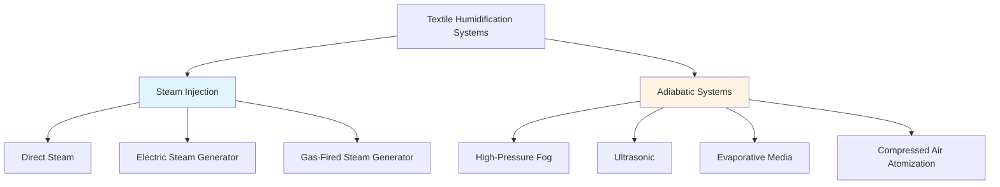

## Humidification Requirements in Textile Processing

Textile manufacturing demands precise humidity control to maintain fiber flexibility, reduce static electricity, minimize fiber breakage, and ensure consistent product quality. Target relative humidity typically ranges from 65% to 75% depending on the fiber type and process stage. Cotton processing requires 70-75% RH, while synthetic fibers operate optimally at 60-65% RH.

The humidification load in textile plants is substantial due to high air change rates, process heat generation, and the hygroscopic nature of textile materials. ASHRAE Industrial Ventilation standards specify that textile facilities require continuous moisture addition to offset ventilation losses and process absorption.

## Humidification Load Calculation

The total humidification load consists of ventilation moisture loss and process absorption.

### Ventilation Moisture Load

The moisture addition rate required to maintain setpoint humidity is calculated as:

$$\dot{m}_w = \frac{\dot{V} \cdot \rho_{air} \cdot (W_{setpoint} - W_{outdoor})}{3600}$$

Where:
- $\dot{m}_w$ = moisture addition rate (kg/h)
- $\dot{V}$ = ventilation airflow rate (m³/h)
- $\rho_{air}$ = air density (kg/m³)
- $W_{setpoint}$ = humidity ratio at setpoint (kg H₂O/kg dry air)
- $W_{outdoor}$ = outdoor air humidity ratio (kg H₂O/kg dry air)

### Total Humidification Capacity

Including process absorption and safety factor:

$$\dot{m}_{total} = (\dot{m}_{vent} + \dot{m}_{process}) \cdot SF$$

Where:
- $\dot{m}_{vent}$ = ventilation moisture loss (kg/h)
- $\dot{m}_{process}$ = process moisture absorption (kg/h)
- $SF$ = safety factor (1.15 to 1.25)

Process absorption rates vary by operation: spinning areas absorb 0.15-0.25 kg/h per spindle, while weaving operations absorb 0.10-0.18 kg/h per loom.

## Humidification System Types

### Steam Injection Systems

Steam injection provides isothermal humidification by adding pure water vapor to the airstream. Direct steam from a central boiler or packaged steam generator is distributed through manifolds with controlled dispersion tubes.

**Key Characteristics:**
- No evaporative cooling effect
- Instantaneous moisture absorption
- Self-sterilizing (above 100°C)
- High energy consumption (2,257 kJ/kg latent heat)
- Requires boiler water quality (TDS < 50 ppm)

Steam injection is preferred for applications requiring rapid response, high precision control, and minimal risk of bacterial growth.

### Adiabatic Humidification Systems

Adiabatic systems evaporate liquid water into the airstream, producing evaporative cooling. The sensible-to-latent heat transfer reduces dry-bulb temperature while increasing humidity.

#### High-Pressure Fog Systems

High-pressure pumps (70-100 bar) force water through specialized nozzles creating 5-10 micron droplets that evaporate rapidly without wetting surfaces.

**Performance Parameters:**
- Evaporation efficiency: 85-95%
- Droplet size: 5-10 μm
- Energy consumption: 0.8-1.2 kW per kg/h
- Water quality requirement: TDS < 5 ppm, filtered to 5 μm
- Turndown ratio: 10:1

#### Ultrasonic Humidifiers

Piezoelectric transducers vibrating at 1.65-2.4 MHz generate water droplets of 1-5 microns. Multiple transducer modules provide distributed humidification with minimal energy input.

**Performance Parameters:**
- Evaporation efficiency: 90-98%
- Droplet size: 1-5 μm
- Energy consumption: 0.05-0.08 kW per kg/h
- Water quality requirement: TDS < 200 ppm, softened
- Turndown ratio: 5:1

## Humidifier Comparison for Textile Applications

| Parameter | Direct Steam | High-Pressure Fog | Ultrasonic | Evaporative Media |
|-----------|--------------|-------------------|------------|-------------------|
| Capital Cost | Medium-High | High | Medium | Low-Medium |
| Operating Cost (Energy) | High | Medium | Very Low | Low |
| Evaporation Efficiency | 100% | 85-95% | 90-98% | 70-85% |
| Temperature Effect | +10 to +15°C | -5 to -8°C | -4 to -7°C | -6 to -10°C |
| Response Time | Immediate | 15-30 seconds | 30-60 seconds | 2-5 minutes |
| Water Quality (TDS) | <50 ppm | <5 ppm | <200 ppm | <500 ppm |
| Maintenance Frequency | 3-6 months | 1-3 months | 2-4 months | 1-2 months |
| Distribution Distance | Unlimited | 30-50 m | 20-30 m | At unit only |
| Wetting Risk | None | Low | Low-Medium | Medium-High |
| Bacterial Control | Excellent | Good | Fair | Poor |

## System Selection Criteria for Textile Plants

### Steam Injection Applications

Select steam injection when:
- Precise temperature and humidity control required (±2% RH)
- Year-round humidification including winter operation
- Minimal risk of surface wetting critical
- Central boiler steam available
- Energy cost differential favorable

### High-Pressure Fog Applications

Select high-pressure fog when:
- Evaporative cooling beneficial (reduces cooling load)
- High ceiling heights (>4 m) allow evaporation distance
- Moderate to high airflow velocities (>2.5 m/s)
- Water treatment infrastructure available
- Operating cost reduction prioritized over capital cost

### Ultrasonic Applications

Select ultrasonic when:
- Low energy consumption critical
- Distributed humidification required
- Moderate humidity loads (<300 kg/h per zone)
- Quiet operation essential
- Limited electrical service capacity

## Water Quality and Treatment

Humidification system longevity and performance depend critically on water quality. ASHRAE Industrial Ventilation standards specify treatment requirements based on humidifier type.

**Treatment Requirements by System:**

| System Type | RO | Softening | Filtration | UV Sterilization |
|-------------|----|-----------|-----------|--------------------|
| Steam Injection | Optional | Required | 5 μm | Optional |
| High-Pressure Fog | Required | Required | 1 μm | Recommended |
| Ultrasonic | Recommended | Required | 5 μm | Optional |
| Evaporative Media | No | Optional | 50 μm | No |

Reverse osmosis (RO) removes dissolved solids preventing white dust formation from adiabatic systems. Pre-filtration protects RO membranes and extends service life. UV sterilization controls bacterial growth in storage tanks and distribution lines.

## Control Strategy and Integration

Humidification control integrates with the air-washing system through cascaded loops. The primary controller maintains space relative humidity by modulating humidifier output. Secondary control prevents condensation by limiting supply air humidity ratio based on the coldest surface temperature in the distribution system.

Proportional-integral (PI) control with humidity ratio compensation provides stable operation. Control deadband of ±3% RH prevents hunting. Sensor placement 10-15 meters downstream of humidifier injection ensures complete evaporation before measurement.

## Maintenance and Operational Considerations

Regular maintenance protocols include nozzle inspection and cleaning (monthly for fog systems, quarterly for ultrasonic), water quality testing (weekly), filter replacement per manufacturer specifications, and annual system capacity verification. Preventive maintenance reduces unplanned downtime and maintains humidification efficiency within design parameters.

Seasonal adjustment of humidification setpoints balances product quality requirements against energy consumption. Winter operation typically requires maximum humidification capacity, while summer conditions may reduce or eliminate humidification demand depending on climate zone.