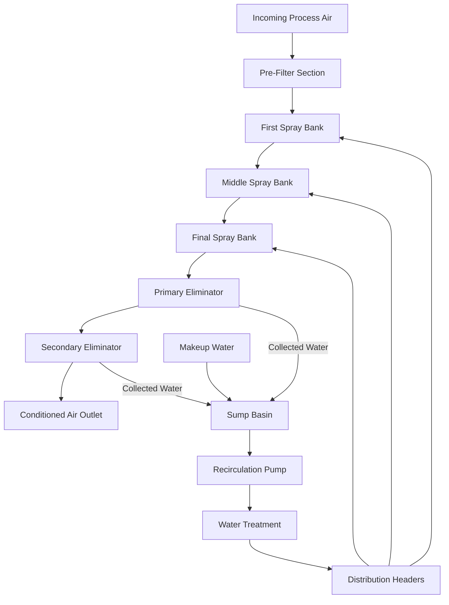
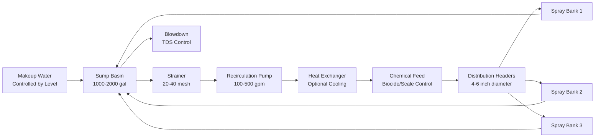

## Spray Chamber Design Fundamentals

Spray chambers serve as the primary component in air washing systems for textile processing plants, providing simultaneous humidification, cooling, and dust removal. The chamber design integrates water spray nozzles, eliminator sections, and water recirculation infrastructure to condition process air while removing airborne contaminants generated during textile operations.

The spray chamber operates on the principle of direct contact between air and finely atomized water droplets. Air velocity through the chamber typically maintains 500 fpm to ensure adequate contact time without excessive water carryover. ASHRAE Industrial Ventilation guidelines specify that chamber length must provide sufficient residence time for mass transfer between air and water phases.

## Chamber Construction and Configuration

The typical spray chamber incorporates three to five spray banks arranged perpendicular to airflow direction. Each bank contains multiple spray nozzles distributed across the chamber cross-section to ensure uniform water distribution. Chamber construction utilizes corrosion-resistant materials including stainless steel or fiberglass-reinforced plastic due to continuous water contact and chemical treatment requirements.

### Design Parameter Specifications

| Parameter | Typical Range | Design Criteria |
|-----------|--------------|-----------------|
| Face Velocity | 400-600 fpm | Optimize at 500 fpm for textile applications |
| Spray Water Flow | 2-4 gpm/ft² face area | Based on cooling/humidification load |
| Nozzle Pressure | 15-40 psi | Higher pressure for finer atomization |
| Chamber Length | 6-12 ft | Minimum 1.5 seconds contact time |
| Eliminator Efficiency | 95-99% | Capture droplets >50 microns |
| Water Temperature | 5-15°F below dry bulb | Cooling effectiveness factor |

## Spray Nozzle Selection and Performance

Nozzle selection determines droplet size distribution, spray pattern, and water atomization efficiency. Hydraulic atomizing nozzles dominate textile applications due to simplicity and reliability. The Sauter mean diameter characterizes droplet size:

$$D_{32} = K \left(\frac{\sigma}{\rho_a v^2}\right)^{0.5} \left(\frac{\mu_w^2}{\sigma \rho_w r}\right)^{0.25} \left(1 + \frac{1}{ALR}\right)$$

Where:
- $D_{32}$ = Sauter mean diameter (microns)
- $K$ = Nozzle-specific constant
- $\sigma$ = Surface tension (N/m)
- $\rho_a$ = Air density (kg/m³)
- $v$ = Relative velocity (m/s)
- $\mu_w$ = Water dynamic viscosity (Pa·s)
- $\rho_w$ = Water density (kg/m³)
- $r$ = Nozzle orifice radius (m)
- $ALR$ = Air-to-liquid ratio

For textile spray chambers, nozzles producing 100-200 micron droplets provide optimal balance between evaporation efficiency and eliminator capture. Spray cone angles between 60-90 degrees ensure adequate coverage without excessive wall impingement.

The evaporation efficiency of spray droplets follows:

$$\eta_{evap} = 1 - e^{-\frac{6k_{m}A_{total}t}{\rho_w D_{32}}}$$

Where:
- $\eta_{evap}$ = Evaporation efficiency
- $k_m$ = Mass transfer coefficient (m/s)
- $A_{total}$ = Total droplet surface area (m²)
- $t$ = Contact time (s)

## Water Recirculation System Design

The recirculation system maintains water quality while minimizing makeup water consumption. Pump sizing follows:

$$Q_{pump} = Q_{spray} \times N_{banks} \times SF$$

Where:
- $Q_{pump}$ = Total pump flow (gpm)
- $Q_{spray}$ = Flow per spray bank (gpm)
- $N_{banks}$ = Number of spray banks
- $SF$ = Safety factor (1.15-1.25)

Pump head calculations account for nozzle pressure requirements, distribution header friction losses, and elevation changes:

$$H_{total} = P_{nozzle} + h_{friction} + h_{static}$$

Sump basin volume provides 2-5 minutes retention time at recirculation flow rate, allowing gravity separation of suspended solids and temperature equalization.

## Air Washing Efficiency and Performance

The air washing effectiveness for cooling and humidification follows psychrometric relationships. Saturation efficiency represents the approach to adiabatic saturation conditions:

$$\eta_{sat} = \frac{t_{db,in} - t_{db,out}}{t_{db,in} - t_{wb,in}} \times 100\%$$

Where:
- $\eta_{sat}$ = Saturation efficiency (%)
- $t_{db,in}$ = Entering dry-bulb temperature (°F)
- $t_{db,out}$ = Leaving dry-bulb temperature (°F)
- $t_{wb,in}$ = Entering wet-bulb temperature (°F)

Well-designed spray chambers achieve 85-95% saturation efficiency with proper nozzle selection and adequate spray banks. Dust removal efficiency depends on particle size distribution and eliminator performance:

$$\eta_{dust} = 1 - \prod_{i=1}^{n} (1 - \eta_{bank,i})$$

Where:
- $\eta_{dust}$ = Overall dust removal efficiency
- $\eta_{bank,i}$ = Efficiency of individual spray bank
- $n$ = Number of spray banks

## Eliminator Design and Water Carryover Control

Eliminator plates prevent water carryover into downstream ductwork and equipment. Chevron-type eliminators with multiple directional changes capture entrained droplets through inertial impaction. The critical droplet diameter for capture follows:

$$d_{crit} = \sqrt{\frac{9\mu_{a} W}{V_{face} \rho_w}}$$

Where:
- $d_{crit}$ = Critical droplet diameter (m)
- $\mu_a$ = Air dynamic viscosity (Pa·s)
- $W$ = Eliminator blade spacing (m)
- $V_{face}$ = Face velocity through eliminator (m/s)

Eliminator sections operate at 400-500 fpm face velocity with 95-99% efficiency for droplets exceeding 50 microns. Two-stage eliminator configurations provide enhanced protection for critical textile processes requiring minimal moisture carryover.

## Water Treatment and Quality Control

Recirculating water requires treatment to prevent biological growth, scale formation, and corrosion. ASHRAE Industrial guidelines recommend maintaining:

- pH: 6.5-8.5
- Total dissolved solids: <1500 ppm
- Biocide concentration: Per manufacturer specifications
- Blowdown rate: 2-5% of recirculation flow

Cycles of concentration typically range from 3-6, balancing water conservation against treatment chemical costs and scaling potential. Automated conductivity controllers regulate blowdown to maintain target TDS levels.

---

*ASHRAE Industrial Ventilation Manual provides comprehensive design guidance for spray chamber applications in textile processing environments.*
