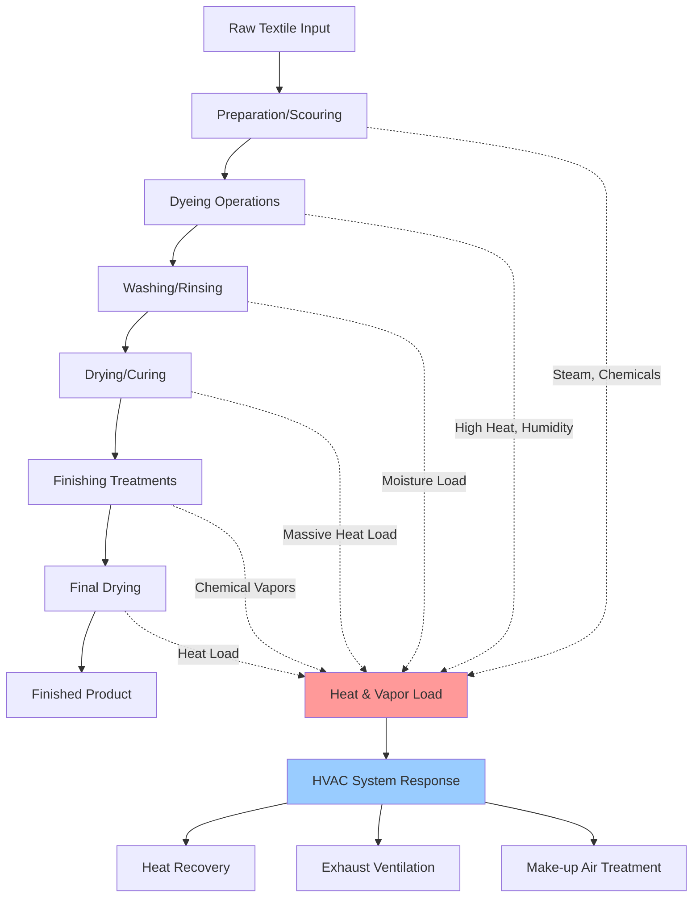

Dyeing and finishing operations represent the most energy-intensive and environmentally critical stages of textile manufacturing. HVAC systems must manage substantial process heat gains, control chemical vapors and humidity, and maintain conditions that ensure product quality while protecting worker health.

## Process Overview and HVAC Integration

Textile dyeing and finishing facilities present unique challenges due to the combination of high-temperature wet processes, chemical vapor generation, and strict environmental control requirements.

## Process Heat Loads and Calculations

### Dyeing Equipment Heat Emissions

Heat gain from dyeing machines depends on vessel capacity, operating temperature, and cycle duration. The instantaneous heat release to the space combines radiant and convective components:

$$Q_{dyeing} = Q_{radiation} + Q_{convection} + Q_{evaporation}$$

For insulated dyeing vessels:

$$Q_{total} = U \cdot A \cdot (T_{vessel} - T_{ambient}) + \dot{m}_{evap} \cdot h_{fg}$$

Where:
- $U$ = overall heat transfer coefficient (0.5-1.5 W/m²·K for insulated vessels)
- $A$ = external surface area (m²)
- $T_{vessel}$ = operating temperature (typically 90-140°C)
- $T_{ambient}$ = space temperature (°C)
- $\dot{m}_{evap}$ = evaporation rate during venting (kg/s)
- $h_{fg}$ = latent heat of vaporization (2257 kJ/kg at atmospheric pressure)

### Drying and Curing Equipment Loads

Tenter frames and stenter ovens generate the largest heat loads in finishing operations:

$$Q_{dryer} = \eta_{loss} \cdot Q_{input} = \eta_{loss} \cdot \dot{m}_{fuel} \cdot LHV$$

Typical heat loss factors ($\eta_{loss}$) to the space:
- Tenter frames: 15-25% of total heat input
- Pin stenter: 20-30% of total heat input
- Cylinder dryers: 10-20% of total heat input

For a tenter frame operating at 180°C with 2 MW thermal input:

$$Q_{space} = 0.20 \times 2000 = 400 \text{ kW}$$

### Moisture Load Calculations

Water removal rates create substantial latent loads:

$$\dot{m}_{water} = \dot{m}_{fabric} \cdot (MC_{initial} - MC_{final})$$

The resulting latent load:

$$Q_{latent} = \dot{m}_{water} \cdot h_{fg} = \dot{m}_{fabric} \cdot \Delta MC \cdot 2257 \text{ kJ/kg}$$

For 1000 kg/hr fabric throughput with moisture content reduction from 80% to 5%:

$$Q_{latent} = \frac{1000}{3600} \times 0.75 \times 2257 = 470 \text{ kW}$$

## Design Parameters for Dyeing and Finishing Areas

| Parameter | Dyeing Area | Drying/Finishing | Chemical Storage | Design Basis |
|-----------|-------------|------------------|------------------|--------------|
| Temperature | 24-28°C | 26-32°C | 18-24°C | Process stability, comfort |
| Relative Humidity | 50-65% | 45-55% | <60% | Prevent condensation, quality |
| Air Changes/Hour | 15-25 | 20-40 | 10-15 | Vapor/heat removal |
| Min. Outside Air | 15-20% | 15-20% | 100% | IAQ, chemical dilution |
| Space Pressure | Negative | Negative | Negative | Contamination control |
| Exhaust Rate | 0.5-1.0 m³/s per machine | 2-4 m³/s per dryer | As required | Heat/vapor control |

## Ventilation System Design

### Local Exhaust Requirements

Each process stage requires dedicated exhaust:

**Dyeing machines:** Capture hoods above vessels to collect steam venting during cycles. Exhaust rate based on vessel volume and cycle frequency:

$$Q_{exhaust} = V_{vessel} \cdot N_{cycles/hr} \cdot F_{safety}$$

Where $F_{safety}$ = 1.25-1.5 capture efficiency factor.

**Drying equipment:** Combination of machine-integral exhaust and supplemental canopy hoods. Total exhaust must handle:
- Evaporated moisture vapor
- Combustion products (if direct-fired)
- Thermal plume from hot surfaces

**Finishing lines:** Continuous exhaust along the process line length, typically 250-500 L/s per meter of line width.

### Chemical Vapor Control

Chemical exposure limits drive ventilation design. For common dyeing chemicals:

| Chemical | TWA Exposure Limit | Control Strategy | Typical Exhaust Rate |
|----------|-------------------|------------------|---------------------|
| Formaldehyde | 0.75 ppm | Local exhaust at application | 500-1000 L/s per station |
| Ammonia | 25 ppm | Dilution + local exhaust | 10-20 ACH minimum |
| Acetic acid | 10 ppm | Fume hoods, process enclosure | Maintain <0.5 m/s face velocity |
| Hydrogen peroxide | 1 ppm | Local exhaust, pressure control | Per ACGIH guidelines |

Ventilation effectiveness factor ($\varepsilon$) for chemical control:

$$C_{space} = \frac{G}{\varepsilon \cdot Q_{ventilation}} \leq C_{limit}$$

Where:
- $G$ = chemical generation rate (mg/s)
- $Q_{ventilation}$ = ventilation rate (m³/s)
- $\varepsilon$ = 0.3-0.7 for general ventilation, 0.8-1.0 for local exhaust

## Heat Recovery Opportunities

Dyeing and finishing facilities offer exceptional heat recovery potential due to high exhaust temperatures and large energy consumption.

### Exhaust Air Heat Recovery

Exhaust from drying equipment at 80-150°C enables:

**Run-around loops:** Glycol systems transferring heat from dryer exhaust to make-up air preheat. Effectiveness 50-60%, pressure drop minimal.

**Air-to-air heat exchangers:** Plate or rotary exchangers where exhaust contamination is minimal. Effectiveness 60-75%.

**Waste heat boilers:** For high-temperature exhausts (>200°C) from thermosol ovens or stenter frames. Generate low-pressure steam for process use.

### Condensate and Process Water Recovery

Hot water from washing operations and equipment cooling represents significant energy:

$$Q_{recoverable} = \dot{m}_{water} \cdot c_p \cdot (T_{hot} - T_{cold})$$

For 10 L/s of condensate at 85°C cooled to 30°C:

$$Q_{recoverable} = 10 \times 4.186 \times (85-30) = 2302 \text{ kW}$$

This recovered heat can preheat process water, reducing boiler load substantially.

## Air Distribution and Pressurization

Maintain negative pressure in dyeing and finishing areas relative to adjacent spaces to prevent chemical vapor migration. Typical pressure differentials:

- Dyeing area to corridor: -5 to -10 Pa
- Finishing area to warehouse: -5 to -10 Pa
- Chemical storage to production: -10 to -15 Pa

Supply air distribution must prevent short-circuiting while providing adequate mixing. Use high sidewall jets or overhead diffusers with high induction ratios to handle large heat loads without excessive velocities at the work level.

$$ADPI = f(\frac{T_{supply} - T_{space}}{T_{space} - T_{return}}, \frac{V_{throw}}{V_{room}})$$

Target ADPI >80% for acceptable thermal comfort in occupied zones.

## Humidity Control Considerations

Excess humidity from wet processes condenses on cool surfaces, causing corrosion and mold growth. Dehumidification approaches:

**Increased ventilation:** Most economical when outdoor air has low moisture content.

**Mechanical dehumidification:** Required in humid climates or when outdoor air moisture exceeds acceptable levels.

**Desiccant dehumidification:** For low dew point requirements or chemical compatibility concerns with refrigeration systems.

Design humidity control to maintain dew point at least 5°C below the coldest surface temperature in the space.

## ASHRAE Design References

ASHRAE Industrial Ventilation Handbook provides detailed guidance on:
- Exhaust hood design for textile equipment
- Heat and moisture load calculation procedures
- Chemical exposure limits and ventilation requirements
- Energy recovery system selection and sizing

Design calculations should reference ASHRAE Handbook—HVAC Applications, Chapter 19 (Textile Processing) for equipment-specific heat gains and ventilation rates derived from field measurements in operating facilities.

## System Selection Summary

For dyeing and finishing facilities, consider:

1. **High-volume exhaust systems** with heat recovery to manage process loads economically
2. **Variable-speed fans** to match exhaust rates to production schedules and reduce energy waste
3. **Separate ventilation** for chemical storage and mixing areas with dedicated exhaust to outdoors
4. **Redundant equipment** for critical process areas where production cannot tolerate HVAC downtime
5. **Filtration and scrubbing** of exhausts as required by environmental permits for particulate and VOC emissions

The combination of massive heat loads, chemical exposure risks, and moisture generation makes dyeing and finishing among the most demanding HVAC applications in industrial environments. Proper design requires close coordination with process engineers to understand equipment operation and production schedules.
