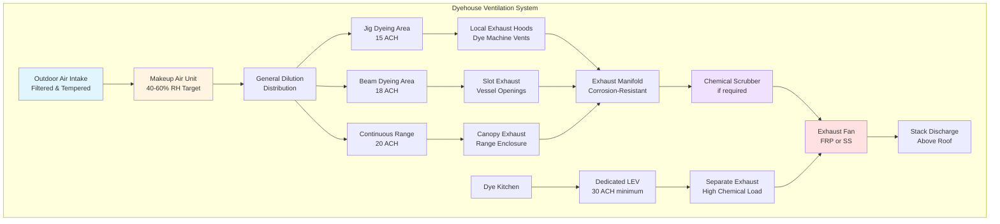

## Overview

Dyehouse ventilation presents unique challenges combining extreme humidity, chemical vapor exposure, process heat loads, and corrosive atmospheric conditions. Proper ventilation design requires integration of dilution ventilation, local exhaust ventilation (LEV), and makeup air systems to maintain safe working conditions while protecting equipment from accelerated degradation.

The dyeing and finishing environment generates heat loads of 40-80 Btu/hr-ft² floor area, moisture gains of 0.5-1.5 lb/hr-ft², and chemical vapors including formaldehyde, acetic acid, and various dye carriers requiring comprehensive ventilation strategies.

## Ventilation Load Calculations

### Total Ventilation Rate

The required ventilation rate combines sensible heat removal, latent heat removal, and contaminant dilution requirements:

$$Q_{total} = \max\left(Q_{sensible}, Q_{latent}, Q_{dilution}\right)$$

where each component is calculated independently and the maximum governs the design.

### Sensible Heat Removal

For process heat removal from dyeing equipment:

$$Q_{sensible} = \frac{q_{process}}{\rho \cdot c_p \cdot \Delta T} \times 60$$

where:
- $Q_{sensible}$ = required airflow (cfm)
- $q_{process}$ = process heat load (Btu/hr)
- $\rho$ = air density (0.075 lb/ft³)
- $c_p$ = specific heat of air (0.24 Btu/lb-°F)
- $\Delta T$ = allowable temperature rise (10-15°F typical)

### Latent Heat Removal

For moisture removal from open vessels and fabric drying:

$$Q_{latent} = \frac{W_{evap} \times h_{fg}}{\rho \cdot \Delta \omega \cdot 60}$$

where:
- $W_{evap}$ = evaporation rate (lb/hr)
- $h_{fg}$ = latent heat of vaporization (1050 Btu/lb at 212°F)
- $\Delta \omega$ = humidity ratio difference (lb moisture/lb dry air)

### Contaminant Dilution

For chemical vapor control based on ACGIH threshold limit values (TLV):

$$Q_{dilution} = \frac{G \times K \times 10^6}{TLV \times 60}$$

where:
- $G$ = contaminant generation rate (lb/hr)
- $K$ = safety factor (3-10 depending on toxicity)
- $TLV$ = threshold limit value (ppm)

## Air Change Requirements

The following table presents recommended air change rates for various dyehouse areas based on process intensity and chemical usage:

| Dyehouse Area | Air Changes per Hour | Basis |
|--------------|---------------------|-------|
| Jig dyeing machines | 10-15 ACH | Moderate heat, steam release |
| Beam dyeing area | 12-18 ACH | High moisture, chemical vapors |
| Package dyeing | 8-12 ACH | Enclosed vessels, lower exposure |
| Continuous dyeing range | 15-20 ACH | High heat, continuous emissions |
| Pad-steam operations | 18-25 ACH | Extreme moisture, temperature |
| Dye kitchen/mixing | 20-30 ACH | High chemical concentration |
| Finishing ranges | 12-18 ACH | Chemical application, curing |
| Sample dyeing lab | 15-20 ACH | Variable chemical use |

**Note:** These rates assume ceiling heights of 14-20 ft. For higher ceilings, calculate volumetric flow requirements independently rather than relying solely on ACH metrics.

## Ventilation System Architecture

## Local Exhaust Ventilation Design

### Dyeing Machine Hoods

For open dyeing vessels and loading stations, capture velocity at the contaminant source must meet ACGIH Industrial Ventilation Manual recommendations:

$$V_{capture} = \frac{Q}{A_{face}} = \frac{Q}{10X^2 + A_{hood}}$$

where:
- $V_{capture}$ = capture velocity (fpm) = 50-100 fpm for low-toxicity dyes, 100-200 fpm for toxic chemicals
- $Q$ = exhaust flow rate (cfm)
- $X$ = distance from hood face to source (ft)
- $A_{hood}$ = hood face area (ft²)

### Slot Exhaust Systems

For continuous ranges and pad-steam units, slot exhaust provides effective capture:

$$Q_{slot} = V_{slot} \times W_{slot} \times L_{slot} \times 60$$

where slot velocity $V_{slot}$ should be 2000-3000 fpm to prevent slot flooding while maintaining capture effectiveness.

## Makeup Air Requirements

Makeup air must equal or slightly exceed exhaust (95-98% of exhaust flow) to maintain slight negative pressure preventing vapor migration:

$$Q_{makeup} = Q_{general} + Q_{LEV} - Q_{infiltration}$$

Makeup air should be conditioned to:
- Temperature: 68-75°F winter, 75-82°F summer
- Relative humidity: 40-60% to minimize static electricity
- Filtration: MERV 8 minimum to protect equipment

## Material Selection for Corrosive Environments

The combination of high humidity, elevated temperatures, and chemical vapors requires corrosion-resistant materials:

| Component | Recommended Material | Rationale |
|-----------|---------------------|-----------|
| Exhaust ductwork | FRP or stainless steel 316L | Acid/alkali resistance |
| Exhaust fans | FRP construction, SS shaft | Wet, corrosive environment |
| Dampers | SS or aluminum bronze | Reliable operation in moisture |
| Diffusers/grilles | Powder-coated aluminum | Corrosion resistance, cleanability |
| Makeup air coils | Epoxy-coated or SS | Protection from chemical attack |
| Controls enclosures | NEMA 4X stainless | Moisture and chemical protection |

## Heat Stress Prevention

Worker heat stress requires monitoring wet-bulb globe temperature (WBGT):

$$WBGT = 0.7 \times T_{wb} + 0.2 \times T_{g} + 0.1 \times T_{db}$$

where:
- $T_{wb}$ = natural wet-bulb temperature (°F)
- $T_{g}$ = globe temperature (°F)
- $T_{db}$ = dry-bulb temperature (°F)

Maintain WBGT below 80°F for continuous moderate work or provide work-rest cycles per ACGIH guidelines.

## System Design Considerations

**Pressure Relationships:** Maintain dyehouse at -0.02 to -0.05 in. w.c. relative to adjacent spaces to contain vapors and moisture.

**Energy Recovery:** Evaluate heat recovery from exhaust air, but recognize that chemical contamination and high moisture may limit effectiveness and increase maintenance.

**Zoning:** Separate high-load areas (dye kitchen, continuous ranges) from lower-load areas (package dyeing) for optimized control and energy efficiency.

**Emergency Ventilation:** Provide manual override capability for emergency purge mode at 150-200% design flow rate for chemical spill scenarios.

## Compliance References

Design dyehouse ventilation per:
- ACGIH Industrial Ventilation: A Manual of Recommended Practice for Design, 31st Edition
- ASHRAE Handbook - HVAC Applications, Chapter 29: Industrial Ventilation
- OSHA 29 CFR 1910.94: Ventilation requirements for specific operations
- NFPA 91: Standard for Exhaust Systems for Air Conveying of Vapors, Gases, Mists, and Particulate Solids

Verify local and state regulations for specific chemical emission limits and stack discharge requirements.