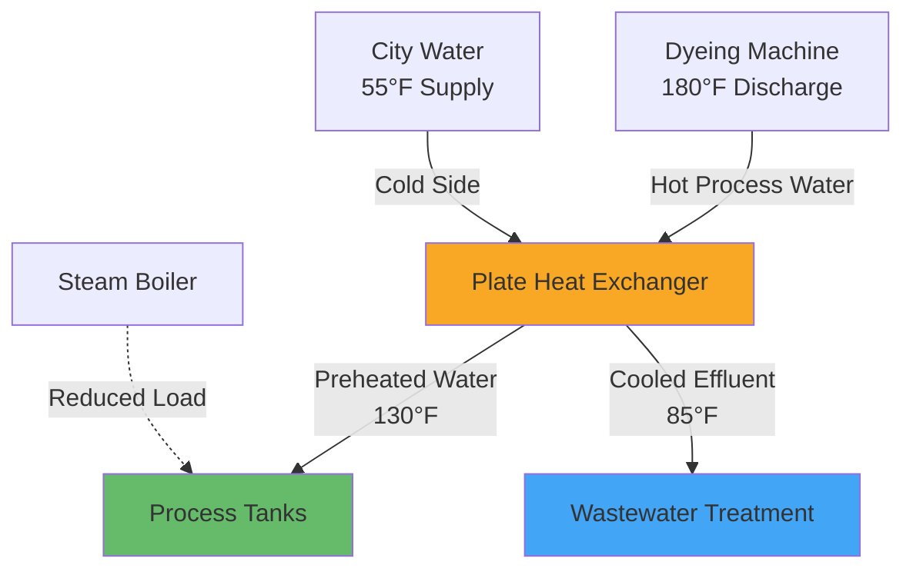
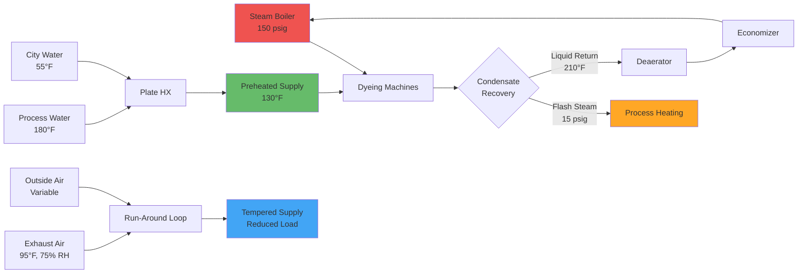

## Heat Recovery in Textile Dyeing and Finishing Plants

Textile dyeing and finishing operations are among the most energy-intensive industrial processes, consuming substantial quantities of thermal energy for heating process water, steam generation, and space conditioning. Heat recovery systems can capture 40-70% of waste thermal energy, significantly reducing operating costs while improving environmental performance.

## Fundamental Heat Recovery Principles

Heat recovery in textile facilities exploits the temperature differential between waste streams and incoming process fluids. The recoverable energy depends on mass flow rates, specific heat capacities, and temperature differences:

$$Q_{recovered} = \dot{m} \cdot c_p \cdot (T_{exhaust} - T_{return})$$

Where:
- $Q_{recovered}$ = recoverable heat rate (kW)
- $\dot{m}$ = mass flow rate (kg/s)
- $c_p$ = specific heat capacity (kJ/kg·K)
- $T_{exhaust}$ = exhaust temperature (K)
- $T_{return}$ = return temperature (K)

The effectiveness of heat recovery equipment is quantified by thermal efficiency:

$$\eta_{HX} = \frac{Q_{actual}}{Q_{maximum}} = \frac{C_{min}(T_{hot,in} - T_{hot,out})}{C_{min}(T_{hot,in} - T_{cold,in})}$$

Where $C_{min}$ represents the minimum heat capacity rate between hot and cold streams.

## Heat Recovery Sources in Dyeing and Finishing

### Exhaust Air Heat Recovery

Dyeing and finishing areas maintain high ventilation rates (15-30 ACH) to control humidity and chemical vapors. Exhaust air temperatures range from 80-110°F with relative humidity often exceeding 70%. Run-around heat recovery loops and plate heat exchangers recover sensible heat while avoiding cross-contamination:

$$Q_{sensible} = 1.08 \cdot CFM \cdot \Delta T$$

Where:
- $Q_{sensible}$ = sensible heat recovery (BTU/hr)
- $CFM$ = exhaust airflow (ft³/min)
- $\Delta T$ = temperature difference (°F)

Latent heat recovery through enthalpy wheels or heat pipe systems captures additional energy:

$$Q_{latent} = 4840 \cdot CFM \cdot \Delta W$$

Where $\Delta W$ = humidity ratio difference (lb moisture/lb dry air)

### Steam Condensate Recovery

Dyeing processes utilize steam at 100-150 psig, with condensate returning at 180-280°F containing significant thermal energy. Flash steam recovery and condensate return systems capture this energy:

$$Q_{flash} = \dot{m}_{condensate} \cdot h_{fg} \cdot x_{flash}$$

Where:
- $h_{fg}$ = latent heat of vaporization (BTU/lb)
- $x_{flash}$ = flash steam fraction (dimensionless)

The flash steam fraction depends on pressure differential:

$$x_{flash} = \frac{h_f(P_{high}) - h_f(P_{low})}{h_{fg}(P_{low})}$$

### Process Water Heat Recovery

Rinse water discharged from dyeing machines exits at 140-180°F. Plate and frame heat exchangers or spiral heat exchangers transfer thermal energy to incoming cold water:

$$\frac{1}{U \cdot A} = \frac{1}{h_{hot}} + R_{fouling,hot} + \frac{t_{wall}}{k_{wall}} + R_{fouling,cold} + \frac{1}{h_{cold}}$$

Where:
- $U$ = overall heat transfer coefficient (BTU/hr·ft²·°F)
- $A$ = heat transfer area (ft²)
- $h$ = convective heat transfer coefficient
- $R_{fouling}$ = fouling resistance due to dye deposits

### Economizer Systems

Boiler economizers recover heat from flue gases (300-450°F) to preheat boiler feedwater, improving overall thermal efficiency by 5-10%:

$$\eta_{boiler,improved} = \frac{Q_{steam} + Q_{economizer}}{Q_{fuel}}$$

## Heat Recovery System Performance

| Recovery Method | Temperature Range | Typical Efficiency | Energy Savings | Payback Period |
|----------------|-------------------|-------------------|----------------|----------------|
| Exhaust air heat recovery | 80-110°F | 50-65% | 15-25% HVAC load | 3-5 years |
| Steam condensate recovery | 180-280°F | 75-85% | 10-20% boiler fuel | 2-4 years |
| Process water heat recovery | 140-180°F | 60-75% | 20-35% water heating | 2-3 years |
| Boiler economizers | 300-450°F | 70-80% | 5-10% boiler efficiency | 4-6 years |
| Flash steam recovery | 100-150 psig | 80-90% | 8-15% steam demand | 2-4 years |

## Design Considerations for Textile Applications

### Fouling and Maintenance

Textile process streams contain dyes, sizing agents, and chemical residues that promote fouling. Heat exchanger selection must account for:

- Accessible cleaning design (removable plate packs, rodding access)
- Increased fouling factors: $R_{fouling}$ = 0.003-0.006 hr·ft²·°F/BTU
- Velocity maintenance above 3-4 ft/s to minimize deposition
- Chemical cleaning compatibility with stainless steel or titanium construction

### Humidity Control Limitations

High humidity exhaust streams (70-90% RH) limit sensible heat recovery effectiveness. Condensation within heat exchangers requires:

- Proper drainage design with 1/4" per foot minimum slope
- Corrosion-resistant materials (epoxy-coated aluminum, stainless steel)
- Defrost or condensate removal systems
- Minimum supply air temperature controls to prevent supply-side condensation

### System Integration Strategy

## Energy Savings Calculations

Total annual energy savings from integrated heat recovery:

$$Savings_{annual} = \sum_{i=1}^{n} Q_{recovered,i} \cdot t_{operation} \cdot Cost_{energy}$$

For a typical 50,000 ft² dyeing facility operating 6,000 hours annually:

- Process water heat recovery: 2,500 MMBTu/year
- Steam condensate recovery: 3,800 MMBTu/year
- Exhaust air recovery: 1,200 MMBTu/year
- Economizer savings: 1,500 MMBTu/year

**Total potential savings:** 9,000 MMBTu/year at $8/MMBTu = **$72,000 annually**

## ASHRAE Industrial Ventilation Guidelines

ASHRAE Industrial Ventilation standards specify heat recovery design criteria:

- Minimum 50°F approach temperature for liquid-to-liquid heat exchangers
- Cross-contamination prevention through indirect heat recovery systems
- Energy recovery ventilators rated per AHRI 1060 for exhaust-to-supply air applications
- Proper condensate management per IMC Section 314

## Implementation Priorities

1. **High-temperature recovery first:** Steam condensate and process water systems offer highest return on investment
2. **Reduce makeup water heating:** Preheating incoming water reduces boiler load immediately
3. **Integrate with process controls:** Modulating heat recovery based on demand optimizes performance
4. **Monitor performance:** Install temperature sensors and BTU meters to verify savings and detect fouling

Properly designed heat recovery systems in textile dyeing and finishing plants deliver 30-50% reduction in thermal energy consumption, with capital costs typically recovered within 2-4 years through reduced fuel and energy expenses.
